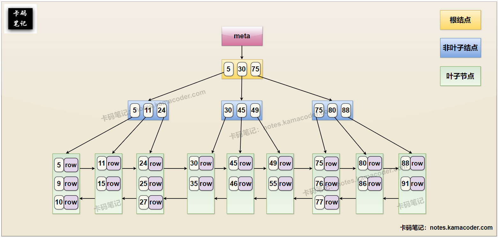
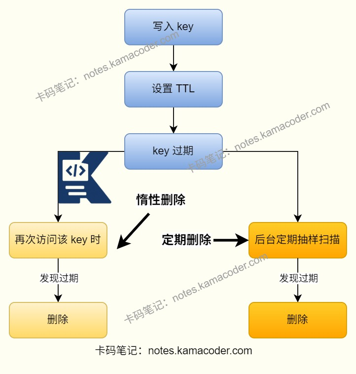
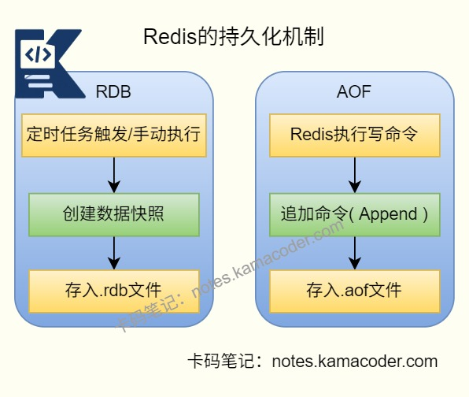
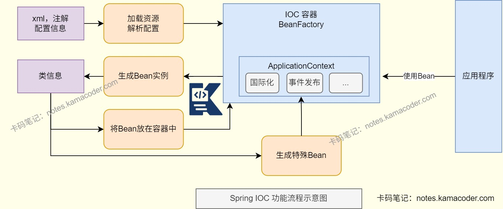
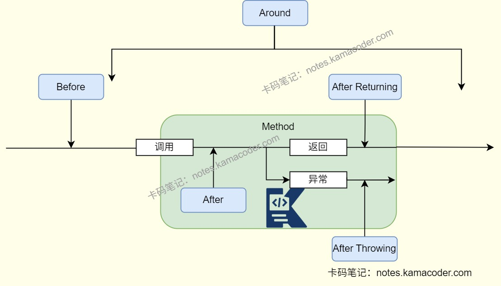

# 阿里 Java 实习面经

> 来源: https://notes.kamacoder.com/interview/java/alibaba-java-intern-4-21.html

# `# 阿里 Java 实习面经 

### `# 抽象类和接口有什么区别？ 
  - 抽象类是“类”，可以有成员变量、构造方法、普通方法和抽象方法；接口则是一种“规范”，字段默认是 `public static final` 常量，方法默认是 `public abstract`，不过Java 8 之后也支持 `default/static` 方法。   - 一个类只能继承一个抽象类，但可以实现多个接口，所以接口更适合做能力扩展和解耦。   - 所以抽象类更适合沉淀公共的方法逻辑，接口更适合定义“统一行为标准”。 

### `# final关键字是什么？ 
  - `final` 表示“不可再变”，用于修饰类、方法、变量。final在修饰类时，类不能被继承；修饰方法时，方法不能被重写；修饰变量时变量只能赋值一次。   - 对引用类型来说，`final` 限制的是“引用地址不能变”，不是对象内容绝对不能改，因此合理使用 `final` 能提升代码可读性和线程安全性。 

### `# MySQL索引底层结构是什么？ 
  - MySQL索引的**核心数据结构是B+树**，是适配磁盘存储的多路平衡查找树。B+树采用分层存储，key和data存在叶子节点中，其他节点只有key，叶子节点之间通过双向链表连接，支持范围查询，并且左右子树高度差不超过1保证查询效率稳定。   - B+树的结构示意图如下：

 

### `# 最左匹配原则是什么？ 
  - **最左匹配原则**指的是联合索引会从最左边的列开始连续匹配。比如索引是 `(a, b, c)`，那么能利用索引的常见场景是 `a`、`a+b`、`a+b+c` 的连续前缀，如果查询条件跳过了最左列，比如只查 `b`、`c`，通常就没法充分利用这个联合索引。在出现范围查询后，联合索引后续列的利用程度也会受影响，这也是设计复合索引时要重点考虑的地方。 

### `# Redis过期策略是什么？ 
  - Redis 实际采用的是**惰性删除 + 定期删除**，即访问 key 时发现过期就删，并周期性随机抽样检查过期 key。   - 这样做是为了在 CPU 开销和内存回收效率之间做平衡，既避免定时删除带来的频繁调度，也避免只靠惰性删除导致过期 key 堆积。 

 

### `# Redis的持久化机制是什么？ 
  - Redis持久化就是把内存中的数据写到磁盘中，防止服务宕机导致数据丢失。主要方式有RDB（内存快照）和AOF（日志文件），还有Redis4.0新增的AOF+RDB混合持久化方式。   - **RDB(Redis Database)** 会按照一定时间间隔把内存的数据以快照方式保存到硬盘的二进制文件，可以通过save参数定义快照的周期。产生的数据文件是dump.rdb，可以执行save或bgsave命令进行保存。如果两次快照之间宕机，可能会造成一定的数据丢失。   - **AOF(Append Only File)** 会将每一个收到的写命令写入AOF缓冲区(server.aof_buf)中，然后将缓存中的数据写入AOF文件并调用fsync()函数将数据写入磁盘appendonly.aof文件。如果Redis重启会重新执行文件中保存的写命令从而在内存中重建整个数据库的内容。如果日志文件较大，可能恢复速度比较慢。   - 使用**混合持久化**，AOF在重写时会把RDB的内容写到AOF开头，可以在快速加载的同时避免丢失过多数据。 

 

### `# Spring 的 IoC 和 AOP 机制，你了解多少？ 
  - 

AOP就是**面向切面编程**，横向地把日志、事务、权限这些跨所有业务模块的通用逻辑，封装成一个 “切面”，不用在每个业务方法里重复写，直接切入到业务逻辑中，实现通用逻辑和业务逻辑的解耦，业务代码更干净。 

AOP使用Java的**动态代理机制**，Spring会为被切入的对象（目标对象）创建一个代理对象，所有通用逻辑都织入到代理对象里，我们调用业务方法时，实际调用的是代理对象的方法，代理对象先执行通用逻辑，再执行原始的业务方法，最后执行后续的通用逻辑，目标对象完全不用改。   - 

SpringIOC是**控制反转**的设计思想，原先由程序员控制整个程序的执行，使用IOC思想后将控制权交给了IOC容器，由Spring IOC容器来控制Bean的生命周期，对象的创建、初始化和销毁。在程序中不手动new对象，而是通过@Component或@Autowired注解来配置，容器会自动实例化Bean，注入依赖，降低代码耦合，简化开发。   - 

因此IOC是基础，AOP是基于IOC实现的。IOC使对象之间解耦，管理Bean的生命周期，而AOP让横切逻辑解耦，实现方法增强。 

 

 

### `# 在空间复杂度为O(1)的情况下，两个链表怎么找交点？ 
  - 可以用双指针法，即`pA` 从链表 A 头开始，`pB` 从链表 B 头开始；每次各走一步，走到尾部就切到对方链表头。如果有交点，两个指针最终会在交点相遇；如果无交点，最终会同时为 `null`。该方法时间复杂度是 `O(m+n)`，空间复杂度是 `O(1)`。
