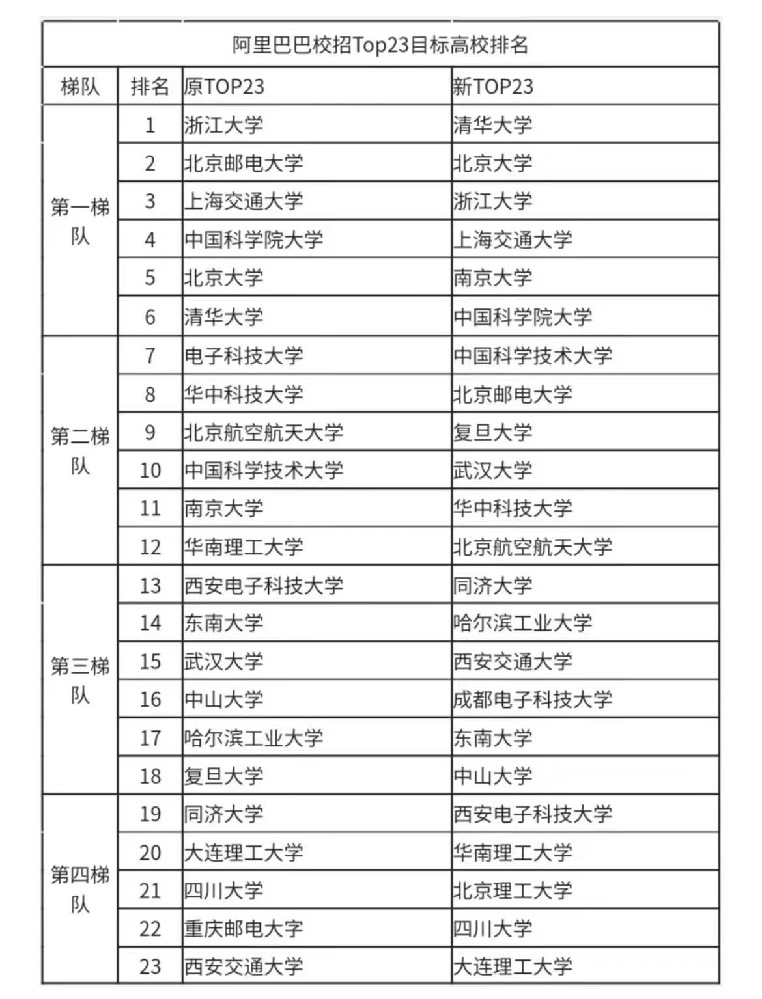
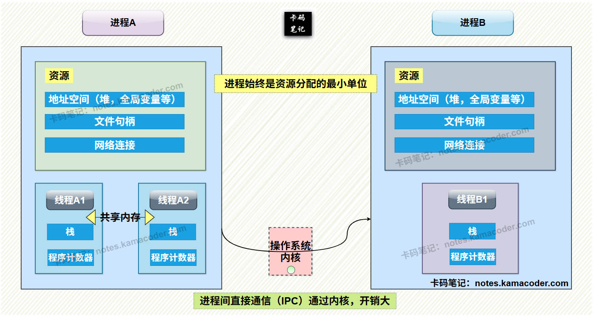

# 阿里巴巴 Java 一面

> 来源: https://notes.kamacoder.com/interview/java/alibaba-interview-11-23.html

# `# 阿里巴巴 Java 一面 

阿里还是比较看学历的，不是 23所，比较难拿到面试机会。 至于哪些23所，可以看一下新旧变化。 

 

以下是知识星球录友分享阿里一面面经： 

## `# 如何排查慢SQL 
  - 数据库可以通过**慢查询日志**找到慢的Sql，也可以通过查询SQL的执行时间进行慢SQL筛选。   - 找到慢SQL后可以**执行explain**看type列和key列，判断SQL是否走索引，检查是否有**索引失效**、**关联表过多**或者**子查询嵌套过深**问题。如果数据量过多，**分页查询未优化**也会导致查询变慢。   - 如果SQL本身没有问题，可能是数据库的配置不合理或者存在资源瓶颈，可以检查**数据库的缓存大小**，再看是否有**CPU、内存或磁盘IO使用率过高**的问题。 

## `# 慢查询可以怎么解决？如果不改代码，如何优化？ 
  - 

针对SQL语句 
    - 修改语句中含有左模糊匹配、否定、隐式转换或者函数运算的部分，可以**解决索引失效**导致的慢查询。     - SQL中存在多表联合时，尽量减少表的数量并给**关联字段设置索引**可以改善查询效率，避免全表扫描。     - 存在多条件查询时，可以创建**联合索引**，减少索引数量的同时避免回表，实现索引覆盖。注意联合索引需要遵循最左匹配原则，否则会索引失效。     - **避免使用select * 语句**，*中包含非索引字段会导致无法用索引排序。     - 对于有深分页查询的SQL，如果该表主键自增可以**把limit查询转换成某个位置查询**。   - 

不修改SQL语句 
    - 可以尝试**优化数据库配置**，增加数据库的缓存区大小；     - 对数据库进行**分库分表**，按照时间或冷热程度分表，减少数据传输量。     - 使用**缓存中间件缓存热点数据**，对高频查询的结果缓存到Redis中，减少数据库压力。 

## `# 如何精确设置慢查询日志阈值？阈值过小或者过大会怎么样？ 
  - 使用long_query_time可以设置慢查询日志的阈值，默认是10秒；如果阈值设置过小会导致日志量暴增，占用磁盘空间并增加分析成本；过大可能会检查不出慢SQL，需要根据业务需求调整不同接口阈值。 

## `# explain使用过吗，会关注哪些字段 
  - 一般在排查SQL性能时会使用explain，尤其是针对慢查询情况，在SQL前添加explain可以查看执行计划，能够判断索引是否生效、是否存在全表扫描等。   - 关注**type字段**：反映查询数据的方式。**ALL**是全表扫描，效率最差，可能存在索引失效或没有索引的问题；**index**是全索引扫描，没有命中有效筛选；**range**是索引范围查询；**ref**是使用普通索引作为查询条件，可能会找到多个符合条件的行；**eq_ref**则是联表查询时被关联表的主键或唯一索引的字段作为条件，前一张表的行在当前表只有一行对应；**system/const**是主键或唯一索引匹配，最多返回一条记录，效率最高。   - 关注**key字段**，可以看到实际使用的索引，如果为NULL则未使用到。   - 关注**Extra字段**，可以看到MySQL执行查询额外信息。**Using filesort**是在排序时使用了外部的索引排序，没有用到表内索引进行排序。**Using temporary**是存在ORDER BY和GROUP BY的情况，需要创建临时表来存储查询的结果。**Using index**是使用了覆盖索引，不用回表；**Using where**表明查询时使用了WHERE进行过滤。需要尽可能避免出现**Using temporary**和**Using filesort**的情况 

## `# MySQL索引数据结构 
  - MySQL索引的**核心数据结构是B+树**，是适配磁盘存储的多路平衡查找树。B+树采用分层存储，key和data存在叶子节点中，其他节点只有key，叶子节点之间通过双向链表连接，支持范围查询，并且左右子树高度差不超过1保证查询效率稳定。   - B+树的结构示意图如下：

 

## `# B+树和B树、二叉树、哈希表之间有什么区别？ 
  - 与**B树**相比，B树的所有节点都存放键和数据，每个节点存储的索引值少，树的深度大；B树的叶子节点没有链表连接，范围查询时需要回溯，效率较低。   - 与**二叉树/红黑树**相比，B+树搜索的时间复杂度为O(logdN)其中d是节点允许的最大子节点个数，因此可以保持B+树的高度低，数据查询操作只需要少量次数的IO操作，而二叉树深度大，会导致磁盘IO次数更多，成为性能瓶颈。   - 与**哈希索引**相比，哈希索引仅支持等值查询，不支持范围查询，还可能有哈希冲突问题，B+树更符合多数的业务场景。 

## `# 长文本LIKE搜索还可以使用哪种索引？ 
  - 可以使用**全文索引**（FULLTEXT），按照分词规则对文本内容拆分为关键词并建立关键词到文档的映射关系，搜索时无需扫描全表，不过也可以选择直接使用搜索引擎代替，如ElasticSearch，效率更高。 

## `# Redis有几种数据结构？ 
  - Redis有String、Hash、List、Set、ZSet五种基础的数据结构，能够满足大多数缓存、计数、队列场景，还有Bitmap、HyperLogLog、Geospatial三种高级结构，适合比较特殊的场景。   - **String**用于存储字符串整数或浮点数，可以支持直接赋值、拼接、自增/减。常用的场景是存储用户token、计数器和简单的键值对缓存。核心命令有set key value设置值、get key获取、incr key自增和append key str拼接。   - **Hash**是类似Java的HashMap，存储键值对集合，适合存储对象型数据，可以单独修改某个字段。核心命令有hset key field value设置字段、hget key field获取字段、hgetall key获取所有字段和hdel key field删除字段。   - **List**是有序可重复的元素集合，底层是双向链表或压缩列表，支持两端插入或删除操作，可以按索引访问。可以实现简单的任务队列，最新列表。核心命令有lpush/rpush key value从左边或右边插入，lpop/rpop从左边或右边弹出和lrange key start可以获取范围元素。   - **Set**是无序不可重复的元素集合，底层是哈希表，支持交集、并集和差集等集合运算。可以使用在需要去重，随机抽取的场景中。核心命令有sadd key value添加元素、smembers key获取所有元素、sinter key1 key2取交集以及sunion key1 key2可以取并集。   - **ZSet**类似Set，额外关联一个分数，会按照分数排序，可以使用在需要排名的场景中。核心命令有zadd key score value添加元素及分数，zrange/zrevrange key start end按分数升序或降序取范围，zrank key value可以获取排名。   - **Bitmap**是位图，按位存储数据0或1，一般使用在统计场景中。核心命令有setbit key offset value设置某一位，getbit key offset获取某一位，bitcount key统计1的个数。   - **HyperLogLog**是基数统计，统计集合中不重复元素的个数，占用空间小，适合做UV统计。核心命令是pfadd key value1 value2添加元素、pfcount key统计基数以及合并两个HyperLogLog可以使用pfmerge dest key1 key2。   - **Geospatital**是地理空间，存储经纬度坐标，支持距离计算和范围查询，比如geoadd key 经度 纬度 地点可以添加坐标，使用geodist可以计算距离，georadius key 经度 纬度 半径查询范围内的地点。 

## `# 使用Bitmap统计UV时，如何处理超过bitmap最大偏移量的情况？ 
  - Bitmap的偏移量最大为2^32-1，当用户ID超过该值时，可以使用分段存储，就是按照用户ID范围拆分多个bitmap，如uv_0，uv_1等。也可以使用Hash函数将大ID映射到小范围，或者改用HyperLogLog。 

## `# 介绍一下观察者模式？ 
  - 观察者模式是**行为型设计模式**，定义了一种**一对多的依赖关系**，当**一个对象的状态发生改变时所有依赖它的对象会收到通知并进行相应更新**。被观察者Subject维护一个观察者列表，定义了通知所有观察者的notify()方法，具体被观察者ConcreteSubject是Subject的具体实现，观察者Observer是接口，定义了update()通知所有已注册的观察者。具体观察者ConcreteObserver是观察者的具体实现，会根据收到的通知完成具体业务逻辑。   - 观察者模式可以将观察者和被观察者解耦，符合**对扩展开发对修改关闭**的开发原则，如果需要新增响应行为只需创建一个新的具体观察者类并注册即可，同时还可以应用在需要给其他对象发送通知的场景中。但是如果代码比较复杂可能会影响性能，观察者之间如果有依赖关系可能会导致循环调用。 

## `# 介绍一下装饰者模式？ 
  - 装饰者模式是**结构型设计模式**，可以**在不改变原有对象结构和代码的前提下动态地给对象添加额外的功能**。抽象构件Component定义了原始对象和装饰器对象共有的接口，具体构件就是被装饰的对象，具体构件和抽象装饰器都实现了Component接口，具体装饰器继承自抽象装饰器，实现Component接口方法的同时添加额外功能逻辑。   - 在装饰者模式下，**装饰类和被装饰类独立且低耦合**，可以实现**动态扩展**，缺点是会产生较多的装饰者类，系统比较复杂。 

## `# 在项目中使用过设计模式吗？ 
  - 我使用装饰者模式实现了接口响应的增强。在项目中存在多个核心接口的情况下，给其中部分接口添加响应日志、给敏感的接口添加响应数据加密和所有接口统一的响应格式封装。装饰者模式可以满足不修改原有接口逻辑动态添加功能的需求。 

## `# 装饰者模式具体有哪些实现步骤？ 
  - 先定义抽象构件接口统一核心功能，再实现具体构建类封装我原始的业务逻辑，然后创建抽象的装饰者类实现接口并持有构件引用，最后编写具体的装饰者类继承抽象装饰者，重写方法添加日志、加密等扩展功能，客户端可以通过嵌套装饰者动态组合功能，无需修改原始代码。 

## `# 进程和线程的区别？ 
  - 最核心的差异是**进程**是操作系统资源分配的基本单位，**线程**是任务调度和执行的基本单位。   - 进程内可以有多个线程，进程的结束会终止所有线程，线程崩溃可能导致进程崩溃，但是进程崩溃不影响其他进程。没有线程的进程可以看做单线程，所以线程也被称为轻量级进程。   - 在开销方面，进程有独立的代码和数据空间，切换会有较大开销；同一类线程共享代码和数据空间，有独立的运行栈和程序计数器，切换开销小。

 

## `# 线程有哪些状态？什么条件下会发生改变？ 
  - 线程的状态反映线程在生命周期的不同阶段，由JVM和操作系统共同管理，状态转换一般就是“就绪-运行-阻塞/等待-就绪”的循环，直到线程终止。   - 线程的状态有新建(NEW)、就绪(RUNNABLE)、运行(RUNNING)、阻塞(BLOCKED)、等待(WAITING)、超时等待(TIMED_WAITING)和终止(TERMINATED)。   - 当线程创建而没有调用start方法，未分配系统资源时线程状态为**NEW**；调用start()后JVM会向操作系统申请线程资源，线程变成**RUNNABLE**状态等待调度；调度器选中线程后线程进入**RUNNING**状态；run()方法执行完毕或者出现未捕获的异常时线程进入**TERMINATED**状态。   - 如果线程在**RUNNING**状态时线程的时间片用完或者线程主动调用Thread.yield()方法，线程会重新进入**RUNNABLE**状态，等待再次被调度器选中。   - **RUNNING**状态的线程竞争锁失败或者主动调用Thread.sleep()方法会进入**BLOCKED**状态，等待获取到锁或者sleep的时间结束回到就绪状态。   - **RUNNING**状态的线程调用Object.wait()/Thread.join()/LockSupport.park()方法会进入**WAITING**状态，需要等待notify()方法唤醒或者目标线程执行完毕、LockSupport.unpark()方法线程才会回到就绪状态。   - **RUNNING**状态的线程调用Object.wait(long timeout)/Thread.join(long timeout)/LockSupport.parkNanos(long nanos)/LockSupport.parkUtil(long deadline)会进入**TIMED_WAITING**状态，时间超时后线程自动唤醒回到就绪队列。 

 

## `# SpringBoot的自动装配有了解吗？ 
  - SpringBoot的自动装配是基于Spring Framework的条件化配置和@**EnableAutoConfiguration注解实现的**，可以通过注解或少量配置就能在SpringBoot帮助下开启和配置各种功能。   - 在@EnableAutoConfiguration注解中，@AutoConfigurationPackage注解将项目src的main包下所有**组件注册到容器**中，@Import({AutoConfigurationImportSelector.class})是自动装配的核心。   - AutoConfigurationImportSelector类实现了ImportSelector接口，**实现自动配置的选择和导入**，能够分析项目的类路径和条件决定哪些自动配置类需要被导入。
