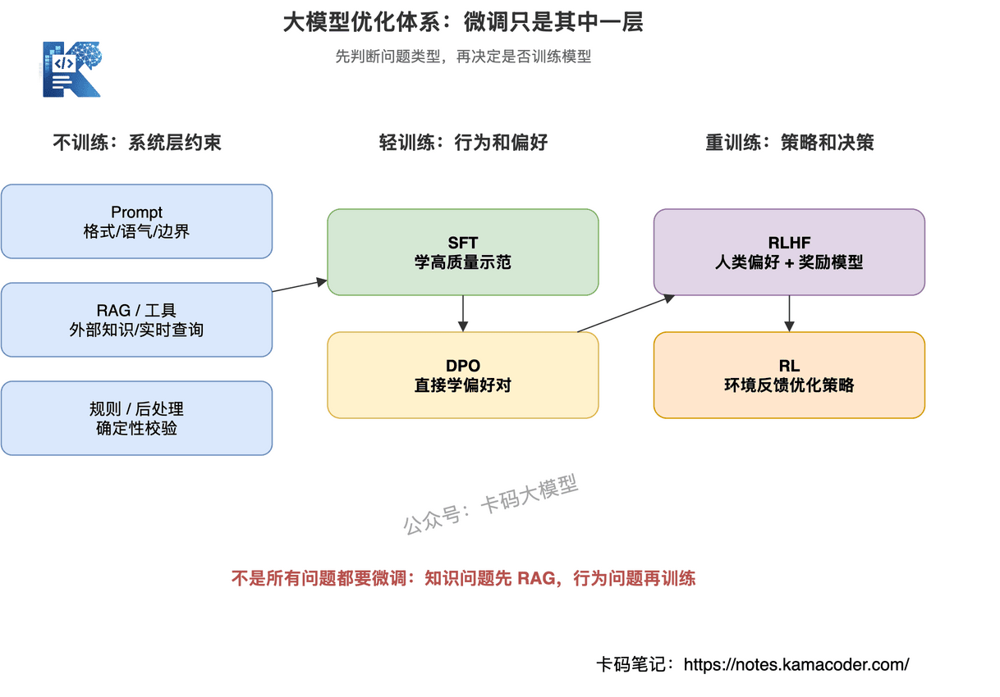
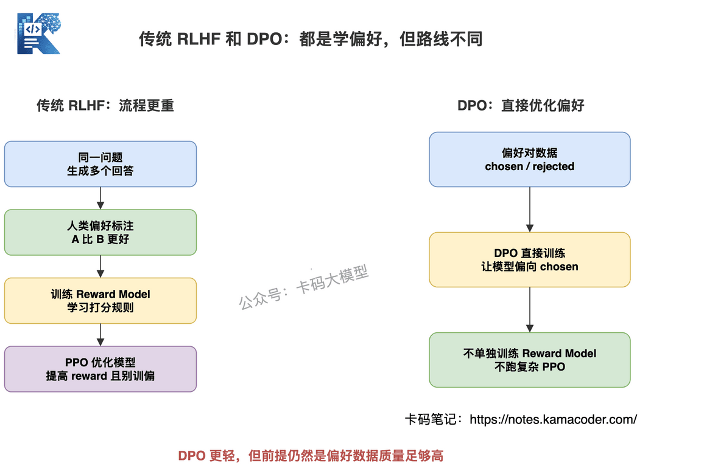
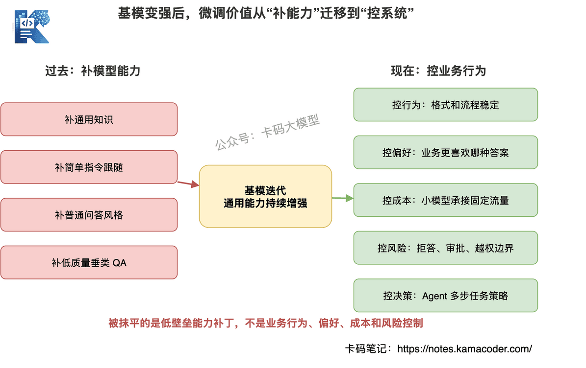
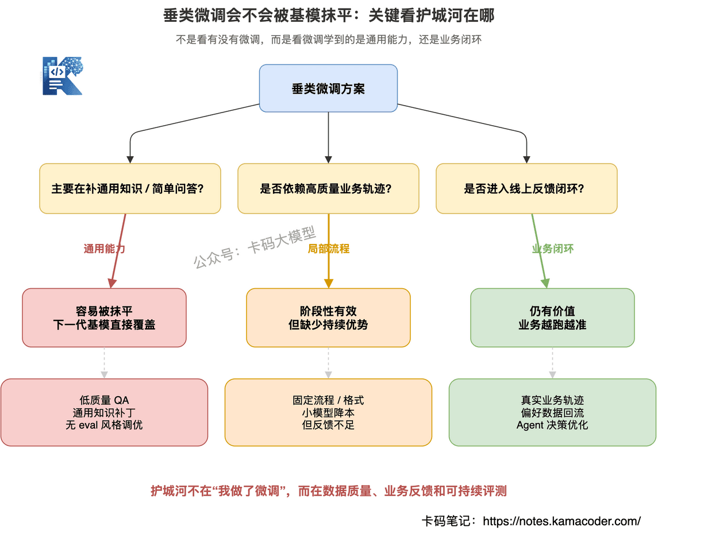
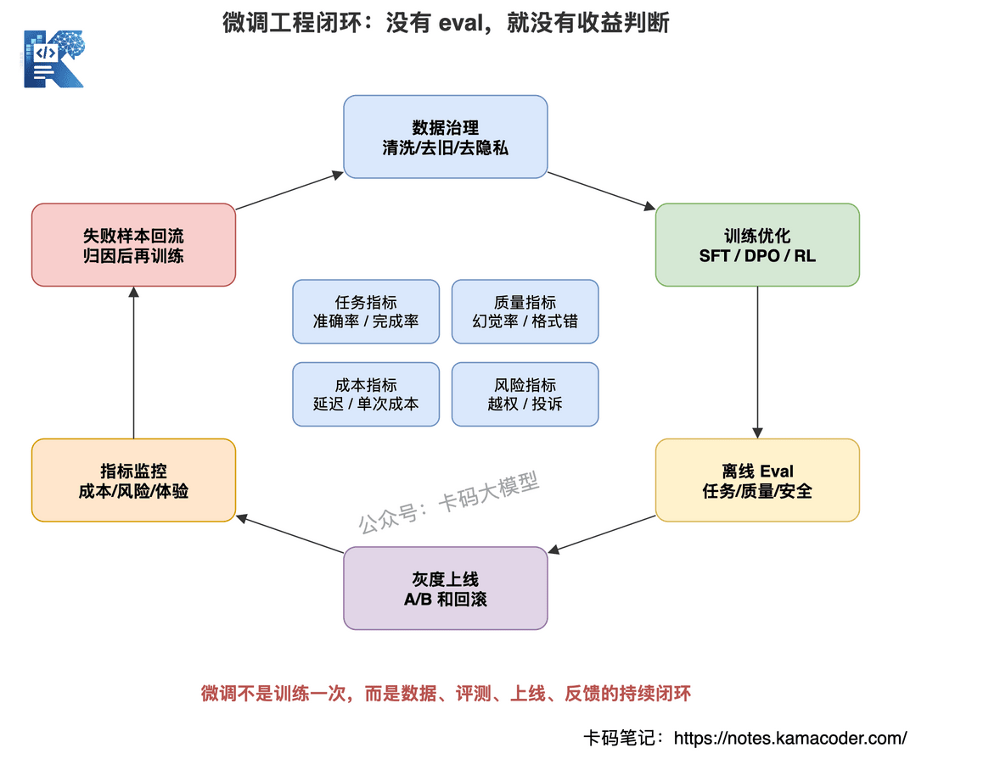

# 大模型微调面试怎么答？SFT、RLHF、DPO、PPO 到底还有没有必要？

> 来源: https://notes.kamacoder.com/interview/llm/finetuning_sft_rlhf_interview.html

# `# 大模型微调面试怎么答？SFT、RLHF、DPO、PPO 到底还有没有必要？ 

最近知识星球  (opens new window)有录友分享了一道很典型的大模型面试题： 

"如今基模能力越来越强的情况下，你认为 RLHF 或者 SFT 的破局点是什么？" 

面试官还会继续追问： 

"随着通用基模能力迭代越来越快，垂类场景里专门做的 RL 可能很快被抹平，还有没有必要坚持 RL/SFT 这类定制优化？" 

这个问题很有意思。 

因为它表面是在问 SFT、RLHF、RL。 

但实际上，它考的不是你会不会背概念。 

它真正想看的是：**你怎么理解大模型微调的价值，以及在基模越来越强的情况下，你有没有工程判断力。** 

很多录友一听到微调，就开始背： 
  - SFT 是监督微调   - RLHF 是人类反馈强化学习   - PPO 是一种强化学习算法   - DPO 是一种偏好优化方法 

这些都对。 

但只会背这些，面试官不会满意。 

因为现实项目里，最关键的问题不是"这些名词分别叫什么"。 

而是： 

**什么场景该做微调？什么场景不该做微调？基模变强后，微调到底还剩什么价值？** 

这篇文章，我们就系统聊一下大模型微调面试怎么答。 

不是写论文。 

也不是堆公式。 

而是从面试和工程落地角度，把 SFT、RLHF、RL、PPO、DPO 这些概念讲清楚，再讲清楚基模变强后，它们到底还有没有必要。 

## `# 目录 
  - 先说结论：微调没有消失，只是价值变了   - 先把名词讲清楚：SFT、RLHF、RL、PPO、DPO 是什么   - 微调、Prompt、RAG 到底怎么选   - 为什么很多垂类微调会被基模抹平   - SFT 的破局点：从补知识变成控行为   - RLHF / RL 的破局点：从变聪明变成控偏好和控决策   - DPO 为什么现在经常被提到   - 什么场景不建议做微调   - 工程上怎么判断微调有没有收益   - 面试官可能怎么追问   - 面试怎么答 

## `# 一、先说结论：微调没有消失，只是价值变了 


 

先给结论。 

**基模越来越强，不是让 SFT、RLHF、RL 消失，而是让它们从"补能力"转向"控行为、控偏好、控成本、控风险"。** 

这句话很重要。 

以前很多团队做 SFT，是因为基模能力不够。 

模型不会客服话术，就微调。 

模型不会写某类报告，就微调。 

模型不会按业务格式输出，也微调。 

但现在通用基模越来越强，很多任务你用 Prompt 就能做得不错。 

**甚至你辛辛苦苦微调一个垂类模型，下一代基模一发布，效果直接追上甚至超过你**。 

这就是面试官说的"被抹平"。 

但这不代表微调没有价值。 

它只是说明：**低质量、低壁垒、只靠几千条 QA 堆出来的垂类微调，越来越不值钱。** 

真正还有价值的是这些方向： 
  - 固定业务流程里的稳定输出   - 特定行业的话术、风格和口径   - 小模型在固定场景里的降本提效   - 安全拒答、风险边界、合规偏好   - Agent 工具调用、动作选择、多步决策   - 有明确 reward 的代码、数学、检索、操作任务 

所以面试里不要说："基模变强了，SFT/RLHF 就没必要了。" 

也不要说："微调永远有用，必须坚持做。" 

这两个回答都太绝对。 

更好的回答是： 

**通用能力会被基模抹平，但业务行为、偏好、成本和风险控制不会自动被抹平。微调的价值要从这些地方找。** 

## `# 二、先把名词讲清楚：SFT、RLHF、RL、PPO、DPO 是什么 


 

很多录友不懂这些名词。 

这很正常。 

因为这些概念经常被放在论文、训练框架、技术博客里讲，一上来就是 loss、reward、policy、KL penalty。 

面试里没必要这么讲。 

你要先能用人话解释清楚。 

### `# 1. SFT：监督微调 

SFT，全称是 Supervised Fine-Tuning，监督微调。 

一句话解释： 

**SFT 就是给模型看高质量示范，让模型模仿这种回答方式。** 

比如你准备一批数据： 

```
用户问题：帮我判断这个订单是否可以退款
标准答案：请先提供订单号，我会查询订单状态、支付时间和退款规则，再判断是否满足退款条件。

```

 

模型看多了这种样本，就会学到： 
  - 遇到退款问题，不要直接下结论   - 先要订单号   - 再查订单状态   - 最后按规则判断 

所以 SFT 的本质是"学示范"。 

它适合解决这些问题： 
  - 输出格式不稳定   - 业务话术不统一   - 固定任务流程学不会   - 工具调用格式需要统一   - 小模型需要学习大模型的回答范式 

但 SFT 不是万能知识库。 

这一点一定要说清楚。 

很多人把业务知识、政策文档、产品说明硬塞进 SFT 数据里，希望模型记住。 

这很容易出问题。 

因为业务知识会变。 

今天退款规则是 7 天，明天可能改成 15 天。 

你把规则训进模型里，后面规则一变，模型记忆就过期了。 

这类动态知识，更适合用 RAG 或工具查询。 

之前写 RAG落地最难的地方在哪 时讲过，RAG 更适合处理外部知识和动态文档。 

所以你可以这样理解： 

**SFT 更适合教模型"怎么答"，不适合硬塞一堆会频繁变化的业务知识。** 


 

### `# 2. RLHF：基于人类反馈的强化学习 

RLHF，全称是 Reinforcement Learning from Human Feedback，基于人类反馈的强化学习。 

一句话解释： 

**RLHF 不是直接教模型标准答案，而是让模型学会人类更喜欢哪种答案。** 

比如同一个问题，模型生成了两个回答。 

A 回答： 

```
可以退款。

```

 

B 回答： 

```
需要先确认订单状态、支付时间和商品类型。如果订单满足平台退款规则，可以发起退款；如果缺少信息，需要用户补充订单号。

```

 

人类标注员认为 B 更好。 

那模型就学到：遇到这类问题，不能武断回答，要更谨慎、更完整、更符合业务流程。 

RLHF 的典型流程是： 
  - 先用 SFT 训练一个基础可用模型   - 对同一个问题生成多个候选回答   - 人类标注哪个回答更好   - 用这些偏好数据训练 Reward Model   - 再用 PPO 这类强化学习算法优化模型 

这里的重点不是公式。 

重点是：**RLHF 解决的是偏好问题。** 

什么叫偏好问题？ 

就是多个答案可能都没错，但业务更喜欢其中一种。 

比如： 
  - 更礼貌，还是更直接   - 更保守，还是更积极   - 先解释原因，还是先给结论   - 遇到风险问题，是拒答还是给安全替代方案   - 客服回答，是强调用户体验还是强调平台规则 

这些问题没有唯一标准答案。 

这就是 RLHF 的价值。 

### `# 3. RL：强化学习 

RL，就是 Reinforcement Learning，强化学习。 

它比 RLHF 更宽泛。 

一句话解释： 

**RL 是让模型在环境里做动作，环境给奖励，模型学会让奖励更高。** 

不一定有人类反馈。 

只要你能定义 reward，就可以做 RL。 

比如代码生成任务： 
  - 代码能跑通，奖励高   - 单测通过，奖励高   - 代码报错，奖励低 

数学推理任务： 
  - 最终答案正确，奖励高   - 推理过程违反规则，奖励低 

Agent 工具调用任务： 
  - 调对工具，奖励高   - 参数合法，奖励高   - 任务完成，奖励高   - 调错工具、越权操作，奖励低 

所以 RL 的核心不在于"人类喜不喜欢"。 

而在于：**有没有明确的环境反馈或可验证目标。** 

如果 reward 设计清楚，RL 很有价值。 

如果 reward 很模糊，RL 就容易训歪。 

### `# 4. PPO：一种常见的 RL 优化算法 

PPO，全称 Proximal Policy Optimization。 

面试里你不需要推公式。 

你只要讲清楚它在 RLHF 里扮演什么角色。 

一句话解释： 

**PPO 是一种强化学习优化算法，用来在提升 reward 的同时，限制模型不要偏离原模型太远。** 

为什么要限制？ 

因为大模型很脆。 

如果你只让它追求 reward，很可能出现"奖励黑客"。 

比如 Reward Model 偏好长答案，模型就疯狂输出长篇废话。 

Reward Model 偏好礼貌语气，模型就每句话都过度客气。 

Reward Model 有漏洞，模型就学会钻漏洞。 

PPO 的思想是：可以优化，但别一步迈太大。 

既要提高 reward，又要尽量保留原模型的语言能力和通用能力。 

所以面试里可以这样说： 

**PPO 不是一种偏好数据，也不是一种标注方式，而是 RLHF 训练阶段常用的优化算法。** 

### `# 5. DPO：直接偏好优化 

DPO，全称 Direct Preference Optimization，直接偏好优化。 

一句话解释： 

**DPO 是直接用偏好对训练模型，让模型更偏向好回答，不再单独训练 Reward Model，也不跑复杂的 PPO 流程。** 

还是刚才那个例子。 

同一个问题下： 
  - A 回答较差   - B 回答更好 

DPO 直接用这个偏好对训练模型，让模型以后更倾向于生成 B 这类答案。 

相比传统 RLHF，DPO 的工程流程更简单： 
  - 不需要单独训练 Reward Model   - 不需要复杂的 PPO 训练   - 训练更稳定   - 工程成本更低 

但它也不是万能的。 

DPO 很依赖偏好数据质量。 

如果你的偏好数据本身就乱，今天喜欢短答案，明天喜欢长答案，标注标准不一致，DPO 也会学乱。 

所以你可以把 DPO 理解成： 

**DPO 是一种更轻量的偏好优化方法，适合在已有偏好数据比较可靠的情况下，让模型对齐某种回答偏好。** 


 

## `# 三、微调、Prompt、RAG 到底怎么选 

面试官很喜欢问这个问题。 

"这个场景你会用 Prompt、RAG，还是微调？" 

这个问题非常考察工程判断。 

你不能一上来就说："我会微调。" 

更不能说："都用 RAG。" 

我的建议是按问题类型判断。 


 

### `# 1. 能靠 Prompt 解决，就先别训练 

如果只是让模型输出更清晰、更结构化、更符合某个格式，先试 Prompt。 

比如： 
  - 按 JSON 输出   - 回答时先给结论再解释   - 不知道就说不知道   - 引用资料来源 

这些先用 Prompt 约束。 

如果 Prompt 已经能稳定解决，就没必要上 SFT。 

因为训练有成本。 

要准备数据、清洗数据、跑训练、评测、上线、回滚。 

不是写几条样本就完事。 

### `# 2. 知识频繁变化，优先 RAG 或工具 

如果问题核心是外部知识，比如产品文档、公司制度、价格规则、合同条款，优先考虑 RAG 或工具查询。 

因为知识会变。 

今天文档更新，RAG 重新入库就能生效。 

但如果你把知识训进模型里，更新就麻烦了。 

还容易出现旧知识残留。 

所以： 

**知识问题优先 RAG，行为问题再考虑 SFT。** 

### `# 3. 行为稳定性不够，再考虑 SFT 

如果你发现模型明明知道规则，但输出就是不稳定。 

今天按格式答，明天格式乱了。 

今天先问用户补充信息，明天直接下结论。 

今天会按工具调用规范输出，明天又自由发挥。 

这种情况就可以考虑 SFT。 

因为你要的不是新知识，而是稳定行为。 

### `# 4. 多个答案都能用，但你有明确偏好，考虑 DPO / RLHF 

比如客服场景。 

同一个用户投诉，模型可以： 
  - 先道歉   - 先解释规则   - 先给补偿方案   - 先询问订单信息 

这些答案可能都不算错。 

但你的业务会有偏好。 

比如平台希望先安抚用户，再收集信息，再给处理路径。 

这种就不是简单 SFT 能完全解决的。 

它更像偏好对齐问题，可以考虑 DPO 或 RLHF。 

### `# 5. 有可验证 reward，才考虑更强的 RL 

如果任务有明确反馈，RL 才更有意义。 

比如： 
  - 代码能否通过单测   - 工具调用是否成功   - 检索结果是否命中答案   - Agent 是否完成任务   - 数学答案是否正确 

这些场景可以设计 reward。 

但如果只是"我感觉这个回答更好"，reward 很模糊，直接上 RL 就很危险。 

## `# 四、为什么很多垂类微调会被基模抹平 

现在我们回到面试官的问题： 

"基模能力越来越强，垂类 SFT / RL 会不会很快被抹平？" 


 

答案是：会。 

但不是全部。 

被抹平的，通常是低壁垒的微调。 


 

### `# 1. 只补通用知识的微调，容易被抹平 

比如你用几千条普通问答，教模型回答 Java、MySQL、Redis、操作系统。 

这种很容易被新基模覆盖。 

因为通用知识本来就在基模能力范围内。 

你训练半天，下一代基模参数更大、数据更多、后训练更强，直接就追上了。 

这类微调没有护城河。 

### `# 2. 只调风格但没有评测，也容易被抹平 

有些团队说自己做了行业微调。 

但你问它："提升了多少？" 

答不上来。 

再问："在哪些 case 上提升？" 

也答不上来。 

最后只是感觉回答更像客服、更像医生、更像律师。 

这种很危险。 

没有评测集，没有线上指标，没有错误归因，就很难证明微调价值。 

基模一升级，你也不知道是不是该保留自己的模型。 

### `# 3. 数据质量低的 SFT，甚至会拖累模型 

SFT 不是样本越多越好。 

如果数据里有大量低质量答案、过时答案、互相矛盾的答案，模型会一起学进去。 

很多垂类微调失败，不是模型不行。 

是数据太脏。 

拿一堆客服聊天记录直接训，里面有： 
  - 坏话术   - 错误处理流程   - 历史规则   - 人工客服的随意表达   - 用户隐私信息 

这种数据不清洗就训练，效果不稳定很正常。 

**低质量数据不是资产，是污染源。** 

### `# 4. 没有业务闭环的 RL，也容易变成样子工程 

RL 听起来高级。 

但如果你没有环境、没有 reward、没有评测、没有线上反馈，RL 就只是一个名词。 

比如你说要做 Agent 的 RL。 

那面试官可能会问： 
  - reward 怎么定义？   - 成功和失败怎么判定？   - 中间步骤怎么给分？   - 工具调用错了怎么惩罚？   - 如何避免模型为了 reward 钻漏洞？   - 线上怎么监控策略退化？ 

如果这些答不上来，说明你还没真正想清楚。 

## `# 五、SFT 的破局点：从补知识变成控行为 

那 SFT 还有没有必要？ 

有。 

但价值点要换。 

**SFT 的破局点，不是让模型知道更多，而是让模型在固定场景里更稳定地按你希望的方式做事。** 

### `# 1. 固定输出格式 

很多业务系统需要结构化输出。 

比如： 

```
{
  "category": "refund",
  "confidence": 0.86,
  "need_human": false,
  "reason": "订单仍在可退款时间内"
}

```

 

强基模能不能输出？ 

能。 

但生产系统要的是稳定。 

字段不能丢。 

枚举不能乱。 

置信度不能瞎填。 

如果 Prompt 约束不够稳定，可以用 SFT 让模型学固定格式。 

### `# 2. 固定业务流程 

比如客服退款流程： 
  - 先识别意图   - 再询问订单号   - 调工具查订单   - 判断退款规则   - 高风险动作要求确认 

这类流程不是简单知识问答。 

它要求模型稳定按步骤行动。 

这时 SFT 可以训练模型形成固定任务范式。 

当然，真正执行动作时还要靠工具和系统校验。 

之前在 Agent系统如何约束大模型幻觉 里讲过，Agent 不能只靠 Prompt，工具调用和高风险动作必须有工程层拦截。 

SFT 只能让模型更倾向于正确流程，不能替代权限、审批、回滚。 

### `# 3. 行业话术和品牌口径 

有些业务不只是要求答对。 

还要求表达方式符合品牌。 

比如金融、医疗、政务、教育。 

这些场景对措辞很敏感。 

同样一句话，"你不能办" 和 "当前条件暂不满足办理要求，可以补充以下材料后重新申请" 给用户的感受完全不同。 

SFT 可以让模型学习行业话术和品牌口径。 

这不是通用基模自动就能完全对齐的。 

### `# 4. 小模型降本 

这是很现实的价值。 

大模型效果好，但贵、慢。 

如果一个业务场景很固定，比如工单分类、标签抽取、简单客服问答，你可以用大模型生成高质量示范数据，再 SFT 一个小模型。 

小模型上线后承担大部分流量。 

复杂问题再路由到大模型。 

这时 SFT 的价值不是超过最强基模。 

而是：**用更低成本，在固定场景里达到够用效果。** 

## `# 六、RLHF / RL 的破局点：从变聪明变成控偏好和控决策 

RLHF 和 RL 的价值，也不能简单理解成"让模型更聪明"。 

基模越来越强后，通用推理能力确实会被持续提升。 

但偏好和决策，不一定会自动符合你的业务。 

### `# 1. RLHF 的价值是对齐偏好 

很多业务问题没有唯一正确答案。 

比如用户投诉： 
  - 先道歉还是先解释规则？   - 要不要主动给补偿？   - 什么情况下转人工？   - 拒绝用户时怎么表达？ 

这类问题靠 SFT 可以学一些示范。 

但更本质的是偏好对齐。 

你需要让模型知道：业务更喜欢哪种回答。 

这就是 RLHF 或 DPO 的空间。 

### `# 2. RL 的价值是优化多步决策 

Agent 场景里，RL 更有想象空间。 

因为 Agent 不是只生成一句话。 

它要做一串动作： 

```
理解任务 → 选择工具 → 填参数 → 读取 Observation → 判断下一步 → 输出结果

```

 

这中间每一步都可能错。 

比如： 
  - 工具选错   - 参数填错   - 检索策略错   - 过早下结论   - 不该执行写操作却执行了 

如果你能定义任务成功率、工具调用成功率、参数合法率、用户确认率、人工接管率，就可以把这些指标变成训练反馈。 

这时 RL 不是为了让模型"更会聊天"。 

而是让 Agent 在多步任务里更会做决策。 

### `# 3. 有明确 reward 的任务，RL 更有价值 

RL 最怕 reward 模糊。 

但有些任务 reward 很清楚。 

比如代码： 
  - 单测通过就是好   - 编译失败就是坏 

比如数学： 
  - 答案正确就是好   - 答案错误就是坏 

比如工具调用： 
  - 调用成功就是好   - 参数非法就是坏   - 越权操作就是严重惩罚 

这类任务更适合 RL。 

因为它不完全依赖人工主观偏好。 

有客观反馈。 

### `# 4. 高风险场景，RLHF/RL 还要配合规则 

这里要提醒一下。 

RLHF/RL 不是安全保险箱。 

尤其是金融、医疗、法律、退款、删除数据、发邮件这类高风险动作。 

不能说"我做了 RLHF，模型应该会安全"。 

不行。 

高风险动作必须配合： 
  - 权限控制   - 二次确认   - 审批流   - 幂等机制   - 回滚机制   - 操作日志 

模型训练只能提高倾向，不能替代系统约束。 

这点面试里说出来，面试官会知道你不是只会讲算法名词。 

## `# 七、DPO 为什么现在经常被提到 

DPO 现在经常被提到，是因为它工程上更轻。 

传统 RLHF 流程比较重： 

```
SFT → 收集偏好数据 → 训练 Reward Model → PPO 优化 → 评测和调参

```

 

每一步都有坑。 

Reward Model 会不会学偏？ 

PPO 会不会不稳定？ 

KL 怎么控制？ 

训练成本能不能接受？ 

这些都不简单。 

DPO 的思路更直接： 

```
给模型一组偏好对：chosen 比 rejected 好
直接训练模型更偏向 chosen

```

 

所以很多场景会优先考虑 DPO。 

尤其是你已经有比较明确的偏好数据，比如： 
  - 好客服回答 vs 差客服回答   - 合规回答 vs 不合规回答   - 简洁回答 vs 啰嗦回答   - 正确工具调用轨迹 vs 错误轨迹 

DPO 可以比完整 RLHF 更容易落地。 

但它也有边界。 

如果你的偏好数据质量差，DPO 也救不了。 

如果你的任务需要和环境多轮交互，光靠静态偏好对也不够。 

所以面试里可以这样说： 

**DPO 降低了偏好优化的工程门槛，但它仍然依赖高质量偏好数据，也不能替代真实环境反馈。** 

## `# 八、什么场景不建议做微调 

这部分一定要讲。 

因为面试官不只想听你会做什么，也想看你知道什么时候不要做。 

### `# 1. Prompt 能解决的，不要急着训练 

如果只是格式、语气、结构稍微调整，Prompt 就能解决。 

先别上 SFT。 

训练不是免费的。 

它会带来数据、成本、版本管理、评测、回滚问题。 

### `# 2. 知识更新频繁的，不要硬塞进模型 

产品规则、政策条款、价格、库存、组织架构，这些都容易变。 

优先 RAG 或工具查询。 

不要把它们都训进模型。 

否则模型里会残留旧知识。 

### `# 3. 没有评测集的，不要盲目微调 

没有 eval，就不知道提升在哪里。 

你只会得到一句话： 

"感觉好了一点。" 

这不是工程结论。 

训练前至少要有： 
  - 核心场景测试集   - 失败案例集   - 安全边界测试集   - 格式稳定性测试   - 线上指标定义 

否则微调只是玄学。 

### `# 4. 数据质量差的，不要直接训 

数据质量决定微调上限。 

如果数据里有大量错误、过时、冲突、隐私信息，先治理数据。 

不要急着训练。 

**脏数据训出来的不是垂类模型，是垂类问题集合。** 

### `# 5. 业务变化很快的，不要重仓微调 

如果业务流程每周都变，话术每天都改，规则频繁调整。 

那你每次都重新微调，成本很高。 

这种场景更适合 Prompt、配置、RAG、规则引擎。 

等流程稳定了，再考虑训练。 

## `# 九、工程上怎么判断微调有没有收益 

面试里，如果你能讲到评估闭环，就比只会背概念强很多。 


 

微调有没有收益，不能靠感觉。 

要看指标。 

### `# 1. 任务指标 

看核心任务有没有提升。 

比如： 
  - 分类准确率   - 信息抽取 F1   - 工具调用成功率   - JSON 合法率   - 任务完成率   - 用户问题解决率 

这些是任务本身的指标。 

### `# 2. 质量指标 

看回答质量有没有提升。 

比如： 
  - 幻觉率   - 无证据回答率   - 格式错误率   - 拒答准确率   - 低置信度处理率   - 人工接管率 

尤其是 RAG 和 Agent 场景，不能只看用户是否满意。 

还要看证据、工具、输出是否可靠。 

### `# 3. 成本指标 

微调还有一个很现实的目标：降本。 

比如： 
  - 单次调用成本下降多少   - 延迟降低多少   - 小模型承接了多少流量   - 大模型调用量减少多少 

如果效果差不多，但成本降了一半，这也是价值。 

### `# 4. 风险指标 

高风险业务要看： 
  - 越权动作率   - 错误拒答率   - 错误放行率   - 审批触发率   - 回滚次数   - 投诉率 

微调不能只追求"答得更像人"。 

还要看有没有降低风险。 

### `# 5. 回归测试 

每次改 Prompt、改 RAG、改工具、改模型，都要跑回归。 

否则很容易出现： 

这个场景好了，另一个场景坏了。 

微调也是一样。 

不能只看训练集和少量样例。 

要有稳定的回归集。 

## `# 十、面试官可能怎么追问 

这篇文章不只是讲一个问题。 

围绕大模型微调，面试官可能会连续追问。 

下面这些问题，录友可以一起准备。 

### `# 1. SFT 和 RAG 怎么选？ 

回答重点： 

**知识用 RAG，行为用 SFT。** 

如果是外部知识、动态知识、需要引用来源，优先 RAG。 

如果是输出格式、任务流程、话术风格、工具调用范式，考虑 SFT。 

### `# 2. SFT 和 Prompt Engineering 怎么选？ 

回答重点： 

先 Prompt，后 SFT。 

如果 Prompt 能稳定解决，不训练。 

如果 Prompt 很长、很脆、效果不稳定，而且场景高频固定，再考虑 SFT。 

### `# 3. SFT 和 RLHF 有什么区别？ 

回答重点： 

SFT 学示范。 

RLHF 学偏好。 

SFT 更像"老师给标准答案"。 

RLHF 更像"人类告诉模型哪个答案更好"。 

### `# 4. DPO 和 RLHF 有什么区别？ 

回答重点： 

传统 RLHF 通常要训练 Reward Model，再用 PPO 优化。 

DPO 直接用偏好对优化模型，流程更简单、更稳定。 

但 DPO 依赖高质量偏好数据，不适合所有多步环境反馈任务。 

### `# 5. PPO 是什么？ 

回答重点： 

PPO 是强化学习优化算法，不是标注方法。 

在 RLHF 里，它用来根据 reward 优化模型，同时限制模型不要偏离原模型太远，避免训崩。 

### `# 6. 为什么垂类微调容易失败？ 

回答重点： 

常见原因有： 
  - 数据质量差   - 任务边界不清   - 把动态知识硬塞进模型   - 没有评测集   - 只看主观体验   - 基模升级后收益消失 

### `# 7. Agent 场景里 RL 有什么价值？ 

回答重点： 

Agent 是多步决策，不只是生成文本。 

RL 可以优化工具选择、参数填写、检索策略、任务完成率。 

但前提是有清晰 reward 和安全边界。 

### `# 8. 微调后怎么上线？ 

回答重点： 

不能直接全量替换。 

要灰度发布、A/B 测试、监控指标、保留回滚方案。 

同时要对幻觉率、格式错误率、人工接管率、投诉率、成本和延迟做监控。 

## `# 十一、面试怎么答 

如果面试官问： 

"基模能力越来越强，SFT/RLHF/RL 还有没有必要？破局点是什么？" 

你可以这样答： 

"**我不会把 SFT、RLHF 或 RL 理解成单纯给模型补知识**。随着通用基模越来越强，很多低质量垂类微调确实会被抹平，尤其是只靠少量 QA 补通用知识、没有评测闭环的微调，价值会越来越低。 

**但这不代表微调没有必要**。它的价值会从补能力转向控行为、控偏好、控成本和控风险。 

**比如 SFT 更适合让模型在固定业务场景里稳定按指定格式、指定流程、指定话术输出**，而不是把动态业务知识硬塞进模型。知识更新频繁的场景，我会优先用 RAG 或工具查询。 

**RLHF 或 DPO 更适合解决偏好问题**，也就是多个答案都能用，但业务更偏好哪一种。比如客服回答是先安抚还是先解释规则，安全场景里应该拒答到什么程度，这些都不是简单知识问题。 

**更广义的 RL 则更适合有明确 reward 的任务**，比如代码单测、数学答案、Agent 工具调用、多步任务完成率。它的破局点不是让模型更会聊天，而是优化多步决策和任务成功率。 

所以我会先判断问题能不能用 Prompt、RAG、规则或工具解决。 

如果只是知识问题，优先 RAG；如果是行为稳定性问题，再考虑 SFT；如果是偏好对齐问题，可以考虑 DPO/RLHF；如果有可验证 reward，才考虑更重的 RL。 

最后，**微调值不值得做，不能靠感觉，要看评测集、线上指标、成本收益和风险控制**。如果没有高质量数据、没有 eval、没有上线监控，我不会贸然做微调。" 

这个回答的重点不是把每个名词都背一遍。 

而是让面试官听出来： 

**你知道大模型微调是什么，也知道它什么时候该做，什么时候不该做。** 

这才是面试真正想考的东西。
