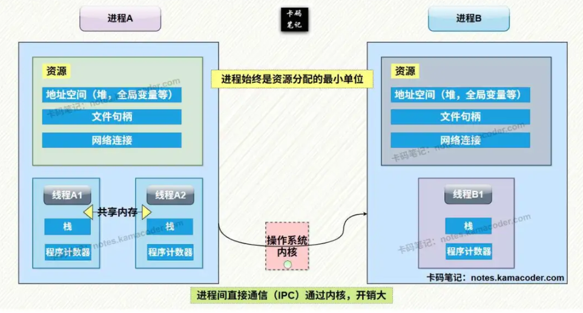
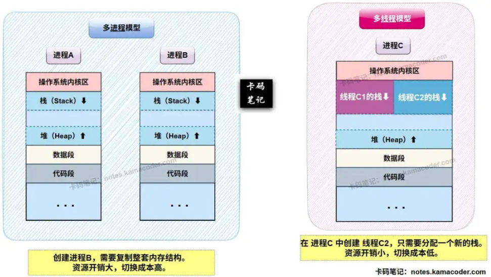
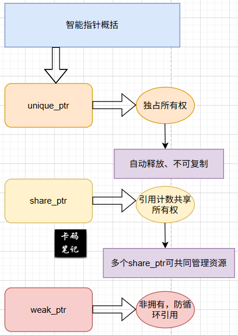

# 全过程50min左右，没有考很难的八股，熟悉的八股基本上答的很全面，但是例如拜占庭和主从复制是答的真的不好，这些了解过但

> 来源: https://notes.kamacoder.com/interview/cpp/bytedance-interview-1.html

全过程50min左右，没有考很难的八股，熟悉的八股基本上答的很全面，但是例如拜占庭和主从复制是答的真的不好，这些了解过但是没有很仔细的去看，没想到考了，虽然每个问题我都能说，但像这种是真的无能为力
感觉最后应该是无了，项目他一个也没问，一开始就说考基础知识和算法，而且还要三轮面试流泪真的服了，字节我第一次面试，感觉会脏面评 

## `# 1.进程、线程、协程区别和应用场景（感觉协程没答很好，主要围绕轻量级线程回答的） 

**简要回答：** 

**进程**：资源分配最小单位，有独立内存空间，切换开销大
**线程**：CPU调度最小单位，共享进程内存，切换开销中等
**协程**：用户态"微线程"，由程序控制切换，开销极小 

**详细回答：** 

**进程是操作系统资源分配的基本单位**，每个**进程拥有独立的地址空间、文件描述符等系统资源**。 

进程间通信需要**通过IPC机制**（管道、消息队列、共享内存等）。**进程**切换涉及**上下文保存、内存空间切换**等，**开销较大**。 

**线程是CPU调度的基本单位**，属于**同一进程的线程共享进程的内存空间和资源**，但每个线程有独立的栈、程序计数器和寄存器状态。线程切换开销小于进程，但仍需内核态切换。 

**协程**是**用户态的轻量级线程**，由**程序自身控制调度，不涉及内核切换**。 

一个**线程内可运行多个协程**，协程间**通过yield/suspend主动让出执行权**，协程切换只需要**保存少量寄存器**，**开销极
小**（纳秒级）。 

应用场景： 
  - **进程**：需要**严格隔离的独立应用**（浏览器、IDE等）   - **线程**：**CPU密集型计算、需要并发的服务端**程序   - **协程**：**高并发I/O密集型应用**（网络服务、爬虫等） 
  - 图解 
  - 进程的基本机构和资源所有权

   - 多进程模型和多线程模型的内存布局 


 

## `# 2.操作系统的线程常见的调度算法有哪些？ 

简要回答： 

**先来先服务**（FCFS）
**短作业优先**（SJF）
**时间片轮转**（RR）
**优先级调度** **多级反馈队列**（MLFQ） 

详细回答： 
  - 

先来先服务（FCFS）：
最简单的调度算法，**按请求到达顺序执行**。优点：实现简单；缺点：可能导致短作业等待时间长。   - 

短作业优先（SJF）：
选择**估计运行时间最短的作业先执行**。优点：平均等待时间最小；缺点：长作业可能饥饿。   - 

时间片轮转（RR）：
每个进程**分配固定时间片，用完后放到队列末尾**，**时间片大小影响性能，太小则上下文切换频繁**。   - 

优先级调度：
**为每个进程分配优先级，高优先级先执行**，可分为**抢占式和非抢占式**，需**防止低优先级饥饿**。   - 

多级反馈队列（MLFQ）：
**多个优先级队列，新进程进入最高优先级队列**，执行完时间片未结束则降低优先级。 

结合了**时间片轮转**和**优先级调度**的优点，是现代操作系统常用算法。   - 

**完全公平调度（CFS）- Linux特有**：
**基于虚拟运行时间**，保证**每个进程获得公平CPU时间**，使用**红黑树管理进程**。 
  - 多级反馈队列图解 


 

## `# 3.熟悉哪些中间件？例如MQ、mysql、redis啥的（我真的不太会中间件，他说mysql，我只熟悉这个） 

简要回答： 

**消息队列**：RabbitMQ、Kafka、RocketMQ - 异步解耦 

**缓存**：Redis、Memcached - 热点数据缓存 

**数据库**：MySQL、PostgreSQL - 数据持久化 

**配置中心**：Nacos、Apollo - 配置管理 

**RPC框架**：Dubbo、gRPC - 服务调用 

详细回答： 

一些重要中间件： 
  - 

消息队列（MQ）： 
    - **Kafka：高吞吐、分布式、持久化，适合日志收集、流处理**     - RabbitMQ：支持多种协议，功能丰富，适合企业级应用     - RocketMQ：阿里开源，分布式、低延迟，适合电商场景   - 

缓存中间件：-** Redis：内存数据库，支持多种数据结构，单线程模型** 
    - Memcached：纯内存缓存，简单高效     - Etcd：分布式键值存储，用于服务发现   - 

数据库相关： 
    - **MySQL**：**关系型数据库，InnoDB引擎支持事务**     - PostgreSQL：功能更丰富的关系型数据库     - MongoDB：文档型NoSQL数据库   - 

服务治理： 
    - Nacos：服务发现、配置管理     - ZooKeeper：分布式协调服务     - Consul：服务网格解决方案 

## `# 4.innodb索引有哪些？有什么特点？ 

简要回答： 

**B+树索引**：主键索引、唯一索引、普通索引 

**哈希索引**：自适应哈希，自动创建 

**全文索引**：FULLTEXT，用于文本搜索 

**空间索引**：SPATIAL，用于地理数据 

详细回答： 
  - 

**聚簇索引**（Clustered Index）： 
    - 主键索引，叶子节点存储整行数据     - 表数据本身就是按主键顺序存储的B+树     - 每个表只能有一个聚簇索引   - 

**二级索引**（Secondary Index）： 
    - 唯一索引、普通索引     - 叶子节点存储主键值，需要回表查询     - 可以有多个二级索引   - 

**联合索引**（Composite Index）： 
    - 多列组合的索引     - 遵循**最左前缀匹配原则**     - 可以用于**索引覆盖查询**   - 

**自适应哈希索引**（Adaptive Hash Index）： 
    - InnoDB自动为热点页创建的内存哈希索引     - 完全自动管理，无需用户干预   - 

**全文索引**（FULLTEXT）： 
    - 用于全文搜索，基于倒排索引     - 支持MATCH AGAINST语法     - MySQL 5.6后InnoDB支持 

特点总结： 
  - 

**B+树结构：适合范围查询，树高度低**（通常3-4层）   - 

**索引组织表：数据按主键顺序存储**   - 

**覆盖索引：查询只需扫描索引，避免回表**   - 

**索引下推：MySQL 5.6优化，在索引中过滤数据** 

## `# 5.事务的隔离级别，各个级别下有哪些锁（这个锁没答好，就答了记录锁、间隙锁啥的用来解决可重复读的幻读问题） 

答： 

| 隔离级别  脏读  不可重复读  幻读  锁机制 
| 读未提交  ✓  ✓  ✓  无锁控制 
| 读已提交  ✗  ✓  ✓  记录锁 
| 可重复读  ✗  ✗  ✓  记录锁+间隙锁 
| 串行化  ✗  ✗  ✗  表级锁 

**MySQL InnoDB引擎**在不同隔离级别下的锁机制： 
  - 

**读未提交**（READ UNCOMMITTED）： 
    - 无锁控制，直接读取最新数据     - 可能读到未提交事务的数据   - 

**读已提交**（READ COMMITTED）： 
    - 使用MVCC（多版本并发控制）     - 只在修改时加锁，使用记录锁     - 语句开始时生成ReadView   - 

**可重复读**（REPEATABLE READ）- **MySQL默认**：-** MVCC + 间隙锁防止幻读** 
    - **事务开始时生成ReadView**     - **锁类型：** 
      - **记录锁**（Record Lock）：锁单行记录       - **间隙锁**（Gap Lock）：锁记录间的范围       - **临键锁**（Next-Key Lock）：记录锁+间隙锁       - **插入意向锁**（Insert Intention Lock）：插入时使用   - 

串行化（SERIALIZABLE）： 
    - 所有SELECT隐式转换为SELECT ... FOR SHARE     - 使用表级锁或更强的行级锁     - 完全串行执行 

sql代码示例 

```
-- 1. 记录锁示例
BEGIN;
SELECT * FROM users WHERE id = 1 FOR UPDATE;  -- 对id=1加排他锁
-- 其他事务不能修改id=1的记录
COMMIT;

-- 2. 间隙锁防止幻读
BEGIN;
SELECT * FROM users WHERE age > 20 AND age < 30 FOR UPDATE;
-- 锁住age在(20,30)之间的所有记录和间隙
-- 防止其他事务插入age=25的记录
COMMIT;

-- 3. 临键锁示例
CREATE TABLE t (id INT PRIMARY KEY, val INT);
INSERT INTO t VALUES (10,1),(20,2),(30,3);

BEGIN;
SELECT * FROM t WHERE id > 15 FOR UPDATE;
-- 锁住的范围：(10,20], (20,30], (30,+∞)
-- 防止插入id=15,25,35等记录
COMMIT;

```

 

## `# 6.mysql的主从复制？（我就知道个binlog，然后说主库记录写操作啥的别的库去备份这个） 

简要回答： 

主从复制 = **主库写binlog → 从库IO线程拉取 → 写入relay log → SQL线程重放** 

用途：**读写分离、数据备份、高可用基础** 

详细回答： 

MySQL**主从复制核心流程**： 
  - 

**主库（Master）**： 
    - **启用binlog**（二进制日志）     - **主库的更新操作记录到binlog**     - **有专门的dump线程负责发送binlog**   - 

**从库（Slave）**： 

a) **IO线程**： 
    - 连接主库，请求binlog     - 接收binlog并写入relay log（中继日志） 

b) **SQL线程**： 
    - 读取relay log中的事件     - 重放SQL语句，更新从库数据 

**复制格式**（binlog_format）： 
  - **STATEMENT：记录SQL语句** 
    - 优点：日志量小     - 缺点：不确定性函数（NOW(), RAND()）可能导致主从不一致   - **ROW：记录每行数据的变化** 
    - 优点：数据一致性强     - 缺点：日志量大（特别是批量更新）   - **MIXED：混合模式，自动选择** 

**复制拓扑：** 
  - 一主一从：基本配置   - 一主多从：读写分离   - 级联复制：Master → Slave1 → Slave2   - 双主复制：互为主从，需注意冲突 

**半同步复制：** 
  - 默认是异步复制：主库提交后立即返回   - 半同步：至少一个从库确认收到binlog后主库才返回   - 增强数据安全性，但影响性能 

**GTID复制**（Global Transaction Identifier）： 
  - 每个事务有全局唯一ID   - 简化故障切换和维护   - 避免主从不一致问题 

## `# 7.raft算法为什么不能解决拜占庭问题？（这个是真离谱，我就解释了拜占庭问题是什么，别的我实在是不知道怎么说了） 

简要回答： 

**Raft假设节点**是"诚实的但可能故障"，**拜占庭节点是"恶意的可能撒谎"** 

**Raft缺乏拜占庭容错所需的密码学验证和冗余机制** 

详细回答： 

**拜占庭问题** vs **普通故障**： 
  - **普通故障**（Crash Fault）：

    - **节点可能崩溃、网络可能丢失消息**     - **但节点不会发送错误信息**     - Raft、Paxos解决这类问题 

2.**拜占庭故障**（Byzantine Fault）： 
  - **节点可能任意行为：崩溃、延迟、发送错误信**息   - 可能被黑客控制或存在恶意节点   - 需要拜占庭容错（BFT）算法 

**Raft的局限性**： 
  - **信任假设**：

    - **Raft假设所有节点是诚实**     - 领导选举、日志复制都基于节点说真话的前提   - **缺乏验证机制**：

    - 没有消息签名验证     - 无法防止伪造的AppendEntries或RequestVote消息   - **简单多数原则失效**：

    - **在拜占庭场景中，恶意节点可能投票给多个候选者**     - 或在不同节点面前表现不一致 

举例说明： 

假设5节点Raft集群，2个拜占庭节点： 
  - **拜占庭节点可能同时给多个候选者投票**   - **可能发送矛盾的日志条目**   - **可能在不同节点面前假装不同的状态**，
Raft无法检测这种欺诈行为。 

**拜占庭容错解决方案**： 
  - **PBFT**（Practical Byzantine Fault Tolerance）：

    - 需要3f+1个节点容忍f个故障     - 使用三阶段提交和消息签名   - **工作量证明**（PoW）：

    - 比特币使用，通过算力成本防止作恶   - **权益证明（PoS）及其他**：

    - 以太坊2.0等使用 

总结：**Raft是CFT算法，BFT需要更复杂的机制和更多冗余节点**。 

## `# 8.c++智能指针分别是怎么实现的？ 

简要回答： 

**unique_ptr：独占所有权，移动语义，禁用拷贝** 

**shared_ptr：共享所有权，引用计数** 

**weak_ptr：不增加引用计数，解决循环引用** 

详细回答： 
  - 

unique_ptr： 
    - **独占式所有权，同一时间只能有一个unique_ptr指向对象**     - **禁用拷贝构造和拷贝赋值**     - **支持移动语义**     - **离开作用域时自动释放资源**   - 

shared_ptr： 
    - **共享式所有权**，多个shared_ptr可指向同一对象     - 使用引用计数，**计数为0时释放资源**     - 线程安全的**引用计数增**减（但对象访问需额外同步）     - 控制块包含：**引用计数、弱引用计数、删除器、分配器**等   - 

weak_ptr： 
    - **不增加引用计数，不拥有对象所有权**     - **用于打破shared_ptr循环引用**     - **必须通过lock()转换为shared_ptr才能访问对象** 
  - 智能指针图解

 

## `# 9.算法题，例如给你n=23311和一个数组（2、4、9），求用这个数组能小于组成n的最大数22999，我这个题用的数位dp做的，最后做出来了，但其实应该用贪心可能更好 

答： 

贪心算法思路：
将n转为字符数组
从左到右遍历每一位
对于当前位置，尝试：
a) 用小于当前位的最大数字填充，后面全用最大数字
b) 如果找不到小于当前位的数字，则回溯到前一位减小 

**c++版本** 

贪心算法实现： 

```
#include <iostream>
#include <vector>
#include <string>
#include <algorithm>
using namespace std;

int findMaxNumber(int n, vector<int>& digits) {
    // 排序digits，方便查找
    sort(digits.begin(), digits.end());

    string n_str = to_string(n);
    string result;
    bool tight = true;  // 是否与n的前缀严格相等

    for (int i = 0; i < n_str.length(); i++) {
        int current_digit = n_str[i] - '0';

        if (tight) {
            // 查找小于等于current_digit的最大数字
            auto it = upper_bound(digits.begin(), digits.end(), current_digit);
            if (it != digits.begin()) {
                // 找到小于current_digit的数字
                int chosen = *(it - 1);
                if (chosen < current_digit) {
                    // 选择这个数字，后面全用最大数字
                    result.push_back(chosen + '0');
                    for (int j = i + 1; j < n_str.length(); j++) {
                        result.push_back(digits.back() + '0');
                    }
                    return stoi(result);
                } else {  // chosen == current_digit
                    result.push_back(chosen + '0');
                    // 继续下一位
                }
            } else {
                // 没有小于等于current_digit的数字，需要回溯
                bool backtrack_success = false;
                for (int j = i - 1; j >= 0; j--) {
                    int prev_digit = result[j] - '0';
                    // 查找比result[j]小的最大数字
                    auto it2 = lower_bound(digits.begin(), digits.end(), prev_digit);
                    if (it2 != digits.begin()) {
                        int smaller = *(it2 - 1);
                        // 重新构建结果
                        result = result.substr(0, j);
                        result.push_back(smaller + '0');
                        for (int k = j + 1; k < n_str.length(); k++) {
                            result.push_back(digits.back() + '0');
                        }
                        backtrack_success = true;
                        break;
                    }
                }
                if (backtrack_success) {
                    return stoi(result);
                } else {
                    // 如果第一位就无法选择，返回全用最大数字但少一位
                    result = string(n_str.length() - 1, digits.back() + '0');
                    return result.empty() ? 0 : stoi(result);
                }
            }
        }
    }

    // 如果所有位都相等，尝试减少最后一位
    for (int i = n_str.length() - 1; i >= 0; i--) {
        int current = result[i] - '0';
        auto it = lower_bound(digits.begin(), digits.end(), current);
        if (it != digits.begin()) {
            int smaller = *(it - 1);
            result[i] = smaller + '0';
            for (int j = i + 1; j < n_str.length(); j++) {
                result[j] = digits.back() + '0';
            }
            return stoi(result);
        }
    }

    // 如果还是不行，返回少一位的最大数
    result = string(n_str.length() - 1, digits.back() + '0');
    return result.empty() ? 0 : stoi(result);
}

int main() {
    int n = 23311;
    vector<int> digits = {2, 4, 9};
    cout << "小于 " << n << " 的最大数为: " << findMaxNumber(n, digits) << endl;
    // 输出: 22999

    // 更多测试用例
    vector<pair<int, vector<int>>> test_cases = {
        {23121, {2, 4, 9}},  // 应该是22999
        {1000, {1, 0}},      // 应该是999
        {12345, {9, 8, 7}},  // 应该是9999
        {555, {1, 2, 3}},    // 应该是333
    };

    for (auto& test : test_cases) {
        cout << "n=" << test.first << ", digits=[";
        for (int d : test.second) cout << d << " ";
        cout << "] => " << findMaxNumber(test.first, test.second) << endl;
    }

    return 0;
}

```

 

动态规划实现 

```
// 数位DP解法
#include <iostream>
#include <vector>
#include <cstring>
#include <algorithm>
using namespace std;

class Solution {
    vector<int> digits;
    string n_str;
    int memo[20][2];  // memo[pos][tight]

    int dfs(int pos, bool tight, string& current) {
        if (pos == n_str.length()) {
            return stoi(current);
        }

        if (memo[pos][tight] != -1 && !tight) {
            return memo[pos][tight];
        }

        int max_num = -1;
        int limit = tight ? (n_str[pos] - '0') : 9;

        for (int d : digits) {
            if (d > limit) break;

            current.push_back(d + '0');
            int next_tight = tight && (d == limit);
            int res = dfs(pos + 1, next_tight, current);

            if (res != -1) {
                max_num = max(max_num, res);
            }

            current.pop_back();
        }

        if (!tight) memo[pos][tight] = max_num;
        return max_num;
    }

public:
    int findMaxNumber(int n, vector<int>& digits) {
        this->digits = digits;
        this->n_str = to_string(n);
        sort(this->digits.begin(), this->digits.end());

        memset(memo, -1, sizeof(memo));
        string current;
        return dfs(0, true, current);
    }
};

```

 

**python版本** 

贪心算法实现 

```
def find_max_number_greedy(n, digits):
    """
    贪心算法实现
    n: 目标数
    digits: 可用数字数组
    """
    digits.sort()
    n_str = str(n)
    result = []
    tight = True  # 表示当前是否与n的前缀严格匹配

    for i in range(len(n_str)):
        current_digit = int(n_str[i])

        if tight:
# 在digits中查找小于等于current_digit的最大数字
# 因为digits已排序，可以使用二分查找
            import bisect
            idx = bisect.bisect_right(digits, current_digit) - 1

            if idx >= 0:
                chosen = digits[idx]
                if chosen < current_digit:
# 找到小于当前位的数字，后面全用最大数字
                    result.append(str(chosen))
                    result.extend([str(digits[-1])] * (len(n_str) - i - 1))
                    return int(''.join(result))
                else:  # chosen == current_digit
                    result.append(str(chosen))
# 继续下一轮
            else:
# 没有小于等于当前位的数字，需要回溯
                backtrack_success = False
                for j in range(i-1, -1, -1):
                    prev_digit = int(result[j])
# 查找比result[j]小的最大数字
                    idx2 = bisect.bisect_left(digits, prev_digit) - 1
                    if idx2 >= 0:
                        smaller = digits[idx2]
# 重新构建结果
                        result = result[:j]
                        result.append(str(smaller))
                        result.extend([str(digits[-1])] * (len(n_str) - j - 1))
                        backtrack_success = True
                        break

                if backtrack_success:
                    return int(''.join(result))
                else:
# 如果第一位就无法选择，返回全用最大数字但少一位
                    if len(n_str) > 1:
                        return int(str(digits[-1]) * (len(n_str) - 1))
                    else:
                        return 0
        else:
# 不是tight状态，直接用最大数字填充
            result.append(str(digits[-1]))

# 如果所有位都相等，尝试减小最后一位
    for i in range(len(n_str) - 1, -1, -1):
        current = int(result[i])
        idx = bisect.bisect_left(digits, current) - 1
        if idx >= 0:
            smaller = digits[idx]
            result[i] = str(smaller)
            for j in range(i + 1, len(n_str)):
                result[j] = str(digits[-1])
            return int(''.join(result))

# 如果还是不行，返回少一位的最大数
    if len(n_str) > 1:
        return int(str(digits[-1]) * (len(n_str) - 1))
    return 0

# 测试
if __name__ == "__main__":
    n = 23311
    digits = [2, 4, 9]
    print(f"小于 {n} 的最大数为: {find_max_number_greedy(n, digits)}")
# 输出: 22999

# 更多测试用例
    test_cases = [
        (23121, [2, 4, 9]),   # 应该是22999
        (1000, [1, 0]),       # 应该是999
        (12345, [9, 8, 7]),  # 应该是9999
        (555, [1, 2, 3]),     # 应该是333
        (100, [9, 8]),        # 应该是99
        (999, [1, 2, 3]),     # 应该是333
    ]

    for n, digits in test_cases:
        result = find_max_number_greedy(n, digits)
        print(f"n={n}, digits={digits} => {result}")

```

 

动态规划（数位DP）实现 

```
def find_max_number_dp(n, digits):
    """
    数位DP实现
    """
    digits.sort()
    n_str = str(n)
    n_len = len(n_str)

# 记忆化数组
    memo = [[-1] * 2 for _ in range(n_len + 1)]

    def dfs(pos, tight, current):
        """
        pos: 当前位置
        tight: 是否与n的前缀严格匹配
        current: 当前构建的数字
        """
        if pos == n_len:
            if current:  # 确保不是空字符串
                return int(current)
            return -1

        if memo[pos][tight] != -1 and not tight:
            return memo[pos][tight]

        limit = int(n_str[pos]) if tight else 9
        max_num = -1

        for d in digits:
            if d > limit:
                break

            new_current = current + str(d)
            new_tight = tight and (d == limit)
            res = dfs(pos + 1, new_tight, new_current)

            if res != -1:
                max_num = max(max_num, res)

        if not tight:
            memo[pos][tight] = max_num

        return max_num

    return dfs(0, True, "")

# 数位DP的优化版本（返回字符串）
def find_max_number_dp_optimized(n, digits):
    """
    数位DP优化版本，直接处理字符串
    """
    from functools import lru_cache

    digits.sort()
    n_str = str(n)
    digits_str = [str(d) for d in digits]

    @lru_cache(maxsize=None)
    def dfs(pos, tight, leading_zero):
        """
        pos: 当前位置
        tight: 是否与n的前缀严格匹配
        leading_zero: 是否当前还在前导零状态
        """
        if pos == len(n_str):
            return ""

        limit = n_str[pos] if tight else '9'
        best = None

        for d in digits_str:
            if d > limit:
                break

            if d == '0' and leading_zero and pos < len(n_str) - 1:
# 前导零的情况
                res = dfs(pos + 1, tight and d == limit, True)
                if res is not None:
                    candidate = res
                else:
                    candidate = None
            else:
                res = dfs(pos + 1, tight and d == limit, False)
                if res is not None:
                    candidate = d + res
                else:
                    candidate = None

            if candidate is not None:
                if best is None or int(candidate) > int(best):
                    best = candidate

        return best

    result = dfs(0, True, True)
    return int(result) if result and int(result) < n else 0

# 测试
if __name__ == "__main__":
    n = 23311
    digits = [2, 4, 9]

    print("贪心算法结果:", find_max_number_greedy(n, digits))
    print("数位DP结果:", find_max_number_dp(n, digits))

```

 

**java版本** 

贪心算法实现 

```
import java.util.*;

public class MaxNumberFinder {

    // 贪心算法实现
    public static int findMaxNumberGreedy(int n, int[] digits) {
        // 排序可用数字
        Arrays.sort(digits);
        String nStr = Integer.toString(n);
        StringBuilder result = new StringBuilder();
        boolean tight = true;  // 是否与n的前缀严格匹配

        for (int i = 0; i < nStr.length(); i++) {
            int currentDigit = nStr.charAt(i) - '0';

            if (tight) {
                // 在digits中查找小于等于currentDigit的最大数字
                int idx = binarySearchLessOrEqual(digits, currentDigit);

                if (idx >= 0) {
                    int chosen = digits[idx];
                    if (chosen < currentDigit) {
                        // 找到小于当前位的数字，后面全用最大数字
                        result.append(chosen);
                        for (int j = i + 1; j < nStr.length(); j++) {
                            result.append(digits[digits.length - 1]);
                        }
                        return Integer.parseInt(result.toString());
                    } else {  // chosen == currentDigit
                        result.append(chosen);
                        // 继续下一轮
                    }
                } else {
                    // 没有小于等于当前位的数字，需要回溯
                    boolean backtrackSuccess = false;
                    for (int j = i - 1; j >= 0; j--) {
                        int prevDigit = result.charAt(j) - '0';
                        int idx2 = binarySearchLess(digits, prevDigit);

                        if (idx2 >= 0) {
                            int smaller = digits[idx2];
                            // 重新构建结果
                            result = new StringBuilder(result.substring(0, j));
                            result.append(smaller);
                            for (int k = j + 1; k < nStr.length(); k++) {
                                result.append(digits[digits.length - 1]);
                            }
                            backtrackSuccess = true;
                            break;
                        }
                    }

                    if (backtrackSuccess) {
                        return Integer.parseInt(result.toString());
                    } else {
                        // 如果第一位就无法选择，返回全用最大数字但少一位
                        if (nStr.length() > 1) {
                            StringBuilder sb = new StringBuilder();
                            for (int j = 0; j < nStr.length() - 1; j++) {
                                sb.append(digits[digits.length - 1]);
                            }
                            return sb.length() > 0 ? Integer.parseInt(sb.toString()) : 0;
                        } else {
                            return 0;
                        }
                    }
                }
            } else {
                // 不是tight状态，直接用最大数字填充
                result.append(digits[digits.length - 1]);
            }
        }

        // 如果所有位都相等，尝试减小最后一位
        for (int i = nStr.length() - 1; i >= 0; i--) {
            int current = result.charAt(i) - '0';
            int idx = binarySearchLess(digits, current);

            if (idx >= 0) {
                int smaller = digits[idx];
                result.setCharAt(i, (char)(smaller + '0'));
                for (int j = i + 1; j < nStr.length(); j++) {
                    result.setCharAt(j, (char)(digits[digits.length - 1] + '0'));
                }
                return Integer.parseInt(result.toString());
            }
        }

        // 如果还是不行，返回少一位的最大数
        if (nStr.length() > 1) {
            StringBuilder sb = new StringBuilder();
            for (int i = 0; i < nStr.length() - 1; i++) {
                sb.append(digits[digits.length - 1]);
            }
            return sb.length() > 0 ? Integer.parseInt(sb.toString()) : 0;
        }

        return 0;
    }

    // 二分查找小于等于target的最大数字
    private static int binarySearchLessOrEqual(int[] digits, int target) {
        int left = 0, right = digits.length - 1;
        int result = -1;

        while (left <= right) {
            int mid = left + (right - left) / 2;
            if (digits[mid] <= target) {
                result = mid;
                left = mid + 1;
            } else {
                right = mid - 1;
            }
        }

        return result;
    }

    // 二分查找小于target的最大数字
    private static int binarySearchLess(int[] digits, int target) {
        int left = 0, right = digits.length - 1;
        int result = -1;

        while (left <= right) {
            int mid = left + (right - left) / 2;
            if (digits[mid] < target) {
                result = mid;
                left = mid + 1;
            } else {
                right = mid - 1;
            }
        }

        return result;
    }

    // 测试
    public static void main(String[] args) {
        int n = 23311;
        int[] digits = {2, 4, 9};

        System.out.println("小于 " + n + " 的最大数为: " +
                          findMaxNumberGreedy(n, digits));
        // 输出: 22999

        // 更多测试用例
        int[][] testCases = {
            {23121, 2, 4, 9},  // 应该是22999
            {1000, 1, 0},      // 应该是999
            {12345, 9, 8, 7},  // 应该是9999
            {555, 1, 2, 3},    // 应该是333
        };

        for (int[] test : testCases) {
            int testN = test[0];
            int[] testDigits = Arrays.copyOfRange(test, 1, test.length);
            int result = findMaxNumberGreedy(testN, testDigits);
            System.out.println("n=" + testN + ", digits=" +
                             Arrays.toString(testDigits) + " => " + result);
        }
    }
}

```

 

动态规划（数位DP）实现 

```
import java.util.*;

public class MaxNumberFinderDP {

    // 数位DP实现
    public static int findMaxNumberDP(int n, int[] digits) {
        Arrays.sort(digits);
        String nStr = Integer.toString(n);
        int nLen = nStr.length();

        // 记忆化数组
        Integer[][][] memo = new Integer[nLen + 1][2][2];

        return dfs(0, 1, 1, nStr, digits, memo, new StringBuilder());
    }

    private static int dfs(int pos, int tight, int leadingZero,
                          String nStr, int[] digits,
                          Integer[][][] memo, StringBuilder current) {
        if (pos == nStr.length()) {
            if (current.length() > 0) {
                return Integer.parseInt(current.toString());
            }
            return -1;
        }

        if (memo[pos][tight][leadingZero] != null && tight == 0) {
            return memo[pos][tight][leadingZero];
        }

        int limit = (tight == 1) ? (nStr.charAt(pos) - '0') : 9;
        int maxNum = -1;

        for (int d : digits) {
            if (d > limit) break;

            if (d == 0 && leadingZero == 1 && pos < nStr.length() - 1) {
                // 处理前导零
                int res = dfs(pos + 1,
                             (tight == 1 && d == limit) ? 1 : 0,
                             1, nStr, digits, memo, current);
                if (res > maxNum) {
                    maxNum = res;
                }
            } else {
                current.append(d);
                int res = dfs(pos + 1,
                             (tight == 1 && d == limit) ? 1 : 0,
                             0, nStr, digits, memo, current);
                current.deleteCharAt(current.length() - 1);

                if (res > maxNum) {
                    maxNum = res;
                }
            }
        }

        if (tight == 0) {
            memo[pos][tight][leadingZero] = maxNum;
        }

        return maxNum;
    }

    // 优化的数位DP版本
    public static int findMaxNumberDPOptimized(int n, int[] digits) {
        Arrays.sort(digits);
        String nStr = Integer.toString(n);
        int nLen = nStr.length();

        // dp[pos][tight] 存储最大结果
        String[][] dp = new String[nLen + 1][2];
        for (int i = 0; i <= nLen; i++) {
            Arrays.fill(dp[i], null);
        }

        dp[nLen][0] = dp[nLen][1] = "";

        for (int pos = nLen - 1; pos >= 0; pos--) {
            for (int tight = 0; tight <= 1; tight++) {
                int limit = (tight == 1) ? (nStr.charAt(pos) - '0') : 9;
                String best = null;

                for (int d : digits) {
                    if (d > limit) break;

                    int nextTight = (tight == 1 && d == limit) ? 1 : 0;
                    String next = dp[pos + 1][nextTight];

                    if (next != null) {
                        String candidate = (d == 0 && pos > 0 && next.isEmpty()) ?
                                          next : Integer.toString(d) + next;

                        if (best == null || compareNumbers(candidate, best) > 0) {
                            best = candidate;
                        }
                    }
                }

                dp[pos][tight] = best;
            }
        }

        String result = dp[0][1];
        return (result != null && result.length() > 0) ? Integer.parseInt(result) : 0;
    }

    private static int compareNumbers(String a, String b) {
        if (a.length() != b.length()) {
            return a.length() - b.length();
        }
        return a.compareTo(b);
    }

    // 测试
    public static void main(String[] args) {
        int n = 23311;
        int[] digits = {2, 4, 9};

        System.out.println("贪心算法结果: " + MaxNumberFinder.findMaxNumberGreedy(n, digits));
        System.out.println("数位DP结果: " + findMaxNumberDP(n, digits));
        System.out.println("优化数位DP结果: " + findMaxNumberDPOptimized(n, digits));

        // 测试更多用例
        int[][] testCases = {
            {23121, 2, 4, 9},
            {1000, 1, 0},
            {12345, 9, 8, 7},
            {555, 1, 2, 3},
        };

        for (int[] test : testCases) {
            int testN = test[0];
            int[] testDigits = Arrays.copyOfRange(test, 1, test.length);

            int greedyResult = MaxNumberFinder.findMaxNumberGreedy(testN, testDigits);
            int dpResult = findMaxNumberDP(testN, testDigits);
            int dpOptimizedResult = findMaxNumberDPOptimized(testN, testDigits);

            System.out.printf("n=%d, digits=%s => 贪心:%d, DP:%d, 优化DP:%d%n",
                             testN, Arrays.toString(testDigits),
                             greedyResult, dpResult, dpOptimizedResult);
        }
    }
}

```
