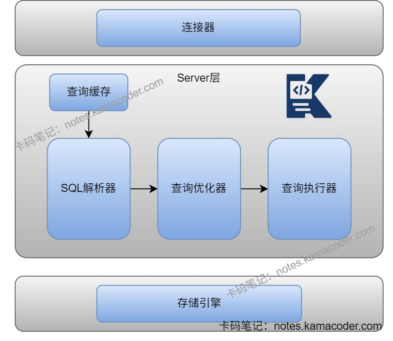

# 美团一二面面经

> 来源: https://notes.kamacoder.com/interview/java/meituan-round1-2-interview-2-2.html

# `# 美团一二面面经 

### `# 子类与父类的加载过程是怎样的？ 
  - 

子类与父类的加载原则是**先父类后子类**。 

在**加载**阶段，JVM 先加载父类的.class 字节码生成 Class 对象，再加载子类，父类Class对象先入方法区； 

在**初始化**阶段，先执行父类的静态变量赋值 + 静态代码块（按源码顺序），再执行子类的，JVM 保证每个类的< clinit >() 方法线程安全。 

### `# Java中sync的阻塞与可重入是怎么实现的？ 
  - 

synchronized是Java提供的内置锁，依赖JVM层面的锁机制实现，主要通过对象头、和监视器锁实现同步。   - 

sync通过对象头的MarkWord字段判断当前锁的状态。 

如果是**偏向锁**，Mark Work会记录线程ID，后续线程可直接复用； 

如果是**轻量级锁**，线程使用CAS将MarkWork替换成自己的锁记录指针，其余线程自旋重试，不阻塞； 

如果是**重量级锁**，会变成Monitor监视器锁，MarkWord是Monitor地址，其余线程会进入阻塞状态。   - 

**监视器锁**的实现原理是给每个对象关联一个Monitor，包含当前持有锁的线程owner、等待队列WaitSet和阻塞队列EntryList，以及锁的计数器。owner会指向执行中的线程，当线程调用wait()方法时，计数器归零，线程进入等待队列，等待被唤醒后进入阻塞队列，随后唤醒阻塞队列的线程获取Monitor并执行下一个线程。

 

### `# sync锁升级机制是怎么样的？ 
  - 

**锁升级机制**是JDK1.6之后引入的，升级过程为偏向锁-轻量级锁-重量级锁，其中重量级锁依赖Monitor实现。 

JDK1.6默认开启**偏向锁**，没有开启偏向锁时为无锁，偏向锁可以减少无竞争场景下的锁开销，当有线程获取到偏向锁时会记录线程ID，即JVM在对象头的Mark Word字段中记录当前线程ID，后续相同线程进入或退出同步块时无需CAS操作，仅需检查ID是否相同；有新线程竞争偏向锁时锁会升级为轻量级锁。   - 

JDK1.8后默认锁为**轻量级锁**，能够在无激烈竞争场景下解决多线程交替执行同步块问题。每个线程在自身栈帧中创建锁记录(Lock Record)，通过CAS操作尝试将锁对象头的Mark Word设置为自身线程，如果成功设置则说明获取锁成功。 

自旋次数或者线程数过多则会升级为**重量级锁**。重量级锁依赖操作系统的互斥量实现，线程会被挂起节省CPU资源，但是存在内核态和用户态切换开销。线程会为对象创建一个监视器锁Monitor，获取锁时线程阻塞在Monitor的等待队列中，持有锁的线程释放锁时操作系统会唤醒等待线程。 

### `# AQS机制了解吗？ 
  - 

AQS是抽象队列同步器，是ReentrantLock、CountDownLatch和ConcurrentHashMap等并发工具的底层核心。 

AQS内部维护一个**state变量**记录锁状态和一个**双向链表（CLH队列）** 管理等待线程。   - 

线程**调用lock()** 时，会通过CAS尝试将state从0改为1，成功则获取锁，失败则会先执行tryAcquire(1)尝试再次通过CAS获取锁，如果当前是线程已经持有锁的重入情况则对state+1实现可重入，否则说明锁被其他线程持有，会将线程封装为Node节点加入AQS等待队列末尾，然后通过自旋和CAS尝试获取锁，自旋失败则阻塞线程并等待被唤醒。 

在锁释放时会**调用unlock()** 执行release(1)方法，首先会执行tryRelease()方法将state-1，若state为0则唤醒队列中的后继线程，被唤醒的线程进入自旋并获取锁。 

### `# 用户态和内核态的区别是什么？ 
  - 

用户态和内核态是操作系统的运行级别，把进程的操作权限分开，进程运行时会在两者之间切换。   - 

用户态是**普通进程的运行态**，只能访问进程自己的内存空间，不能访问内核内存、硬件资源等，需要通过系统调用进入内核态； 

内核态是**操作系统内核的运行状态**，能访问所有的系统资源，处理系统调用、中断、进程调度等核心操作。   - 

比如Java程序调用new File()读文件，会触发系统调用，进程会从用户态切换到内核态，内核会处理系统调用，切回用户态把数据返回给程序，但是状态切换会造成性能开销。 

### `# wait与sleep调用后操作系统发生了什么？ 
  - wait和sleep会让线程暂停，不过wait是Object的方法，只能在sync锁中使用，会释放锁；sleep是Thread的方法，可以在任何地方使用，不会释放锁。   - 调用wait()后会**释放持有的对象锁**，然后操作系统会把该线程的状态从RUNNABLE变为WAITING，随后将线程放入对象的等待队列，剥夺CPU执行权后线程进入阻 塞状态，直到等待被notify/notifyAll()唤醒；   - 调用sleep()后**不会释放锁**，操作系统直接将线程状态改为TIMED_WAITING，剥夺CPU执行权后线程暂停指定时间，在此期间不参与CPU的调度，直到时间到或者被interrupt()中断。 

### `# Concurrenthashmap介绍一下？ 
  - 

ConcurrentHashMap是HashMap的线程安全版本，初始化和扩容过程采用无锁操作，不会阻塞，但是禁止null键值对，避免逻辑错误。   - 

JDK1.7中，ConcurrentHashMap使用了**数组 + 链表**的数据结构，数组分为大数组Segement和小数组HashEntry，采用分段锁技术实现线程安全，即对每个Segment独立加锁，小数组HashEntry用于存储键值对数据。**读操作**无锁，使用volatile保证可见性，根据HashEntry的volatile字段保证读操作能获取最新值。**写操作**对目标加锁，完成后释放，同一Segment写操作互斥。 

JDK1.8中，ConcurrentHashMap使用的是**数组 + 链表 + 红黑树**的结构。并发控制体现在操作时会判断数组节点是否为空，如果为空则使用CAS无锁插入，如果不为空则使用Synchronized锁定当前链表/红黑树节点后进行操作。可以缩小锁的粒度，让发生冲突和加锁的频率降低，实现线程安全的同时提高并发操作性能。 

### `# size()的流程是什么？ 
  - size()用于获取ConcurrentHashMap的元素总数，在JDK1.8中实现高效获取且无全局锁，依靠baseCount变量和counterCells数组实现，避免遍历全表导致性能问题。   - 在正常增加或删除元素时会尝试使用CAS修改baseCount基础计数器，修改成功则直接更新总数；当出现多个线程修改baseCount失败时，JDK会创建counterCells数组，把不同线程的计数操作分散到不同的Cell中，避免线程冲突。   - 最后调用size()时，先获取baseCount的值，然后遍历counterCells数组，累加所有Cell的value值，返回总数为元素总数。 

### `# 单例模式的双重校验锁了解吗？ 
  - 

单例模式保证一个类在程序运行期间只有一个实例，提供全局唯一访问入口，解决频繁创建和销毁全局使用的类实例问题，当需要控制实例数目节省资源时使用。   - 

使用双重校验锁(DCL-Double Check Locking)可以实现单例模式，能够在多线程环境下保证线程安全并具有高性能。 

通过**volatile解决指令重排问题**，如果没有volatile关键字可能会导致有线程拿到未初始化的实例，导致空指针；**synchronized保证多线程下的原子性**，外加两次空检查校验实现，第一次校验避免每次调用都加锁，第二次校验防止多个线程同时走到sync外等待锁，导致执行完方法后释放锁，其他线程获取锁多次执行方法。 

```
    public class Singleton {
        private static volatile Singleton instance; // volatile修饰
        private Singleton() {} // 私有构造
        public static Singleton getInstance() {
            if (instance == null) { // 第一次校验
                synchronized (Singleton.class) { // 只有一个线程能进
                    if (instance == null) { // 第二次校验，防止多线程等待锁后重复创建
                        instance = new Singleton();
                    }
                }
            }
            return instance;
        }
    }

```

 


 

### `# volatile的可见性原理(MESI)了解吗？ 
  - CPU的缓存一致性协议保证了volatile变量的可见性，MESI表示缓存行的四种状态：修改(Modified)、独占(Exclusive)、共享(Shared)和无效(Invalid)。   - 当一个线程修改了volatile变量，CPU会将该变量所在的缓存行标记为Modified状态，然后会通知其他CPU核心，让其他核心将缓存行标记为Invalid状态，之后其他线程需要读取该变量时，会重新从主内存中读取该变量，因此所有线程都能看到最新值。 

### `# MySQL中select语句执行流程是什么？ 


 
  - 查询语句在客户端与MySQL服务器建立连接后，如果使用的MySQL是8.0之前的版本，那么MySQL会**查询缓存**，如果之前有执行过这条语句，那么MySQL会从缓存中返回结果，否则进行下一步；   - MySQL中的**分析器进行词法和语法分析**，提取出语句中的关键元素，检查此时的SQL语句，如果正确会构建SQL语法树，不正确时会返回错误信息；**优化器对语法树进行优化**，如选择合适的索引、表连接顺序等生成最佳的执行计划；执行器根据优化器生成的执行方案，**校验用户权限**后调用下层存储引擎的API接口**执行**数据读写操作，将结果返回给客户端。如果MySQL是短连接，则会在执行完成后关闭连接； 

### `# MySQL用户名密码存在错误时怎么解决？语法错误在哪个阶段检查？ 
  - 在客户端通过TCP三次握手连接MySQL后，MySQL连接器会从客户端发送的认证数据包中检查用户名和密码，如果验证失败则拒绝连接并返回错误信息，不进行后续资源分配，验证成功则会为该链接分配连接资源，记录连接状态并返回连接成功信息，执行下一步。   - MySQL的分析器会进行词法分析和语法分析，根据MySQL的语法规则对SQL语句进行解析，并生成相应的抽象语法树（AST），会检查关键字的拼写、语法结构是否正确以及关键字的顺序是否正确等，如果在语法分析过程中出现错误分析器就会停止解析，生成详细的错误信息后将错误位置以及原因返回给客户端。 

### `# MySQL的事务了解吗？ 
  - MySQL的事务是一组SQL操作，要么全部执行成功，要么全部执行失败，具有原子性、一致性、隔离性、持久性四个特性。原子性通过undoLog实现，持久性通过redoLog实现，隔离性则是利用锁机制和MVCC共同保证，最终实现事务的一致性；   - 事务有四种隔离级别，从低到高分别是读未提交(RU)、读已提交(RC)、可重复读(RR)、串行化(Serializable)，默认级别是可重复读(RR)。 

### `# 并发MVCC的原理是什么？ 
  - MVCC是多版本并发控制，是InnoDB实现读已提交和可重复读隔离级别的核心机制，能够解决并发场景下读和写的冲突问题。   - InnoDB为每一行添加了三个隐藏列，分别是**事务ID**，**行号**和指向undoLog的指针**roll_pointer**，用于回滚生成历史版本，形成版本链。**Read View**会记录当前事务的ID(m_creator_trx_id)，未提交事务列表(m_ids)和其中最小的事务ID(m_up_limit_id)，还有未开始的事务ID(m_low_limit_id)，也就是最大的事务ID+1，使用Read View进行可见性判断时，事务ID小于m_up_limit_id的事务是已经提交的事务，是可见的，大于等于m_low_limit_id的事务是不可见的。   - 在**读已提交**隔离级别下，每次执行读操作会生成一个新的快照视图read view，可以看到其他事务已提交的修改；在**可重复读**的隔离级别下，只会在事务第一次读时生成一个read view，后续读操作会复用该视图，能保证同一事务内多次读的结果一致。 

### `# rr隔离级别下的间隙锁为什么会导致死锁问题？ 
  - 在可重复读隔离级别下，如果**有多个事务交叉持有并等待对方的间隙锁**时，就会形成循环等待，造成死锁。   - 因为InnoDB加锁的顺序不一致，比如事务A执行时会添加间隙锁，此时事务B在同一个区间上也添加了间隙锁，此时如果事务A希望获取插入锁时就会被事务B的间隙锁阻塞，而事务B希望获取插入锁时就会被事务A的间隙锁阻塞，两个事务互相持有对方需要的锁后触发死锁。   - InnoDB检测到死锁后，会选择回滚代价最小的事务进行回滚，释放锁后解决死锁问题。 

### `# 使用索引的注意事项有哪些？ 
  - 创建索引时，需要控制索引数量，索引过多会降低效率，增加索引维护成本；如果数据量比较小，可能全表扫描会比索引效率更高；如果数据的区分度比较低，过滤效果差，也不适合创建索引；索引不再使用时应该及时删除，避免维护开销；   - 最好选择区分度高、频繁查询的列创建索引，尽量创建唯一索引；经常一起查询的列可以创建联合索引，可以避免索引合并的开销；对于字符串类型的字段可以建立前缀索引；如果索引列不能存储NULL值，在创建表时使用NOT NULL约束，以便优化器高效选择。   - 使用索引时，需要遵循最左匹配原则，不能跳过索引列；不要使用索引列做运算，和模糊查询，否则会导致索引失效。 

### `# 自增ID和UUID的区别是什么？ 
  - 自增ID是连续递增的，采用顺序写，InnoDB的主键索引是聚簇索引，插入新数据时，会直接追加到叶子节点末尾，不会产生索引碎片，所以使用InnoDB应该尽可能的按主键的自增顺序插入。   - UUId是随机写，每次插入的ID无序，写入的目标页可能已经刷新到磁盘上并且从缓存上移除，需要在插入前读取到内存中导致大量的随机IO；InnoDB还会频繁地做页分裂操作，为新的行分配空间。以UUID作为主键时，如果表中有大字段，可能会导致行移除，也就是每一行数据的总大小超过数据页的存储上限，查询效率降低。
