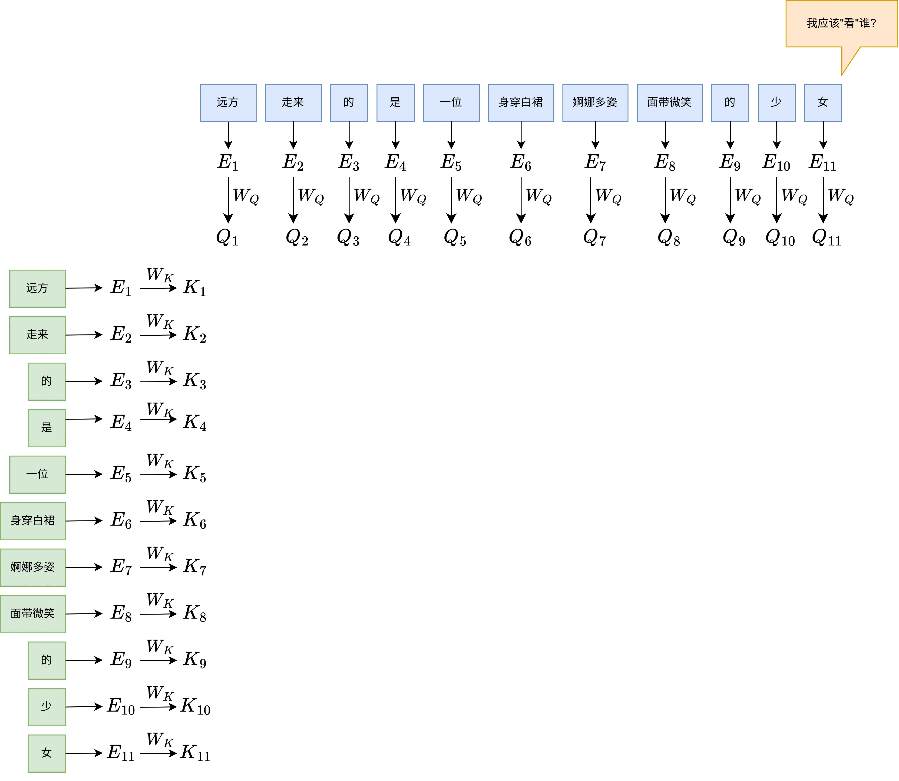
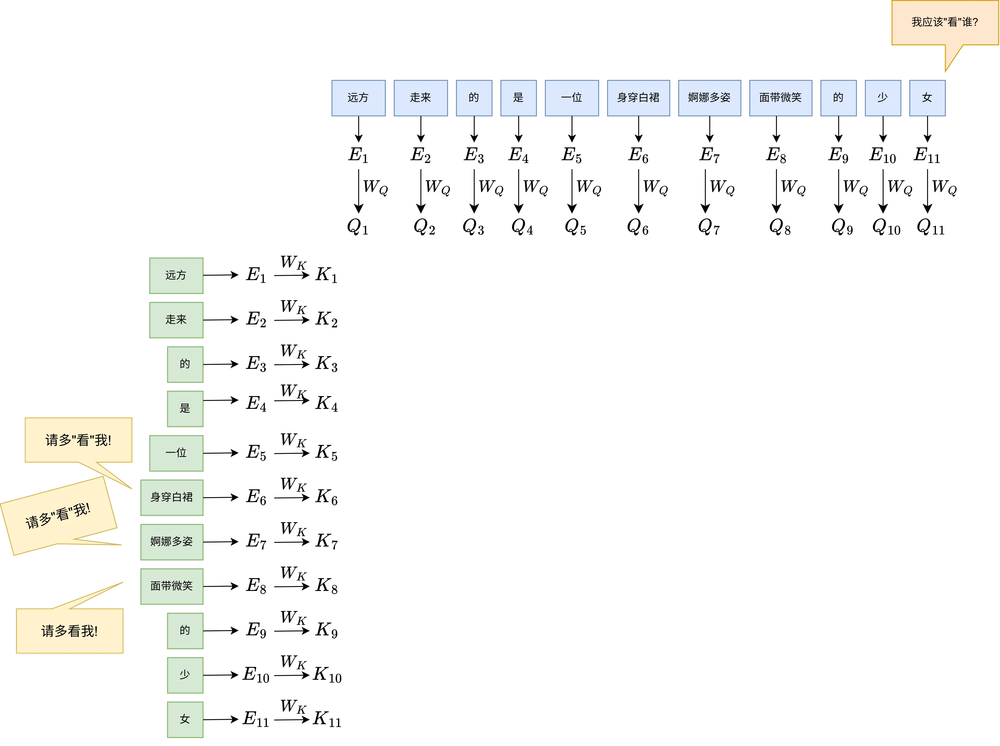

# Attention机制详解：Q、K、V是什么，为什么它是Transformer的核心

> 来源: https://notes.kamacoder.com/llm/transformer/qkv.html

# `# Attention机制详解：Q、K、V是什么，为什么它是Transformer的核心 

上一阶段给大家接受了Transformer的基础原理， 接下来的几篇文章将重点给大家拆解Transformer的几个核心组件与计算原理。本篇文章先给大家介绍一下Attention机制当作过渡。 

## `# 注意力的直觉解释 

Attention本质上在做一件很像人类的事，大家先看这句话： 
> 

小明打了小刚，因为他生气了
 

这里的“他”指的是谁？小明？小刚？放你看到这句话时，你不会随机回答，你会“先看一眼上下文”，再做出判断——小明。这就是Attention的直觉解释： 
> 

从上下文中，挑出和当前词最相关的部分；也就是说，**每个Token都会关注其他Token，但关注的程度不一样**
 

## `# 为什么必须关注不同Token？ 

如果没有Attention机制，会发生什么？  

1.每个词独立处理  

2.像RNN一样顺序传递信息  

这都会导致远距离的信息丢失，比如这句话： 
> 

我最近都在学习Transformer，前几天还去图书馆借了相关书籍，今天终于把Transformer学完了，它真的很强大
 

“它”指的是谁？相关书籍？图书馆？Transformer？如果模型不能**“看整体”**，就很难捕捉到这样的语义信息 

## `# Query，Key，Value在Attention中扮演的角色 

大家一定也会常常听到Attention中的QKV矩阵，也是很多人搞不懂的地方：**QKV到底是做什么的？** 本篇文章依旧不涉及复杂公式，给大家形象介绍下它们的用途。  

Query（Q）：当前Token会问所有Token一个问题：我应该**“更注意”** 谁？  

比如这句话： 
> 

*远方走来的是一位身穿白裙婀娜多姿面带微笑的少女*
 

这句话中，“身穿白裙”“婀娜多姿”“面带微笑”“少”等词对于“女”的语义影响是很大的，而“的”“是”等词就显得没有那么重要，于是Query矩阵就相当于“女”这个Token在发问：**我应该更关注谁？** 

 

Key（K）：这个矩阵相当于在回答Query矩阵的问题，还是以上面这句话为例，“女”这个Token会问：我应该更关注谁？而Key矩阵则是回答：你应该更关注我。于是“身穿白裙”“婀娜多姿”“面带微笑”“少”则是回答“女”的query：**多关注我！** 

 

Value（V）：Value 是 Token 携带的**核心特征信息**。当 Query 发现某个 Key 很匹配时，它就会把对应的 Value 提取出来，融入到当前的语义表示中 

下一篇文章将会给大家讲解Q，K，V与softmax的计算细节，点个关注不迷路～
