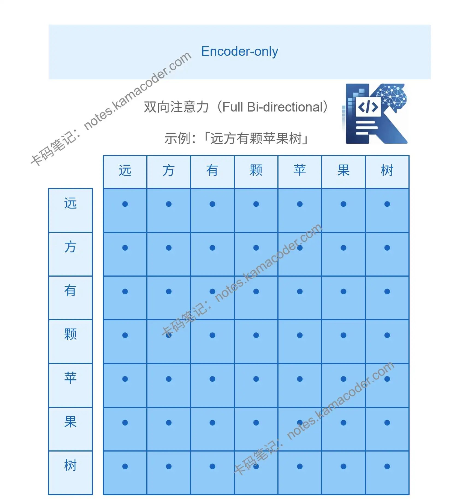
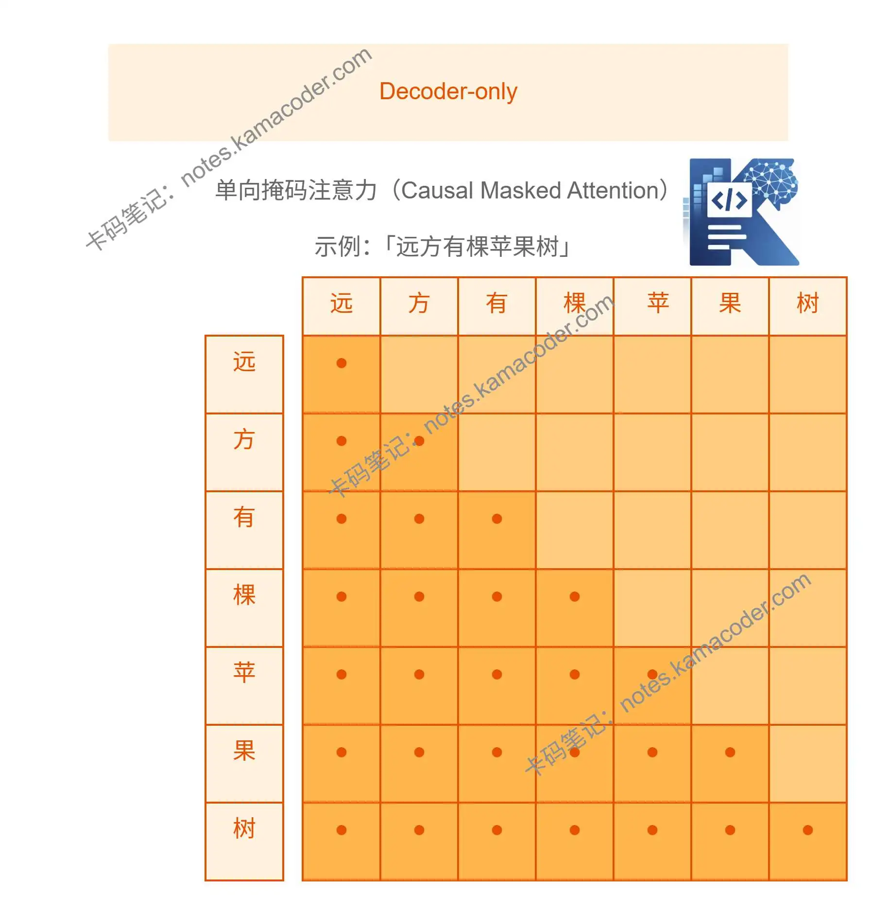
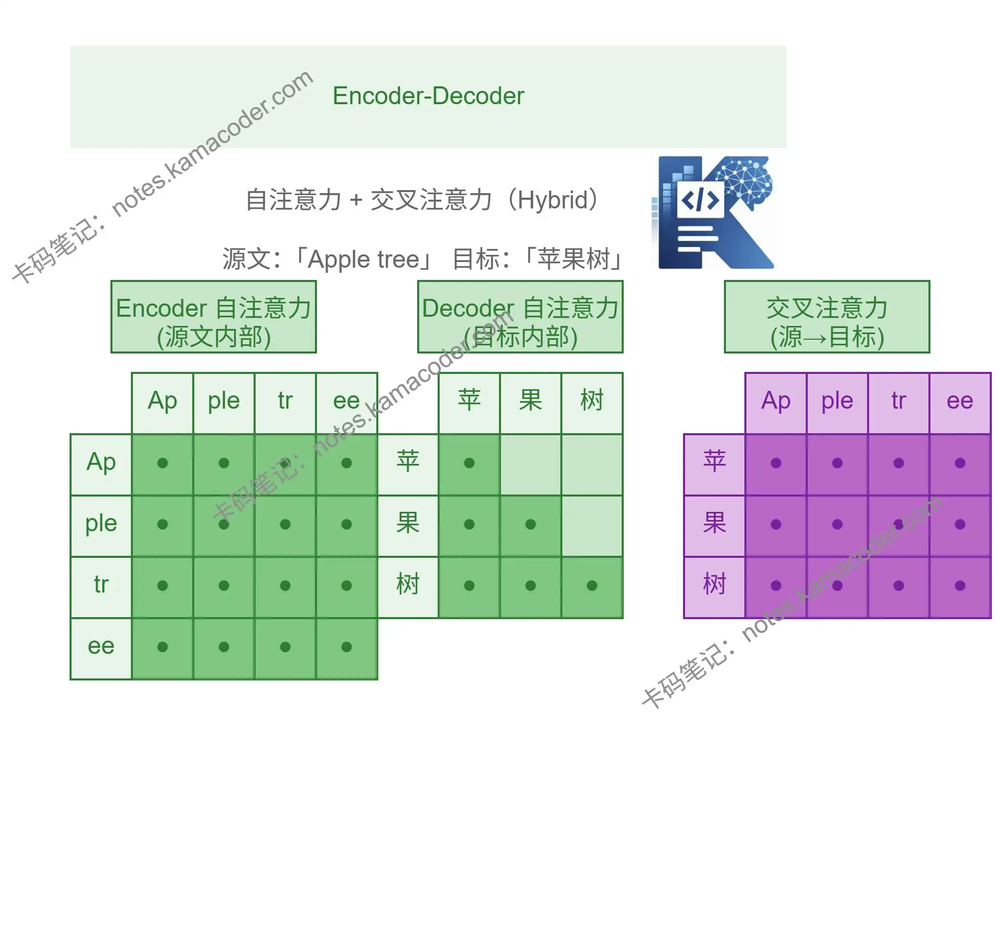

# Encoder-only、Decoder-only、Encoder-Decoder三种架构详解与对比

> 来源: https://notes.kamacoder.com/llm/transformer/transformer_base_encoder_decoder.html

# `# Encoder-only、Decoder-only、Encoder-Decoder三种架构详解与对比 

上一篇文章我们简单介绍了Transformer架构，这一篇文章我们来详细讲讲Transformer中的Encoder-only，Dcoder-only，Encoder-Decoder这三种架构的异同与用法 

## `# 1.Encoder-only架构 

顾名思义，Encoder-only架构为只有编码器的架构，代表性模型为BERT。这种架构更擅长“理解输入”，所以其主要应用场景为文本分类、情感分析、信息抽取、命名实体识别等。注意力矩阵采用双向注意力计算，即每个字都能看到上下文得所有信息。 以“远方有棵苹果树”这句话为例子带大家看下注意力矩阵大概的样子：

 

## `# 2.Decoder-only架构 

Decoder-only架构为只有解码器的架构，擅长按顺序生成，适合生成类任务，也就是当今GPT（Generative Pre-trained Transformer）、Llama、Qwen、Deepseek等模型家族的主流架构，我们日常使用AI产品例如deepseek、千问、元宝、豆包等，底层往往也是这类生成式大模型。  

这也引出一个经典面试问题：为什么生成式大模型都使用Decoder- only架构？明明这三种架构都使用自注意力机制，为什么偏偏是Decoder-only架构成了主流？  

相信大家现在或多或少都用过一些大模型工具，不知道大家有没有注意过这些工具在生成时的特点，这些大模型都是一个字一个字往外“吐”的，更准确的说，是一个一个token逐步生成。就像我们人说话，也是一个字一个字从前往后说的，这种设计模拟了人类思维的**因果性**：我们基于已经说出口的话（前文）来推理下一个字，而不能预知未来。而我们在上篇文章中介绍的Transformer的优势之一就是：它可以让任何一个位置的Token都“注意”到其他位置的Token，也就是说，在生成一句话例如： 
> 

**远方有颗苹果树**
 

当生成到“苹果”这个词时，“树”这个词是不应该被“看见”的。即在生成当前位置的Token时，不能提前“偷看”后面的Token。  

在Decoder-only架构中，会通过 causal mask 把“未来位置”遮住，这样便可以使大模型在生成前文时“看不到”后文。（我们后面会详细讲解自注意力矩阵的计算，大家在这里有个印象即可） 如果把注意力矩阵画出来，常见写法里被遮住的部分通常表现为上三角区域：

 

## `# 3.Encoder- Decoder架构 

即编码器-解码器架构，代表性模型为T5，适合序列到序列，文本到文本的转换任务，比如翻译、摘要、问答生成。在该架构中： 
  - Encoder阶段：使用双向注意力计算   - Decoder阶段采用两种注意力计算方式： 
  - **掩码自注意力（Masked Self-Attention）**：用于处理已经生成的译文。   - **交叉注意力（Cross-Attention）**：用于从编码器输出的“原文”中提取关键信息。

 

## `# 三种架构的主要区别： 

这也是初学者常常会混淆的地方，三种架构都有自注意力计算，那么区别到底在哪？ 给大家提供表格方便对比异同： 

| 架构类型  注意力机制特征  核心“超能力”  代表模型  适用场景 
| **Encoder-only (仅编码器)**  **双向注意力**：每个字都能看到上下文所有的信息，没有遮挡。  **深刻理解**：擅长对输入文本进行精细化分析。  BERT, RoBERTa  情感分析、文本分类、命名实体识别、关键词提取 
| **Decoder-only (仅解码器)**  **单向掩码注意力**：只能看到已生成的词，不能看到未来的词（Mask）。  **生成与推理**：擅长基于前文“吐字”，预测下一个词。  GPT系列, Llama, DeepSeek, Claude  聊天机器人、创意写作、逻辑推理、代码生成 
| **Encoder-Decoder (编码-解码器)**  **混合注意力**：Encoder看原文，Decoder边看原文边生成新内容。  **翻译与转换**：擅长将一种序列转换为另一种序列。  T5, BART, Transformer 原作  机器翻译、长文本摘要、纠错改写 

虽然早期三种架构并存，但现在 **Decoder-only** 几乎“统治”了 LLM 领域，是因为它在处理超大规模数据时表现出的**涌现能力**和**推理效率**更具优势。 

回到我们最初的问题：为什么生成式大模型都使用Decoder- only架构？明明这三种架构都使用自注意力机制，为什么偏偏是Decoder-only架构成了主流？ 
  - 它用了 masked self-attention，使当前位置只能看到前文。   - 天然符合“根据前文预测下一个 token”的训练目标。   - 大多数通用 AI 场景都能转成“给定上下文继续生成”，容易扩展。
