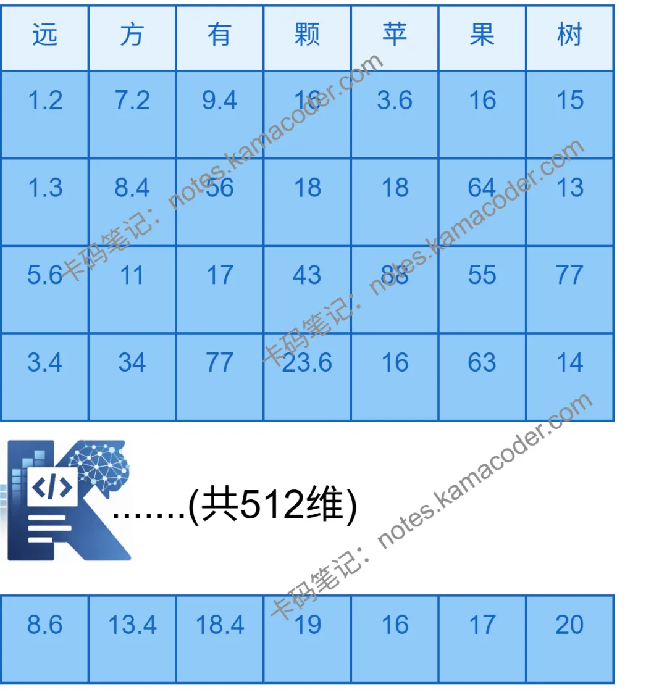

# Transformer数据流动全解析：从输入文本到输出Token每一步做什么

> 来源: https://notes.kamacoder.com/llm/transformer/transformer_data_flow.html

# `# Transformer数据流动全解析：从输入文本到输出Token每一步做什么 

上一篇文章给大家介绍了Transformer的三种架构，在给大家介绍复杂的公式前，这篇文章会先带大家搞懂数据在Transformer中是如何流动的，希望大家多多关注向量维度的变化，关于计算细节会在接下来的文章中给大家详细讲解。 

## `# Word Embedding 

先给大家介绍一下Word Embedding
（如果已经对Word Embedding有所了解，可以跳过此部分）
计算机并不不理解“苹果”是什么，只理解数字。Word Embedding就是充当一名翻译官，把人类的自然语言翻译成计算机能理解、运算的数字。它将词映射到一个高维的语义空间中，变成高维向量： 

```
苹果 -> [1.2, 3, 4 ………, n] 
常见维度有512，1024

```

 

相似的词比如“小猫”“小狗”在这个空间中的距离就会比较近，这种“距离”，就能让计算机像人一样捕捉词之间的关系  

下面开始正文 

假设输入序列为： 
> 

**远方有颗苹果树**
 

## `# step1.先进行分词 

（假设词表为512维，则每个Token为1*512维的向量， 假设输入序列长L）  

得到【远，方，有，颗，苹，果，树】（分词结果可能由于embedding模型不同而不同, 则$$L=7$$） 


 

## `# step2. 输入文本经过embedding变成高维向量，加上位置编码 

简单介绍下位置编码： 
  - 位置编码：让模型学习到不同位置得Token可能会具有不同的语义信息，比如 
> 

“你打我” 和 “我打你” 这两句话中相同的“你”“我”，位置不同，语义也不同
 

## `# step3.进入自注意力子层 

此时矩阵为7×5127 \times 5127×512：  

step3.1 多头自注意力计算  

step3.2 残差连接（加上自身）  

step3.3 层归一化（配公式） 

## `# step4. 进入前馈神经网络子层 

前面都在做线性变换,为了能让模型理解更深层次的信息, 在这一层会引入非线性变换 

step4.1 升维（假设我们要升成2048维，则乘一个512∗2048512*2048512∗2048维的向量，得到7×20487 \times 20487×2048的矩阵）  

step4.2 经过激活函数  

step4.3 降维（乘一个2048×5122048\times5122048×512维的向量，降回原矩阵大小，7×5127\times5127×512）  

step4.4 残差连接  

经过若干层堆叠，最后输出的矩阵仍然是7×5127 \times 5127×512维 

最后一步，我们需要把这 512 维映射回“词表大小”（比如 50257 维，则表示该此表有50257个词）。就像是在 5 万多个备选词里做“多选题”，看哪个词的得分最高，分数最高的，就是所预测的下一个Token，作为输出的Token，将该 Token拼接到句子末尾，就完成了一次预测。继续下一次的计算，如此循环，就是我们所看到大模型一个字一个字生成时，背后的计算原理。 

下一阶段会为大家拆解Transformer的核心计算组件，从公式到计算原理会为大家一一介绍清楚，点个关注不迷路~
