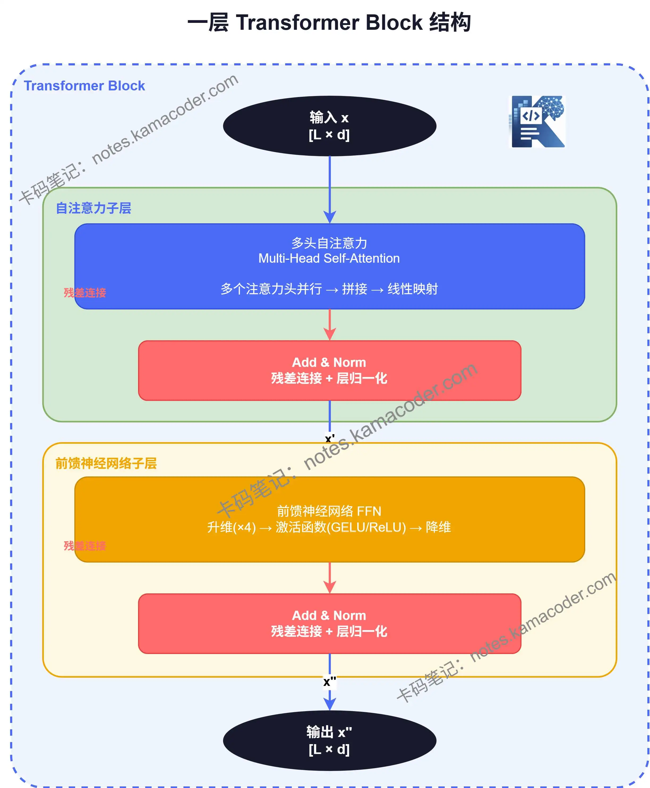
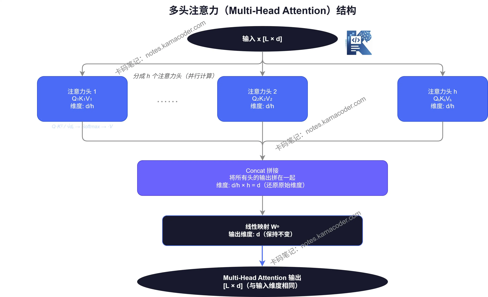

# 一层Transformer Block长什么样？自注意力、FFN、残差、LayerNorm拼起来

> 来源: https://notes.kamacoder.com/llm/transformer/transformer_structure.html

# `# 一层Transformer Block长什么样？自注意力、FFN、残差、LayerNorm拼起来 

上一篇文章带大家看了数据在 Transformer 里的流动过程。这一篇我们把焦点放在最关键的地方： 

**一层 Transformer Block 到底长什么样？** 

你可以把 Transformer 想象成一栋楼，每一层楼就是一个 Block。无论楼有多高，每一层的结构都是相同的。搞清楚"一层楼"长什么样，整栋楼就通了。 

一个 Transformer Block，由两个子层组成： 
  - **自注意力子层**（Self-Attention Sublayer）   - **前馈神经网络子层**（FFN Sublayer） 

每个子层外面，都包裹着两件固定的"外套"：**残差连接** 和 **层归一化**。

  

## `# 一、自注意力子层 

### `# 先回顾一下自注意力机制 

上=前几篇文章提到，Transformer 最核心的能力之一，是让每个 token 都能"直接看到"整个序列里其他位置。 

自注意力机制（Self-Attention）就是完成这件事的核心模块。 

还是用这句话举例： 
> 

**远方有颗苹果树**
 

当模型在计算"苹果"这个词的表示时，自注意力机制会让它去衡量： 
  - "苹果"和"树"有多相关？   - "苹果"和"远方"有多相关？   - "苹果"和"有"有多相关？ 

最后把所有位置的信息按相关程度**加权聚合**，得到"苹果"这个词更丰富的表示。 

### `# 多头注意力：多角度看问题 

实际上，Transformer 不只用一组注意力，而是同时用**多组**，这就是"多头注意力"（Multi-Head Attention）。 

为什么要多头？
一个词和其他词的关系，往往不止一种维度。比如"苹果"和"树"的关系，可能既有"苹果是树上长的"这层语义，又有"苹果和树位置相邻"这层结构信息。 

单头注意力每次只能学一种关系模式。多头注意力，则相当于同时派出多个"分析员"，每个人从不同角度去看词与词的关系，最后把所有分析结果拼起来。 
> 

多头注意力 = 多个注意力头并行计算 + 结果拼接 + 线性变换
 

假设有 8 个注意力头，每个头负责不同的语义维度，最后把 8 个结果拼在一起，再做一次线性映射，输出和输入维度保持一致。

  

## `# 二、残差连接：把原来的自己加回来 

自注意力算完之后，不是直接把结果往下传，而是要先做一个操作： 

**把输出和输入相加。** 

用公式表示就是： 

输出=Self-Attention(x)+x\text{输出} = \text{Self-Attention}(x) + x
输出=Self-Attention(x)+x 

这就是**残差连接**（Residual Connection）为什么要这样做？ 

这样做有两个好处： 
  - **防止信息丢失**：哪怕注意力层没学到什么有用的东西，至少原始输入还保留着，不会越传越"面目全非"。   - **解决深层网络训练难题**：网络层数很深时，梯度容易消失。残差连接提供了一条"快速通道"，让梯度可以直接流回较早的层，训练更稳定。 
> 

**残差连接 = 原始输入 + 子层输出**
  

## `# 三、层归一化：把数值拉回合理范围 

残差连接之后，紧接着是**层归一化**（Layer Normalization，简称 LayerNorm）。 

归一化的直觉是：经过多次矩阵运算，数值可能跑得很大或很小，分布变得很不稳定。LayerNorm 的作用，是把每一层的输出**重新拉回到均值为 0、方差为 1 附近的分布**，让后续计算更稳定。 

把残差连接和层归一化合起来，这一步完整写出来是： 

x′=LayerNorm(x+Self-Attention(x))x' = \text{LayerNorm}(x + \text{Self-Attention}(x))
x′=LayerNorm(x+Self-Attention(x)) 

注意：现代很多大模型（比如 Llama）改成了 **Pre-LayerNorm**，也就是先归一化再送入子层，效果往往更稳定，我们后续文章会详细讲。  

## `# 四、前馈神经网络子层：引入非线性理解 

自注意力子层完成后，数据进入第二个子层：**前馈神经网络**（Feed-Forward Network，FFN）。 

上一篇文章提到，自注意力本质上是在做**线性变换**，也就是对序列中的各个位置进行加权组合。 

但只有线性变换，模型的"理解能力"其实是有上限的——很多复杂的语义模式，线性变换捕捉不了。 

FFN 的存在，就是为了引入**非线性**，让模型能学到更深层次的语义信息。 

FFN 的结构很简单，三步走： 

**第一步：升维** 

把维度从 512 升到 2048（通常是 4 倍），乘一个大矩阵。 

h=W1x+b1(512→2048)h = W_1 x + b_1 \quad (512 \to 2048)
h=W1​x+b1​(512→2048) 

**第二步：激活函数** 

引入非线性，常用 ReLU 或 GELU。 

h=GELU(h)h = \text{GELU}(h)
h=GELU(h) 

**第三步：降维** 

再乘一个矩阵，把维度从 2048 降回 512。 

输出=W2h+b2(2048→512)\text{输出} = W_2 h + b_2 \quad (2048 \to 512)
输出=W2​h+b2​(2048→512) 
> 

**FFN = 先升维 → 激活 → 再降维**
 

这个"先升维再降维"的设计，让模型能够去捕捉非线性特征，然后再压缩回来继续传递。 

FFN 结束后，同样要做一次残差连接 + 层归一化： 

x′′=LayerNorm(x′+FFN(x′))x'' = \text{LayerNorm}(x' + \text{FFN}(x'))
x′′=LayerNorm(x′+FFN(x′))  

## `# 五、一层 Block 的完整前向过程 

现在把所有步骤串起来，一层 Transformer Block 的前向过程如下： 

**输入**：矩阵 xxx，形状为 [L×d][L \times d][L×d]（L 为序列长度，d 为向量维度） 

**第一步：自注意力子层** 

x′=LayerNorm(x+MultiHead-Attention(x))x' = \text{LayerNorm}(x + \text{MultiHead-Attention}(x))
x′=LayerNorm(x+MultiHead-Attention(x)) 

**第二步：前馈神经网络子层** 

x′′=LayerNorm(x′+FFN(x′))x'' = \text{LayerNorm}(x' + \text{FFN}(x'))
x′′=LayerNorm(x′+FFN(x′)) 

**输出**：矩阵 x′′x''x′′，形状仍为 [L×d][L \times d][L×d] 

注意关键点：**输入和输出的维度完全一致**。这意味着可以把很多层 Block 串联起来，一层接一层，最终形成深层网络。这也是 Transformer 能轻松"堆深"的原因之一。  

## `# 本阶段小结 

一层 Transformer Block，本质上就是两个子层的叠加： 
  - **自注意力子层**：让 token 之间互相"交流"，聚合全局信息   - **前馈神经网络子层**：对每个 token 独立做深层非线性变换 

两个子层都由相同的外壳包裹： 
> 

**子层输出 → 残差连接 → 层归一化**
 

这套组合，简洁、稳定、可扩展，是 Transformer 能被堆到几十上百层的根本原因。 

下一篇文章我们将开启一个新阶段：从理解到手撕 Transformer，争取带大家开始真正“从零实现”,可以点下关注不迷路~
