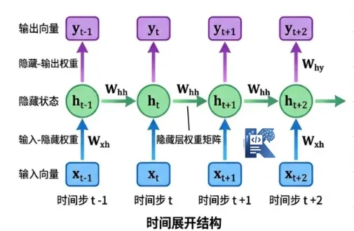
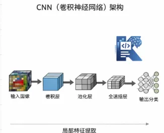

# 为什么所有大模型都绕不开 Transformer？

> 来源: https://notes.kamacoder.com/llm/transformer/transformer_base_1.html

# `# 为什么所有大模型都绕不开 Transformer？ 

很多人刚开始学大模型时，都会有一个疑问： 

**为什么现在一提大模型，几乎就一定会提到 Transformer？**  

为什么不是 RNN？为什么不是 CNN？  

BERT、GPT、T5、Llama 这些名字看起来完全不同的模型，为什么最后都能追溯到 Transformer？ 

如果你也有这种感觉，其实很正常。 

因为大模型这条主线，表面上看是在不断冒出新名字，实际上底层很多变化，都是围绕 **Transformer 这套骨架** 在做增强、裁剪和改造。 

这篇文章，我们就只回答一个问题： 
> 

**为什么今天的大模型，几乎都绕不开 Transformer？**
 

你不需要先会公式，也不需要先啃论文。  

先把这条主线理顺，后面你再看 BERT、GPT、T5、Llama，才不会觉得它们像四种完全不同的东西。  

## `# 一、Transformer 到底是什么？ 

先给大家一个大白话说法： 

**Transformer 本质上就是一个巨大的函数，输入为多个x，输出为一个y。** 

它最核心的特点就是： 
  - **它让序列里每个位置都能直接关注其他位置**   - **它可以并行训练**   - **它更容易被扩展到超大数据、超大参数、超大算力** 

这里的“序列”，你可以先简单理解成一句话里的 token 序列。 

比如一句话： 
> 

我昨天在公司食堂吃饭时，突然想明白了 Transformer 为什么重要
 

对于传统模型来说，它通常得按顺序一点点往后读。  

但 Transformer 不太一样，它会让“Transformer”这个词，在计算时直接去看“想明白了”“为什么重要”这些位置。 

也就是说，它不是“一个字一个字往后传”，而更像是： 
> 

**我先把整句话都摆在桌面上，再决定每个词该重点看谁。**
 

这就是它后来能成为大模型底座的关键起点。  

## `# 二、为什么 RNN 不适合今天的大模型？ 

 

很多初学者会先接触到 RNN、LSTM、GRU，然后自然会问： 

**既然 RNN 本来就是处理序列的，那为什么大模型不用它？** 

### `# 1. RNN 最大的问题：太依赖“按顺序处理” 

RNN 的思路很直观： 
  - 先读第 1 个 token   - 再读第 2 个 token   - ...   - 一直读到最后 

它每一步都依赖前一步的隐藏状态，所以天然就是**串行**的。
这在小模型时代还能接受，但一旦你要训练一个几百亿、几千亿参数的大模型，问题就来了： 

**串行意味着很难把 GPU/TPU 的并行能力真正发挥。** 

### `# 2. 长距离依赖容易“传着传着就弱了” 

RNN 还有一个经典问题：  一句话太长时，前面的信息传到后面，容易越来越弱。
比如这句话： 
> 

我前天在上海参加完技术分享之后，晚上和几个做推理优化的朋友聊到凌晨，最后才真正理解，Transformer 解决的核心不是能不能做序列建模，而是能不能高效做大规模序列建模。
 

如果模型想理解“Transformer”对应的是后面那一大段解释，RNN 得把前面的信息一级一级往后传。链路越长，信息越容易衰减，训练也越容易不稳定。 

### `# RNN 像什么？ 

像一个人拿着纸条，必须一条一条按顺序往后传。 前面传错一点，后面可能越来越模糊。 

所以，RNN 在“小而精”的时代很有存在感，但在“大而强”的时代，训练范式已经不占优势了。  

## `# 三、为什么 CNN 也没有成为大模型的主流底座？ 

 

那有人又会问： 

**CNN 不也很强吗？图像领域都统治那么久了，为什么不用 CNN 来做大模型？** 

### `# 1. CNN 更擅长局部模式，不擅长天然建模全局关系，想看得更远，就要不断加深网络 

CNN 的核心是卷积核，它特别擅长提取局部特征。在图像里，这很合理。  因为边缘、纹理、局部结构，本来就很重要。但语言不太一样。
一句话里真正重要的关系，往往不只在局部邻域里。  比如： 
> 

我原本以为他不懂 Transformer，直到他把 Attention 的矩阵维度都手推了一遍。
 

这里“他不懂”和“直到后面反转”之间，是全局语义关系。  CNN 如果只看局部窗口，想把这种远距离依赖建模好，往往需要堆很多层，或者设计得很复杂。 

### `# CNN 像什么？ 

像一个人拿着放大镜，每次只看局部几块区域。  想看全局，就得多看很多轮。 

这样当然也能做，但问题是： 

**Transformer 有一种更直接的方式。** 

它不是“我多绕几层才看到远处”，而是： 
> 

**我这一层就允许当前位置直接去看任何位置。**
  

## `# 四、Transformer 克服了什么短板？ 

既然 RNN 和 CNN 都有明显限制，那 Transformer 到底解决了什么？ 

### `# 1. 它让“长距离依赖”变得更直接 

在 Transformer 里，一个 token 不需要把信息一层层传很多步，它可以直接通过注意力机制，去“看”整段序列里和自己最相关的位置。
比如句子： 
> 

小李说他昨天终于看懂了 Transformer，因为他第一次真正理解了 Self-Attention。
 

这里“他”到底指谁？  模型要判断，很可能需要同时参考“小李”“昨天”“看懂了 Transformer”“理解了 Self-Attention”。 

Transformer 的做法是： 
  - 让“他”这个位置直接去对整句所有位置计算相关性   - 最后把更相关的信息聚合回来 

这比“顺着时间一步步传”要直接得多。 

### `# 2. 它让训练可以并行起来 

RNN 的串行方式会拖慢训练。Transformer 在训练时，可以把一整段 token 一起送进模型，同时做矩阵运算。这也意味着它天然更适合 GPU/TPU 这种擅长并行计算的硬件。 

而今天的大模型，本质上就是： 
> 

**架构设计 + 海量数据 + 高性能并行训练 + 工程优化**
 

Transformer 之所以成了主流，不只是因为它“原理好”，还因为它特别符合现代计算硬件的优势。 

### `# 3. 它更容易扩展成“大模型” 

一个架构要成为大模型底座，不只要“能用”，还要“能放大”。 

Transformer 在这方面特别适合： 
  - 层数可以加深   - hidden size 可以加大   - 训练范式容易标准化 

### `# Transformer 像什么？ 

像把整段内容直接铺开在会议桌上，  

然后每个人都可以立刻看全局，再决定自己重点参考谁。 

所以你会发现： 
> 

**Transformer 不是“会做序列”这么简单，而是“更适合在大规模条件下做好序列”。**
 

这才是它真正赢下大模型时代的原因。而今天大模型最核心的关键词，恰恰就是“规模化”。  

## `# 五、为什么 BERT、GPT、T5、Llama 本质都和 Transformer 有关？ 

这也是很多人最容易混乱的地方。 

它们名字完全不同，为什么都和 Transformer 有关？ 

因为： 
> 

**它们大多不是在重新发明一套完全不同的骨架，而是在 Transformer 这个骨架上，做任务形式、训练目标、结构细节上的变化。**
 

### `# 1. BERT：Transformer 的“理解型”用法 

BERT 更偏向双向编码。  

它会同时看左边和右边上下文，更擅长做理解任务，比如分类、抽取、匹配。 

### `# 2. GPT：Transformer 的“生成型”用法 

GPT 则更偏向自回归生成。  

它通常只看前文，预测下一个 token。 

### `# 3. T5：Transformer 的“统一文本到文本”用法 

T5 更强调把很多任务都统一成 text-to-text。  翻译、摘要、问答，都变成“输入文本，输出文本”。 

### `# 4. Llama：Transformer 的“现代大模型工程化升级版” 

Llama 看起来像新一代模型，但本质上仍然属于 Transformer 家族。 

它做的更多是： 
  - 改进归一化方式   - 改进位置编码   - 调整训练细节   - 提升训练效率与推理表现 

也就是说，Llama 不是“抛弃 Transformer”，而是： 
> 

**站在 Transformer 这套骨架上，做更适合现代大模型的优化。**
 

所以BERT、GPT、T5、Llama 绝不是四个互不相干的名词，而是： 
> 

**它们都是 Transformer 主线上的不同分支。**
  

## `# 六、学完这个系列你能收获什么？ 

我们这个系列的写作主线将会从 Transformer 出发，逐步过渡到 BERT / T5 / GPT、MoE、Llama，再到更现代的架构辨析与核心模块手撕。同时为大家奉上常见的面试问法，也就是说，这个系列不会停留在“知道名词”，而是会尽量带你走到： 
> 

**真的看懂、真的能写、真的能复现、真的能在面试时做到“从容回答”**
 

希望能助力大家进步，多多斩获offer！
