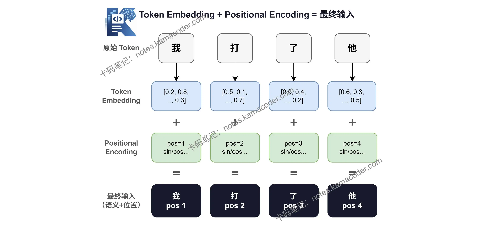

# 位置编码详解：Transformer为什么必须知道Token顺序，正弦编码原理

> 来源: https://notes.kamacoder.com/llm/transformer/pos_encode.html

# `# 位置编码详解：Transformer为什么必须知道Token顺序，正弦编码原理 

上一篇文章我们搞清楚了 Multi-Head Attention 的运作方式——多个头并行、各自关注不同关系，最后融合输出。
这篇文章我们来聊一个经常被忽略、但非常关键的问题：**Positional Encoding 是什么？ Transformer 是怎么知道词的顺序的？**  

## `# 先做一个实验 

看下面这两句话： 
> 

我打了他
 
> 

他打了我
 

意思完全相反，但用的是**完全一样的词**，唯一的区别是**顺序不同**。 

一个好的语言模型，必须能区分这两句话。那 Transformer 能吗？  

## `# 自注意力天然不感知顺序 

这是 Transformer 一个反直觉的地方。 

回忆一下 Self-Attention 的计算：每个 Token 和**所有其他 Token** 做内积，算出注意力权重，再加权求和。 

在这个过程里，**Token 的位置信息从来没有参与过计算**。
"我"在第一位还是第三位，对 QKᵀ 的结果没有任何影响。 

用一句话来说： 
> 

Self-Attention 眼里只有"有哪些词"，没有"这些词在哪里"
 

你把输入序列的词顺序随机打乱，Self-Attention 算出来的注意力权重**完全一样**。 

这就意味着，如果什么都不做，"我打了他"和"他打了我"在 Transformer 看来是**同一句话**。 

## `# 为什么 RNN 不需要担心这个问题？ 

你可能会想：RNN 不也是处理序列的吗，它有这个问题吗？ 

没有。RNN 是**一个词一个词按顺序处理**的，天然把位置信息编进了隐藏状态里。第一个词处理完，才轮到第二个词，顺序是硬编码在结构里的。 

而 Transformer 的优势之一，恰恰是**可以并行处理所有词**——所有 Token 同时进入 Self-Attention。但代价就是：**顺序信息丢了**，需要手动补回来。 

## `# 解决方案：位置编码 

解决思路很简单：既然 Self-Attention 本身不感知位置，那就**在输入进 Attention 之前，把位置信息加进去**。 

具体做法是：给每个 Token 的 Embedding 向量，加上一个代表它位置的向量，这个向量就叫 **Positional Encoding（位置编码）**。 

输入=Token Embedding+Positional Encoding\text{输入} = \text{Token Embedding} + \text{Positional Encoding}
输入=Token Embedding+Positional Encoding 

加完之后，每个 Token 的向量里就同时包含了**语义信息**（它是什么词）和**位置信息**（它在第几位）。 

  

## `# 位置编码长什么样？ 

原始论文用的是**正弦和余弦函数**来生成位置编码，公式如下： 

PE(pos,2i)=sin⁡(pos100002i/d)PE_{(pos,\ 2i)} = \sin\left(\frac{pos}{10000^{2i/d}}\right)
PE(pos,2i)​=sin(100002i/dpos​) 

PE(pos,2i+1)=cos⁡(pos100002i/d)PE_{(pos,\ 2i+1)} = \cos\left(\frac{pos}{10000^{2i/d}}\right)
PE(pos,2i+1)​=cos(100002i/dpos​) 

我们一步步来看这两个公式。  

## `# 1.为什么用三角函数？ 

位置编码需要满足几个条件： 
  - **每个位置的编码唯一**，不能有两个位置一模一样   - **位置之间的"距离"有规律**，相邻位置的编码应该相似，距离越远越不同   - **可以泛化到更长的序列**，训练时没见过的位置也能用 

正弦和余弦函数天然满足这几点：不同频率的波形叠加，就像一把"尺子"，每个刻度的花纹都不一样，但整体有规律。 

## `# 2.为什么不同维度用不同频率？ 

位置编码是一个和 Token Embedding 等长的向量，比如 512 维。 

正弦编码的聪明之处在于：**不同维度使用不同频率的波**。 
  - 低维度：频率高，变化快 → 区分近距离的位置（第1个词 vs 第2个词）   - 高维度：频率低，变化慢 → 区分远距离的位置（第1个词 vs 第100个词） 

就好像用"秒"刻度区分相邻时刻，用"小时"刻度区分跨度更大的时间段——**不同精度的尺子，量不同尺度的距离**。 

 

## `# 3.位置编码是固定的，还是学出来的？ 

原始 Transformer 论文用的是**固定的正弦编码**，不参与训练，直接按公式算好。 

但后来很多模型（比如 BERT）用的是**可学习的位置编码**——位置编码也是一组参数，和词向量一起随训练更新。 

两种方式在实践中效果相差不大，但各有侧重： 

|   正弦编码（固定）  可学习编码 
| **参数量**  无额外参数  多一组位置参数 
| **长序列泛化**  理论上可以外推  受训练长度限制 
| **代表模型**  原始 Transformer  BERT、GPT-2 

Transformer 用 Self-Attention 并行处理所有词，带来了速度优势，但也丢掉了顺序信息。位置编码就是用来"补"回这个信息的——在输入进 Attention 之前，把每个 Token 的位置"写"进它的向量里。 

正弦位置编码的设计看起来复杂，本质上是一把多精度的尺子：不同维度、不同频率，共同唯一标识每个位置，还能泛化到更长的序列。  

下一篇文章我们来聊聊 **残差连接与 Layer Norm**，看看 Transformer 是怎么防止信息在层层传递中"消失"的，大家可以点个关注不迷路～
