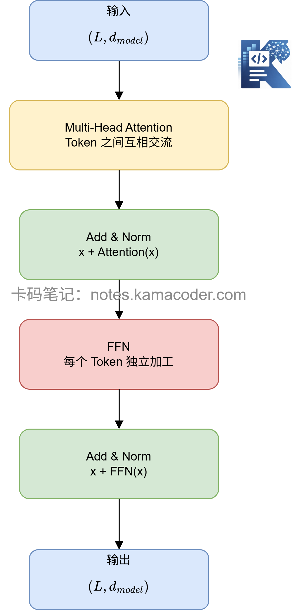
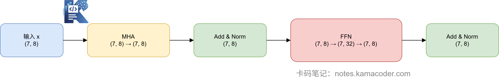

# 手撕Transformer Block：把Attention、FFN、Norm拼起来

> 来源: https://notes.kamacoder.com/llm/transformer/transformer_block_code.html

# `# 手撕Transformer Block：把Attention、FFN、Norm拼起来 

前面几篇文章，我们已经把 Transformer Block 里的核心零件基本都手撕了一遍： 
  - Multi-Head Attention：让不同 Token 之间互相交流   - FFN：让每个 Token 独立做非线性加工   - 残差连接：把原始输入加回来，防止信息丢失   - LayerNorm：把数值拉回稳定范围 

这一篇，我们不再单独看零件，而是把它们真正拼起来，写出一个**最小版 Transformer Block**。  

## `# 一个 Block 到底长什么样？ 

最常见的 Transformer Block 可以写成： 

```
输入 x
  ↓
Multi-Head Attention
  ↓
残差连接 + LayerNorm
  ↓
FFN
  ↓
残差连接 + LayerNorm
  ↓
输出

```

 

也就是： 

x1=LayerNorm(x+MHA(x))x_1 = \text{LayerNorm}(x + \text{MHA}(x))
x1​=LayerNorm(x+MHA(x)) 

x2=LayerNorm(x1+FFN(x1))x_2 = \text{LayerNorm}(x_1 + \text{FFN}(x_1))
x2​=LayerNorm(x1​+FFN(x1​)) 

这里有一个非常重要的点： 
> 

**输入是什么形状，输出还是什么形状。**
 

假设输入是： 

```
x.shape = (L, d_model)

```

 

其中： 
  - L 是序列长度，比如“远方有颗苹果树”有 7 个 token   - d_model 是每个 token 的向量维度，比如这里用 8 维演示 

那么经过一个 Transformer Block 后，输出仍然是： 

```
output.shape = (L, d_model)

```

 

这也是为什么 Transformer 可以一层一层往上堆。 


 

## `# 先写 LayerNorm 和 FFN 

我们先把最基础的组件准备好。 

```
import numpy as np

class LayerNorm:
    def __init__(self, d_model, eps=1e-5):
        self.gamma = np.ones(d_model)
        self.beta = np.zeros(d_model)
        self.eps = eps

    def forward(self, x):
        mean = x.mean(axis=-1, keepdims=True)
        std = x.std(axis=-1, keepdims=True)
        x_norm = (x - mean) / (std + self.eps)
        return self.gamma * x_norm + self.beta

```

 

LayerNorm 做的事很简单：对每个 Token 自己的向量做归一化。 

比如输入是 `(7, 8)`，表示 7 个 token，每个 token 8 维，那么 LayerNorm 会分别对这 7 行做归一化。 

接着写 FFN： 

```
class FeedForward:
    def __init__(self, d_model, d_ff):
        self.W1 = np.random.randn(d_model, d_ff) * 0.01
        self.b1 = np.zeros(d_ff)
        self.W2 = np.random.randn(d_ff, d_model) * 0.01
        self.b2 = np.zeros(d_model)

    def gelu(self, x):
        return 0.5 * x * (1 + np.tanh(
            np.sqrt(2 / np.pi) * (x + 0.044715 * x ** 3)
        ))

    def forward(self, x):
        hidden = x @ self.W1 + self.b1
        hidden = self.gelu(hidden)
        output = hidden @ self.W2 + self.b2
        return output

```

 

FFN 的过程就是： 

```
(L, d_model)
   ↓ 升维
(L, d_ff)
   ↓ GELU
(L, d_ff)
   ↓ 降维
(L, d_model)

```

 

还是那句话：**中间怎么变都可以，但最后必须回到 d_model。** 

## `# 写 Multi-Head Attention 

现在写一个最小版多头注意力。 

```
class MultiHeadAttention:
    def __init__(self, d_model, num_heads):
        assert d_model % num_heads == 0

        self.d_model = d_model
        self.num_heads = num_heads
        self.d_k = d_model // num_heads

        self.W_Q = np.random.randn(d_model, d_model) * 0.01
        self.W_K = np.random.randn(d_model, d_model) * 0.01
        self.W_V = np.random.randn(d_model, d_model) * 0.01
        self.W_O = np.random.randn(d_model, d_model) * 0.01

    def softmax(self, x):
        e = np.exp(x - np.max(x, axis=-1, keepdims=True))
        return e / e.sum(axis=-1, keepdims=True)

    def split_heads(self, x):
        L, d_model = x.shape
        return x.reshape(L, self.num_heads, self.d_k).transpose(1, 0, 2)

    def forward(self, x):
        L, d_model = x.shape

        Q = x @ self.W_Q
        K = x @ self.W_K
        V = x @ self.W_V

        Q = self.split_heads(Q)
        K = self.split_heads(K)
        V = self.split_heads(V)

        head_outputs = []

        for i in range(self.num_heads):
            scores = Q[i] @ K[i].T / np.sqrt(self.d_k)
            weights = self.softmax(scores)
            out = weights @ V[i]
            head_outputs.append(out)

        concat = np.stack(head_outputs, axis=0)
        concat = concat.transpose(1, 0, 2).reshape(L, d_model)

        output = concat @ self.W_O
        return output

```

 

这里最容易绕的还是 shape： 

```
输入 x:              (L, d_model)
Q/K/V:               (L, d_model)
拆成多个头:          (num_heads, L, d_k)
每个头输出:          (L, d_k)
拼接回来:            (L, d_model)
输出投影后:          (L, d_model)

```

 

可以看到，Attention 虽然中间拆成多个头，但最后依然回到原来的形状。 


  

## `# 定义完整 Transformer Block 

现在核心来了。 

```
class TransformerBlock:
    def __init__(self, d_model, num_heads, d_ff):
        self.attn = MultiHeadAttention(d_model, num_heads)
        self.ffn = FeedForward(d_model, d_ff)

        self.norm1 = LayerNorm(d_model)
        self.norm2 = LayerNorm(d_model)

    def forward(self, x):
        print(f"输入 x:              {x.shape}")

        attn_out = self.attn.forward(x)
        print(f"Attention 输出:      {attn_out.shape}")

        x = self.norm1.forward(x + attn_out)
        print(f"Add & Norm 之后:     {x.shape}")

        ffn_out = self.ffn.forward(x)
        print(f"FFN 输出:            {ffn_out.shape}")

        x = self.norm2.forward(x + ffn_out)
        print(f"Block 最终输出:      {x.shape}")

        return x

```

 

这就是一个最小版 Transformer Block。 

注意这里用了 Post-Norm 写法： 

```
x = norm(x + sublayer(x))

```

 

也就是先经过子层，再残差相加，最后 LayerNorm。 

现代很多大模型会使用 Pre-Norm： 

```
x = x + sublayer(norm(x))

```

 

但为了和原始 Transformer 结构更一致，也为了方便初学者理解，这里先用 Post-Norm。  

## `# 跑通一个 toy example 

我们继续用熟悉的句子： 
> 

远方有颗苹果树
 

假设它被切成 7 个 token，每个 token 用 8 维向量表示。 

```
if __name__ == "__main__":
    np.random.seed(42)

    L = 7
    d_model = 8
    num_heads = 2
    d_ff = 32

    x = np.random.randn(L, d_model)

    block = TransformerBlock(
        d_model=d_model,
        num_heads=num_heads,
        d_ff=d_ff
    )

    output = block.forward(x)

    print("\n=== 检查结果 ===")
    print("输入形状:", x.shape)
    print("输出形状:", output.shape)
    print("形状一致:", x.shape == output.shape)

```

 

运行输出大概是： 

```
输入 x:              (7, 8)
Attention 输出:      (7, 8)
Add &amp; Norm 之后:     (7, 8)
FFN 输出:            (7, 8)
Block 最终输出:      (7, 8)

=== 检查结果 ===
输入形状: (7, 8)
输出形状: (7, 8)
形状一致: True

```

 

这说明我们的最小版 Transformer Block 已经跑通了。 

从输入到输出，形状始终保持 `(7, 8)`。 

但是注意：**形状没变，不代表内容没变。** 

经过 Attention 之后，每个 Token 已经融合了其他 Token 的上下文信息。 

经过 FFN 之后，每个 Token 又单独做了一次非线性加工。 

再加上残差连接和 LayerNorm，整个 Block 就既能表达复杂语义，又能保持训练稳定。  

## `# 总结 

一个 Transformer Block 本质上就是： 

```
先让 Token 之间交流，
再让每个 Token 自己思考，
每一步都用残差保留原信息，
再用 LayerNorm 稳定数值。

```

 

如果再压缩成代码，就是这两行： 

```
x = norm1(x + attention(x))
x = norm2(x + ffn(x))

```

 

这就是 Transformer Block 的核心。 

看起来简单，但大模型就是把这样的 Block 堆几十层、上百层，再配上海量数据和算力训练出来的。 

下一篇文章将继续带大家**从 0 拼一个 Tiny Transformer**，大家可以点个关注不迷路哦~
