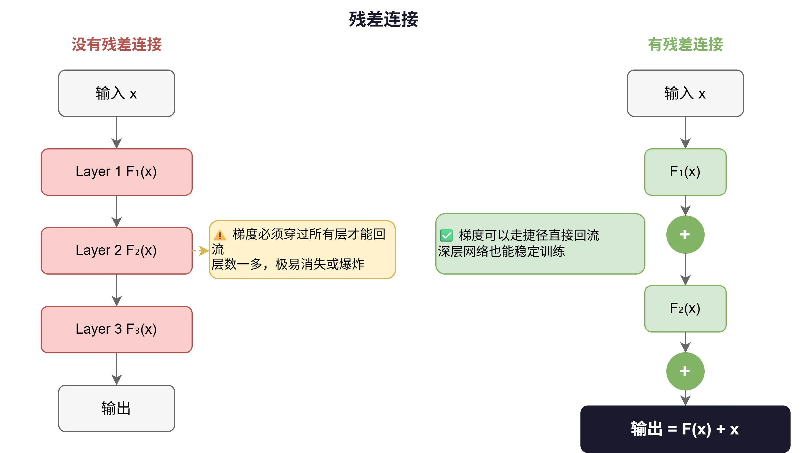
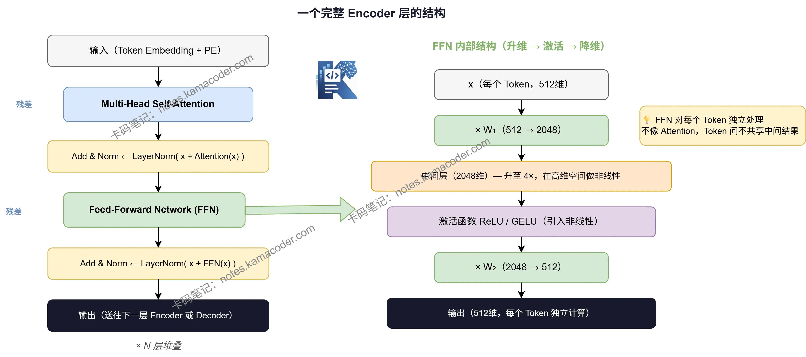

# 残差连接、LayerNorm、FFN：Transformer里缺一不可的配角组件

> 来源: https://notes.kamacoder.com/llm/transformer/ffn_ln.html

# `# 残差连接、LayerNorm、FFN：Transformer里缺一不可的配角组件 

上一篇聊完了 Positional Encoding，
这篇文章我们来聊聊：**残差连接、LayerNorm、前馈网络（FFN）**。 

它们看起来像是凑数的，但缺了任何一个，Transformer 都跑不起来。  

Transformer 是一个很深的网络——原始论文里堆了 6 层 Encoder，每层里有 Self-Attention 和 FFN 两个子模块。 

信息每过一层，都要经历一次变换。问题是：**层数一多，训练就容易崩。** 

梯度消失、梯度爆炸、层与层之间的数值越来越不稳定——这些都是深层网络的老问题。
残差连接和 LayerNorm 的存在，就是专门为了解决这些问题的。 

先看这个场景： 
> 

一首歌经过了混音、母带处理、压缩…… 每个步骤都在"加工"原声。
如果每一步都把上一步的结果完全覆盖掉，原声就消失了。
 

深层网络也是一样——每一层都在对输入做变换，如果变换出了问题（比如梯度消失），后面的层就完全收不到有效信息了。 

残差连接的解法非常直接：**把输入直接加到输出上，绕过中间的变换。** 

输出=F(x)+x\text{输出} = F(x) + x
输出=F(x)+x 

其中 F(x)F(x)F(x) 是这一层学到的变换（比如 Self-Attention 的结果），xxx 是这层的原始输入。

 

这步加法带来了两个好处： 

**一：梯度可以直接回流** 

反向传播时，梯度不再只能穿过 F(x)F(x)F(x) 这条路，还能沿着 xxx 这条捷径直接流回去。就算 F(x)F(x)F(x) 这条路梯度消失了，信息也不会断。 

**二：层可以学"修正量"而不是"全量"** 

没有残差时，每一层都要从零学一个全新的变换，压力很大。
加了残差后，这一层只需要学：**在上一层输出的基础上，还需要修正哪里？**  

残差连接解决了梯度流动的问题，但还有另一个隐患：**数值爆炸**。 

把 F(x)F(x)F(x) 和 xxx 加在一起之后，数值的范围可能变得很大、很不均匀。进入下一层时，有些维度的值极大，有些极小，模型很难稳定地学习。 

LayerNorm 就是做这件事的：**把每个 Token 的向量重新规范化，让它的均值为 0、方差为 1。** 

LayerNorm(x)=x−μσ⋅γ+β\text{LayerNorm}(x) = \frac{x - \mu}{\sigma} \cdot \gamma + \beta
LayerNorm(x)=σx−μ​⋅γ+β 
  - μ\muμ 和 σ\sigmaσ 是这个向量自身的均值和标准差   - γ\gammaγ 和 β\betaβ 是可学习的缩放和偏移参数，让模型可以自己决定"规范到什么程度" 

## `# 两者组合 

在 Transformer 里，残差和 LayerNorm 是**捆绑使用**的，标准写法叫 **Add & Norm**： 

输出=LayerNorm(x+F(x))\text{输出} = \text{LayerNorm}(x + F(x))
输出=LayerNorm(x+F(x)) 

先残差相加，再 LayerNorm 归一化，每个子模块（Self-Attention 和 FFN）后面都跟一个这样的结构。 


 

## `# FFN：Self-Attention 的"搭档"，不是装饰 

Transformer 每一层的结构是： 

```
Self-Attention → Add & Norm → FFN → Add & Norm

```

 

Self-Attention 负责让 Token 之间"互通信息"，FFN 负责什么？ 

很多初学者觉得 FFN 就是两层普通的线性变换，可有可无。但它其实在做一件 Self-Attention 做不了的事：**对每个 Token 的向量做非线性变换，提取更深层的特征。** 

FFN 的结构很简单： 

FFN(x)=ReLU(x⋅W1+b1)⋅W2+b2\text{FFN}(x) = \text{ReLU}(x \cdot W_1 + b_1) \cdot W_2 + b_2
FFN(x)=ReLU(x⋅W1​+b1​)⋅W2​+b2​ 

两层线性变换，中间夹一个激活函数（ReLU 或 GELU）。 

关键细节：**FFN 会先升维，再降维。** 

以 d_model = 512 为例： 

```
输入 x（512维）
    ↓ × W₁（512→2048）
中间层（2048维）← 升维到 4 倍
    ↓ 激活函数
    ↓ × W₂（2048→512）
输出（512维）

```

 

## `# 为什么要先升维再降维？ 

这里藏着 FFN 最重要的设计思路。 

Self-Attention 做的是**线性组合**——把不同 Token 的 Value 向量加权求和，本质上是线性变换。**线性变换叠加再多层，表达能力还是有限的。** 

FFN 中间插入了激活函数，带来了**非线性**。先升维，是为了在更高维的空间里让激活函数"发挥作用"——高维空间里，非线性能捕捉到更复杂的特征组合。再降维，把提取到的信息压缩回原来的维度，传给下一层。 

还有一点值得注意：**FFN 是对每个 Token 独立计算的**，不同 Token 之间不共享中间结果。 

这和 Self-Attention 正好相反——Self-Attention 让所有 Token 互相"看"，FFN 让每个 Token 自己"想"。 

|   Self-Attention  FFN 
| **处理方式**  Token 之间互相交互  每个 Token 独立处理 
| **变换类型**  线性（加权求和）  非线性（含激活函数） 
| **作用**  聚合上下文信息  深化单个 Token 的表示 

两者一个负责"横向"（Token 间）的信息交流，一个负责"纵向"（特征维度）的深度加工，缺一不可。 

这三者各有分工，但都不可少： 
  - **残差连接**：给梯度留一条高速公路，让深层网络能够正常训练   - **LayerNorm**：每层计算完之后做数值体检，防止数值爆炸影响下一层   - **FFN**：补上 Self-Attention 缺少的非线性能力，让每个 Token 的表示更丰富 

把这三个加上 Self-Attention，一个完整的 Transformer Encoder 层就搭好了。  

下一篇文章我们来聊聊 **一层 Transformer Block 到底长什么样？**——把核心组件拼起来看一遍,大家点个关注不迷路哦～
