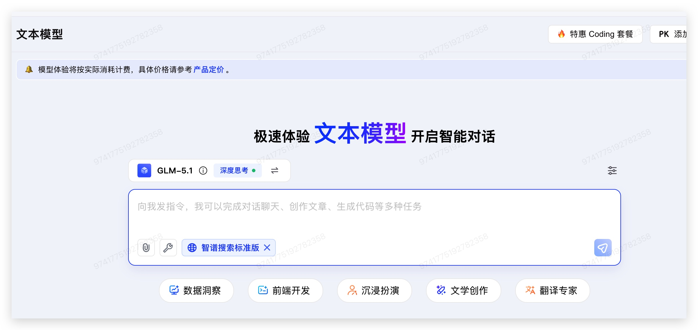
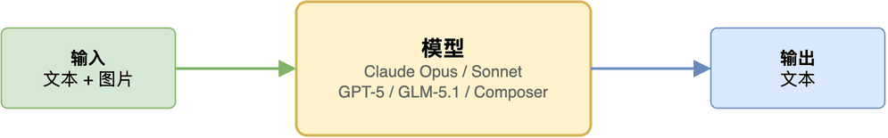
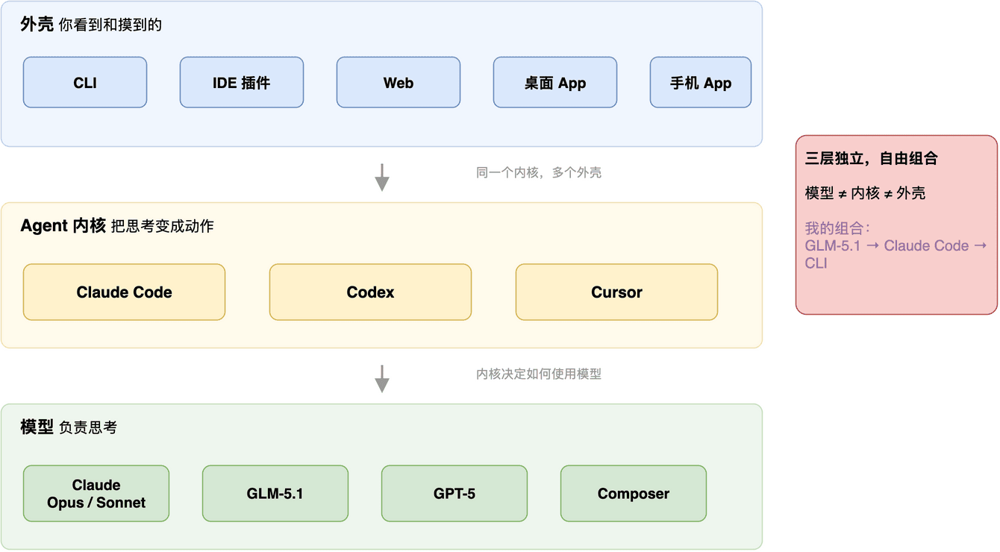

# Claude Code 和 Claude.ai 有什么区别？三层架构看懂 AI 编程产品

> 来源: https://notes.kamacoder.com/llm/intro/ai-coding-three-layers.html

# `# Claude Code 和 Claude.ai 有什么区别？三层架构看懂 AI 编程产品 

很多录友在和别人交流的时候，说自己用Claude，说听被人说自己用Claude。 

但对于很多对AI 编程工具没有那么了解的人来说，这是这个说法很模糊。 

大家也知道我之前，两个claude账号都被封  (opens new window)，我现在是 claude agent + cli + GLM-5.1 基本算是平替了，再加上我高超的"教导技巧"，和之前用 Opus4.6 也差不多。 

最近智谱5.1模型用起来确实不错，我和其他人推荐的时候，他们说用的一般啊，和他发一发信息，也没感觉有什么特殊之处。 

我问了一下，他怎么用的，结果他说他用的是 **对话框**。。。。 

 

不是说对话框里的模型降智，**而是你用对话框，根本用不出来这个模型的威力**。 

需要有一个"牛逼"的agent，才能发挥出这个模型的威力。 

用web 对话框，可以理解是直接和大模型对话。当然 web 对话框 也有云端控制台入口（可以理解是轻量agent） 

所以你看，**同样的模型，在不同的"壳"里，表现天差地别。** 不少录友对 AI 的 web 端、CLI 端、app 端分不清，不仅影响大家无法发挥大模型该有的威力，而且其实在和别人沟通上，对AI编程一直处于混沌窗台。。 

为什么会这样？ 

因为大多数人对"一个 AI 编程产品"的理解太粗了——以为换个模型就是换个产品，以为同一个模型在哪用都一样。但真不是。 

知识星球  (opens new window)里录友里交流也经常出现这样的情况： 

"你现在用什么写代码？" 

"Claude 啊。" 

"网页还是 CLI？" 

"……都用。差别挺大的吗？" 

**差别挺大的。** 

而且不只是 Claude。Codex 也一样——我说"用 Codex"，对方脑子里想的可能是 chatgpt.com 里那个开 PR 的云端 agent，也可能是终端里的 `codex` 命令。 

Cursor 稍微好点，因为它本体就是个编辑器，但它现在也有 Web、手机端、后台 agent，也不是一个单一产品了。 

一开始我以为是命名混乱——厂商把十几个东西塞进同一个品牌，用户当然分不清。 

但用得多了才发现，混乱的不是名字，**是我们脑子里对"AI 编程产品"的理解太粗了**。把"模型"当成了产品的全部。 

解开这个结，需要把一个产品拆成三层来看。 

 

## `# 第一层：模型 

最容易理解的一层。Claude Opus、Claude Sonnet、GPT-5-Codex、Cursor 家的 Composer——这些是模型。 

**你可以把模型想成一个纯函数：给输入，返回输出。** 当然，现在的模型（Claude、GPT-5 这些）本身也有 tool use 能力——模型可以决定"我要读这个文件""我要跑这个命令"。但模型只是**发出指令**，真正去执行这些指令、把结果喂回来、再让模型继续推理，这个循环不在模型里。 

模型的能力边界很清楚：**一次推理，输入一段文本，输出一段文本（可能包含工具调用指令）。** 你完全可以通过 API 直接调模型——发请求、拿响应、自己处理。很多人早期用 Claude 写代码就是这么干的：把代码贴进 API 请求，让它返回修改后的代码，然后自己复制出来。 

但这样用很低效。模型要改三个文件，你就得贴三次、复制三次。模型说"我要跑一下测试"，它自己跑不了——得有人去执行这个命令，把结果贴回来，它才能继续。 

这种"读文件 → 推理 → 写文件 → 跑工具 → 再推理"的循环，就是 agent loop。**模型负责决定做什么，内核负责执行和编排循环。** 这两层有重叠，不是完全解耦的——后面会讲到。 

 

## `# 第二层：Agent 内核 

这层是最被忽视、但其实最关键的一层。 

**它决定了"拿到模型输出之后，怎么把它变成实际动作"。** 

具体做的事：解析模型输出里的工具调用指令、实际执行这些工具（读文件、改文件、跑 shell 命令、搜代码）、把工具结果喂回给模型、管理上下文窗口的增长、判断任务什么时候算完成、处理出错和重试。 

Claude Code 有自己的 agent 内核，Codex 有自己的，Cursor 有自己的。**这些内核设计上的差异，很多时候比模型本身的差异更影响体验。** 

举个例子。Cursor 的 Composer 模型专门训练了"自总结"能力——上下文快满的时候模型会自己总结、压缩、继续干活。这听起来是模型的事，但要真正生效，agent 内核必须配合：在上下文触到某个阈值时暂停、提示模型总结、用压缩后的上下文继续循环。**模型和内核是共同设计出来的。** 

认识到这一层的存在以后，很多现象就能解释了。 

为什么同一个 Claude 模型，在 Claude.ai 网页聊天和在 Claude Code CLI 里用起来感觉完全不同？因为网页聊天的 agent 内核很轻——大概就能调用几个工具，循环也很短。Claude Code CLI 的内核复杂得多——完整的工具集、深度的循环、project 级的上下文管理、skills 和 subagents。**模型是同一个，内核不是。** 

这也是为什么开头我说，同样的模型在对话框里和 CLI 里差别那么大——**不是模型变了，是 agent 内核不一样。** 

更有意思的是反过来。**同一个 agent 内核，可以在多种外壳里跑。** Claude Code 的内核在 CLI、VS Code 插件、JetBrains 插件、桌面 app、网页云端、手机 app 里都是同一套，只是外面包的交互不同。所以你从 CLI 切到 IDE 插件时不会觉得在"重新学一个工具"——它们本来就是一个工具。 

 

## `# 第三层：外壳 

外壳是用户真正看到和摸到的那一层：CLI、桌面 app、网页、IDE 插件、手机端。它的任务是把 agent 内核的执行过程"翻译"成人类可感知的形式。 

听起来好像是最没技术含量的一层，其实不是。**外壳决定了太多东西：** diff 怎么展示、工具输出怎么折叠、多任务怎么切换、流式输出怎么呈现、中断怎么处理。同一个 agent 内核，在不同外壳里的使用体验可能天差地别。 

而且好的外壳不只是"翻译"，有些外壳会**反哺内核的能力**。比如 Cursor 编辑器外壳集成了 codebase 语义索引，这个索引能力直接影响 agent 内核搜代码的质量——外壳和内核的边界也没那么清晰。 

以 Claude Code 为例。CLI 外壳给你的是一个文本流——看到什么就是模型看到什么，很原始、很直接。IDE 插件外壳把改动变成可审阅的 diff，还带行内建议。桌面 app 外壳把 agent 能力和聊天能力融在一起，让你可以一边闲聊一边派活。云端 Web 外壳则把整个 agent 运行环境托管到服务器上，你关掉电脑它也能继续跑。 

 

## `# 最后 

我模型用的是智谱5.1，agent 内核用的是 Claude，交互方式用的 CLI。 

有录友可能不理解：agent 用的是 Claude，交互方式不也就是 Claude CLI 吗？ 

**未必啊** ，交互方式我可以用 VSCode，装一个 Claude Code 插件——同样的 agent 内核，换个外壳而已。 

很多录友，一直在说用 claude大模型，其实准确来说，你用的客户端是CLI，agent用的是claude， 大模型用的 是 Opus。 

这么说，大家是否清晰了。
