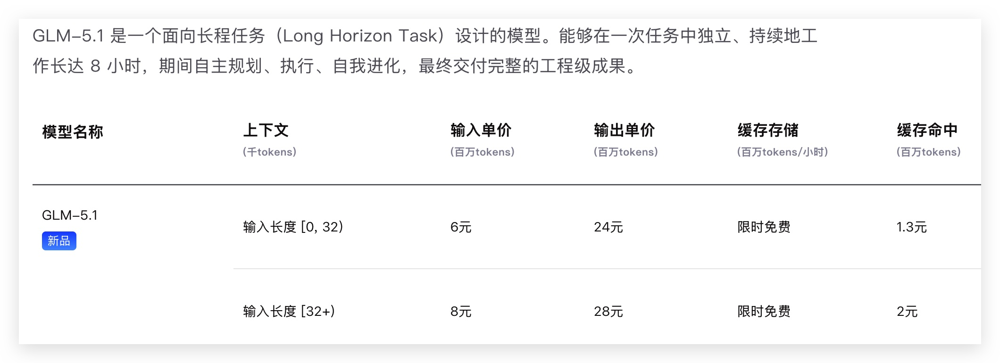
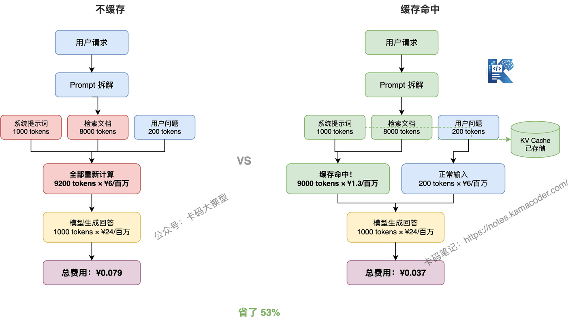
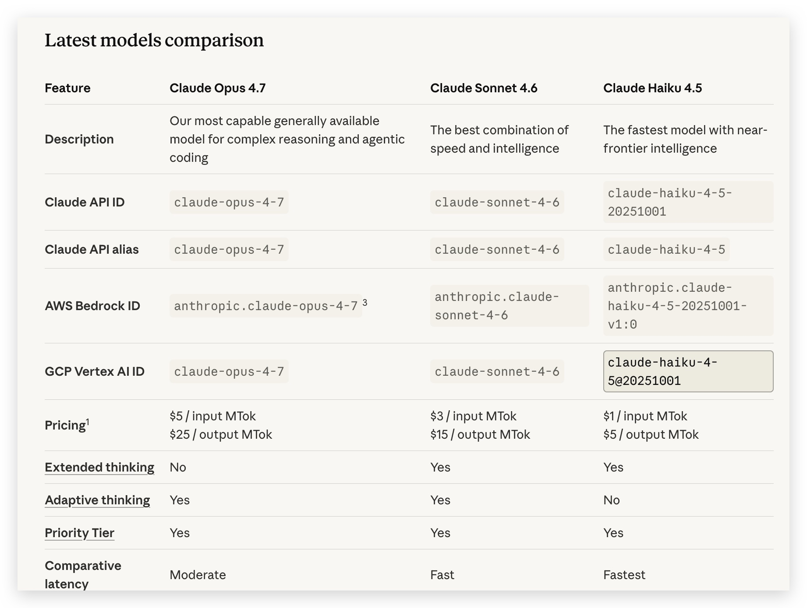
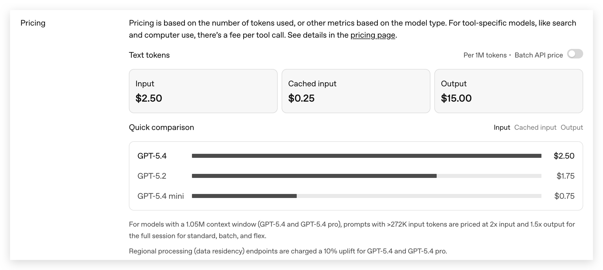
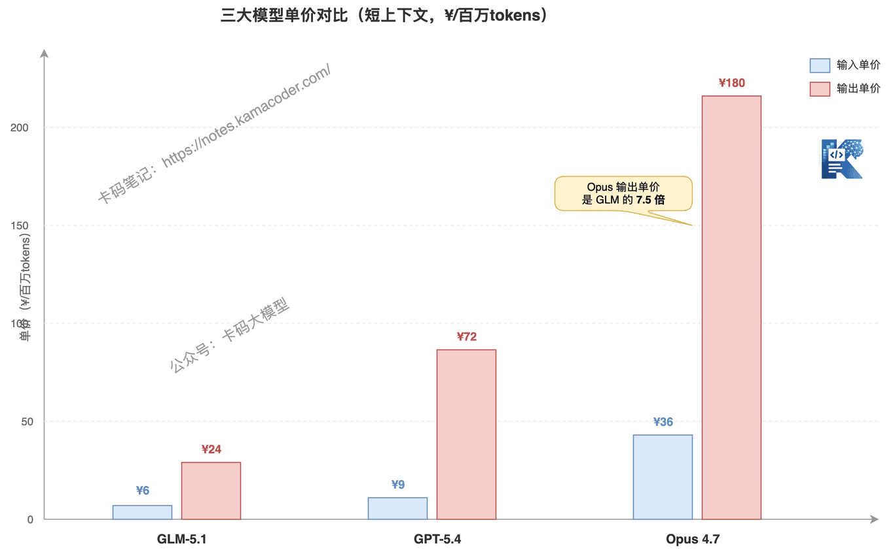
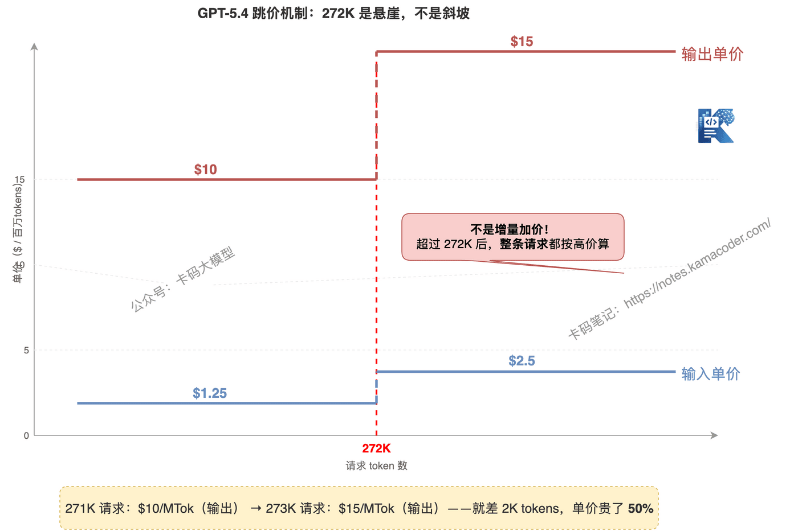

# 大模型 API 到底怎么计费？一个汉字几个 token？GLM-5.1、GPT-5.4、Opus 4.7 算给你看

> 来源: https://notes.kamacoder.com/llm/intro/llm_pricing.html

# `# 大模型 API 到底怎么计费？一个汉字几个 token？GLM-5.1、GPT-5.4、Opus 4.7 算给你看 

很多录友开始用大模型 API 了，一看定价页面就懵了： 

下面是GLM5-1的api定价： 


 

**输入单价、输出单价、上下文长度、缓存存储、缓存命中**——每个词都认识，组合在一起就是看不懂。 

更基本的问题：**一个汉字到底占几个 token？我发一段 500 字的中文，究竟花了多少钱？GLM-5.1、GPT-5.4、Opus 4.7 到底谁便宜？** 

这篇文章就用三个主流模型的实际定价，把大模型计费从 token 到账单，一步一步算给你看。  

## `# 目录 
  - `Token 是什么？一个汉字几个 token？   - `GLM-5.1 的定价结构拆解   - `输入和输出为什么价格不一样？   - `上下文长度为什么影响价格？   - `缓存是什么？能省多少钱？   - `完整算一遍：从请求到账单   - `GLM-5.1 vs GPT-5.4 vs Opus 4.7 价格对比   - `三个模型的隐性成本，标价里看不到   - `真实场景算一遍：到底谁便宜？   - `到底怎么选？  

## `# 1. Token 是什么？一个汉字几个 token？ 

**Token 是大模型计费的基本单位。** 你不是按"字"付费，也不是按"行"付费，而是按 token 付费。 

那 token 和汉字是什么关系？ 

### `# 英文的 token 

英文比较直观：**大约 1 个英文单词 = 1 个 token**。 

```
"Hello world"        → 2 tokens
"I love programming" → 3 tokens

```

 

短单词可能 1 个单词 = 1 token，长单词可能被拆成 2 个 token。比如 "unbelievable" 可能被拆成 "un" + "believ" + "able" = 3 tokens。 

### `# 中文的 token 

中文不是按"字"切分的，是按词频和组合切分的。**常见字通常 1 个字 = 1 个 token，生僻字或特殊组合可能 1 个字 = 2-3 个 token。** 

实际测试结果（以 GLM/GPT 系列的 tokenizer 为例）： 

| 内容  字数  Token 数  比例 
| "你好世界"  4 字  ~4 tokens  ~1 token/字 
| "今天天气不错，适合出去散步"  12 字（含标点）  ~12 tokens  ~1 token/字 
| "RAG系统中的混合检索策略"  12 字  ~14 tokens  ~1.2 token/字（中英混合） 
| "中华人民共和国国务院"  9 字  ~5 tokens  专有名词可能合并 

### `# 标点符号占几个 token？ 

**1 个标点 = 1 个 token**，和汉字一样。 

```
"，" → 1 token
"。" → 1 token
"！" → 1 token

```

 

但如果是连续标点或特殊符号，可能不一样： 

```
"..."  → 1 token（三个点被合并）
"。。。"→ 3 tokens（中文句号逐个计算）

```

 

### `# 代码的 token 

代码的 token 化比较特殊，缩进、括号、关键字都算： 

```
def hello():
    print("hi")

```

 

这段代码大约 10-12 tokens：`def`、`hello`、`(`、`)`、`:`、`print`、`(`、`"`、`hi`、`"`、`)`……每个符号和关键字都算。 

### `# 快速估算公式 

**中文场景：1 个汉字 ≈ 1-1.5 个 token** 

日常文本按 1:1 估算就够用，中英混合或专业术语多的文本按 1:1.5 估算更准。 

**总之，大家可以这么记：1000 个汉字大概 1000-1500 个 token。**  

## `# 2. GLM-5.1 的定价结构拆解 

我们以 GLM-5.1  (opens new window) 为例，给大家拆解一下，各个指标以及费用（下面在和 gpt、opus做对比） 


 

### `# 输入单价（每百万 tokens） 

| 上下文长度  价格 
| 0 ~ 32K tokens  ¥6 
| 32K tokens 及以上  ¥8 

### `# 输出单价（每百万 tokens） 

| 上下文长度  价格 
| 0 ~ 32K tokens  ¥24 
| 32K tokens 及以上  ¥28 

### `# 缓存相关 

| 项目  价格 
| 缓存存储（每百万 tokens / 小时）  限时免费 
| 缓存命中（0~32K）  ¥1.3 / 百万tokens 
| 缓存命中（32K+）  ¥2 / 百万tokens 

看到这个表，你可能有两个疑问：**为什么输入和输出价格差这么多？为什么上下文越长越贵？** 下面逐个讲。  

## `# 3. 输入和输出为什么价格不一样？ 

GLM-5.1  (opens new window) 的输出价格是输入的 **4 倍**。这不是智谱故意坑你，是输出确实比输入费算力。 

**输入是"读"**——模型把你的 prompt 过一遍，计算出每一层的表示，这就完了。相当于看一篇文章，看完了就有印象了。 

**输出是"写"**——模型每生成一个 token，都要把整个上下文重新算一遍（从第一个字到最后生成的字），才能决定下一个字是什么。生成 1000 个输出 token，相当于把整个输入重新算了 1000 遍。 

```
输入 1000 tokens：算 1 遍
输出 1000 tokens：算 1000 遍

```

 

所以输出贵 4 倍，不是 1000 倍，是因为有 KV Cache 优化——模型把输入部分算过的结果缓存起来了，不用从头重算，但输出部分还是要逐 token 生成，计算量依然远大于输入。 

**面试可能会问**：为什么输出比输入贵？——答案就是上面说的，输出是自回归生成，每步都要重新计算，输入只需要前向传播一次。  

## `# 4. 上下文长度为什么影响价格？ 

32K 以下输入单价 ¥6，32K 以上 ¥8，涨了 33%。为什么？ 

**Transformer 的注意力机制，计算量和序列长度的平方成正比。** 

```
输入 1K tokens → 计算量 ∝ 1K² = 100万
输入 32K tokens → 计算量 ∝ 32K² = 10.24亿
输入 128K tokens → 计算量 ∝ 128K² = 1638.4亿

```

 

从 1K 到 32K，计算量不是 32 倍，是 **1024 倍**。 

所以长上下文的单价更高，是在覆盖额外的计算成本。这不是智谱一家这么干，所有大模型厂商的长上下文定价都比短上下文贵，原因都一样。  

## `# 5. 缓存是什么？能省多少钱？ 

缓存是 GLM-5.1  (opens new window) 定价表里最容易让人懵的部分。什么叫"缓存存储"？什么叫"缓存命中"？ 

### `# 什么时候用得上缓存？ 

**RAG 系统**是最典型的场景。 

RAG 系统每次请求的 prompt 长这样： 

```
[系统提示词] + [检索到的文档] + [用户问题]

```

 

其中系统提示词每次都一样，检索到的文档大部分时候也差不多（同一个知识库，文档更新不频繁）。唯一变的就是用户的提问。 

如果不缓存，每次请求都要把整个 prompt 从头算一遍，系统提示词和文档部分明明每次都一样，却重复计算，白花钱。 

### `# 缓存存储 = 把算过的结果存下来 

**缓存存储**就是把模型对输入的计算结果（KV Cache）存到磁盘上，下次请求如果输入前面部分一样，直接复用，不用重新算。 

当前限时免费，存储本身不花钱。 

### `# 缓存命中 = 复用了存下来的结果 

**缓存命中**就是新请求的输入前缀和之前缓存的完全一致，这部分 token 按更低的价格计费： 

|   正常输入价格  缓存命中价格  省了多少 
| 短上下文（<32K）  ¥6 / 百万tokens  ¥1.3 / 百万tokens  **78%** 
| 长上下文（≥32K）  ¥8 / 百万tokens  ¥2 / 百万tokens  **75%** 

省 3/4 的钱，效果非常明显。 

### `# 举个例子 


 

你做了一个 RAG 系统，每次请求的 prompt 组成： 

```
系统提示词：1000 tokens（每次一样）
检索文档：8000 tokens（大部分时候一样）
用户问题：200 tokens（每次不同）
模型输出：1000 tokens

```

 

**不用缓存：** 

```
输入费用 = (1000 + 8000 + 200) ÷ 1,000,000 × ¥6 = ¥0.0552
输出费用 = 1000 ÷ 1,000,000 × ¥24 = ¥0.024
总费用 = ¥0.0792

```

 

**用缓存（9000 tokens 命中）：** 

```
缓存命中费用 = 9000 ÷ 1,000,000 × ¥1.3 = ¥0.0117
正常输入费用 = 200 ÷ 1,000,000 × ¥6 = ¥0.0012
输出费用 = 1000 ÷ 1,000,000 × ¥24 = ¥0.024
总费用 = ¥0.0369

```

 

**省了 53%**。请求量越大省得越多，一天 10 万次请求的话，一个月能省几千块。  

## `# 6. 完整算一遍：从请求到账单 

来算三个真实场景，把所有概念串起来。 

### `# 场景一：短对话，无缓存 

你问 GLM-5.1  (opens new window)："用 Python 写一个快排"，模型输出了 300 字代码。 

```
输入：约 20 tokens（"用 Python 写一个快排" + 系统提示词）
输出：约 500 tokens（代码 + 解释）
上下文总长：520 tokens < 32K，按低档价算

```

 

```
输入费用 = 20 ÷ 1,000,000 × ¥6 = ¥0.00012
输出费用 = 500 ÷ 1,000,000 × ¥24 = ¥0.012
总费用 = ¥0.01212 ≈ 1.2 分钱

```

 

**结论：短对话非常便宜，几分钱的事。** 

### `# 场景二：长文档问答，无缓存 

你往 prompt 里塞了一篇 3 万字的 PDF 文档（约 4 万 tokens），问"总结第三章的核心观点"，模型输出了 800 字。 

```
输入：约 40,000 tokens（文档 + 问题）
输出：约 1,200 tokens（800 字回答）
上下文总长：41,200 tokens ≥ 32K，按高档价算

```

 

```
输入费用 = 40000 ÷ 1,000,000 × ¥8 = ¥0.32
输出费用 = 1200 ÷ 1,000,000 × ¥28 = ¥0.0336
总费用 = ¥0.3536 ≈ 3 毛 5

```

 

**结论：长文档单次 3 毛多，看着不贵，但一天问 1000 次？那就是 350 块。** 

### `# 场景三：RAG 系统，开缓存 

你的 RAG 系统每次请求带 1 万 tokens 的系统提示词和检索文档，缓存命中 9000 tokens，用户问题 1000 tokens，模型输出 1500 tokens。 

```
缓存命中：9000 tokens（按缓存命中价）
正常输入：1000 tokens（按正常输入价）
输出：1500 tokens
上下文总长：11,500 tokens < 32K，按低档价算

```

 

```
缓存命中费用 = 9000 ÷ 1,000,000 × ¥1.3 = ¥0.0117
正常输入费用 = 1000 ÷ 1,000,000 × ¥6 = ¥0.006
输出费用 = 1500 ÷ 1,000,000 × ¥24 = ¥0.036
总费用 = ¥0.0537 ≈ 5.4 分钱

```

 

对比不开缓存： 

```
输入费用 = 10000 ÷ 1,000,000 × ¥6 = ¥0.06
输出费用 = 1500 ÷ 1,000,000 × ¥24 = ¥0.036
总费用 = ¥0.096 ≈ 9.6 分钱

```

 

**开缓存省了 44%。**  

## `# 7. GLM-5.1 vs GPT-5.4 vs Opus 4.7 价格对比 

前面用 GLM-5.1  (opens new window) 讲了计费原理，现在把三大主流模型放一起比。为了直观，统一换算成美元（¥1 ≈ $0.14）。 

大家可以先看一下官网价格： 


 


 

GPT API官网：https://developers.openai.com/api/docs/models/gpt-5.4 

Claude opus API官网：https://platform.claude.com/docs/en/about-claude/models/overview 

### `# 基础单价对比 


 

|   GLM-5.1  GPT-5.4  Opus 4.7 
| 输入（短上下文）  ~$0.83/MTok  $1.25/MTok  $5/MTok 
| 输入（长上下文）  ~$1.11/MTok  $2.5/MTok  $5/MTok 
| 输出（短上下文）  ~$3.43/MTok  $10/MTok  $25/MTok 
| 输出（长上下文）  ~$4.00/MTok  $15/MTok  $25/MTok 
| 长上下文分界点  32K  272K  无分档 
| 缓存命中价  ~$0.18/MTok  ~$0.25/MTok  ~$0.5/MTok 

**小总结一下：**： 
  - **GLM-5.1 最便宜**——输入单价是 Opus 的 1/6，输出是 1/7   - **GPT-5.4 居中**——比 GLM 贵，但比 Opus 便宜不少   - **Opus 4.7 最贵**——但价格稳定，没有分档跳价 

但只看单价会误判，因为每个模型都有**标价里看不到的隐性成本**。  

## `# 8. 三个模型的隐性成本，标价里看不到 

### `# GPT-5.4 的坑：272K 跳价机制 


 

GPT-5.4 的 272K 分界点不是"超过部分按高价算"，而是**整条请求都按高价算**。 

```
你发了一条 280K tokens 的请求：

你以为：272K × 便宜价 + 8K × 贵价
实际上：280K 全部按贵价算！

```

 

这意味着：一条 271K 的请求和一条 273K 的请求，**成本可能差一倍**。如果你做 Agent 系统，上下文很容易滚过 272K，成本突然暴涨。 

### `# Opus 4.7 的坑：Tokenizer 膨胀 

同样的文本，不同模型的 tokenizer 分词结果不一样。**Opus 的 tokenizer 对中文和代码的切分更碎，同样的内容会产生更多 token。** 

实际测试中，同一段文本在 Opus 上比 GLM 多 20%-35% 的 token。也就是说： 

```
一段 10 万字的中文：
GLM-5.1：约 10 万 tokens
Opus 4.7：约 12-13.5 万 tokens

```

 

token 数多了 20%-35%，实际费用比标价贵 20%-35%。**标价 $5/MTok，实际等效 $6-6.75/MTok。** 

### `# Opus 4.7 的坑：Thinking Tokens 

Opus 4.7 有"思考"功能，推理过程中会产生大量 thinking tokens。这些 token **你在输出里看不到，但一样要收费**。 

一个复杂问题，Opus 可能在内部"想"了 5000 tokens，然后给你输出 500 tokens 的回答。你看到的是 500 tokens，但账单上是 5500 tokens。 

**这个成本很容易被忽略**——如果你只算"模型给我输出了多少字"，会觉得 Opus 怎么这么贵，其实大头在 thinking tokens 上。 

### `# GLM-5.1 的坑：能力边界 

GLM 最大的隐性成本不是计费机制，而是**能力不够时的重试成本**。 

复杂推理、长链路代码生成这些场景，GLM 一次做对的概率比 Opus 低。做不对就得重试，重试一次成本翻倍。**如果 Opus 一次成功、GLM 需要三次才成功，那 GLM 的实际成本就不是 Opus 的 1/7，而是 3/7**。  

## `# 9. 真实场景算一遍：到底谁便宜？ 

### `# 场景一：短对话（输入 1K，输出 500 tokens） 

|   GLM-5.1  GPT-5.4  Opus 4.7 
| 输入费用  $0.00083  $0.00125  $0.005 
| 输出费用  $0.00172  $0.005  $0.0125 
| **总计**  **$0.0026**  **$0.0063**  **$0.0175** 

**GLM 便宜一个数量级。** 短对话场景，选 GLM。 

### `# 场景二：长文档问答（输入 50K，输出 2K tokens） 

|   GLM-5.1  GPT-5.4  Opus 4.7 
| 输入费用  $0.056  $0.0625  $0.25 
| 输出费用  $0.008  $0.02  $0.05 
| **总计**  **$0.064**  **$0.083**  **$0.30** 

**GLM  (opens new window) 依然最便宜，GPT 紧随其后，Opus 是 GLM 的 5 倍。** 

但别忘了 Opus 的 tokenizer 膨胀：50K tokens 在 Opus 上实际可能是 60-67K tokens，费用会到 $0.35-0.39。 

### `# 场景三：Agent 复杂任务（多轮，累计 300K tokens，输出 10K tokens） 

这个场景 GPT-5.4 会触发 272K 跳价： 

|   GLM-5.1  GPT-5.4（跳价后）  Opus 4.7 
| 输入费用  $0.33  $0.75  $1.5 
| 输出费用  $0.04  $0.15  $0.25 
| **总计**  **$0.37**  **$0.90**  **$1.75** 

**加上 tokenizer 膨胀和 thinking tokens，Opus 实际可能到 $2-2.5。** 

但注意：这个场景下，**成功率才是最大的成本变量**。如果 GLM 成功率 60%，需要平均 1.7 次才成功，实际成本 $0.63；Opus 成功率 95%，几乎一次过，成本 $2.0。Opus 还是贵，但差距缩小了。  

## `# 10. 我们怎么选？ 

别只看单价，**真正成本 = token 数 × 单价 ÷ 成功率**。 

### `# 按场景选 

**短对话、简单问答、分类任务** → **GLM-5.1  (opens new window)** 

单价最低，中文能力够用，这类简单任务不需要顶级模型。 

**中等复杂度、需要稳定性** → **GPT-5.4** 

单价居中，能力比 GLM 强，但要注意 272K 跳价坑。如果你的请求不会超过 272K，GPT 是性价比之选。 

**复杂推理、Agent 系统、代码生成** → **Opus 4.7** 

单价最贵，但能力最强，一次做对的概率最高。Agent 场景下，**成功率比单价重要得多**——做错重试的成本远比单价贵更伤。 

### `# 混合使用才是最优解 

实际生产环境，没人只用一个模型： 

```
简单问题 → [GLM-5.1](https://www.bigmodel.cn/invite?icode=h5645fTH07PKdN0cj%2FTnKmczbXFgPRGIalpycrEwJ28%3D)（便宜）
中等问题 → GPT-5.4（平衡）
复杂问题 → Opus 4.7（靠谱）

```

 

这就是"模型路由"——先判断问题难度，再分派给合适的模型。简单问题用便宜的，复杂问题才上贵的，总体成本最低。 

### `# 总结 

**GPT-5.4 看起来便宜，Opus 4.7 用起来稳定，GLM-5.1  (opens new window) 算起来最省。** 别被标价骗了，真正成本要看场景、看成功率、看隐性费用。  

## `# 写在最后 

**按 token 计费，输入便宜输出贵，长上下文 比 短上下文贵。** 

但真正决定你花多少钱的，不只是标价——跳价机制、tokenizer 膨胀、thinking tokens、成功率，这些隐性成本可能比单价差得更远。 

很多录友不敢用 API，怕花钱。其实算一算就知道了——普通对话一次几分钱，长文档问答一次几毛钱，只有大规模线上服务才需要关注成本优化。 

很多录友问我："卡哥你平时怎么用大模型的？一个月花多少钱？" 

我现在的主力工具是 **Claude Agent + CLI + GLM-5.1**，说白了就是 Opus 干难的活，GLM 干简单的活（其实GLM也还行）。 

### `# Claude CLI 只显示总 token 数，怎么算钱？ 

用 Claude CLI 的录友应该都发现了——它只给你看这次交互总共花了多少 tokens，不拆分输入和输出。 

没法精确算？不用精确算，**用一个混合单价估算就够了**。 

Claude Code 的典型交互，token 构成大概是： 

```
总 tokens ≈ 输入 60% + 输出 40%（含 thinking tokens）

```

 

混合单价算一下： 

**Opus 4.7：0.6 × 输入价 + 0.4 × 输出价 = 0.6 × ¥0.036/千 + 0.4 × ¥0.18/千 ≈ ¥0.09/千 tokens** 

**GLM-5.1：0.75 × 输入价 + 0.25 × 输出价 = 0.75 × ¥0.006/千 + 0.25 × ¥0.024/千 ≈ ¥0.01/千 tokens** 

### `# 两个数记住就行 
  - **Opus：1K 总 tokens ≈ 1 毛钱**   - **GLM：1K 总 tokens ≈ 1 分钱** 

差 10 倍。 

### `# 实际算一下 

我用 Claude Code 做一次代码修改，大约 30K tokens： 

```
Opus 费用 ≈ 30 × ¥0.09 = ¥2.7

```

 

同样的任务走 GLM-5.1  (opens new window)： 

```
GLM 费用 ≈ 30 × ¥0.01 = ¥0.3

```

 

一次差两块多，一天用个几十次，一个月就差几千块。 

**但 Opus 贵有贵的道理**——复杂代码修改、多文件重构这种活，GLM 容易改错，改错了还得重来，重试两三次成本就上来了。Opus 一次搞定，看着贵，其实省时间也省钱。
