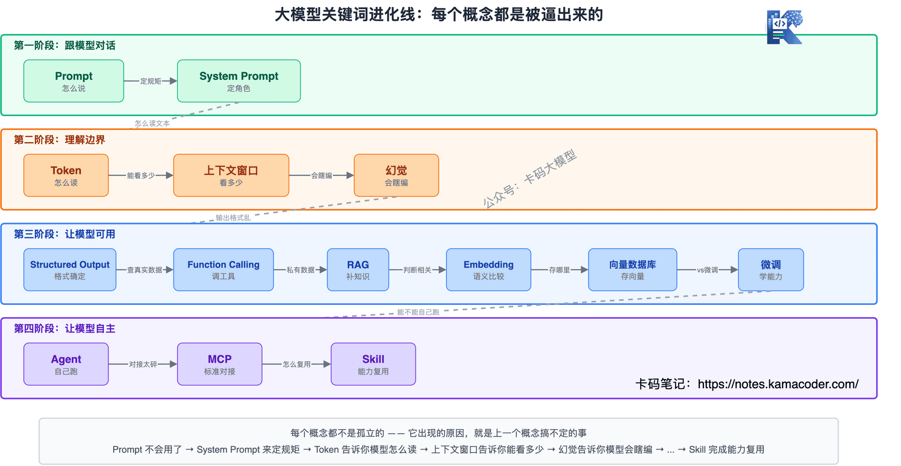
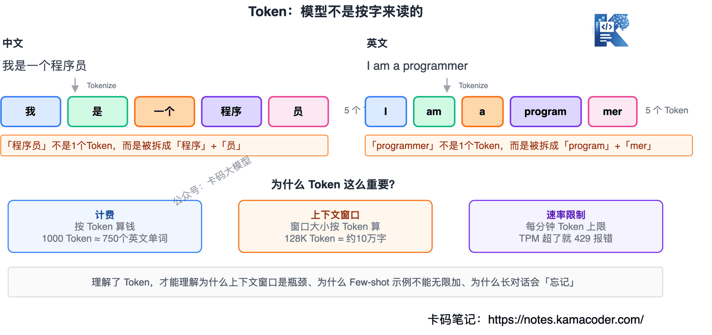
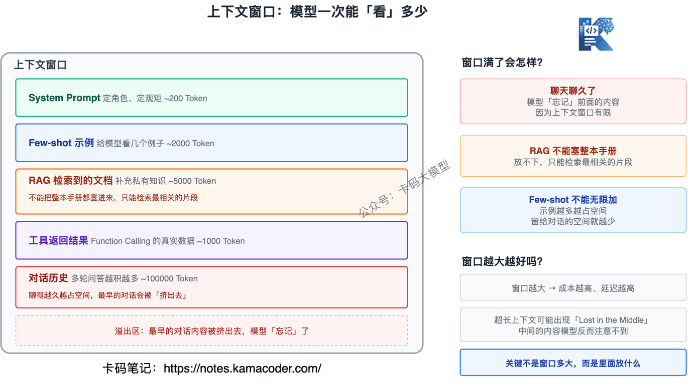
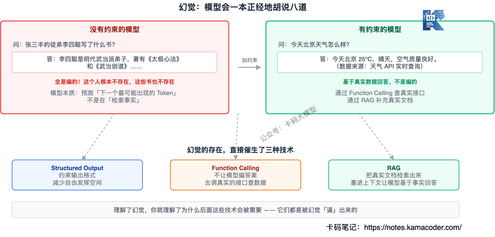
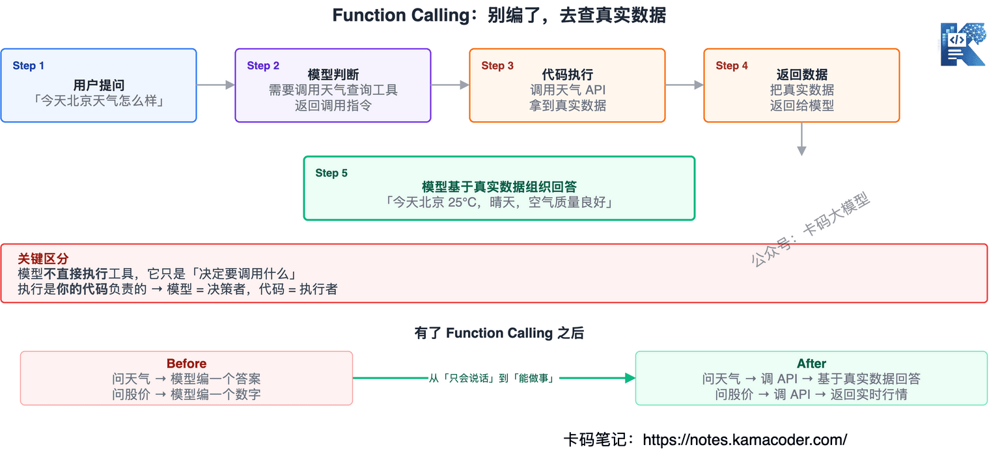
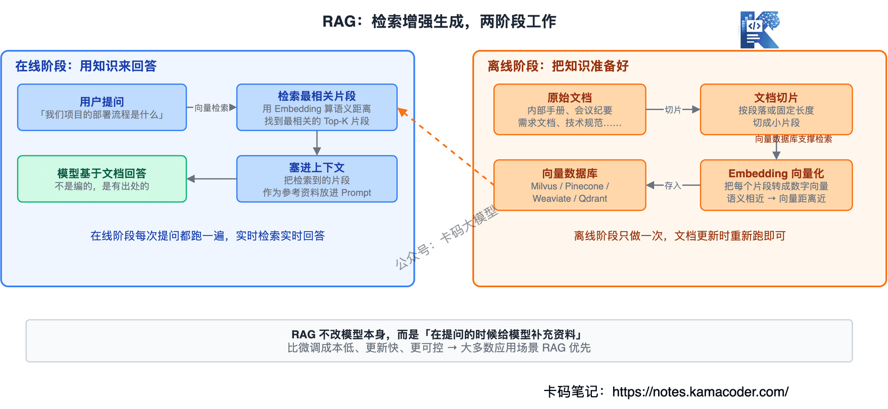
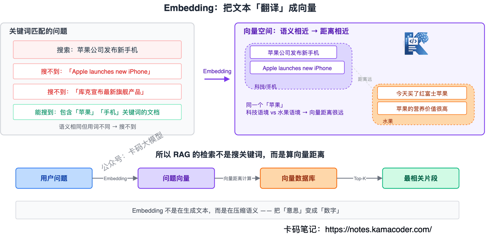
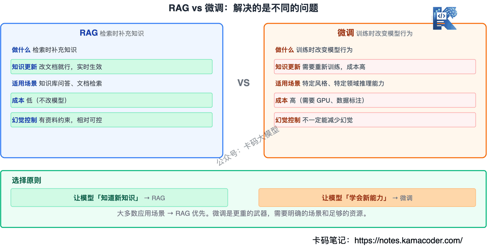
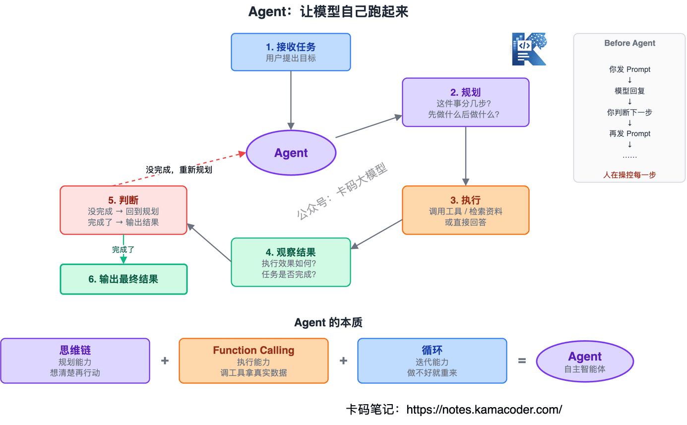
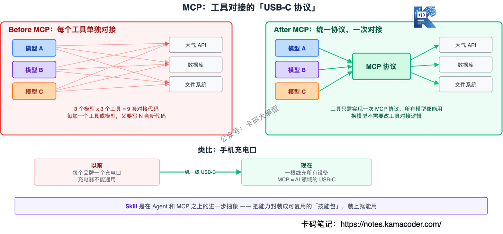

# 大模型关键词全解：从 Prompt 到 Agent 到 MCP，一篇搞懂 13 个核心概念

> 来源: https://notes.kamacoder.com/llm/intro/llm_keywords.html

# `# 大模型关键词全解：从 Prompt 到 Agent 到 MCP，一篇搞懂 13 个核心概念 

很多录友刚开始接触大模型，满屏的英文缩写和术语：Prompt、Agent、RAG、MCP、Function Calling…… 

每个词单独搜都能搜到解释，但搜完还是串不起来。 

这篇文章，我不按字母顺序讲，**按"从简单到复杂"的顺序讲**。每个概念，都是因为上一个"不够用了"，才被逼出来的。你跟着走一遍，这些词就不再是散落的名词，而是一条完整的进化线。 

 

## `# 目录 

**第一阶段：跟模型对话** 
  - Prompt：你跟模型说的每一句话   - System Prompt：给模型定规矩 

**第二阶段：理解模型的边界** 
  - Token：模型不是按"字"来读的   - 上下文 / 上下文窗口：模型一次能"看"多少   - 幻觉（Hallucination）：模型会一本正经地胡说八道 

**第三阶段：让模型可用** 
  - Structured Output：输出别乱来   - Function Calling：别编了，去查真实数据   - RAG：模型不认识你的私有数据   - Embedding：RAG 背后的"翻译官"   - 向量数据库：存向量的"专用仓库"   - 微调（Fine-tuning）：和 RAG 的区别 

**第四阶段：让模型自主** 
  - Agent：让模型自己跑起来   - MCP：工具对接的"USB 协议"   - Skill：能力的标准化封装  

## `# Prompt：你跟模型说的每一句话 

Prompt 就是你输入给大模型的内容。你在聊天框里打"帮我写一封请假邮件"，这个就是 Prompt。 

看起来很简单，但同样的大模型，有人用起来很强，有人用起来很弱。区别在哪？**就在于 Prompt 怎么写**。 

所以有了一个专门的领域：**Prompt Engineering**，研究怎么写 Prompt 才能让模型输出更好的结果。比如给模型定角色（System Prompt）、给几个示例（Few-shot）、让它一步步想（CoT），都是 Prompt Engineering 的具体技巧。 

这不是玄学，是有方法的。但不管 Prompt 写得多好，模型终究只是"在说话"，它不能做事、也不能保证说的是真的。后面的每一个概念，都是在弥补 Prompt 的某个短板。  

## `# System Prompt：给模型定规矩 

普通 Prompt 是你"问一句、模型答一句"。 

但如果你想让模型**始终按某种风格回答**呢？比如：你是一个法律助手，只用中文回答，不要编造案例。 

这时候就需要 **System Prompt**——在对话开始前，给模型设定一个"角色"和"行为规范"。模型在整个对话过程中都会遵守这个设定。 

这是从"聊天"走向"应用"的第一步。你在 ChatGPT 里用的 GPTs，本质上就是预设了一套 System Prompt。  

## `# Token：模型不是按"字"来读的 

前面一直在说 Prompt，但你有没有想过：模型到底是怎么"读"你写的东西的？ 

它不是按字读，也不是按词读，是按 **Token** 读。 

Token 是大模型处理文本的最小单位。一个汉字通常是 1-2 个 Token，一个英文单词可能是 1-3 个 Token。代码、标点、特殊符号，各有各的切分规则。 

 

为什么要知道这个？因为 **大模型的一切都按 Token 计量**： 
  - 计费按 Token 算   - 上下文窗口的大小按 Token 算   - API 的速率限制也按 Token 算 

理解了 Token，才能理解后面为什么上下文窗口是瓶颈、为什么 Few-shot 示例不能无限加。  

## `# 上下文 / 上下文窗口：模型一次能"看"多少 

你跟模型聊天，所有的输入——System Prompt、对话历史、RAG 检索到的文档、工具返回的结果——都装在一个"窗口"里，这个窗口就叫**上下文**。 

而这个窗口有大小限制，这就是**上下文窗口（Context Window）**。 

 

比如 GPT-5.5 的上下文窗口是 1M Token，Claude Opus 4.7 是 200K，DeepSeek V4 是 1M。看起来很大，但实际用起来你会发现很快就被填满： 
  - System Prompt 占掉几百 Token   - Few-shot 示例占掉几千 Token   - 多轮对话历史越积越多   - RAG 检索的文档也要塞进来 

**窗口满了怎么办？最早的对话内容就会被"挤出去"**——模型就"忘了"你前面说了什么。 

这就解释了几个现实问题： 
  - 为什么聊天聊久了，模型会"忘记"前面的内容？→ 上下文窗口有限   - 为什么 RAG 不能把整本手册都塞进去？→ 放不下，只能检索最相关的片段   - 为什么长文档场景对上下文窗口大小很敏感？→ 窗口太小连文档都装不完 

那上下文窗口是不是越大越好？也不完全是。窗口越大，**成本越高、延迟越高**，而且研究表明模型在超长上下文中可能出现"Lost in the Middle"现象——中间的内容模型反而注意不到。 

所以实际工程里，不是拼命塞满上下文，而是**精准控制上下文里放什么**。关于从 Prompt Engineering 到 Context Engineering 再到 Harness Engineering 的演进，可以看这篇 Harness Engineering 面试文章  (opens new window)。  

## `# 幻觉（Hallucination）：模型会一本正经地胡说八道 

讲到这里，必须直面一个事实：**大模型会编造不存在的东西**，而且语气特别自信。 

问它一个不存在的人，它能给你编出完整的履历；问它某个 API 的用法，它能编一个根本不存在的参数。这就是**幻觉**。 

幻觉不是 Bug，是大模型工作方式的"副产物"——它本质上是在预测"下一个最可能出现的 Token"，而不是在"检索事实"。 

 

幻觉的存在，直接催生了后面的一系列技术： 
  - **Function Calling**：不让模型自己编答案，而是让它去调用真实的接口查数据   - **RAG**：把真实的文档检索出来塞进上下文，让模型基于事实来回答   - **Structured Output**：约束输出格式，减少模型自由发挥的空间 

理解了幻觉，你就理解了为什么后面这些技术会被需要。  

## `# Structured Output：输出别乱来 

模型的默认输出是自由文本，想说什么说什么。 

但做应用开发，你需要的往往是**结构化数据**——JSON、表格、固定字段。 

比如你做信息提取，需要模型返回 `{"姓名":"张三","年龄":28}`，而不是"这个人叫张三，今年28岁"。 

**Structured Output** 就是约束模型按指定格式输出。常见方式有： 
  - 在 Prompt 里规定格式（简单但不稳定）   - 用 JSON Schema 约束（更可靠，主流 API 都支持） 

这是从"聊天"走向"系统"的关键一步——下游代码要解析模型的输出，格式必须确定。  

## `# Function Calling：别编了，去查真实数据 

模型有两个硬伤：不知道实时信息，也不能操作外部系统。 

你问它今天北京天气，它只能编。你让它帮你发封邮件，它做不到。 

**Function Calling** 就是解决这个问题的：你给模型定义一组"工具"（函数），模型在回答时可以决定调用哪个工具，你的代码负责执行，再把结果返回给模型。 

 

流程是这样的： 
  - 你问"今天北京天气怎么样"   - 模型判断需要调用天气查询工具，返回调用指令   - 你的代码调用天气 API，拿到真实数据   - 把数据返回给模型   - 模型基于真实数据组织回答 

**模型不直接执行工具，它只是"决定要调用什么"**，执行是你的代码负责的。 

这是大模型从"只会说话"进化到"能做事"的关键一步。  

## `# RAG：模型不认识你的私有数据 

模型训练用的是公开数据，你公司的内部文档、你上周的会议纪要、你项目的需求文档——它统统不知道。 

怎么办？最直觉的想法：把相关资料找出来，塞进上下文里，让模型基于这些资料来回答。 

这就是 **RAG（Retrieval-Augmented Generation）**，检索增强生成： 

 
  - **离线阶段**：把你的文档切成片段，转成向量，存进数据库   - **在线阶段**：用户提问时，检索最相关的片段，塞进上下文，模型基于这些片段回答 

RAG 不改模型本身，而是"在提问的时候给模型补充资料"。这比微调成本低、更新快、也更可控。 

关于 RAG 的面试高频考点（链路、向量检索、混合检索），在RAG 面试文章  (opens new window)里有完整整理。  

## `# Embedding：RAG 背后的"翻译官" 

RAG 说要"检索最相关的片段"，但怎么判断"相关"？ 

总不能用关键词匹配吧？语义相关但用词不同的内容就搜不到了。 

**Embedding** 就是把文本"翻译"成一组数字（向量），语义越相近的文本，向量距离越近。 

 

"苹果公司发布新手机"和"Apple launches new iPhone"用词完全不同，但 Embedding 之后的向量非常接近——因为语义一样。 

所以 RAG 的检索不是搜关键词，而是**算向量距离**，找到语义最相近的文档片段。 

在Embedding 详解  (opens new window)里我们讲过，Embedding 不是在生成文本，而是在压缩语义。  

## `# 向量数据库：存向量的"专用仓库" 

有了 Embedding，你还需要一个地方来存这些向量，并且能高效地检索。 

普通数据库（MySQL、PostgreSQL）擅长精确匹配和范围查询，但向量检索是"找最近的邻居"，这是完全不同的查询模式。 

**向量数据库**就是专门做这件事的：存向量、快速做相似度检索。Milvus、Pinecone、Weaviate、Qdrant 都是做这个的。 

如果传统 RAG 的向量检索已经满足不了你，可以看看GraphRAG 面试文章  (opens new window)，了解 RAG 从"找文本"到"找关系"的演进。  

## `# 微调（Fine-tuning）：和 RAG 的区别 

讲到 RAG，很多人会问：**为什么不直接微调？把我的数据喂给模型，让它记住不就行了？** 

没那么简单。微调和 RAG 解决的是不同的问题： 

 

|   RAG  微调 
| 做什么  检索时补充知识  训练时改变模型行为 
| 知识更新  改文档就行，实时生效  需要重新训练，成本高 
| 适用场景  知识库问答、文档检索  特定风格、特定领域推理能力 
| 成本  低（不改模型）  高（需要 GPU、数据标注） 
| 幻觉控制  有资料约束，相对可控  不一定能减少幻觉 

简单说：**要让模型"知道新知识"→ RAG；要让模型"学会新能力"→ 微调**。 

大多数应用开发场景，RAG 优先。微调是更重的武器，需要明确的场景和足够的资源。  

## `# Agent：让模型自己跑起来 

有了 Function Calling，模型能调用工具了；有了 RAG，模型有私有知识了。 

但到目前为止，每一步还是你在操控：你发 Prompt → 模型回复 → 你判断下一步 → 再发 Prompt。 

**Agent 就是把"你判断下一步"这件事交给模型自己做。** 

 

一个典型的 Agent 循环： 
  - 接收用户任务   - 自己规划：这件事分几步？   - 执行第一步：调用工具 or 检索资料 or 直接回答   - 观察结果，判断是否继续   - 如果没完成，回到第 2 步   - 任务完成，输出最终结果 

Agent 的本质 = **思维链（规划能力）+ Function Calling（执行能力）+ 循环（迭代能力）**。所谓思维链，就是让模型把推理过程一步步写出来，而不是直接给结论。**让模型"想清楚了再行动"，这就是 Agent 能自主规划的基础**。 

想更深入了解 Agent 的工作模式（ReAct、Plan-and-Execute 等）和 Agent vs Workflow 的区别，可以看Agent 面试文章  (opens new window)。  

## `# MCP：工具对接的"USB 协议" 

Agent 能调工具了，但问题来了：每接一个新工具，就要写一套对接代码。换个大模型，又得重写。 

这就像手机充电口——以前每个手机品牌一个接口，充电器不能通用。后来统一成了 USB-C，一根线充所有设备。 

**MCP（Model Context Protocol）** 就是 AI 领域的"USB-C"：一个标准化的协议，让任何模型都能用统一的方式连接外部工具和数据源。 

 

有了 MCP： 
  - 工具开发者只需要实现一次 MCP 协议，所有支持 MCP 的模型都能用   - 应用开发者不需要为每个工具写适配代码   - 换模型不需要改工具对接逻辑 

MCP 解决的是**规模化的问题**——当你只有一两个工具，手写对接也行；但当工具越来越多、模型经常换，标准化协议就是刚需。Claude Code 就是 MCP 的典型实践，它的 18+ 内置工具就是通过标准化协议对接的，具体可以看Claude Code 深度拆解  (opens new window)。  

## `# Skill：能力的标准化封装 

最后，**Skill** 是在 Agent 和 MCP 之上的进一步抽象。 

Skill 把 Agent 的某个能力封装成一个可复用的"技能包"——就像手机上的 App，装上就能用。 

比如： 
  - "文件摘要"是一个 Skill   - "代码审查"是一个 Skill   - "数据库查询"是一个 Skill 

每个 Skill 定义了：能做什么、需要什么输入、输出什么格式、依赖哪些工具。 

有了 Skill： 
  - 不同 Agent 之间可以**共享能力**   - 新 Agent 不用从零开发，**组合现有 Skill** 就行   - 能力可以**独立升级**，不影响其他部分 

从 Prompt 到 Skill，这就是大模型应用能力的完整进化线。  

## `# 全景回顾 

最后把 13 个概念串起来： 

**第一阶段：跟模型对话** 

Prompt → System Prompt（定角色） 

**第二阶段：理解模型的边界** 

Token（模型怎么读文本）→ 上下文窗口（一次能看多少）→ 幻觉（模型会瞎编） 

**第三阶段：让模型可用** 

Structured Output（输出别乱来）→ Function Calling（去查真实数据）→ RAG（补充私有知识）→ Embedding + 向量数据库（RAG 的底层原理）→ 微调（和 RAG 的对比） 

**第四阶段：让模型自主** 

Agent（自己规划、自己执行）→ MCP（工具对接标准化）→ Skill（能力封装复用） 

每个概念都不是孤立的，**它出现的原因，就是上一个概念搞不定的事**。 

理解了这条线，再看大模型相关的文章和面试题，你就知道每个词在整张拼图里属于哪一块了。
