# 大模型到底是怎么训练出来的？预训练、模型参数、SFT微调、RLHF对齐、推理一次讲明白

> 来源: https://notes.kamacoder.com/llm/intro/how_llm_trained.html

# `# 大模型到底是怎么训练出来的？预训练、模型参数、SFT微调、RLHF对齐、推理一次讲明白 

大家有没有好奇过：大模型到底是怎么被制作（训练）出来的。 

大模型什么都会，它是程序逻辑，还是靠的什么魔法。 

一个像 ChatGPT、Claude、DeepSeek 这样的大模型，**从一开始什么都不会，到后来能写代码、能聊天、能总结文档、能分析问题，中间到底发生了什么**？ 

很多人其实都不懂，包括程序员。 

有人以为大模型是工程师写了一堆规则。 

有人以为训练就是把百科、代码、论文塞进去，让模型背下来。 

有人以为推理阶段模型是先在脑子里想好完整答案，再一次性吐出来。 

这些理解都不对。 

大模型的工作原理简单概括一下： 

**大模型不是被人一条条写规则写出来的，而是先通过海量文本学习“下一个 token 应该是什么”，再通过指令数据和人类偏好，把它校准成一个更像助手的模型。** 

后面所有概念，预训练、SFT、RLHF、DPO、推理、幻觉，都可以从这句话里展开。 

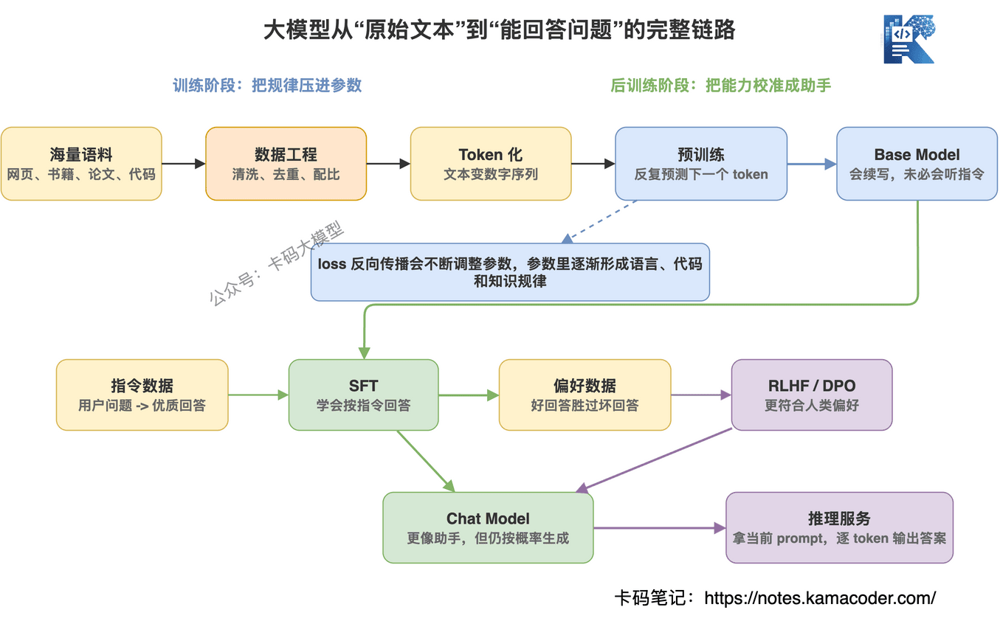
 

## `# 本篇文章目录 

这篇文章就用通俗易懂的方式，给大家介绍清楚，大模型究竟是怎么来的，本篇会按大模型从“训练出来”到“回答问题”的顺序讲： 
  - **先拆误区**：大模型不是工程师写规则写出来的   - **Token 化**：模型看到的不是文字，而是 token 和数字序列   - **数据工程**：为什么脏数据会把模型带歪   - **预训练**：为什么预测下一个 token 能学出语言、代码和知识   - **模型参数**：参数到底是什么，为什么参数越大通常越强   - **SFT 和对齐**：Base Model 怎么变成更像助手的 Chat Model   - **推理阶段**：模型如何逐 token 生成答案，第一个输出 token 怎么来   - **围绕问题回答**：模型为什么知道要回答用户问题，而不是乱续写   - **幻觉问题**：为什么大模型会胡说，以及如何降低幻觉风险   - **岗位边界**：训练大模型和做大模型应用到底有什么区别 

## `# 先拆一个误区：大模型不是写规则写出来的 

传统程序是我们熟悉的模式。 

你写 if else，写 for 循环，写数据库查询，写接口逻辑。 

输入 A，代码走固定路径，输出 B。 

但大模型不是这样。 

工程师没有写一条规则说： 

“如果用户问 HashMap，就先回答数组 + 链表 + 红黑树。” 

也没有写一条规则说： 

“如果用户让你写简历点评，就先指出问题，再给优化版本。” 

大模型的能力，主要来自训练。 

训练不是写规则，而是让模型在大量样本里反复做一件事： 

**根据前面的 token，预测下一个 token。** 

这个任务看起来太简单了，简单到很多人第一次听会觉得离谱： 

就这？ 

就靠预测下一个词，能学会写代码、做数学、讲道理？ 

关键就在于两个字：**规模**。 

数据规模足够大，模型参数足够多，训练次数足够多，这个简单任务就会逼着模型去学习文本背后的各种规律。 

语法、事实、代码结构、推理模板、问答习惯、领域术语，都藏在“下一个 token 应该是什么”这个任务里。 

## `# 第一步：先把文本变成 token 

模型不是直接看中文、英文、代码文件的。 

它看到的是 token。 

录友可以先粗暴理解： 

**token 就是模型处理文本的基本颗粒。** 

一个 token 可能是一个汉字，也可能是一个英文单词的一部分，也可能是一个符号，也可能是一段常见字符串。 

比如一句话： 

“大模型训练很贵” 

经过 tokenizer 之后，可能会被切成类似这样的 token 序列： 

“大模型” “训练” “很” “贵” 

代码也是一样。 

`public static void main` 这种东西，不是作为一整段代码塞给模型，而是切成一串 token。 

为什么要这么做？ 

因为神经网络不能直接处理自然语言字符串，它要处理的是数字。 

tokenizer 会把文本切成 token，再把 token 映射成 id，模型拿到的是一串数字。 

这一步听起来不起眼，但非常重要。 

**模型不是在字符层面理解世界，而是在 token 序列上学习规律。** 

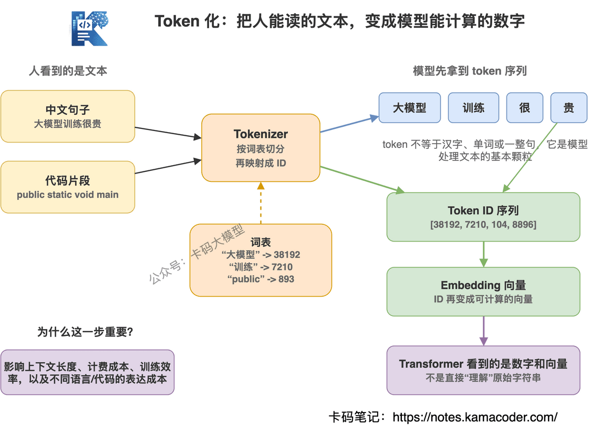
 

## `# 第二步：数据不是越多越好，脏数据会把模型带歪 

训练大模型之前，先要准备数据。 

数据从哪里来？ 

大体包括： 
  - 网页文本   - 书籍   - 论文   - 问答数据   - 代码仓库   - 文档   - 多语言语料   - 数学题、推理题、工具调用样本 

但不是把互联网全量抓下来就完事了。 

互联网上有大量垃圾内容： 
  - 重复页面   - 广告   - 采集站   - 低质量问答   - 错误代码   - 机翻内容   - 色情、暴力、诱导性内容   - 互相复制的 AI 生成文本 

如果这些东西不过滤，模型会照单全收。 

所以训练前要做大量数据工程： 

清洗、去重、分类、质量打分、过滤敏感内容、控制不同类型数据比例。 

录友要注意一个点： 

**大模型训练不是只有算法，数据工程占了非常大的工作量。** 

很多模型能力差，不一定是架构不行，而是数据配比、数据质量、训练策略没做好。 

同样是 Transformer，同样是几十亿参数，不同团队训练出来的效果可能差很多。 

差距往往就在这些看起来不炫技的工程细节里。 

## `# 第三步：预训练，到底在训练什么？ 

预训练是大模型训练里最烧钱、最核心的一步。 

它的目标很直接： 

**给模型一段 token，让它预测下一个 token。** 

举个例子： 

输入： 

“Java 中 HashMap 的底层结构是” 

模型要预测下一个 token 可能是什么。 

如果训练数据里大量高质量 Java 文章都在讲 HashMap，模型就会慢慢学到： 

后面很可能是“数组”“链表”“红黑树”“哈希表”这一类内容。 

一开始模型是乱猜的。 

它猜错了，就会算 loss。 

loss 越大，说明预测越离谱。 

然后通过反向传播，更新模型参数，让下一次预测更接近真实答案。 

这个过程重复无数次。 

不是几千次，不是几万次，而是在海量 token 上训练很久。 

模型就在这个过程中，把语言规律和世界知识压进参数里。 

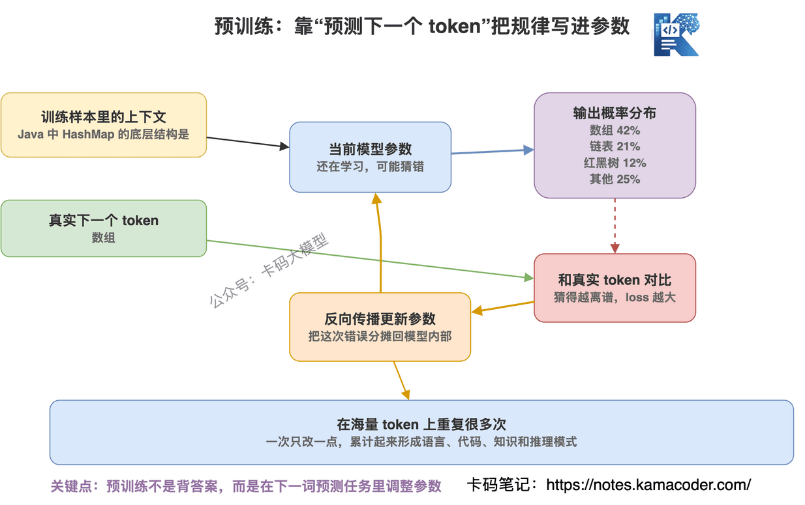
 

## `# 模型参数到底是什么？ 

讲到“更新模型参数”，很多录友又会懵。 

大模型动不动几百亿参数、几千亿参数。 

这个“参数”到底是啥？ 

先说人话版： 

**模型参数就是神经网络里一大堆可以被训练调整的数字。** 

它不是我们写代码时手动配置的参数，比如 `temperature=0.7`、`max_tokens=2048`。 

那种叫调用参数或者超参数。 

大模型里的参数，是模型内部的权重。 

你可以把它理解成无数个小旋钮。 

每个旋钮都是一个数字。 

训练之前，这些旋钮基本是随机初始化的，模型当然也就不会回答问题。 

预训练时，模型不断做预测： 

“基于前面的 token，下一个 token 应该是什么？” 

预测错了，就算 loss。 

loss 会告诉模型：你这次错得有多离谱。 

然后反向传播会把错误信号传回模型内部，把这些数字一点点调到更合适的位置。 

这个过程重复很多很多次。 

最后，模型参数里就压缩了大量语言规律、代码模式、事实关联和推理模板。 

注意，参数不是一条条知识。 

不是说第 9527 个参数存着“Redis 为什么快”。 

也不是说第 10086 个参数存着“HashMap 底层结构”。 

真实情况更像是： 

**大量参数共同形成一种高维空间里的规律。** 

当你问 Redis 为什么快，输入 token 会经过一层层参数矩阵计算，最后变成下一个 token 的概率分布。 

所以参数不是数据库字段。 

参数更像是模型的“神经连接强度”。 

连接强度不同，模型对同一段输入的判断就不同。 

这也是为什么预训练这么重要： 

**预训练的本质，就是用海量 token 反复调模型参数。** 

训练前，参数是一堆不会说话的数字。 

训练后，这堆数字就能把输入上下文映射成合理的输出概率。 

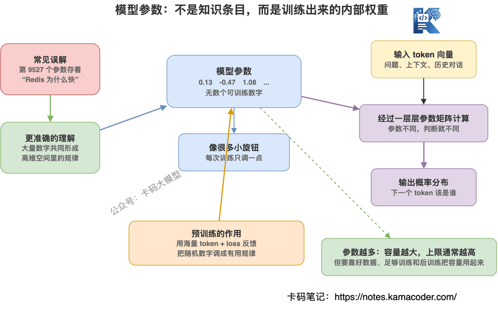
 

## `# 为什么参数越大，通常越强？ 

既然参数是一堆可训练的数字，那参数越多是不是越好？ 

大方向上，是的。 

参数越多，模型的表达能力通常越强。 

你可以粗暴理解成： 

**参数越多，模型内部可调的旋钮越多，能表示的规律就越复杂。** 

小模型参数少，就像一个容量很小的压缩包。 

它也能学东西，但能装下的模式有限。 

大模型参数多，就像容量更大的压缩包。 

它有机会学到更多语言风格、知识关联、代码模式、推理路径和任务格式。 

所以同等训练质量下，大模型通常更容易表现出更强的能力。 

但录友千万别理解成： 

**参数越大，一定越好。** 

这也太简单了。 

参数大，只是给了模型更大的容量。 

容量能不能用好，还要看： 
  - 数据质量好不好   - 数据配比合不合理   - 训练 token 够不够   - 算力和训练稳定性够不够   - 模型架构是否合适   - 后训练和对齐做得怎么样 

如果数据很脏，参数再大，也可能学一堆垃圾规律。 

如果训练 token 不够，大模型也可能没训透。 

如果后训练没做好，模型可能会续写，但不一定会好好回答问题。 

所以更准确的说法是： 

**参数越大，模型上限通常越高，但能不能达到这个上限，要靠预训练和后训练把参数调出来。** 

参数、预训练、能力三者的关系，可以这样理解： 

参数规模决定模型容量。 

预训练负责把容量填满、调准。 

后训练负责把能力变成用户更好用的回答方式。 

还有一个现实问题： 

参数越大，推理成本也越高。 

显存更贵，延迟更高，部署更难。 

所以工程上不是永远追最大模型，而是选“够用且划算”的模型。 

这也是为什么有些场景会做蒸馏、量化、小模型部署。 

## `# 为什么预测下一个 token，能学出这么多能力？ 

这里是很多录友最难理解的地方。 

“预测下一个 token”听起来像文字接龙，怎么会变成智能？ 

我们换个角度。 

如果模型要准确预测这句话后面应该接什么： 

“MySQL 的 B+ 树索引适合范围查询，是因为” 

它就不能只背几个字。 

它必须学到： 
  - MySQL 是数据库   - B+ 树是一种索引结构   - 范围查询和叶子节点链表有关   - 索引查询和磁盘 IO 有关   - 面试回答通常要按原因分点讲 

再比如它要预测代码： 

`for (int i = 0; i < nums.length; i++)` 

它要学到循环结构、变量作用域、数组访问、边界条件。 

所以表面看是在预测 token，实际上是在逼模型学习： 

语言怎么组织。 

代码怎么写。 

知识怎么关联。 

问题怎么回答。 

推理过程通常怎么展开。 

**预训练不是把知识一条条存进数据库，而是把大量文本中的统计规律压缩进模型参数。** 

这也是为什么大模型有时候很厉害，有时候又很离谱。 

它不是查表。 

它是在概率空间里生成最可能的后续内容。 

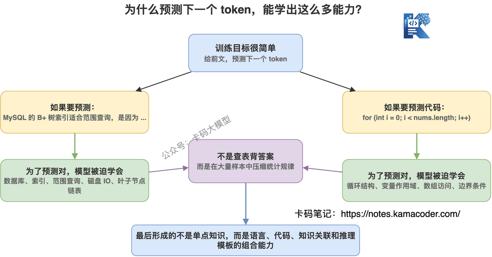
 

## `# 预训练完的模型，还不是 ChatGPT 

预训练完的模型，一般叫 Base Model。 

Base Model 很强，但它不一定好用。 

为什么？ 

因为它学会的是“续写文本”，不是“听人话办事”。 

你问它： 

“请解释一下 Redis 为什么快。” 

Base Model 可能会继续续写一段文章，可能会补一个问答样本，可能会编一段论坛帖子，甚至可能反问你。 

它不一定知道自己应该扮演一个助手。 

所以预训练之后，还要做后训练。 

后训练的第一步，通常是 SFT。 

SFT，全称 Supervised Fine-Tuning，监督微调。 

你可以理解成： 

**给模型看大量“用户问题 -> 优质回答”的样本，让它学会按指令回答。** 

比如训练数据长这样： 

用户：HashMap 为什么线程不安全？ 

助手：HashMap 在多线程场景下可能发生数据覆盖、链表环、扩容异常等问题…… 

模型通过这些样本学到： 
  - 用户问问题时，我要回答问题   - 回答要有结构   - 不要乱续写   - 不要把问题也接着写下去   - 编程问题要先讲结论，再讲原因，再讲场景 

这一步之后，模型才开始像一个聊天助手。 

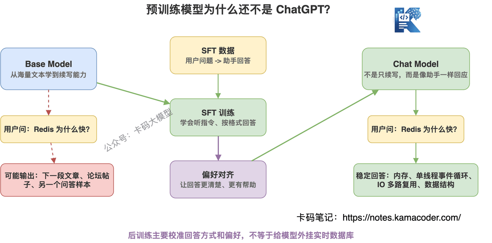
 

## `# SFT 解决的是“会不会按格式回答”，不是万能药 

很多录友一听微调，就觉得什么问题都能靠微调解决。 

太简单了。 

SFT 确实很重要，但它不是万能药。 

SFT 主要解决的是： 
  - 模型会不会听指令   - 回答风格是否稳定   - 某些任务格式是否固定   - 某个领域的表达方式是否更贴合   - 工具调用、JSON 输出、分类抽取是否更规范 

但 SFT 不适合解决所有问题。 

比如你的公司知识库每天都在更新，今天新增了几十份产品文档。 

你不可能每天拿这些文档去重新微调一次模型。 

这种问题更适合 RAG。 

再比如模型算账不准、数据库状态不知道、订单实时状态不知道。 

这不是单纯 SFT 能解决的。 

要接工具，要查数据库，要做检索。 

所以录友要记住： 

**微调是改变模型行为，不是给模型外挂一个实时数据库。** 

## `# RLHF / DPO：让模型更符合人类偏好 

SFT 之后，模型已经会回答问题了。 

但“会回答”和“回答得让人满意”，中间还有距离。 

比如同一个问题，模型可能有几种回答： 

A：很短，但没讲透。 

B：讲得很全，但废话太多。 

C：有结构，有重点，也没有乱编。 

人类通常更喜欢 C。 

这时候就需要偏好对齐。 

RLHF（Reinforcement Learning from Human Feedback，基于人类反馈的强化学习是一种机器学习技术） 和 DPO （Direct Preference Optimization， 直接偏好优化）都是在做类似的事： 

**让模型更倾向于输出人类更喜欢的答案。** 

RLHF 的经典流程是： 

先让模型对同一个问题生成多个回答。 

然后让人类标注员比较哪个回答更好。 

再训练一个奖励模型，学习人类偏好。 

最后用强化学习方法，让模型往高奖励方向调整。 

DPO 则更直接一些，可以用“好回答 / 坏回答”成对数据来优化模型，不一定要单独训练奖励模型。 

这里录友不用陷入公式。 

你只要理解本质： 

**偏好对齐不是让模型突然懂了新知识，而是让模型更像一个靠谱助手。** 

比如更有帮助、更少胡说、更少攻击性、更愿意承认不确定、更符合安全边界。 

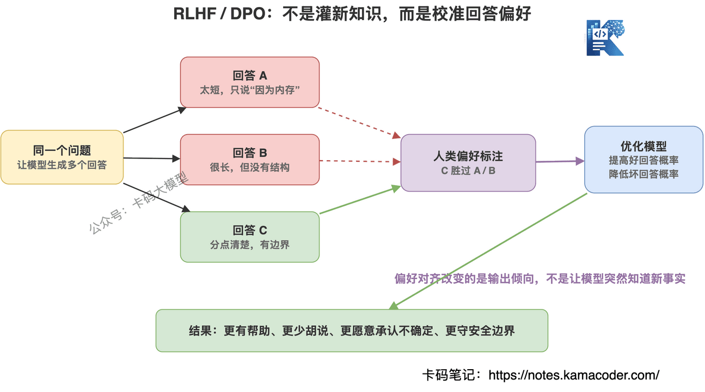
 

## `# 推理阶段：模型不是一次性想好整篇答案 

训练讲完了，再看推理。 

推理就是模型上线后，用户输入问题，模型生成答案的过程。 

很多人以为模型看到 prompt 后，会先在内部想好完整答案，然后一次性输出。 

不是。 

大模型生成答案，通常是一个 token 一个 token 往外吐。 

流程大概是： 
  - 用户输入 prompt   - prompt 被 tokenizer 切成 token   - 模型根据上下文计算下一个 token 的概率分布   - 按照策略选出一个 token   - 把这个 token 拼回上下文   - 继续预测下一个 token   - 直到遇到停止条件 

所以你看到模型流式输出，本质上就是这个过程。 

它不是一口气写完答案。 

它是在不断做： 

“基于目前已经出现的内容，下一个 token 最可能是什么？” 

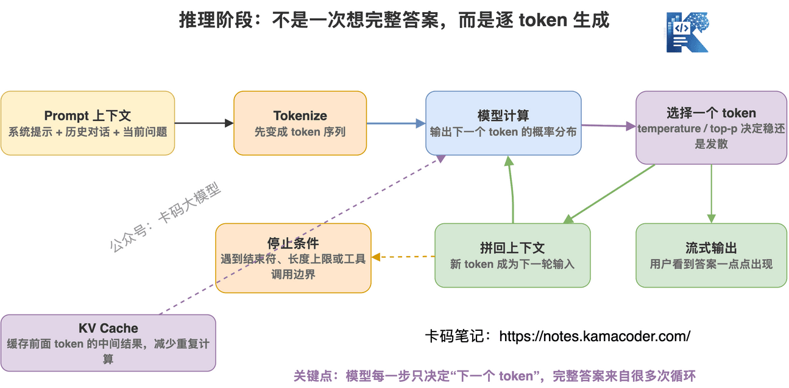
 

## `# 那第一个输出 token 是怎么来的？ 

这里很多录友会有一个疑惑： 

如果已经有一句话了，模型继续预测下一个 token，这个我能理解。 

但用户刚问一个问题时，模型回答的第一个词是怎么来的？ 

比如我问： 

“Redis 为什么快？” 

模型怎么知道回答第一个 token 应该是“Redis”，还是“因为”，还是“主要”？ 

这个问题问得非常关键。 

答案是： 

**模型不是凭空预测第一个输出 token，而是基于用户输入的 prompt 来预测第一个输出 token。** 

你问： 

“Redis 为什么快？” 

模型看到的不是空白，而是一串 token： 

```
[Redis] [为什么] [快] [?]

```

 

所以第一步不是“从零开始写答案”，而是： 

**基于“Redis 为什么快？”这个上下文，预测回答的第一个 token。** 

它会给很多候选 token 算概率。 

比如可能是： 

```
Redis：30%
它：22%
主要：18%
因为：12%
首先：8%
其他：...

```

 

如果采样策略选中了“Redis”，上下文就变成： 

```
Redis 为什么快？ Redis

```

 

接下来模型再预测第二个输出 token。 

比如第二个 token 可能是“之所以”： 

```
Redis 为什么快？ Redis 之所以

```

 

再继续预测第三个 token。 

所以不是“先有一句完整回答，再往下预测”。 

而是： 

**用户的问题本身，就是模型预测第一个输出 token 的上下文。** 

如果是 ChatGPT 这种对话模型，它看到的上下文还不止用户问题，通常还包括： 
  - 系统提示词   - 历史对话   - 当前用户问题   - 工具返回结果   - RAG 检索出来的资料 

这些内容都会被拼成一整段 token 序列。 

模型基于这整段上下文，预测第一个输出 token。 

第一个 token 出来后，再拼回上下文，预测第二个 token。 

第二个 token 出来后，再拼回上下文，预测第三个 token。 

一直循环下去。 

如果真的什么都不给模型，让它从空白开始生成，它也能生成。 

但那就像让它随机续写互联网文本的开头，可能是文章标题，可能是代码，可能是故事，也可能是一段网页内容。 

方向会非常不稳定。 

所以录友记住一句话： 

**大模型不是从空白里猜第一个词，而是根据 prompt 预测回答的第一个 token。** 

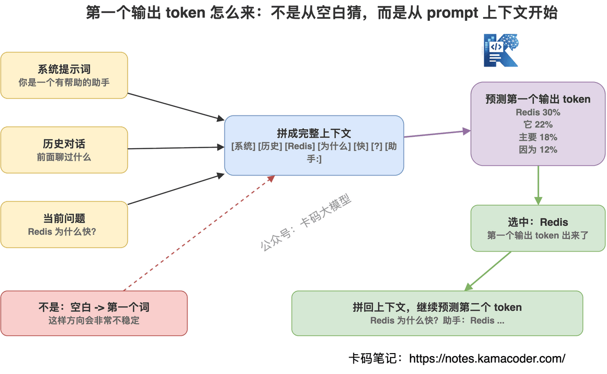
 

## `# 模型怎么知道要围绕问题回答？ 

继续追问下去，录友还会有一个更细的问题： 

既然大模型只是根据已有 token 预测下一个 token，那它怎么知道自己是在“回答问题”？ 

用户问： 

“Redis 为什么快？” 

模型为什么不是随便续写一段网页内容，而是围绕 Redis 的内存、IO 多路复用、单线程事件循环去回答？ 

这个问题要分两层看。 

**第一层：模型在训练阶段学过“问题后面通常应该接回答”。** 

预训练时，模型看过大量网页、论坛、问答、教程、代码注释、文档。 

这些数据里天然有很多结构： 

```
问题：Redis 为什么快？
回答：Redis 快主要有几个原因……

```

 

或者： 

```
面试官：HashMap 为什么线程不安全？
候选人：主要原因是……

```

 

模型在预训练里，不只是学词语搭配，也在学这种文本结构： 

**一个问题出现后，后面通常会出现解释、原因、步骤、结论。** 

所以预训练已经让模型具备了“问题 -> 回答”的基础模式。 

但这还不够。 

因为 Base Model 学的是互联网文本的续写模式，它可能会续写成文章，续写成论坛帖子，续写成另一个问题。 

它不一定稳定地按助手方式回答。 

**第二层：SFT 把这种模式校准成“用户提问 -> 助手回答”。** 

SFT 会给模型大量明确的样本： 

```
用户：Redis 为什么快？
助手：Redis 快主要有以下几个原因……

```

 

这种样本会反复告诉模型： 

看到“用户问题”之后，不要乱续写网页，不要接着编问题，而是生成“助手回答”。 

也就是说： 

**模型会围绕问题回答，主要是在 SFT 阶段被训练出来的。** 

再往后，RLHF / DPO 会继续做偏好校准。 

比如同样问 Redis 为什么快，模型可能有几种回答： 
  - 只回答“因为基于内存”，太浅   - 讲了一堆但没有结构，读起来累   - 分点讲内存、IO 多路复用、单线程、数据结构，还提醒持久化和网络不是重点 

人类更喜欢第三种。 

偏好对齐就会让模型更倾向这种回答。 

所以，对齐阶段解决的不是“模型是否知道要回答问题”这个基础动作，而是： 

**回答得是不是更有帮助、更清楚、更安全、更符合人类偏好。** 

那推理阶段做什么？ 

推理阶段不是重新教模型怎么回答。 

推理阶段是把当前 prompt 喂给已经训练好的模型，让它根据当前上下文生成下一个 token。 

比如当前上下文是： 

```
系统：你是一个有帮助的助手
用户：Redis 为什么快？
助手：

```

 

模型在训练中已经见过大量类似结构，所以它会判断： 

“助手：”后面最合理的下一个 token，大概率应该是围绕 Redis 的解释。 

于是第一个 token 可能是： 

```
Redis

```

 

接下来上下文变成： 

```
系统：你是一个有帮助的助手
用户：Redis 为什么快？
助手：Redis

```

 

模型继续预测下一个 token，可能是“快”，再下一个可能是“主要”，再下一个可能是“有”。 

一步步生成： 

```
Redis 快主要有几个原因……

```

 

所以答案是： 

**“知道如何回答问题”这件事，是在预训练、SFT、对齐阶段学出来的；“针对当前这个问题输出具体回答”，是在推理阶段逐 token 生成出来的。** 

更准确地拆一下： 
  - 预训练：学语言、知识和“问题后面接解释”的通用模式   - SFT：学“用户提问后，助手应该认真回答”的指令格式   - RLHF / DPO：学什么样的回答更受人类喜欢   - 推理：把当前用户问题作为上下文，按已经学到的模式生成答案 

这几个步骤不是互相替代，而是接力关系。 

没有预训练，模型没有基础能力。 

没有 SFT，模型可能会续写，但不一定像助手。 

没有对齐，模型可能能回答，但不一定好用。 

没有推理，训练好的能力也不会变成当前这次对话里的具体答案。 

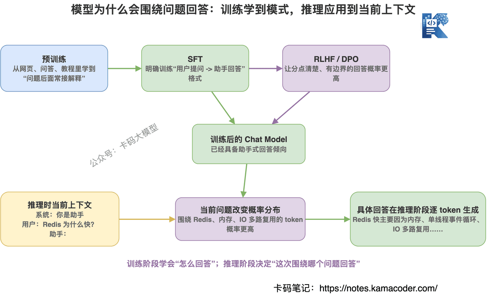
 

## `# temperature、top-p 到底控制什么？ 

既然模型每一步都会算出一堆候选 token 的概率，那就有一个问题： 

下一个 token 到底选谁？ 

如果永远选概率最高的那个，回答会更稳定，但也可能更死板。 

如果允许从多个高概率候选里采样，回答会更丰富，但也更容易发散。 

这就是 temperature、top-p 这些参数的作用。 

**temperature 越低，模型越保守。** 

适合代码、分类、结构化输出、严肃问答。 

**temperature 越高，模型越发散。** 

适合创意写作、头脑风暴、广告文案。 

top-p 则是限制采样范围。 

比如 top-p = 0.9，意思是只在累计概率达到 90% 的候选 token 里挑。 

录友别把这些参数想神秘了。 

它们本质上是在控制： 

**模型生成时，到底是更稳，还是更放开。** 

## `# 上下文窗口和 KV Cache，又是什么？ 

推理阶段还有两个常见概念：上下文窗口和 KV Cache。 

上下文窗口，就是模型一次能看的 token 数量。 

你发给模型的系统提示词、用户问题、历史对话、检索出来的文档、已经生成的答案，都要占上下文。 

上下文窗口不是无限的。 

如果塞太多内容，超出窗口，模型就看不到前面的东西。 

这也是为什么长文档问答要做切分、检索、压缩，而不是把所有材料一股脑塞进去。 

KV Cache 则是推理加速的关键。 

模型生成第 100 个 token 时，前 99 个 token 的很多中间计算结果可以缓存下来，不用每次都从头算。 

所以 KV Cache 能显著降低重复计算，提高生成速度。 

但它也会占显存。 

并发越高、上下文越长、生成越长，KV Cache 压力越大。 

这就是为什么大模型部署不仅是“把模型跑起来”，还要考虑显存、吞吐、延迟和并发。 

## `# 为什么大模型会幻觉？ 

讲到这里，录友就能理解幻觉了。 

**大模型的原始目标，不是保证每句话都真实，而是生成最可能的下一个 token。** 

这句话非常关键。 

模型在训练里学到的是语言和知识的统计规律。 

当它不知道答案时，它不一定会像数据库一样返回 null。 

它可能会生成一段“看起来很像正确答案”的内容。 

这就是幻觉。 

为什么幻觉常常很有迷惑性？ 

因为大模型非常擅长语言形式。 

它知道一个正式回答应该长什么样。 

它知道论文引用应该长什么样。 

它知道技术解释应该怎么分点。 

所以即使内容是错的，也可能说得很顺。 

这就是大模型最危险的地方： 

**它不一定知道自己不知道。** 

要减少幻觉，不能只靠一句“请不要胡说”。 

更靠谱的方式是： 
  - 用 RAG 给它提供可靠资料   - 让它调用工具查实时数据   - 做引用来源校验   - 做结构化输出约束   - 做自动评测和人工抽检   - 对高风险场景设置拒答边界 

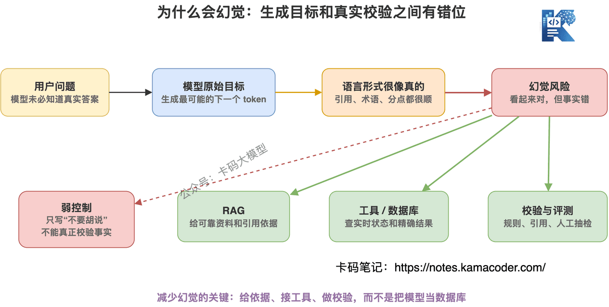
 

## `# 训练大模型和做大模型应用，是两回事 

这里也顺便帮录友厘清一个岗位问题。 

训练大模型，主要是算法岗、训练岗、基础模型团队做的事。 

他们关注： 
  - 数据配比   - 模型架构   - 训练稳定性   - 分布式训练   - loss 曲线   - 对齐算法   - benchmark   - 模型权重 

大模型应用开发，更多是用模型做系统。 

他们关注： 
  - Prompt   - RAG   - Agent   - 工具调用   - API 接入   - 成本控制   - 延迟优化   - 业务效果   - 安全兜底 

两者有交集，但不是一回事。 

应用开发者不一定要亲手训练一个千亿参数模型。 

但你一定要理解训练和推理的基本逻辑。 

因为你只有知道模型是怎么来的，才知道它能做什么、不能做什么。 

你才不会动不动说“这个问题微调一下就行”。 

你也不会把模型当成绝对正确的数据库。 

## `# 最后 

理解大模型的原理，你就抓住一条主线： 

**训练阶段，把海量文本里的规律压进参数；推理阶段，根据当前 prompt 一个 token 一个 token 往外生成。** 

这句话理解了，很多概念就顺了。 

为什么要预训练？ 

因为模型一开始什么都不会，参数就是一堆没调好的数字。 

为什么要 SFT？ 

因为 Base Model 只会续写，不一定知道自己要当助手。 

为什么要 RLHF、DPO？ 

因为会回答不代表答得好，模型还得学人类喜欢什么样的答案。 

为什么会幻觉？ 

因为它本质上是在生成最可能的 token，不是在查数据库。 

为什么 RAG、工具调用、评测这么重要？ 

因为真实业务不能靠“看起来像对的”上线。 

录友做大模型应用开发，不一定要亲手训练一个千亿参数模型。 

但你必须知道模型是怎么来的。 

不然很容易犯两个低级错误： 

一个是把模型当神，觉得什么问题都能问它。 

另一个是把模型当普通接口，觉得调一下参数就能稳定解决业务问题。 

都不对。 

大模型应用开发真正难的地方，不是把 API 调通。 

而是你要知道： 

**什么该交给模型，什么该交给检索，什么该交给工具，什么必须做校验。** 

这篇看懂了，再去学 RAG、Agent、微调、部署，就不是背概念了。
