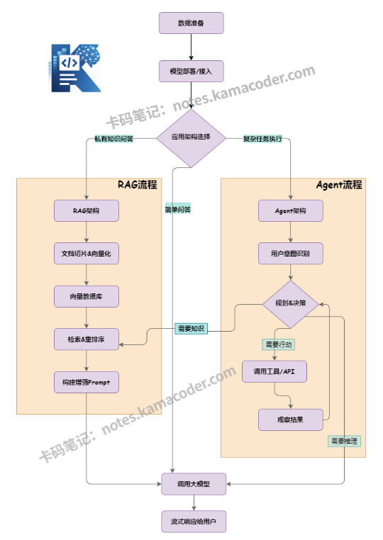

# 大模型应用开发到底在做什么：和算法岗区别、日常关注什么、核心模块

> 来源: https://notes.kamacoder.com/llm/intro/app_dev_overview.html

# `# 大模型应用开发到底在做什么：和算法岗区别、日常关注什么、核心模块 

## `# 一、大模型应用开发是什么？ 

很多初学者有一个误区：认为大模型开发岗位是为那些高学历、强科研能力的同学设立的，要用“强大的数学算法能力”去训练、微调模型。联想到自己的大学数学“三件套”：微积分、线性代数、概率论早都忘光了，连最基础的神经网络反向传播的原理用到的偏导、梯度下降都看不懂，还怎么拥抱变革？ 

**错**。那是高级算法岗的事。 

**大模型“应用”开发**（LLM Application Development），本质上是利用已经被“调教”好的、现成的大模型能力，加之自己公司的业务逻辑、私有数据和外部工具，构建解决实际问题的软件系统，是人人都能掌握的新时代技术核心竞争力，而不是需要你去科研模型的底层细节。  

## `# 二、和算法岗/训练岗有什么区别？ 

这是转型者需要厘清的定位（仅供参考，分工会有部分重合）。 

| 维度  **算法/训练岗**(Algorithm/Training)  **应用开发岗**(Application Dev) 
| **核心目标**  提升模型的**底层能力**（更聪明、更通用）  提升**业务落地效果**（更准确、更稳定、更便宜） 
| **日常工作**  数据清洗、预训练、SFT 微调、RLHF、评估基准测试  Prompt 工程、RAG 链路搭建、Agent 编排、API 集成、系统部署 
| **主要工具**  PyTorch, DeepSpeed, CUDA, HuggingFace Transformers  Python/Java/Go, LangChain/LlamaIndex, Vector DB, Docker 
| **关注指标**  Perplexity, Accuracy, Loss, Benchmark Score  **首字延迟** (TTFT), **Token 成本**, **召回率**, **用户满意度** 
| **数学要求**  极高（线性代数、概率论、优化理论）  中等（理解概率、向量等概念与运用即可） 
| **代码风格**  实验性脚本为主，重科研复现  工程化代码为主，重高并发、高可用、可维护 
| **典型产出**  一个新的模型权重文件 (.bin/.safetensors)  一个可运行的 SaaS 服务、API 接口或内部系统 

如果说算法岗是研究更快更猛的发动机，那么应用岗则是负责汽车硬部件的组装（各组件的连接）和软功能的开发（RAG、Agent）。  

## `# 三、应用开发者日常更关注什么？ 

对于普通程序员来说，转向大模型应用开发意味着工作重心的范式转移：从传统的“代码逻辑实现”转向“模型能力驾驭与业务落地”，不再过分钻研“古法编程”的细节，而是要提高自身对业务流程的理解，关注模型交互的效果，开发稳定安全的产品。 

**深入理解业务（行业Know-How）**：不再仅仅是实现一个功能，而是要深刻理解业务场景、行业术语、用户痛点和商业目标。 
  - 

业务流程抽象建模，将复杂的业务逻辑拆解、抽象成AI可以理解和执行的标准化流程。这需要定义清楚AI在流程中扮演什么角色（如审核员、助手、创作者），需要执行哪些具体动作（如信息提取、内容生成、意图判断），输入数据和期望的输出结果；明确AI在哪个环节介入。   - 

模型交互与效果调优，提示词工程 (Prompt Engineering)，模型调用与集成，数据处理与知识库构建，效果评估与优化   - 

工程落地和风险控制，系统集成与部署，测试与监控，安全与合规审查  

## `# 四、为什么部署、调用、RAG、Agent 会成为核心模块？ 

这四个模块共同构成了一个完整、可落地的企业级AI应用闭环，解决了大模型从“能聊天”到“能干活”的最后一公里问题。 

RAG (检索增强生成)：公共大模型不知道你们公司的私有数据。直接问它，它就会一本正经地胡说八道（幻觉）。RAG便是项目落地的核心技能之一，在RAG开发中，我们的工作量集中在一下几点：文档解析、文本切块、embedding嵌入向量数据库、检索query。 

Agent (智能体)：解决“执行”的问题，让模型从被动应答变为**主动规划和执行**。传统的大模型是“你问一句，它答一句”的被动工具。而 **Agent (智能体)** 则能主动思考、规划并执行复杂任务 

调用 (工具)：光有“大脑”（LLM）和“知识”（RAG）还不够，AI要真正解决问题，必须能对外部世界产生影响。通过定义好的工具（如API、函数），模型可以调用这些外部能力来执行具体操作。 

部署：前面三者定义了应用的功能，而**部署**则是让这些功能从代码变成稳定、可用的服务。 

  

## `# 五、初学者的一些小Tips 
  - 对AI发展保持持续兴趣，多尝试各家厂商的大模型，其实往往能发现某某厂的某模型在文本输出方面效果更好，另一个厂的某模型在代码能力更强等。这有利于你在做agent开发编排时的模型选择。   - 不以参数大小作为评判模型性能的唯一标准：应用开发的核心不是谁用的模型参数量大，而是谁能用**合适的模型**解决**具体的业务问题**。有时候，一个经过精心 Prompt 优化的 7B 小模型，效果远好于裸奔的 70B 大模型。   - 积极加入“AI coding进化派”：cursor、Claude Code这样新时代编码方式已成主流，传统后端技能依然值钱，但门槛在逐步变低，纯“古法编程”已不可取。有的时候，一个好的“提示词”带来的效率上的提升远超人工编码。   - 拥抱“不确定性”：传统程序是确定性的（输入 A 必得输出 B），大模型是概率性的。学会设计评估体系（Eval）和风险管理。   - 动手做项目：不要只看教程。试着做一个“基于公司内部文档的智能客服”或“自动整理会议纪要的 Agent”，在踩坑中学习 RAG 的切分、向量的选型、Agent 的调试。
