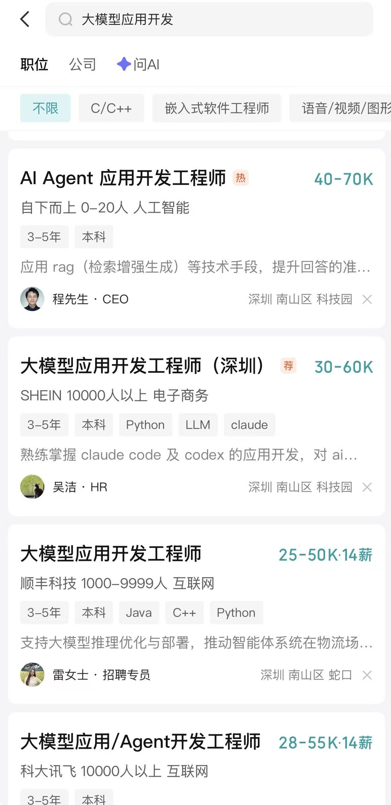
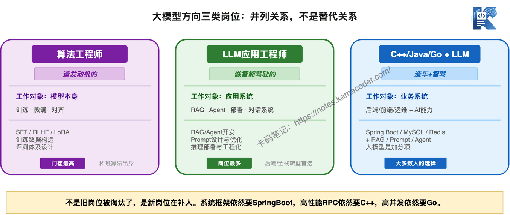

# 大模型应用开发岗、算法岗、C++/Java/Go开发岗到底什么区别？谁替代谁了吗？

> 来源: https://notes.kamacoder.com/llm/intro/application_development.html

# `# 大模型应用开发岗、算法岗、C++/Java/Go开发岗到底什么区别？谁替代谁了吗？ 

现在大模型很火,也有了一个岗位叫做：大模型应用开发岗。 

在boss上搜一下，现在 大模型应用开发 岗位很多，比普通开发岗位都多。下面我这还是仅仅深圳南山的结果： 

 

我自己也搞 卡码大模型应用开发训练营  (opens new window) 

很多录友报名的时候，搞不懂 大模型应用开发就是是个啥？ 

我列一下大家的困惑： 
  - 究竟什么是大模型应用开发岗位？开发啥？   - **大模型应用开发和我们之前熟悉的C++/Java/Go开发是什么关系**？   - **大模型应用开发 和 算法岗又是什么关系**？   - 现在ai这么厉害，是不是以后就只有 大模型应用开发，没有 C++/Java/Go开发了？？   - 大模型应用开发 只会python就行？ 不用会Java、C++、Go了？   - 现在找C++/Java/Go开发，都会要求会agent相关知识，这又是为啥？ 

以上问题，每一个问题都是直击灵魂的好问题。 

现在在ai技术的飞速迭代期，一些新岗位，一些新技术，会让大家感觉很乱。 

当然，就是什么是 大模型应用开发，这不是我定义的，全行业也没有标准定义。 

我就从我对整个行业的理解，来帮大家去分析他们之前的关系，尽量帮大家捋清楚思路。 

## `# 先说结论：三者是并列关系，不是替代关系 

**大模型应用开发不会替代 C++/Java/Go 开发，它是一个新岗位，和传统开发是并列的。** 

为什么大模型应用开发岗位看起来这么多？不是因为传统开发岗位没了，是因为这是一个**新物种**，行业在吸纳人员。 

业务框架依然要 SpringBoot，高性能 RPC 依然要 C++，高并发服务依然要用 Go。这些需求没有消失，只是这些岗位已经发展了很多年，人员已经够用了。 

而大模型应用开发是这两年才冒出来的，自然需要大量招人。 

**不是旧岗位被淘汰了，是新岗位在补人。** 

我再给大家举一个例子，算法岗是早汽车发动机，大模型应用开发是做智能驾驶的，而C++/Go/Java开发是造车的。 

不是说，有了智驾，车都不用造了，框架构架，通信协议，业务逻辑 要有开发来做。 

而C++/Go/Java开发 + LLM，就是现在造车的，最好也要懂点智驾，这么比喻够形象了吧。 

 

## `# 大模型方向，实际就两类新岗位 

别被各种岗位名称搞混了。大模型方向的岗位，本质上就两类： 

**算法工程师**：改模型的。训练、微调、对齐，你的工作对象是模型本身。 

**LLM应用工程师**：用模型的。RAG、Agent、对话系统，模型是你用的组件，你的工作对象是应用系统。 

但还有一类，是大多数人的实际情况——**传统开发岗位 + LLM能力**。 

你的本职还是Java后端、C++开发、Go开发，只是现在这些岗位越来越希望你懂大模型。 

下面逐个讲清楚。 

## `# 算法工程师：改模型的人 

这个方向门槛最高，不是科班算法出身很难硬挤。 

核心工作是：模型训练、微调、对齐。你直接对模型能力负责。 

**大模型应用开发也需要懂微调，但程度完全不同**——算法工程师是要亲手训练模型、调超参、构造训练数据；大模型应用开发是理解微调能解决什么、不能解决什么，做技术选型判断就行。 

## `# LLM应用工程师：用模型的人 

**这是目前岗位最多、也是最适合后端/全栈转型的方向。** 

核心工作是：基于大模型的能力，构建应用系统。RAG、Agent、对话系统，这些都是你的主战场。 

你不需要训练模型，不需要推导公式，你需要的是**工程化能力**——把大模型的能力稳定地跑在生产环境里。 

具体做什么？举几个实际的例子： 
  - **RAG系统**：企业知识库问答，用户提问→检索文档→组装Prompt→调用模型→返回答案。你得设计检索策略、处理幻觉、优化延迟   - **Agent系统**：让大模型自主调用工具完成任务，比如工单处理、数据分析。你得设计工具、处理多步推理的稳定性、防止死循环   - **对话系统**：智能客服、销售助手。你得处理上下文管理、意图识别、多轮对话   - **部署与优化**：vLLM部署、KV Cache优化、推理成本控制。跑个Demo谁都会，上线扛住并发 

**LLM应用工程师也需要懂微调**，不是亲手训，是要理解：什么时候该用RAG、什么时候该微调？微调能解决什么问题、不能解决什么？SFT和RLHF分别适合什么场景？这些选型判断能力，面试必问。 

## `# C++/Java/Go + LLM：大多数人的选择 

**这是大多数人最该关注、但最容易忽略的方向。** 

什么意思？你的本职还是Java后端开发、C++开发、Go开发，岗位JD上写的也是这些。但现在越来越多的公司，在这些传统岗位的JD里加了一行："有大模型相关经验优先"。 

为什么会这样？ 

还是因为 大模型应用开发这是一个**新物种**，行业在吸纳人员，很多公司部门找 Java/C++/Go开发进来做大模型应用开发。 

同时他们也会找针对自己业务部门系统开发，也就是 Java/C++/Go开发。 

那么究竟 Java/C++/Go开发 + LLM，究竟投 Java/C++/Go开发，还是 大模型应用开发，这个没有明确量化。 

这个岗位，这个行业也才刚刚开始。很多部门的招聘人员甚至面试官自己都没搞明白，这两个岗位的区别。 

一般来说，C++/Java/Go + LLM 这种情况下，**大模型不是你的主业，是你的差异化竞争力。** 

简历怎么写？技能栏里，你原有的技术栈（Spring Boot、MySQL、Redis）还是主力，大模型相关的技能放后面两三条就行，别喧宾夺主。 

举个例子，投Java后端开发： 
> 
  - 熟悉Java后端开发，有Spring Boot/MyBatis项目经验   - 熟悉MySQL、Redis，有分库分表与缓存优化经验   - 熟悉RAG工程化落地，实践过向量检索与Prompt优化   - 了解大模型微调流程（SFT/LoRA），理解微调与RAG的选型边界
 

前两条是你的基本盘，后两条是加分项。面试官看到就知道：这个人后端扎实，还懂大模型，加分。 

**最常见的坑**：为了突出大模型能力，把传统技能栏缩水了。面试官招的是Java开发，你技能栏一半在写RAG和Agent，他会觉得你方向不明确。 

## `# 回答开头的6个问题 

**1、什么是大模型应用开发？开发啥？** 

用大模型的能力构建应用系统。RAG知识库、Agent工具调用、智能客服、对话系统——这些都是大模型应用开发的范畴。核心不是训练模型，是把模型的能力稳定地跑在业务系统里。 

他也是开发，你可以理解和 Java/C++/Go一样的开发。 

**2、大模型应用开发和C++/Java/Go开发是什么关系？** 

并列关系，不是替代关系。大模型应用开发是一个新岗位，C++/Java/Go开发岗位还在，只是人员已经够用了，显得大模型岗位多。系统框架依然要SpringBoot，高性能RPC依然要C++，高并发依然要Go。 

**3、大模型应用开发和算法岗是什么关系？** 

工作对象不同。算法岗改模型（训练、微调、对齐），应用岗用模型（RAG、Agent、部署）。两者都需要懂微调、懂Transformer，但深度和目的完全不同——算法岗是为了动手训练，应用岗是为了做选型判断。 

**4、是不是以后只有大模型应用开发，没有C++/Java/Go开发了？** 

不是。后端服务、高性能计算、分布式系统这些需求不会消失，大模型自己都跑在这些基础设施上。大模型应用开发是新增的岗位，不是来替代传统开发的。 

**5、大模型应用开发只会Python就行？** 

大模型应用开发确实以Python为主，因为主流框架（LangChain、LlamaIndex、vLLM）都是Python生态。如果只做大模型应用开发相关的工作，Python确实够用。 

但实际情况是，**很多公司的大模型应用开发和C++/Java/Go开发并没有划分得那么清楚**。你做着RAG系统，后端接口还得写；你搭了Agent，部署上线还得搞。如果你只会Python，公司里其他系统都是Java，你连接口都对接不了，会有一定的限制。 

不是说Python天花板低，是**实际工作中很难只做大模型那部分，其他都不碰**。 

**6、为什么C++/Java/Go开发现在也要求会Agent？** 

因为越来越多的业务系统要接入大模型能力。你做Java后端，老板说"加个智能客服"，你得知道怎么接API、怎么做Prompt设计、什么是RAG。不是让你转行做大模型应用开发，是在原有岗位上多了个技能要求。 

搞清楚这6个问题，你就知道该投什么方向了，别再纠结了。 

## `# 最后 

我再给大家做一个总结吧。 

如果**你是更想"改模型"还是"用模型"？** 
  - 想**改模型**提升能力 → 算法工程师   - 想**用模型**做应用 → LLM应用工程师   - 想**继续做开发**但大模型是加分项 → 传统开发 + LLM能力 

**你是后端/全栈转型，没有算法背景？** 别硬投算法岗，LLM应用工程师才是你的主战场。你的工程经验是优势，不是劣势。 

**你不想换岗位，就想在现有方向上加分？** 传统开发 + LLM能力，大模型技能放技能栏后半段，两三条就够了。 

这一篇文章希望能帮大家彻底搞懂，什么是大模型应用开发，和目前各个岗位之间的关系。 

如果大家想冲大模型应用开发岗，或者自己是cpp/Java/Go开发，想+LLM加分，可以报名卡码大模型应用开发训练营  (opens new window)
