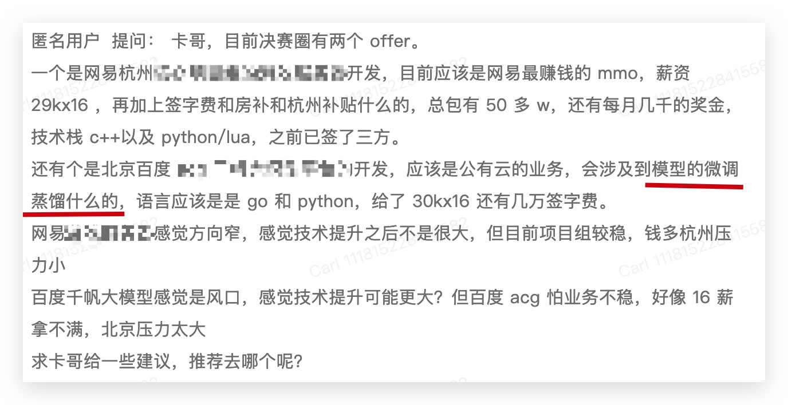
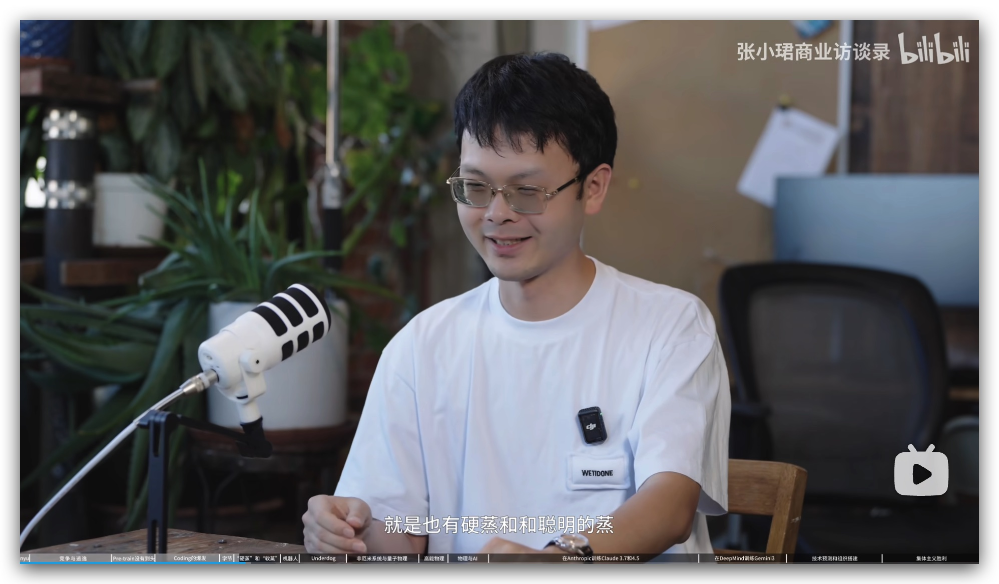
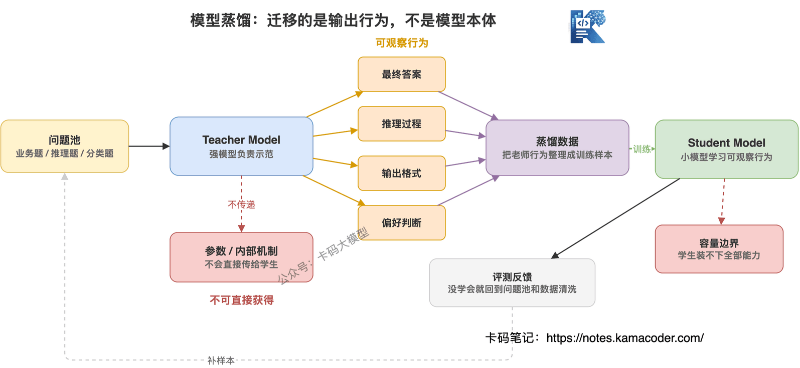
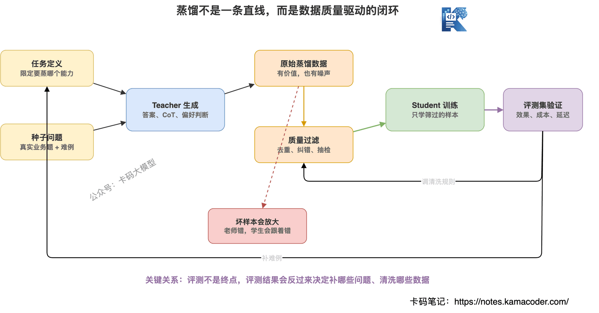
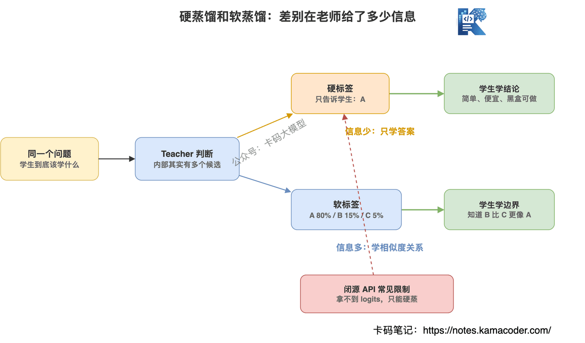
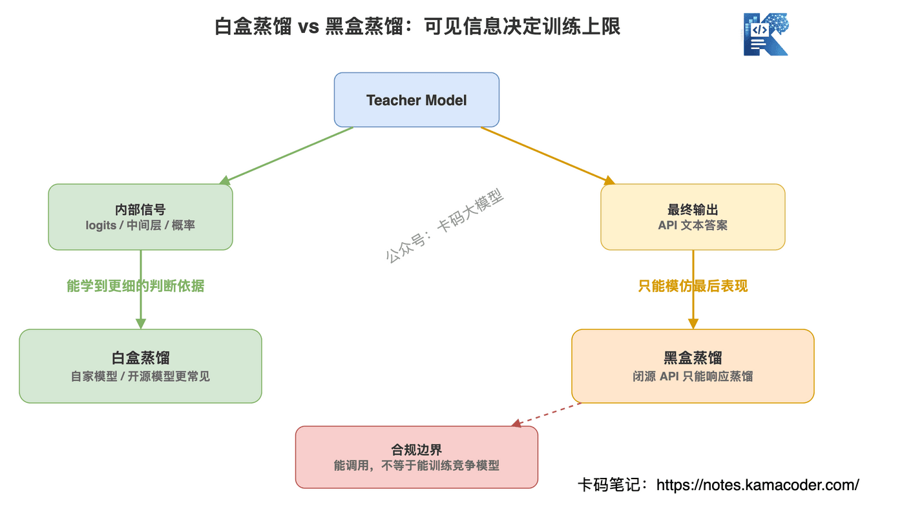
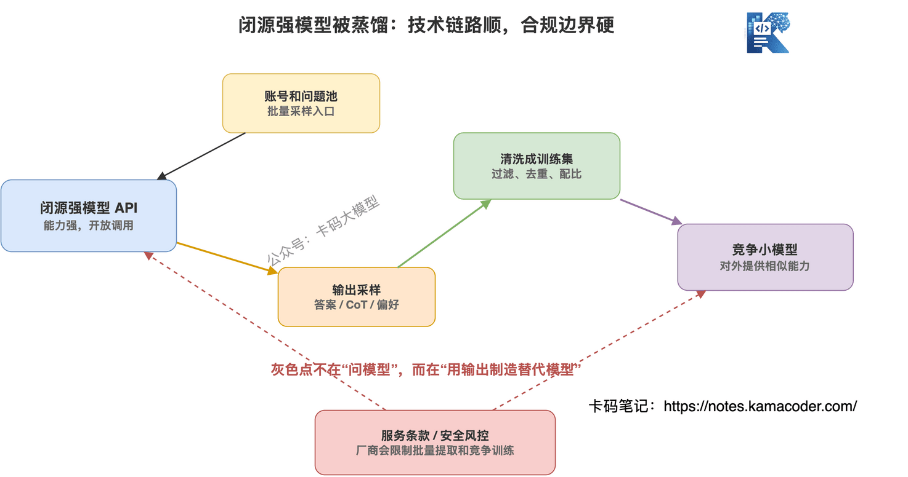
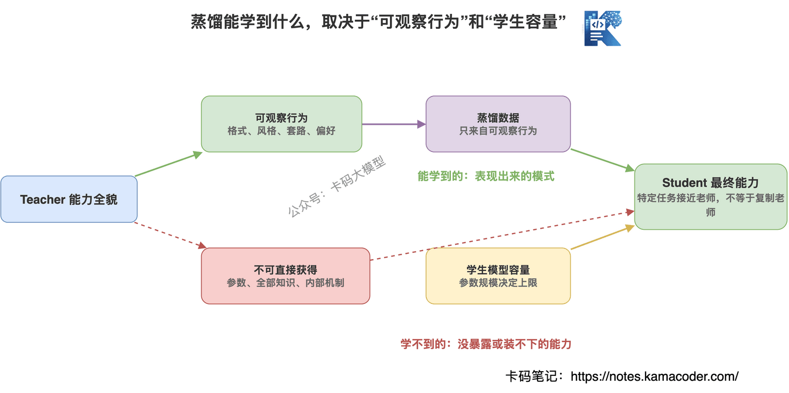
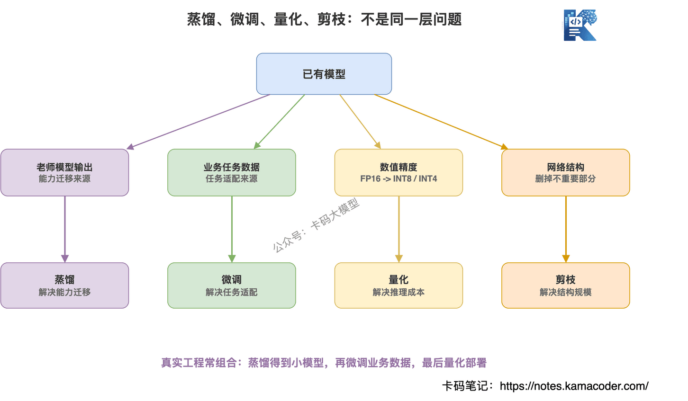
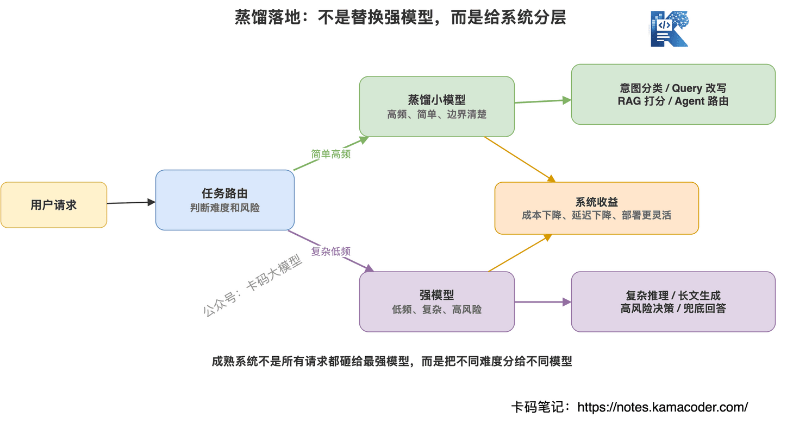

# 大模型蒸馏到底是什么？硬蒸、软蒸、蒸馏其他厂商模型，一篇讲明白

> 来源: https://notes.kamacoder.com/llm/intro/model_distillation.html

# `# 大模型蒸馏到底是什么？硬蒸、软蒸、蒸馏其他厂商模型，一篇讲明白 

在知识星球  (opens new window) 里有录友向我提问offer选择的问题： 


 

这里他在面百度千帆大模型开发的之后，就问过他蒸馏相关的问题。 

星球里不少录友看到这个提问，都来问我，卡哥讲讲什么是蒸馏，我也能和面试官扯几句。 

**模型蒸馏** 这个词现在很常见了。 

尤其是大模型圈子里，经常有人说： 

**某某模型是不是蒸馏出来的？** 

**某某公司是不是蒸馏了其他厂商的模型？** 

**听说现在大家都在互相蒸馏，谁家模型强，就去蒸谁家的？** 

如果**大家最近有有看过 姚顺宇 的采访视频，他其实也委婉点名了，一些公司是 硬蒸，一些公司是 聪明的蒸**（我这里就把它称为软蒸吧） 


 

一些录友其实还没搞明白：**蒸馏到底是个啥？** 

今天这篇，我就把模型蒸馏讲透。 

不搞论文腔，不上来推公式。我们先从最核心的一句话开始： 

**模型蒸馏不是复制别人的模型参数，而是让一个小模型学习大模型的输出行为。** 

大模型像老师，小模型像学生。 

老师不把脑子直接拆下来给学生，但学生可以通过老师的答案、解题过程、判断偏好，学会一套接近老师的答题方式。 

这就是蒸馏。 


 

## `# 蒸馏到底在蒸什么？ 

先说清楚一个误区。 

**蒸馏不是把大模型压缩一下，就变成小模型。** 

它不是把 1000 亿参数模型直接压成 70 亿参数模型。 

如果真能这么压，那大模型训练公司都不用烧钱了，大家直接点一下"压缩"按钮就行。 

真实的蒸馏，是这样一个过程： 
  - 准备一批问题   - 让强模型回答这些问题   - 把强模型的答案整理成训练数据   - 用这些数据训练一个小模型   - 看小模型有没有学到强模型的能力 

所以蒸馏学的不是参数，而是**行为**。 

比如老师模型面对一个问题，会怎么回答、怎么解释、怎么推理、怎么拒答、怎么判断哪个答案更好。 

学生模型通过大量样本去模仿这些行为。 

这就是知识蒸馏的核心。 


 

## `# 为什么要做蒸馏？ 

很简单：**大模型太贵、太慢、太重。** 

录友做大模型应用的时候，一定会遇到三个现实问题： 
  - 调一次强模型，成本不低   - 输出长一点，延迟就上来了   - 想私有化部署，机器成本顶不住 

但很多业务场景，其实不需要一个全能大模型。 

比如： 
  - 客服意图识别   - 文档分类   - Query 改写   - RAG 结果打分   - Agent 工具路由   - 简历字段抽取   - 内容安全审核 

这些任务不需要模型会写诗、会做数学竞赛、会分析哲学。 

它只要在某个小任务上稳定、便宜、速度快。 

这就是蒸馏的价值： 

**把强模型在某个具体任务上的能力，迁移到一个更便宜、更快、更好部署的小模型里。** 

大模型负责当老师，小模型负责上线干活。 

## `# 硬蒸和软蒸 

（这是我自己编的词，主要是我看了 采访硅谷姚顺宇（不是腾讯的那位）的视频，他说到了 硬蒸 和 聪明的蒸，那我这里就说“软蒸”吧） 

**硬蒸馏：只学最终答案。** 

比如一道选择题： 

问题：Redis 为什么快？ 

老师答案：因为内存存储、单线程事件循环、IO 多路复用、数据结构高效。 

学生模型只看到这个最终答案，然后学习怎么输出类似答案。 

这就是硬蒸。 

硬蒸的训练数据通常就是： 

```
问题 -> 老师最终回答

```

 

它简单、便宜、最常见。 

特别是黑盒 API 场景，你只能拿到模型输出文本，拿不到模型内部概率分布，所以现实中很多蒸馏都是硬蒸。 

**软蒸馏：不仅学答案，还学老师的判断分布。** 

比如一个分类任务，老师模型不是只告诉你"答案是 A"，而是告诉你： 

```
A：80%
B：15%
C：5%

```

 

这就比单纯的 A 信息量大多了。 

因为学生能知道：A 最可能，但 B 也有一点像，C 基本不像。 

这就是软标签。 

软蒸馏学的是老师模型对多个答案的概率分布，所以信息更细。 

但问题也很现实：**软蒸通常需要拿到 logits 或概率分布，很多闭源 API 根本不给。** 

所以你听到有人说"蒸馏其他厂商模型"，多数时候不是严格意义上的软蒸，而是黑盒硬蒸，或者响应蒸馏。 


 

## `# 白盒蒸馏和黑盒蒸馏 

再讲一组概念：白盒蒸馏和黑盒蒸馏。 

**白盒蒸馏**，意思是你能看到老师模型内部的一些信息。 

比如： 
  - logits   - 概率分布   - 中间层表示   - attention 信息 

这种蒸馏更"正统"，信息量也更大。 

但它通常发生在自家模型体系里，或者开源模型上。 

比如公司自己有一个 70B 模型，再训一个 7B 小模型，这就比较适合白盒蒸馏。 

**黑盒蒸馏**，意思是你看不到模型内部，只能通过 API 问它问题，拿到回答。 

这就是大多数闭源模型 API 的情况。 

你不知道它内部参数，也拿不到 logits，只能看到它最终输出。 

所以黑盒蒸馏常见做法是： 
  - 准备大量问题   - 调用强模型 API   - 收集输出   - 清洗成训练数据   - 拿去微调自己的小模型 

**黑盒蒸馏技术上不复杂，麻烦的是成本、质量、规模、合规。** 


 

## `# 蒸馏其他厂商模型，是不是公开的秘密？ 

**大模型厂商都不希望自己的模型被别人蒸馏。** 

这直接动了核心利益。 

训练一个强模型，要花大量算力、数据、工程、人力和对齐成本。你通过 API 批量拿它的输出，再训练自己的模型，相当于把别人的技术投入变成自己的训练数据。 

厂商当然不愿意。 

OpenAI 使用条款  (opens new window)里明确限制自动化或程序化提取输出，也限制用输出开发与 OpenAI 竞争的模型。 

Anthropic 的 Claude 帮助文档  (opens new window)也说得很清楚：可以把 Claude 输出用于不竞争的专用工具，但不能拿 Claude 输出训练和 Anthropic 竞争的模型。 

所以这不是"大家各凭本事"这么简单。 

**用自家大模型蒸自家小模型，没问题。** 

**用开源模型和许可允许的数据做蒸馏，没问题。** 

**但批量调用闭源模型 API，拿输出训练竞争模型，很可能违反服务条款。** 

这里可以举几个已经公开报道的例子：。 

25年1月，DeepSeek R1 爆火之后，外媒也讨论过，是否 DeepSeek 不当使用了 OpenAI API 用来蒸馏。 

2026 年 2 月，Anthropic 也公开点名国内的三家公司（这里就不提具体公司名了）蒸馏自己的模型。 

Anthropic 的说法是，这些公司/实验室通过大约 24000 个欺诈账号，和 Claude 产生了超过 1600 万次交互，用来提取 Claude 的能力，改进自己的模型。 

2026 年 4 月，TechCrunch 报道  (opens new window)，Elon Musk 在加州联邦法院作证时，被问到 xAI 是否使用 OpenAI 模型的蒸馏技术来训练 Grok。 

他的回答大意是：**这是 AI 公司之间的普遍做法**。对方追问是不是"yes"，他说：**Partly**。 

现在大模型行业里，现实是：**只要强模型开放 API，就一定会有人想把它当老师。** 

因为从零训练一个强模型太贵了。 

而让强模型批量生成问答数据，再拿这些数据训练小模型，成本低很多。 

这就是为什么行业里会有一种灰色现实： 

**谁家的模型效果好，谁就更容易成为别人采样、对齐、蒸馏的目标。** 

行业内，也有人说 "所有公司都在互相蒸馏"。 

这个没有依据，不能把部分坚持自己做模型的公司一棒打死。 


 

## `# 蒸馏其他大模型有哪些方法？ 

下面讲具体方法。 

### `# Response Distillation：学最终回答 

这是最常见的方式。 

你准备一批问题，让强模型回答，然后用这些问答对训练小模型。 

格式大概是： 

```
{
  "instruction": "解释一下RAG为什么需要Embedding",
  "output": "Embedding的作用是把文本转成向量..."
}

```

 

这种方式简单粗暴，但有效。 

很多垂直小模型，本质上就是大量高质量指令数据 + SFT。 

缺点也明显：**学生只学到了老师最后怎么答，不一定学到老师为什么这么答。** 

### `# CoT 蒸馏：学推理过程 

CoT 就是 Chain of Thought，思维链。 

普通蒸馏只学答案，CoT 蒸馏让老师模型把推理过程也写出来。 

比如不是只回答： 

```
答案是 B

```

 

而是让老师写： 

```
先判断题目问的是上下文窗口，不是训练数据。
再排除和RAG无关的选项。
所以答案是 B。

```

 

学生模型学到的就不只是结论，还有解题路径。 

这对数学、代码、复杂问答、面试题讲解都很有用。 

但也有坑：**老师的推理过程如果是错的，学生会把错误思路也学进去。** 

所以 CoT 数据必须清洗。 

不是老师写得长，就一定好。 

### `# Preference Distillation：学偏好判断 

大模型不只是会回答，还会判断哪个回答更好。 

比如同一个问题有两个答案： 
  - 答案 A：说得很完整，但废话多   - 答案 B：更准确，更符合用户需求 

老师模型可以判断 B 更好。 

学生模型就可以学习这种偏好。 

这类蒸馏常用于对齐，让小模型更像强模型一样判断"什么是好回答"。 

### `# Self-Instruct：让强模型造训练题 

还有一种常见玩法：让强模型自己生成题目、生成答案、生成变体。 

比如你要训一个简历点评小模型，可以让强模型生成： 
  - 不同行业的简历片段   - 不同质量的项目描述   - 错误版本和优化版本   - 点评理由 

这样就能低成本扩充训练数据。 

但注意：**强模型生成的数据，不等于高质量数据。** 

生成数据很容易同质化，也容易带进模型自己的偏见和错误。 

真正有价值的是：生成之后的筛选、去重、评测和人工抽检。 

### `# 领域蒸馏：只蒸一个小能力 

我认为应用开发者最该关注的是领域蒸馏。 

不是把一个通用大模型完整蒸出来，而是只蒸某个具体能力。 

比如： 
  - 只蒸"客服意图分类"   - 只蒸"代码评审建议"   - 只蒸"简历项目经历优化"   - 只蒸"RAG 检索结果排序"   - 只蒸"Agent 工具选择" 

这才是工程里更常见、更现实的做法。 

**全量复刻一个强模型太难，但复刻它在一个小任务上的表现，现实很多。** 

## `# 蒸馏能学到什么，学不到什么？ 

蒸馏不是魔法。 

学生模型不是看了老师答案，就突然变成老师。 

它能学到一些东西，也学不到一些东西。 

**能学到什么？** 
  - 常见问题的回答方式   - 某个任务的输出格式   - 老师模型的表达风格   - 一部分领域知识   - 一部分推理套路   - 一部分偏好判断 

**学不到什么？** 
  - 老师模型的完整参数   - 老师模型的全部世界知识   - 老师模型的全部泛化能力   - 老师模型内部真实推理机制   - 超过学生模型容量的复杂能力 

这里有个关键点： 

**学生模型容量是天花板。** 

一个很小的模型，不可能因为蒸馏数据多，就完整学会强模型的全部能力。 

就像你让一个小学生听大学教授讲课，听得再多，也不可能马上变成教授。 

它能学到一些解题套路，但底层知识结构和能力上限不一样。 


 

## `# 蒸馏和微调、量化、剪枝有什么区别？ 

这几个词很容易混。 

我给录友直接拆开。 

**微调**：让一个已有模型学习你的任务数据。 

比如你拿客服问答数据去训练一个模型，让它更懂你公司的客服场景。 

微调强调的是：**学任务数据**。 

**蒸馏**：让学生模型学习老师模型的输出行为。 

老师可以是强模型，也可以是多个模型的集成。 

蒸馏强调的是：**学老师模型**。 

**量化**：降低模型参数的数值精度。 

比如从 FP16 变成 INT8、INT4，让模型占用显存更少、推理更快。 

量化强调的是：**降低计算和存储成本**。 

**剪枝**：删掉模型里不重要的结构。 

比如删掉部分神经元、通道、层，让模型更小。 

剪枝强调的是：**减少模型结构规模**。 

这几者不是互斥的。 

真实工程里经常组合使用： 

**先蒸馏出一个小模型，再量化部署。** 

或者： 

**先用强模型生成领域数据，再 SFT 微调，再做量化上线。** 

所以录友不要死记概念，要看它们解决的问题： 
  - 蒸馏：能力迁移   - 微调：任务适配   - 量化：降低精度   - 剪枝：减少结构 


 

## `# 蒸馏有哪些应用场景？ 

蒸馏最核心的场景，就是降本增效。 

但具体到大模型应用开发里，可以拆成很多方向。 

### `# 1. 降低 API 成本 

如果一个业务每天要调用强模型几百万次，成本会非常吓人。 

这时候可以让强模型先生成高质量数据，再训练一个小模型承接高频任务。 

强模型处理复杂问题，小模型处理常见问题。 

这就是典型的成本分层。 

### `# 2. 降低延迟 

强模型输出慢，小模型输出快。 

对客服、搜索、推荐、实时交互类场景来说，延迟很关键。 

用户不是来欣赏模型思考的，用户是来要结果的。 

如果一个小模型能在 200ms 内完成意图识别，就没必要每次都调用最强模型。 

### `# 3. 端侧部署 

手机、PC、本地设备，不可能都跑超大模型。 

端侧模型需要小、快、省资源。 

蒸馏就是把云端强模型的一部分能力迁移到端侧模型的一种方式。 

### `# 4. 企业私有化部署 

很多企业不想把数据发到外部 API。 

但自己部署强模型成本又高。 

这时候可以考虑训练一个领域小模型，在内网环境里跑。 

它不一定全能，但可以解决内部固定任务。 

### `# 5. 垂直领域小模型 

比如医疗、法律、金融、教育、招聘。 

这些场景里，通用大模型未必最合适。 

你可以用强模型辅助生成领域数据，再结合真实业务数据，训练一个更懂业务的小模型。 

### `# 6. RAG 系统里的辅助模型 

RAG 不一定所有环节都用大模型。 

比如： 
  - Query 改写   - 文档 rerank   - Chunk 打分   - 答案置信度判断   - 引用完整性检查 

这些环节都可以用小模型承接。 

### `# 7. Agent 系统里的子任务模型 

Agent 系统里，很多判断不需要最强模型。 

比如： 
  - 该不该调用工具   - 调哪个工具   - 是否需要继续执行   - 当前结果是否够用   - 是否触发人工审核 

这些都是很适合蒸馏的小任务。 

**真正成熟的系统，不是所有请求都砸给最强模型，而是把不同难度的任务分给不同模型。** 


 

## `# 面试里怎么回答模型蒸馏？ 

如果面试官问你：什么是模型蒸馏？ 

你可以这样回答： 

**模型蒸馏是一种能力迁移方法，用一个性能更强的 Teacher Model 生成标签、概率分布、推理过程或偏好数据，再训练一个更小的 Student Model，让小模型在特定任务上接近大模型表现。它的核心价值是降低推理成本、降低延迟、方便私有化或端侧部署。** 

如果面试官问：蒸馏和微调区别？ 

你可以说： 

**微调是让模型学习任务数据，蒸馏是让学生模型学习老师模型的行为。两者可以组合，比如先用强模型生成领域问答数据，再对小模型做 SFT。** 

如果面试官问：蒸馏其他厂商模型怎么看？ 

你可以说： 

**技术上可以通过黑盒 API 采样输出做响应蒸馏，但合规上要看服务条款。很多闭源模型厂商明确限制用输出训练竞争模型，所以工程项目里不能只看技术可行性，还要看授权、数据来源和合规边界。** 

这个回答就比较完整。 

## `# 最后 

**蒸馏的本质，是把大模型在某个任务上的能力，迁移到一个更便宜、更快、更可控的小模型里。** 

至于蒸馏其他厂商模型，确实是行业里绕不开的灰色话题。
