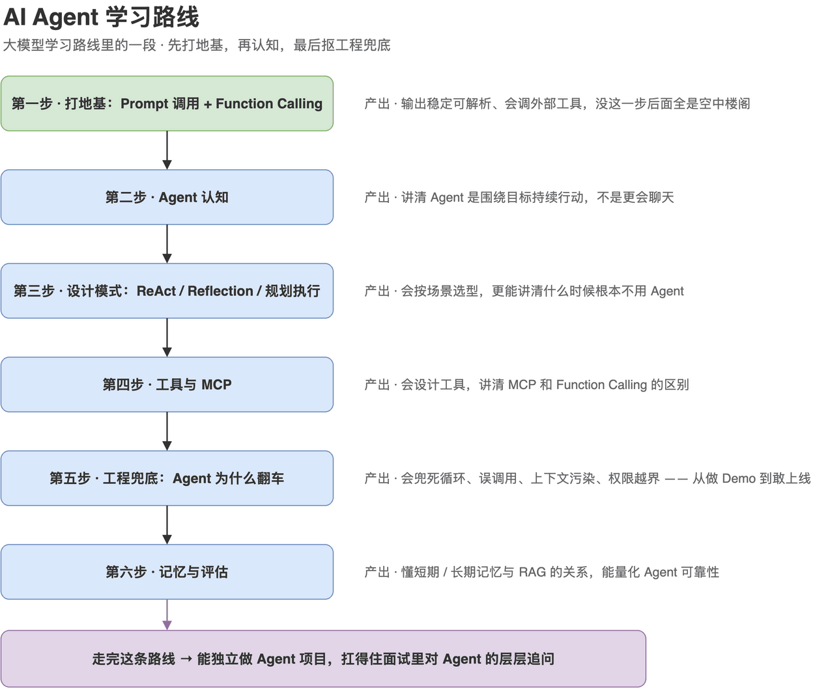

# AI Agent 学习路线：程序员怎么从零学 Agent 开发，该按什么顺序学

> 来源: https://notes.kamacoder.com/llm/app/agent_learning_roadmap.html

# `# AI Agent 学习路线：程序员怎么从零学 Agent 开发，该按什么顺序学 
 

很多录友单独来问：**我就想学 AI Agent，该怎么入门？** 

先说清一件事：**Agent 学习路线，本质上就是大模型学习路线的一段。** Agent 不是一个独立的新技术，它是"大模型 + 会调工具 + 会用记忆 + 会自己决定下一步"拼出来的系统。所以你没法跳过前面直接学 Agent——前面缺了地基，学 Agent 就是背名词。 

如果你还没看过整条主线，建议先扫一眼大模型学习路线，知道 Agent 在整张地图的哪个位置。这篇我们把镜头拉近，**只讲 Agent 这一段该怎么走。** 

整段路线先放在这，下面六步逐个拆： 

 

## `# 学 Agent 之前，先承认一个事实 

Agent 是大模型应用里**最容易做出 Demo、也最容易翻车**的方向。 

跟着教程，半小时就能搭一个"会调工具的 Agent"，看着很唬人。但一上真实业务，立刻死循环、乱调工具、上下文污染、权限越界……一地鸡毛。 

所以学 Agent 的目标不是"搭一个能跑的 Demo"，而是**搞懂它为什么转得动、又为什么会翻车、翻车了怎么兜底**。下面这条路线就是照着这个目标排的。 

## `# 第一步：补好两块地基——Prompt 调用 + Function Calling 

别急着学 Agent。先确认两件事你会了： 

一是能稳定地调用大模型、拿到**结构化输出**——Agent 的每一步决策都依赖模型吐出可解析的结构，输出不稳定，Agent 直接散架。 

二是 **Function Calling**，这是 Agent 的命根子。Agent 之所以能"动手"，靠的就是 Function Calling 去调外部工具。这一篇必须先吃透： 
  - 结构化输出：JSON Schema 怎么约束   - Function Calling 详解：大模型怎么调用工具，为什么是 Agent 的基础 

这一步没过关，后面全是空中楼阁。 

## `# 第二步：建立 Agent 认知——它到底和普通问答差在哪 

目标：一句话讲清 Agent 是什么，以及它和"普通大模型问答"的本质区别。 

很多人对 Agent 的理解停在"更会聊天"，错得离谱。核心区别是：**普通问答是答一句就结束，Agent 是围绕一个目标持续行动、边做边判断。** 
  - Agent 到底是什么？和普通大模型问答有什么区别 

这一篇是整条 Agent 路线的"定盘星"，理解偏了，后面越学越乱。 

## `# 第三步：掌握 Agent 设计模式——ReAct、Reflection、规划执行 

目标：知道 Agent 有哪几种主流"思路"，分别适合什么场景，面试被问到能讲出选型依据。 

Agent 不是只有一种写法。工具调用型任务用 ReAct，需要自我检查的用 Reflection，复杂任务拆解用 Plan-and-Execute。这三种是面试高频： 
  - ReAct、Reflection、规划执行：Agent 三种常见思路怎么选 

然后是一个最容易被忽视、却最能体现工程判断力的问题——**很多场景根本不需要 Agent**： 
  - Agent vs Workflow：什么时候根本不需要 Agent 

能讲清"什么时候不用 Agent"，比会写十个 Agent Demo 更值钱。"过度 Agent 化"是新手最常踩的坑。 

## `# 第四步：工具与协议——Agent 的上限由工具决定 

目标：理解 Agent 能干多少事，取决于你给它的工具设计得好不好；并搞懂 MCP 是怎么回事。 
  - 工具设计决定 Agent 上限：Tool Use、参数 Schema、返回值怎么设计   - MCP 协议详解：Agent 工具调用的新标准，和 Function Calling 有什么区别 

MCP 是这两年 Agent 工程绕不开的关键词，面试越来越爱问，务必能讲清它和 Function Calling 的关系。 

## `# 第五步：工程兜底——Agent 为什么翻车，怎么兜住 

目标：知道 Agent 在生产里有哪些典型故障，以及怎么设兜底机制。这是从"会做 Demo"到"敢上线"的分水岭。 
  - Agent 为什么容易翻车？死循环、误调用、上下文污染、权限越界怎么兜底 

面试官最爱在这里钻——"你的 Agent 陷入死循环怎么办""它调错工具怎么兜底"。答得上来，立刻和只会跑 Demo 的人拉开差距。 

## `# 第六步：记忆与评估——让 Agent 可靠、可衡量 

目标：搞懂 Agent 的记忆机制，以及怎么量化一个 Agent 到底靠不靠谱。 
  - Agent 的记忆：短期记忆、长期记忆、RAG 到底什么关系   - Agent 怎么评估？任务完成率与可靠性度量 

这里你会发现 Agent 和 RAG 是连在一起的——长期记忆很多时候就是用 RAG 实现的。所以如果你 RAG 那段跳过了，建议补回来，看大模型学习路线里的 RAG 阶段。 

## `# 这条 Agent 路线要走多久 

如果前面 Prompt 和 Function Calling 的底子已经打好，**Agent 这一段大概两到三周能走完一遍**，再配一个能自己干活的小项目（比如一个会查资料、会调工具、能自己规划步骤的小助手），就足以应付大部分 Agent 开发岗的面试。 

记住顺序：**先认知 → 再设计模式 → 再工具 → 再兜底 → 再记忆评估。** 别一上来就堆框架、抄 Demo，那样学完只会用，一问原理和兜底就露馅。 

## `# 顺手准备 Agent 面试 

Agent 是现在面试问得最细的方向之一。相关面试题我整理在大模型面经里，简历怎么把 Agent 项目写出彩，可以看简历专栏。 

我也在知识星球  (opens new window)里带过不少录友做 Agent 项目、抠面试细节，路线和项目一路盯着改。 

想看完整的大模型知识体系，回到卡码大模型专栏首页，Agent 只是其中一章，前后串起来才是完整的战斗力。
