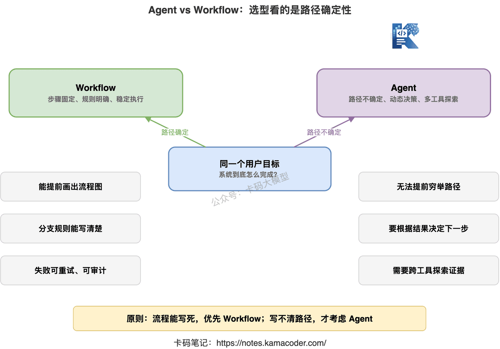
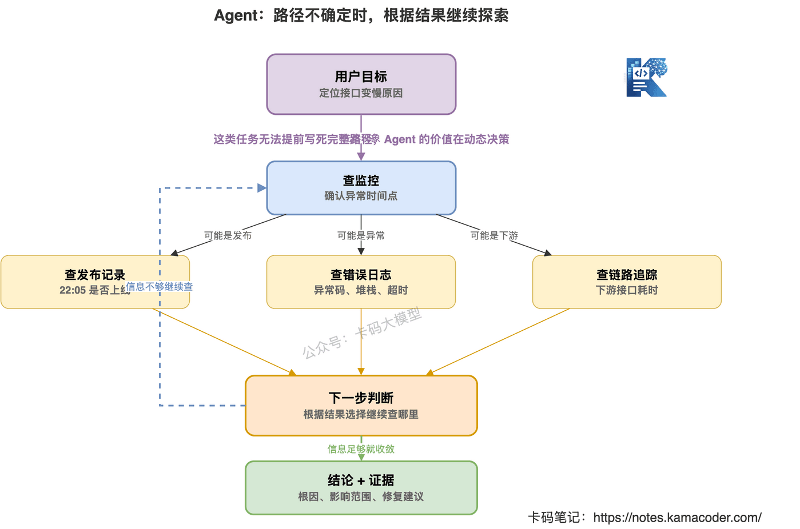
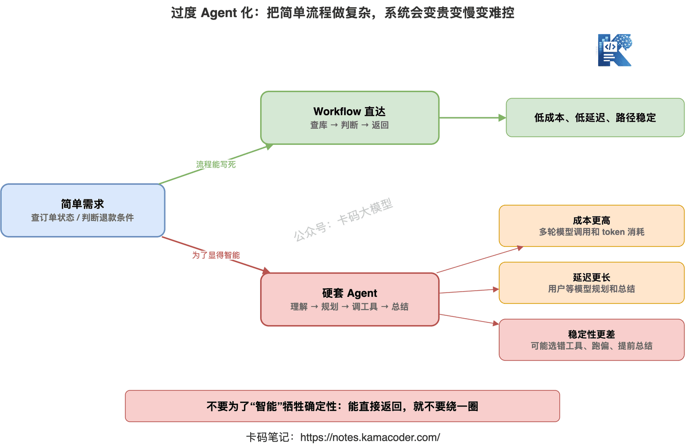
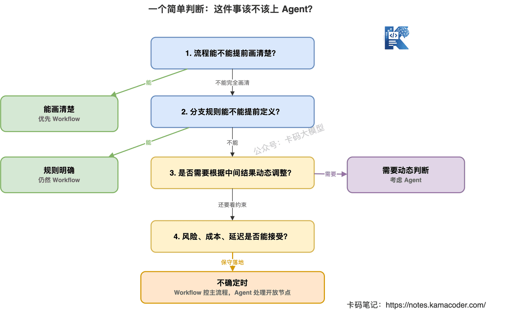

# Agent vs Workflow：什么时候根本不需要 Agent？

> 来源: https://notes.kamacoder.com/llm/app/agent_vs_workflow.html

# `# Agent vs Workflow：什么时候根本不需要 Agent？ 
 

前两篇我们把 Agent 的基础讲了一遍。 

第一篇讲 Agent 到底是什么，核心是：**Agent 不是更会聊天，而是能围绕目标持续行动。** 

第二篇讲 ReAct、Reflection、规划执行，核心是：**Agent 要能边做边判断，做完还要检查。** 

但到这里，很多录友会产生一个新误区： 

“既然 Agent 这么强，那我是不是所有流程都应该改成 Agent？” 

不是。 

而且我建议你把这句话记住： 

**不是所有任务都需要 Agent。很多场景硬上 Agent，反而是在给系统制造不稳定。** 

这篇就专门讲一个面试和项目里都很常见的问题： 

**Agent 和 Workflow 到底怎么选？什么时候根本不需要 Agent？** 

 

## `# 一、先说结论：流程能写死，就优先 Workflow 

很多人一听 Workflow，就觉得它不如 Agent 高级。 

这个理解是错的。 

Workflow 不是低级方案。 

在很多生产系统里，Workflow 才是更靠谱的方案。 

什么是 Workflow？ 

简单说，就是**步骤固定、规则明确、输入输出稳定的流程编排。** 

比如发票审核： 
  - OCR 识别发票图片。   - 提取金额、税号、日期。   - 校验字段是否合法。   - 调用财务系统入账。   - 返回审核结果。 

这个流程很清楚。 

先做什么，后做什么，异常怎么处理，都能提前写出来。 

这种场景，你根本不需要让模型每次自由发挥： 

“我思考一下，接下来要不要入账。” 

这就很危险。 

因为财务流程最需要的不是“灵活”，而是**稳定、可审计、可回放、可控制。** 

所以第一条原则很简单： 

**如果流程能稳定写死，就优先用 Workflow，不要硬上 Agent。** 

## `# 二、Workflow 解决的是“按固定步骤稳定执行” 

Workflow 的核心价值，是把业务流程变成一条可控链路。 

它关注的问题是： 
  - 每一步做什么   - 每一步依赖什么输入   - 每一步失败怎么重试   - 哪些节点需要人工审批   - 哪些结果需要记录和追踪 

比如客服退款流程。 

用户申请退款后，系统可能这样走： 
  - 校验订单是否存在。   - 判断订单是否在退款期限内。   - 判断商品是否已发货。   - 如果未发货，自动退款。   - 如果已发货，进入人工审核。   - 写入退款记录，通知用户。 

这个流程有分支，但它仍然是 Workflow。 

因为分支规则是确定的。 

订单超过 7 天不能退。 

已发货要人工审核。 

未发货可自动退款。 

这些规则都能写在代码里。 

这种任务让 Agent 来判断，反而会增加风险。 

因为 Agent 可能解释错规则，也可能在边界条件上犯错。 

而 Workflow 的好处是：**规则一旦写清楚，每次都会稳定执行。** 

 

## `# 三、Agent 解决的是“路径不确定时动态决策” 

那 Agent 什么时候有价值？ 

当任务目标明确，但执行路径不确定时。 

比如： 

“帮我定位线上接口变慢的原因。” 

这个任务没法提前写死。 

可能是数据库慢。 

可能是缓存击穿。 

可能是刚发布的代码引入了慢查询。 

可能是第三方接口超时。 

可能是流量突然变大。 

你不知道第一步该查哪里。 

就算第一步查了监控，也不知道第二步该查日志、数据库、发布记录还是链路追踪。 

这时候 Agent 的价值就出来了。 

它可以根据中间结果动态调整下一步： 
  - 先查接口延迟曲线。   - 发现 22:10 开始变慢。   - 再查 22:10 附近有没有发布。   - 发现支付服务 22:05 发布。   - 再查支付服务日志。   - 发现下游支付回调大量超时。   - 再查第三方接口状态。   - 最后形成结论和证据。 

这个过程不是固定流程。 

它是不断“观察结果 -> 再决定下一步”。 

这就是 Agent 更适合的地方。 

所以第二条原则是： 

**路径不确定、需要中途判断、需要多工具探索，才考虑 Agent。** 

 

## `# 四、别把“有分支”误判成“需要 Agent” 

这里有个特别容易踩的坑。 

很多录友会说： 

“我这个流程也有分支啊，是不是就要 Agent？” 

不一定。 

**有分支，不等于需要 Agent。** 

关键要看分支是不是能提前定义。 

比如退款流程： 
  - 未发货 -> 自动退款   - 已发货 -> 人工审核   - 超过退款期 -> 拒绝退款 

这叫规则分支。 

规则分支适合 Workflow。 

再比如风控审核： 
  - 金额小于 1000，自动通过   - 金额大于 1000，进入二次校验   - 命中黑名单，人工审核 

这也是 Workflow。 

因为判断条件清楚，规则边界明确。 

真正需要 Agent 的，是那种你没法提前列出完整路径的任务。 

比如： 

“帮我分析这次活动转化率为什么下降。” 

这个任务可能要查流量来源、页面加载速度、用户路径、按钮点击率、支付成功率、竞品价格、客服反馈。 

而且查到一个异常后，下一步还要跟着异常走。 

这种才是开放决策。 

所以判断标准不是“有没有分支”，而是： 

**分支能不能提前写清楚。** 

能写清楚，就是 Workflow。 

写不清楚，才考虑 Agent。 

## `# 五、过度 Agent 化，是很多项目翻车的开始 

现在 Agent 太热了。 

很多项目为了显得“智能”，会把简单流程也包装成 Agent。 

这就是过度 Agent 化。 

它最常见的问题有四个。 

### `# 1. 成本更高 

Workflow 执行一次，可能就是几次接口调用。 

Agent 执行一次，可能要多轮模型调用、多次工具调用、反复观察和总结。 

同样一个任务，如果 Workflow 0.5 秒能跑完，Agent 跑 20 秒，还消耗一堆 token。 

这不是智能。 

这是把简单问题复杂化。 

### `# 2. 延迟更长 

用户只是想查一个订单状态。 

Workflow 直接查数据库就行。 

如果你让 Agent 先理解意图、再规划、再调用工具、再总结，用户体验只会变差。 

能直接返回，就不要绕一圈。 

### `# 3. 稳定性更差 

Workflow 的路径是固定的。 

Agent 的路径是模型动态决定的。 

动态决策意味着灵活，也意味着不稳定。 

它可能选错工具，可能重复调用，可能提前总结，可能跑偏。 

在高风险业务里，这种不稳定不是小问题。 

### `# 4. 调试更难 

Workflow 出问题，可以看节点日志。 

哪个节点失败，输入是什么，输出是什么，一眼能定位。 

Agent 出问题，经常要看整条 trace。 

它为什么选这个工具？ 

为什么忽略那个结果？ 

为什么明明失败了还继续走？ 

调试成本明显更高。 

所以不是“Agent 更高级”，而是： 

**Agent 的自由度更高，也意味着你要付出更多成本去约束它。** 

 

## `# 六、一个简单判断：这件事能不能画成固定流程图 

项目里怎么快速判断用 Workflow 还是 Agent？ 

我给一个很实用的方法： 

**先问自己：这件事能不能画成固定流程图。** 

如果能画出来，而且大多数情况都覆盖了，那就优先 Workflow。 

比如： 
  - 发票审核   - 订单退款   - 简历四要素检查   - 内容发布审核   - 工单状态流转   - 数据同步任务 

这些都适合 Workflow。 

如果你画不出来，或者画出来之后发现分支爆炸，说明它可能更适合 Agent。 

比如： 
  - 线上故障定位   - 复杂竞品调研   - 大型代码库问题分析   - 用户反馈归因   - 多数据源经营分析   - 开放式资料整理 

这些任务路径不固定。 

你很难提前定义每一步。 

这时 Agent 才有意义。 

 

## `# 七、最稳的方案，往往是 Workflow + Agent 

真实项目里，不一定是二选一。 

很多时候，最靠谱的是混合架构： 

**外层用 Workflow 控制主流程，里面某些开放节点交给 Agent。** 

比如一个智能工单系统。 

主流程可以是 Workflow： 
  - 接收工单。   - 判断工单类型。   - 分配处理队列。   - 处理完成后通知用户。   - 记录处理结果。 

这条主流程必须稳定。 

但在“分析工单原因”这个节点，可以用 Agent。 

因为不同工单的问题路径不一样。 

有的要查日志。 

有的要查订单。 

有的要查用户行为。 

有的要查最近发布记录。 

这部分适合 Agent 动态决策。 

所以更合理的架构是： 

**Workflow 负责边界和流程，Agent 负责开放问题求解。** 

这样既有稳定性，又有灵活性。 

不要让 Agent 接管整个系统。 

让它在真正需要判断的地方发挥作用。 

 

## `# 八、面试时怎么回答 Agent vs Workflow 

**面试官问：Agent 和 Workflow 有什么区别？** 

不要只说： 

“Agent 更智能，Workflow 更固定。” 

这句话太泛了。 

你可以这样答： 

“Workflow 适合步骤明确、规则稳定、可提前编排的任务，核心是稳定执行；Agent 适合目标明确但路径不确定、需要中途观察结果并动态决策的任务，核心是探索和调整。工程上不是所有场景都要用 Agent，如果流程能写死，用 Workflow 更稳定、更便宜、更容易审计。” 

**面试官问：你们项目里为什么不用纯 Agent？** 

可以这样答： 

“因为纯 Agent 的自由度太高，成本、延迟和不确定性都会上升。我们一般把主流程放在 Workflow 里，保证权限、状态流转和异常处理可控；只有在路径不确定的节点，比如故障定位、原因分析、复杂数据查询，才让 Agent 调工具动态判断。” 

**面试官问：怎么判断一个场景该不该上 Agent？** 

可以这样答： 

“我会先看流程能不能提前画清楚。如果步骤固定、分支规则明确，就用 Workflow；如果路径无法提前穷举，需要根据中间结果不断调整下一步，才考虑 Agent。同时还要看风险、成本、延迟和可解释性要求，不能为了技术热度硬套 Agent。” 

这套回答就比较稳。 

它说明你不是只会追热点，而是知道工程取舍。 

## `# 九、别为了“智能”牺牲确定性 

Agent 真正有价值的地方，是处理开放问题。 

但生产系统里，很多环节不需要开放。 

它需要确定。 

需要可控。 

需要每次结果一致。 

需要出了问题能追责。 

这时候 Workflow 就比 Agent 合适。 

所以做大模型应用，不要看到 Agent 就兴奋。 

先问自己四个问题： 
  - 这个流程能不能写死？   - 分支规则能不能提前定义？   - 错了以后影响大不大？   - 用户更需要灵活，还是更需要稳定？ 

如果答案偏向稳定，那就别硬上 Agent。 

**Agent 解决的是路径不确定的问题。** 

**Workflow 解决的是流程稳定执行的问题。** 

选错了，系统会变贵、变慢、变难控。 

能把这个边界讲清楚，才是真正懂 Agent。
