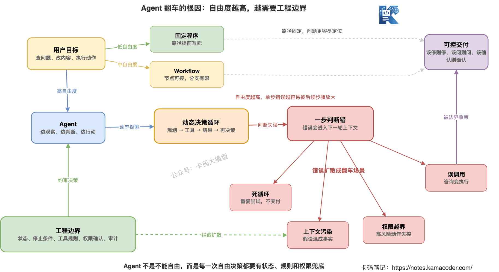
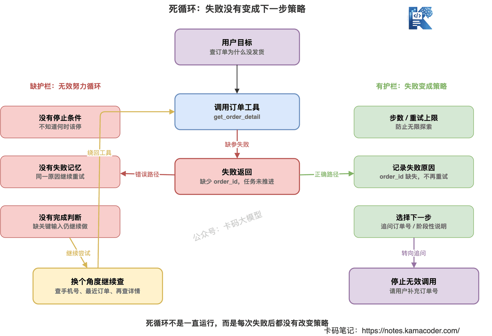
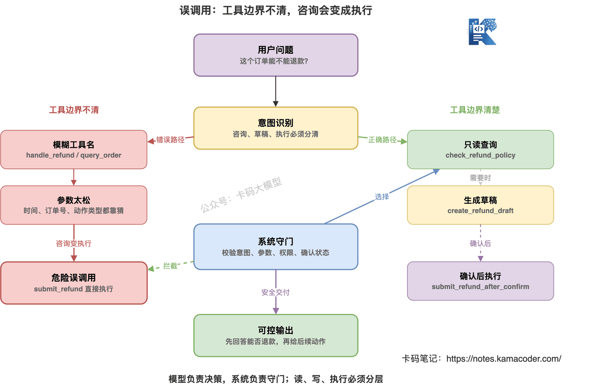
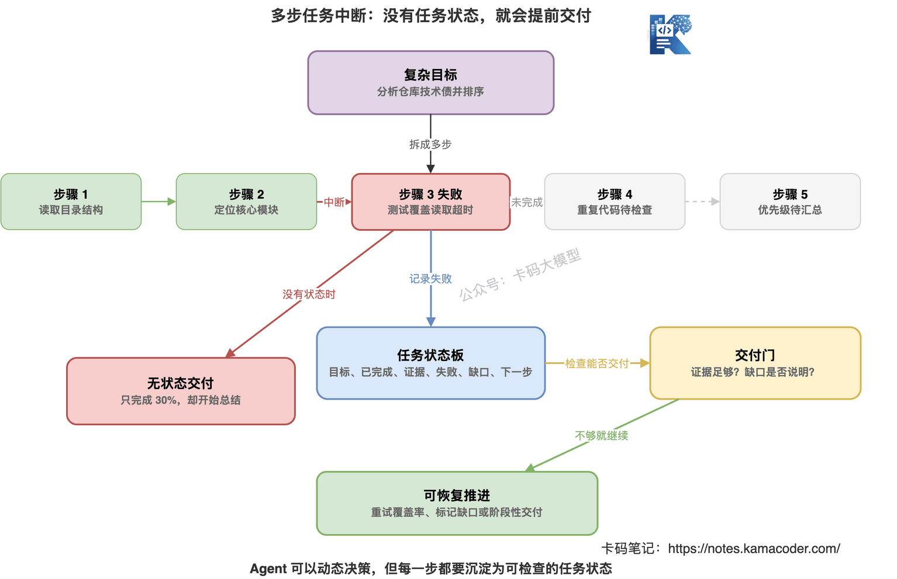
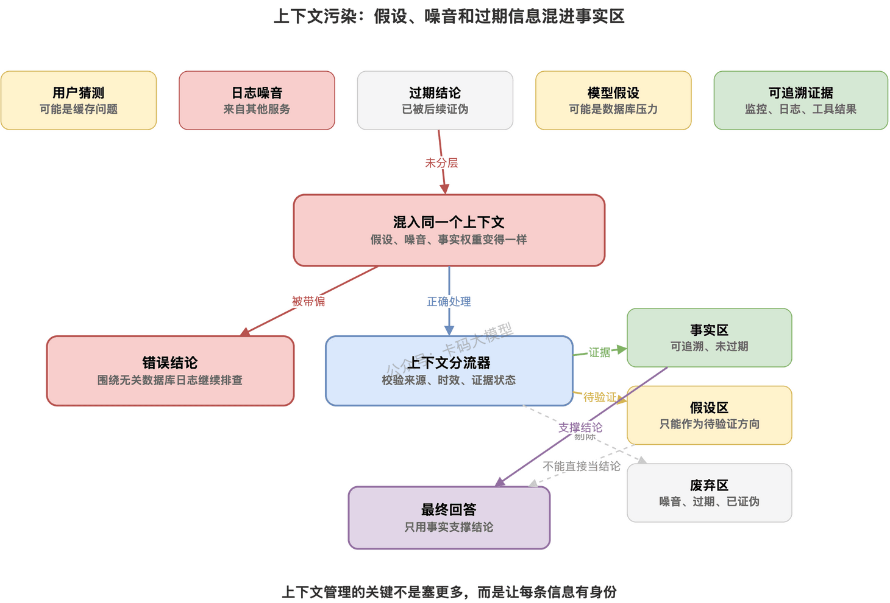
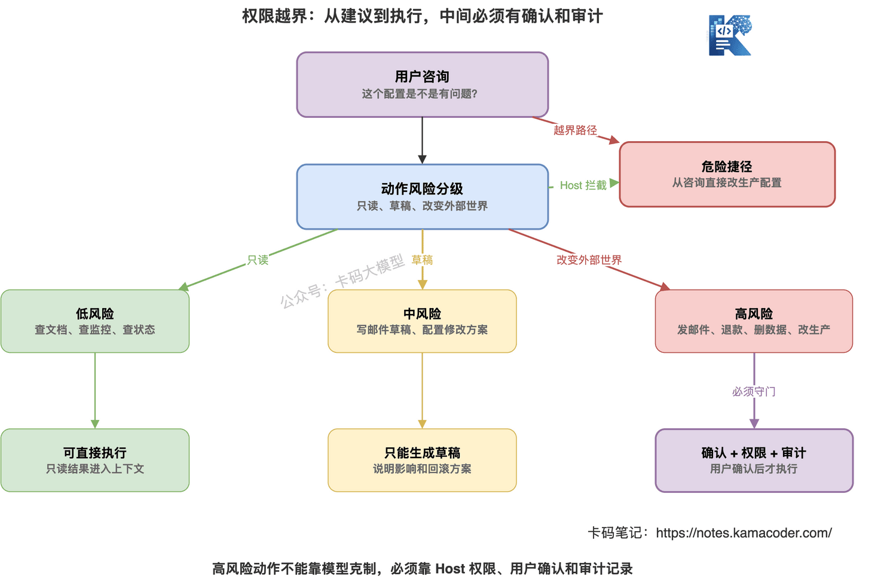
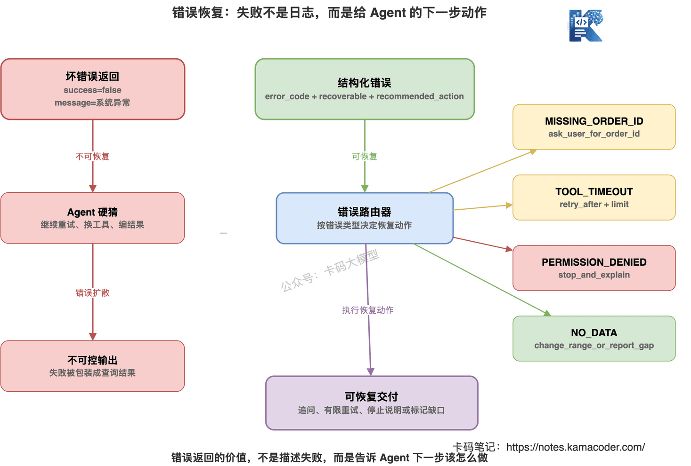
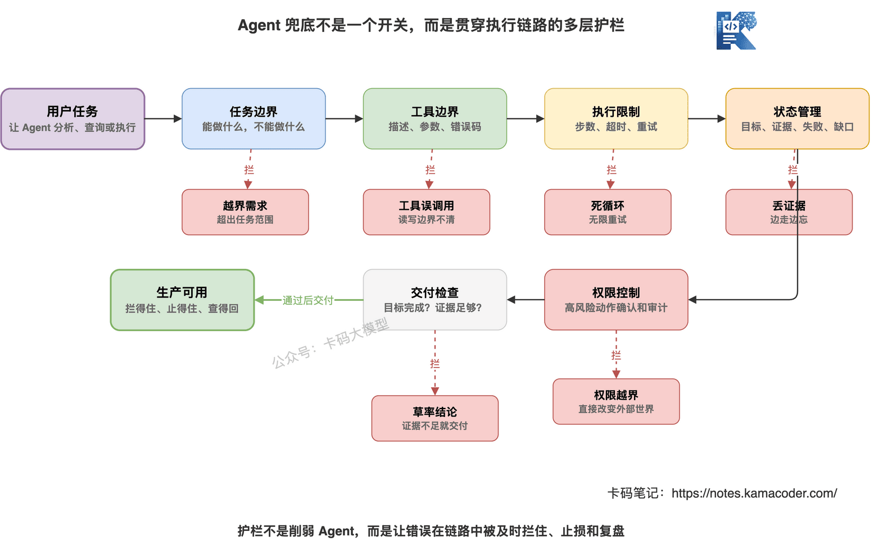

# Agent为什么容易翻车？

> 来源: https://notes.kamacoder.com/llm/app/agent_failure_modes.html

# `# Agent为什么容易翻车？ 
 

前几篇我们把 Agent 的核心能力一路讲下来了。 

Agent 到底是什么，讲的是 Agent 和普通问答的区别。 

Agent vs Workflow，讲的是不要什么场景都硬上 Agent。 

工具设计决定 Agent 上限，讲的是工具描述、参数、返回值和权限边界。 

MCP 协议，讲的是工具和上下文怎么标准化接入 AI 应用。 

到这里，很多录友会以为： 

“只要 Agent 会规划，会调用工具，工具设计也不错，那系统是不是就稳了？” 

还真不一定。 

Agent 最麻烦的地方就在这里： 

**它越能自主行动，就越可能自主翻车。** 

普通问答错了，最多回答不准。 

Workflow 错了，通常能定位到某个固定节点。 

Agent 错了，经常是整个执行过程都跑偏： 
  - 一直重复调用同一个工具   - 明明缺参数，还硬编   - 查着查着忘了原始目标   - 工具返回失败，还继续瞎猜   - 本来只是咨询，结果直接执行了动作   - 上下文里混入错误信息，后面每一步都被带偏 

所以这篇不讲“Agent 很强”。 

我们专门讲它为什么容易翻车，以及工程上怎么兜底。 

先记住一句话： 

**Agent 翻车不是偶然 bug，而是自由度带来的必然风险。** 


 

## `# 一、Agent 为什么比普通应用更容易不稳定 

传统程序的执行路径，大多是开发者提前写好的。 

比如订单退款流程： 
  - 查订单。   - 判断是否可退。   - 创建退款单。   - 用户确认。   - 提交退款。 

每一步都能写进代码。 

出了问题，也能看日志定位。 

Agent 不一样。 

Agent 的核心价值，是根据中间结果动态决定下一步。 

这也是它不稳定的来源。 

比如用户说： 

“帮我分析支付接口昨天晚上为什么变慢。” 

Agent 可能先查监控。 

发现 22:10 开始变慢。 

再查发布记录。 

发现 22:05 有发布。 

再查日志。 

发现第三方支付回调超时。 

这条路径看起来很合理。 

但它也可能走成这样： 

先查监控，没查到。 

再查日志，关键词写错。 

再查数据库，发现无关慢查询。 

再查发布记录，时间范围写大。 

最后总结说“可能是数据库压力升高”。 

这就是 Agent 的问题。 

它不是按固定流程走。 

它是边走边判断。 

**边走边判断，就意味着每一步都可能判断错。** 

所以 Agent 的可靠性，不只取决于模型聪不聪明。 

还取决于： 
  - 每一步有没有状态记录   - 工具有没有清晰边界   - 失败能不能恢复   - 有没有停止条件   - 有没有人工确认   - 有没有审计和回放 

如果这些都没有，Agent 就像一个很有想法但没有刹车的人。 

跑得快。 

也容易冲出去。 

## `# 二、死循环：Agent 一直做，但就是不交付 

Agent 最常见的翻车之一，就是死循环。 

不是程序意义上的 while true。 

而是它一直在“努力”，但任务没有推进。 

比如： 

用户问： 

“帮我查一下订单为什么还没发货。” 

Agent 调用订单查询工具。 

工具返回： 

“缺少订单ID。” 

正常做法应该是追问用户： 

“请提供订单号。” 

但有些 Agent 会继续尝试： 

查用户手机号。 

查最近订单。 

再查订单详情。 

还是缺订单ID。 

再查最近订单。 

再查订单详情。 

最后绕了好几圈。 

这就是死循环。 

### `# 为什么会死循环 

死循环通常不是模型“傻”。 

而是系统缺了三个东西。 

**第一，缺停止条件。** 

Agent 不知道什么时候应该停。 

它以为继续调用工具就能解决问题。 

**第二，缺失败记忆。** 

同一个工具已经失败过，它没有记住。 

于是反复重试。 

**第三，缺任务完成判断。** 

它不知道当前信息已经不足以继续推进，应该转向追问用户。 


 

### `# 怎么兜底 

死循环的兜底很直接。 

**第一，限制最大步数。** 

比如一个客服 Agent 最多调用 5 次工具。 

一个故障排查 Agent 最多跑 15 步。 

超过步数，就必须总结当前进展和缺失信息。 

**第二，记录失败工具。** 

如果同一个工具用同一组关键参数失败过，不要无限重试。 

应该改变策略： 
  - 缺参数，就追问用户   - 工具超时，就有限重试   - 无数据，就换查询范围   - 权限不足，就停止说明 

**第三，设计停止条件。** 

比如： 
  - 已经拿到足够证据   - 缺少关键输入   - 工具连续失败   - 达到最大步数   - 进入高风险动作前 

这几个条件一触发，Agent 就不能继续自由探索。 

它要么交付阶段性结果。 

要么请求用户补充。 

要么进入人工确认。 

## `# 三、误调用：工具选错，后面全错 

第二类翻车，是误调用。 

Agent 调错工具，或者用错参数。 

这个问题在真实项目里非常常见。 

比如用户问： 

“我这个订单能不能退款？” 

正确路径应该是： 

先查订单状态。 

再调用退款规则检查工具。 

最后告诉用户是否可退。 

但 Agent 可能直接调用退款提交工具。 

这就危险了。 

再比如用户问： 

“接口 `/api/pay` 昨天晚上变慢了吗？” 

正确应该查监控工具。 

结果 Agent 去查业务数据库。 

查到一堆订单数据后，开始胡乱解释。 

### `# 为什么会误调用 

误调用常见有四个原因。 

**第一，工具描述太像。** 

比如： 
  - `get_order_info`   - `query_order`   - `search_order`   - `order_detail` 

模型分不清哪个该用。 

**第二，读写工具没分开。** 

查询退款规则和提交退款申请混在一个工具里。 

风险很大。 

**第三，参数 Schema 太松。** 

模型把“昨天晚上”直接塞进时间字段。 

或者把手机号当订单号。 

**第四，工具返回值没有明确状态。** 

Agent 拿到一段自然语言后，还要自己猜下一步。 

猜错了，就会继续错。 


 

### `# 怎么兜底 

误调用的兜底，核心是把工具边界写进系统。 

**查询工具和动作工具分开。** 

比如： 
  - `check_refund_policy`   - `create_refund_draft`   - `submit_refund_after_confirm` 

不要写一个模糊的 `handle_refund`。 

**高风险动作必须二次确认。** 

只要涉及钱、权限、通知、生产环境、删除、修改，都不要让 Agent 单独决定。 

它最多先生成草稿。 

用户确认后再执行。 

**工具调用前做规则校验。** 

比如： 
  - 订单号格式不对，不调用   - 时间范围超过 24 小时，不调用   - 缺少用户确认，不允许提交   - 当前用户无权限，不允许执行 

不要把所有判断都交给模型。 

模型负责决策。 

系统负责守门。 

这句话很重要。 

## `# 四、多步任务中断：中间失败后不会恢复 

Agent 做简单任务还好。 

一旦进入多步任务，问题就多了。 

比如让 Agent： 

“帮我分析这个仓库的技术债，并按优先级给修复建议。” 

它可能要做这些步骤： 
  - 看目录结构。   - 找核心模块。   - 搜复杂函数。   - 看测试覆盖。   - 找重复代码。   - 总结优先级。 

中间任何一步失败，Agent 都可能断。 

比如搜索工具超时。 

它可能直接说“仓库没有明显技术债”。 

比如某个目录无权限。 

它可能忽略这个目录，继续总结。 

比如读取文件失败。 

它可能脑补文件内容。 

这就是多步中断。 

### `# 为什么多步任务容易中断 

根因是 Agent 缺少任务状态。 

它只知道刚才工具返回了什么。 

但不知道整个任务目前做到哪一步。 

哪些子任务完成了。 

哪些子任务失败了。 

哪些证据已经拿到。 

哪些结论还不能下。 

所以它很容易出现两种问题。 

**一种是提前交付。** 

只完成了 30%，就开始总结。 

**另一种是丢失上下文。** 

前面查到的证据，后面忘了。 


 

### `# 怎么兜底 

多步任务要用任务状态管理。 

不要只让模型在脑子里记。 

可以维护一个简单的任务状态： 
  - 当前目标是什么   - 已完成哪些步骤   - 每一步证据是什么   - 哪些步骤失败了   - 失败是否可恢复   - 还缺什么信息   - 当前是否可以交付 

这听起来像 Workflow。 

但不是把 Agent 变成固定流程。 

而是给 Agent 一个外部任务板。 

它可以动态决策。 

但每一步都要写入状态。 

如果失败，要标记失败原因。 

如果证据不足，要标记缺口。 

最后交付前，要检查状态是否满足目标。 

这就是把 Agent 从“边走边忘”拉回“边走边记录”。 

## `# 五、上下文污染：错信息混进去，后面全被带偏 

上下文污染，是 Agent 里非常隐蔽的问题。 

它不像工具调用失败那么明显。 

但杀伤力很大。 

什么叫上下文污染？ 

就是错误信息、过期信息、无关信息、未验证假设，被放进上下文后，影响后续判断。 

比如 Agent 查日志时，工具返回了一段无关错误： 

“数据库连接池等待时间升高。” 

但这段日志其实来自另一个服务。 

Agent 没检查服务名，就把它当成根因。 

后面每一步都围绕数据库查。 

最后得出一个错误结论： 

“支付接口变慢主要是数据库连接池不足。” 

这就是上下文污染。 

再比如： 

用户前面说“可能是缓存问题”。 

这只是用户猜测。 

Agent 却把它当成事实。 

后面一直查缓存。 

最后忽略了真正的发布问题。 

### `# 上下文污染来自哪里 

常见来源有四个。 

**第一，用户猜测。** 

用户说“我觉得可能是 xx”，这不是证据。 

**第二，工具返回的噪音。** 

日志、搜索结果、RAG 片段里经常有无关信息。 

**第三，过期上下文。** 

前面得到的结论，在后面可能已经被推翻。 

**第四，模型自己的中间假设。** 

模型说“可能是数据库问题”，如果不标记为假设，很容易被后面当事实。 


 

### `# 怎么兜底 

上下文管理要分层。 

不要把所有东西都丢进同一个上下文。 

至少分成三类： 

**事实。** 

来自工具、数据库、日志、监控，而且能追溯来源。 

**假设。** 

模型推测、用户猜测、待验证的原因。 

**废弃信息。** 

已经被验证无关、过期或错误的信息。 

Agent 最后输出结论时，必须基于事实。 

假设只能作为待验证方向。 

废弃信息不能继续参与推理。 

这就是为什么很多成熟 Agent 系统会做状态记录、证据引用、trace 回放。 

不是为了好看。 

是为了防止上下文变成一锅粥。 

## `# 六、权限越界：最危险的翻车 

前面几类翻车，大多影响答案质量。 

权限越界，影响的是安全。 

这类问题最危险。 

比如： 

用户只是问： 

“这个订单能不能取消？” 

Agent 直接调用取消订单工具。 

用户只是说： 

“帮我看看这封邮件怎么回。” 

Agent 直接发出去了。 

用户只是说： 

“这个配置是不是有问题？” 

Agent 直接改了生产配置。 

这不是体验问题。 

这是事故。 

### `# 为什么会权限越界 

权限越界通常来自三件事。 

**第一，工具权限太大。** 

一个工具既能查，又能改。 

**第二，缺少确认环节。** 

Agent 从“建议”直接跳到“执行”。 

**第三，Host 没有做权限守门。** 

系统默认相信模型判断。 

这就很危险。 


 

### `# 怎么兜底 

高风险动作要分级。 

可以简单分三类。 

**低风险：只读查询。** 

比如查文档、查订单状态、查监控指标。 

通常可以让 Agent 直接调用。 

**中风险：生成草稿。** 

比如写邮件草稿、创建退款申请草稿、生成配置修改方案。 

可以让 Agent 做，但不能直接提交。 

**高风险：改变外部世界。** 

比如发邮件、退款、删除数据、改生产配置、执行命令。 

必须用户确认。 

还要有审计记录。 

这和 MCP 文章里讲的安全边界是一致的。 

Host 要管权限。 

工具要暴露有限能力。 

动作要分草稿和执行。 

不要指望模型自己永远克制。 

## `# 七、错误不可恢复：失败后只会硬编 

Agent 翻车还有一个很常见的场景： 

工具失败了。 

但 Agent 不知道怎么处理。 

于是它开始编。 

比如工具返回： 

```
{
  "success": false,
  "message": "系统异常"
}

```

 

这对 Agent 没什么帮助。 

它不知道： 
  - 是缺参数？   - 是权限不足？   - 是工具超时？   - 是数据不存在？   - 是业务规则不允许？   - 能不能重试？   - 应该追问用户吗？ 

如果错误信息不可恢复，Agent 很容易说： 

“根据查询结果，订单正在处理中。” 

但其实它根本没查到。 

### `# 怎么兜底 

错误返回要结构化。 

至少包含： 
  - `error_code`   - `recoverable`   - `recommended_action`   - `retry_after`   - `missing_fields`   - `permission_required` 

比如： 

```
{
  "success": false,
  "error_code": "MISSING_ORDER_ID",
  "recoverable": true,
  "recommended_action": "ask_user_for_order_id",
  "missing_fields": ["order_id"]
}

```

 

这样 Agent 就知道下一步不是继续查。 

而是追问用户。 

再比如： 

```
{
  "success": false,
  "error_code": "PERMISSION_DENIED",
  "recoverable": false,
  "recommended_action": "stop_and_explain",
  "permission_required": "refund:submit"
}

```

 

这时 Agent 就应该停止。 

不是换个工具继续试。 


 

## `# 八、Agent 兜底不是一个开关，而是一套护栏 

很多人问： 

“怎么防止 Agent 翻车？” 

不要期待一个万能开关。 

真正的兜底是一套护栏。 

至少包括六层。 

**第一，任务边界。** 

明确 Agent 能做什么，不能做什么。 

**第二，工具边界。** 

工具描述、参数、返回值、错误码都要清楚。 

**第三，执行边界。** 

最大步数、超时、重试次数、停止条件。 

**第四，状态管理。** 

记录目标、步骤、证据、失败、缺口。 

**第五，权限控制。** 

高风险动作二次确认、权限校验、审计记录。 

**第六，交付检查。** 

最终回答前检查：目标是否完成？证据是否足够？有没有未验证假设？ 


 

这里要特别强调一点。 

护栏不是为了限制 Agent 的能力。 

而是为了让它能进入生产环境。 

没有护栏的 Agent，Demo 里看起来很聪明。 

一到真实业务就容易出事。 

能不能做生产级 Agent，差别就在这里。 

## `# 九、面试时怎么回答 Agent 翻车问题 

Agent 面试里，面试官很喜欢问这类问题。 

因为它能看出你是真做过，还是只会讲概念。 

**面试官问：Agent 为什么容易翻车？** 

可以这样答： 

“Agent 的核心是动态决策，它不是固定 Workflow，每一步都会根据中间结果决定下一步。所以它的自由度更高，也更容易出现死循环、工具误调用、上下文污染、多步任务中断和权限越界。工程上不能只靠模型自觉，需要用步数限制、状态记录、工具边界、错误恢复、权限确认和审计来兜底。” 

**面试官问：怎么防止 Agent 死循环？** 

可以这样答： 

“我会设置最大步数、最大重试次数和停止条件，并记录失败工具和关键参数。如果同一个工具因为同样原因失败，就不能无限重试，要根据错误码选择追问用户、缩小范围、换工具或停止说明。” 

**面试官问：怎么防止 Agent 调错工具？** 

可以这样答： 

“工具设计上要把查询类和动作类分开，工具描述写清适用场景和不适用场景，参数 Schema 收紧类型、枚举和必填字段。执行前还要做规则校验，高风险动作只能先生成草稿，用户确认后才能调用正式执行工具。” 

**面试官问：Agent 上下文污染怎么处理？** 

可以这样答： 

“上下文不能混成一锅粥。我会把事实、假设和废弃信息分开管理。工具返回的可追溯结果才能进入事实区，模型推测和用户猜测只能作为假设，已经被证伪或过期的信息要标记废弃。最终回答必须基于事实和证据。” 

**面试官问：怎么让 Agent 更适合生产环境？** 

可以这样答： 

“生产环境要把 Agent 放在工程护栏里。包括任务边界、工具边界、执行限制、状态管理、权限控制、人工确认、审计日志和交付前检查。Agent 可以动态决策，但系统必须负责守门和回放。” 

这套回答很实用。 

因为它不是背 ReAct。 

它讲的是工程可靠性。 

## `# 十、Agent 翻车不可怕，没兜底才可怕 

Agent 会翻车，这件事不用回避。 

只要它能自主决策、能调用工具、能多步执行，就一定有不确定性。 

真正的问题不是“能不能完全不翻车”。 

而是： 

**翻车前能不能拦住。** 

**翻车时能不能止损。** 

**翻车后能不能复盘。** 

如果没有步数限制，它会死循环。 

如果没有工具边界，它会误调用。 

如果没有状态管理，它会中途断。 

如果没有上下文分层，它会被错误信息带偏。 

如果没有权限控制，它会越界执行。 

如果没有错误恢复，它会失败后硬编。 

所以做 Agent，不要只问“它能不能自己做事”。 

还要问： 

**它做错的时候，系统怎么兜底？** 

能答出这个问题，才算真正开始懂 Agent 工程。
