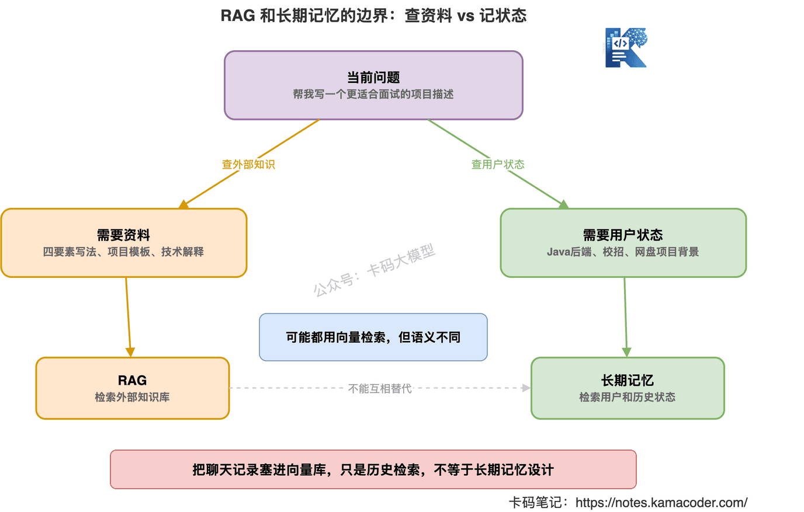
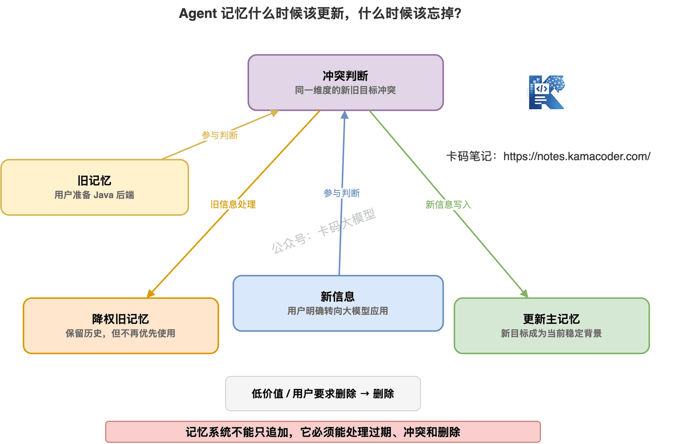

# Agent的记忆：短期、长期、RAG到底什么关系？

> 来源: https://notes.kamacoder.com/llm/app/agent_memory.html

# `# Agent的记忆：短期、长期、RAG到底什么关系？ 
 

上一篇我们讲了 Agent 为什么容易翻车。 

核心就一句话：**Agent 能自主行动，就必须有工程护栏。** 

死循环、误调用、上下文污染、权限越界，本质上都和“状态管理”有关。 

一个 Agent 如果不知道自己做过什么、当前做到哪一步、哪些信息是真的、哪些只是猜测，那它就很容易跑偏。 

所以这一篇，我们继续往下讲： 

**Agent 的记忆到底怎么设计。** 

很多录友一听 Agent 记忆，第一反应是： 

“是不是把所有聊天记录都存起来，下次再塞给模型？” 

不是。 

这理解太粗了。 

如果你真这么做，系统很快就会遇到三个问题： 
  - 上下文塞不下   - 噪音越来越多   - 旧信息和新信息互相打架 

所以先记住一句话： 

**Agent 记忆不是把历史全塞进 Prompt，而是把有价值的信息用合适的方式保存、检索、更新和遗忘。** 

这篇我们就把短期记忆、长期记忆、RAG、Session State 之间的关系讲清楚。 


 

## `# 一、先搞清楚：Agent 为什么需要记忆 

普通问答系统，不一定需要复杂记忆。 

用户问一句。 

模型答一句。 

结束。 

但 Agent 不一样。 

Agent 往往要做多步任务。 

比如用户说： 

“帮我分析这个项目的技术债，然后按优先级给修复建议。” 

Agent 可能要： 
  - 先看项目目录。   - 再看核心模块。   - 再找复杂函数。   - 再看测试覆盖。   - 再总结优先级。 

这个过程中，它必须记住： 
  - 用户最初的目标是什么   - 已经看过哪些目录   - 哪些文件有问题   - 哪些证据支撑当前判断   - 哪些步骤失败了   - 哪些结论只是临时假设 

如果没有记忆，Agent 就会边做边忘。 

前面刚查到的证据，后面忘了。 

前面已经失败的工具，后面继续调用。 

用户强调过的要求，后面又忽略。 

这就是很多 Agent 看起来“不稳定”的原因之一。 

**它不是单纯不会推理，而是缺少可管理的任务记忆。** 

## `# 二、Agent 记忆至少分四类 

讲 Agent 记忆，不要上来就说向量数据库。 

先按用途分清楚。 

一个比较实用的划分是四类： 

**短期记忆、Session State、长期记忆、外部知识库。** 

它们解决的问题不一样。 

### `# 1. 短期记忆：当前对话里刚发生了什么 

短期记忆通常就是当前对话上下文。 

比如最近几轮聊天、最近几次工具调用、最近拿到的结果。 

它的特点是： 
  - 生命周期短   - 和当前任务强相关   - 通常放在上下文窗口里   - 容易被窗口长度限制 

比如用户前面说： 

“我的项目是 Java 后端，主要用 Spring Boot。” 

后面又问： 

“那我这个简历项目怎么写？” 

模型需要记住前面这句话。 

这就是短期记忆。 

### `# 2. Session State：当前任务进行到哪一步 

Session State 不是聊天记录。 

它是结构化状态。 

比如： 

```
{
  "goal": "分析仓库技术债",
  "completed_steps": ["读取目录结构", "定位核心模块"],
  "failed_steps": [
    {
      "step": "读取测试覆盖报告",
      "reason": "文件不存在"
    }
  ],
  "evidence": ["core/payment/PayService.java 方法过长"],
  "missing_info": ["缺少测试覆盖率数据"]
}

```

 

你看，它不是把聊天原文堆起来。 

它是在记录任务状态。 

这对 Agent 特别重要。 

因为 Agent 做多步任务时，最怕“做到一半开始总结”。 

Session State 可以提醒它： 

你哪些步骤完成了。 

哪些证据拿到了。 

哪些信息还缺。 

现在能不能交付。 

### `# 3. 长期记忆：跨会话保留的稳定信息 

长期记忆是跨会话存在的。 

比如用户长期偏好： 
  - 用户主要写 Java   - 用户准备秋招   - 用户简历希望突出项目难点   - 用户不喜欢太书面腔 

再比如某个业务 Agent 的长期状态： 
  - 某客户属于高优先级客户   - 某项目常用的排查入口   - 某团队的代码规范 

长期记忆的特点是： 
  - 不一定每次都用   - 必须经过筛选再写入   - 需要更新和遗忘   - 不能把临时信息当成长期事实 

长期记忆最怕什么？ 

**把所有聊天都存进去。** 

这样最后不是记忆。 

是垃圾堆。 

### `# 4. 外部知识库：Agent 可以查的资料 

外部知识库常常用 RAG 实现。 

比如： 
  - 公司文档   - API 文档   - 产品手册   - 代码仓库   - 面试题库   - 运维手册 

它不是“用户记忆”。 

它是外部知识来源。 

Agent 在需要时检索相关资料，再放进上下文。 

所以 RAG 更像是： 

**Agent 的外部资料库。** 

而长期记忆更像是： 

**Agent 对用户、任务、历史经验的持久记录。** 


 

## `# 三、短期记忆不是越长越好 

很多录友会觉得： 

“上下文窗口越大，短期记忆越强。” 

这话只对一半。 

上下文窗口大，确实能放更多历史。 

但放得多，不代表效果一定好。 

因为上下文里有很多噪音： 
  - 用户的临时猜测   - 工具返回的无关日志   - 已经被证伪的方向   - 过期的中间结论   - 重复的对话内容 

如果这些都堆进去，模型反而会被干扰。 

上一篇我们讲过上下文污染。 

短期记忆越长，越容易污染。 

所以短期记忆要做两件事。 

**第一，保留当前任务相关信息。** 

比如目标、约束、最近工具结果、关键证据。 

**第二，丢掉不再有用的信息。** 

比如重复对话、无关日志、已经证伪的假设。 

短期记忆不是聊天记录全文。 

它应该更像一份“当前任务摘要”。 


 

举个例子。 

用户让 Agent 排查接口变慢。 

原始对话可能很长： 
  - 用户猜是数据库问题   - Agent 查了数据库   - 数据库没问题   - Agent 查了发布记录   - 发现 22:05 有发布   - Agent 查了日志   - 发现第三方回调超时 

短期记忆里真正该保留的是： 

“目标：定位接口变慢原因。数据库方向已排除。22:05 有发布。22:10 后第三方回调超时增加。下一步应确认发布是否引入回调重试逻辑。” 

这比把全部聊天原文塞进去更有用。 

## `# 四、Session State 比聊天记录更适合多步任务 

Agent 做多步任务时，最重要的不是“记住说过什么”。 

而是“记住任务进展”。 

这就是 Session State 的价值。 

比如一个故障排查 Agent，可以维护这样的状态： 

```
{
  "goal": "定位支付接口变慢原因",
  "current_hypothesis": "第三方支付回调超时可能导致接口变慢",
  "confirmed_facts": [
    "22:10 后 /api/pay P95 从 300ms 升到 3.8s",
    "22:05 发布了 payment-service v2.3.1"
  ],
  "rejected_hypotheses": [
    "数据库慢查询导致接口变慢"
  ],
  "next_actions": [
    "检查 v2.3.1 是否改动回调重试逻辑",
    "查询第三方支付回调错误码分布"
  ]
}

```

 

这比一段长聊天有用得多。 

因为它把信息分成了： 
  - 目标   - 假设   - 事实   - 已排除方向   - 下一步动作 

Agent 每一步都能对照它推进。 

而不是靠模型自己在长上下文里找重点。 


 

很多生产系统里的 Agent，其实都要做状态管理。 

否则一旦任务超过三五步，就很容易跑散。 

特别是这些场景： 
  - 故障排查   - 代码库分析   - 长文档总结   - 数据分析报告   - 多轮客服处理   - 面试辅导和简历修改 

只靠 conversation buffer，不够。 

要有结构化状态。 

## `# 五、长期记忆不能直接写入，必须过筛 

长期记忆听起来很诱人。 

用户说过什么都记住。 

下次再来就像老朋友一样。 

但工程上最怕这件事： 

**把临时信息写成长期事实。** 

比如用户今天说： 

“我最近在看 Go。” 

这是不是长期记忆？ 

不一定。 

可能只是今天临时问一下。 

再比如用户说： 

“我可能想投后端。” 

这是不是长期记忆？ 

也不一定。 

它是一个不稳定意向。 

如果 Agent 直接记成“用户目标是后端开发”，后面就可能持续误导。 

所以长期记忆写入前，必须过筛。 

至少要问四个问题： 

**第一，这个信息是否长期稳定？** 

比如“用户主要使用 Java”比“用户今天问了 Go”更适合长期记忆。 

**第二，这个信息以后是否有用？** 

比如“用户喜欢口语化讲解”有用。 

“用户今天晚上 9 点问了一个问题”通常没用。 

**第三，这个信息是否被确认过？** 

用户明确说“我主要投 Java 后端”，比模型猜“用户可能投 Java”可靠。 

**第四，这个信息是否涉及隐私或敏感信息？** 

敏感信息不能随便写。 

需要权限、用途和删除机制。 


 

长期记忆要像数据库写入。 

不是像聊天记录自动追加。 

它应该有写入规则、更新规则、删除规则。 

否则越用越乱。 

## `# 六、长期记忆怎么检索：不是全量塞回上下文 

长期记忆存起来以后，下一步是怎么用。 

很多人又会犯一个错： 

“既然有长期记忆，那每次都把用户全部记忆塞进 Prompt。” 

不行。 

这和把全部聊天记录塞进去是一个问题。 

长期记忆也要按需检索。 

比如用户问： 

“帮我优化这个简历项目。” 

这时有用的长期记忆可能是： 
  - 用户目标是 Java 后端   - 用户准备校招   - 用户希望项目描述更像面试表达   - 用户已有 Redis 项目经历 

但下面这些就没必要： 
  - 用户上次问过 MCP   - 用户曾经问过 C++ 智能指针   - 用户喜欢某个模型产品 

所以长期记忆使用流程应该是： 
  - 根据当前任务生成检索意图。   - 从长期记忆里找相关条目。   - 过滤过期和低置信度记忆。   - 只把关键记忆放进上下文。   - 生成回答后，根据需要更新记忆。 


 

这和 RAG 很像。 

但对象不一样。 

长期记忆检索的是用户偏好、历史任务、稳定状态。 

RAG 检索的是外部知识、文档、资料。 

这就是它们的区别。 

## `# 七、RAG 不是 Agent 的长期记忆 

这点很重要。 

很多人会把 RAG 和长期记忆混为一谈。 

“我把历史聊天记录存到向量数据库里，再检索出来，这不就是长期记忆吗？” 

不完全是。 

向量数据库只是存储和检索方式。 

不等于记忆设计。 

如果你把所有聊天记录原文扔进向量库，后面检索出来一堆碎片。 

那只是“历史记录检索”。 

不一定是“长期记忆”。 

长期记忆应该是经过提炼的信息。 

比如原始对话是： 

“我现在主要准备 Java 后端，项目是一个网盘系统，希望简历不要写得太像流水账。” 

长期记忆应该写成： 

```
{
  "type": "user_profile",
  "content": "用户主要准备 Java 后端方向",
  "confidence": 0.95,
  "source": "用户明确表达",
  "updated_at": "2026-05-26"
}

```

 

而不是把整段聊天原文丢进去。 

RAG 更适合做外部知识库： 
  - 公司文档   - 产品说明   - API 手册   - 代码仓库   - 运维手册   - 面试题库 

长期记忆更适合记录： 
  - 用户偏好   - 用户目标   - 历史任务结论   - 已确认的项目背景   - Agent 自己需要跨会话保留的状态 


 

所以面试时别说： 

“我们用向量数据库实现长期记忆。” 

这句话太浅。 

你要补一句： 

“向量数据库只是检索层。长期记忆还要设计写入规则、记忆类型、置信度、更新时间、冲突处理和删除机制。” 

这才像工程回答。 

## `# 八、记忆也要会忘 

记忆不是越多越好。 

Agent 也要会忘。 

否则长期记忆会出现三个问题。 

### `# 1. 过期 

用户去年准备 Java 后端。 

今年转向大模型应用。 

如果 Agent 还一直按 Java 后端给建议，就错了。 

### `# 2. 冲突 

用户之前说想投算法。 

后来明确说不投算法，转投应用开发。 

旧记忆和新记忆冲突。 

这时不能都塞给模型。 

要更新或降权旧记忆。 

### `# 3. 噪音 

长期记忆里存了太多低价值信息。 

检索时就容易召回一堆无关内容。 

所以记忆系统要有“遗忘机制”。 

至少包括： 
  - 过期时间   - 置信度   - 更新时间   - 冲突合并   - 用户删除   - 低价值记忆清理 


 

记忆不是仓库。 

不是只进不出。 

它更像一个持续维护的状态系统。 

## `# 九、Agent 记忆怎么设计更稳 

如果你真要在项目里设计 Agent 记忆，可以按这个框架来。 

### `# 1. 先定义记忆类型 

不要只有一个 `memory` 表。 

至少区分： 
  - 用户偏好   - 用户目标   - 项目背景   - 任务状态   - 历史结论   - 外部知识引用 

不同类型的记忆，写入规则不同。 

用户偏好可以长期保存。 

任务状态可能会话结束就清掉。 

外部知识引用应该回到 RAG 文档里。 

### `# 2. 再定义写入规则 

什么信息可以写？ 

什么信息不能写？ 

什么信息需要用户确认？ 

什么信息只作为临时状态？ 

这一步很重要。 

没有写入规则，长期记忆很快会变脏。 

### `# 3. 检索时按任务筛选 

不要全量塞。 

根据当前任务选择相关记忆。 

比如简历优化任务，就检索求职方向、项目背景、写作偏好。 

故障排查任务，就检索服务背景、历史事故、常用排查入口。 

### `# 4. 使用后更新记忆 

用户目标变了，要更新。 

旧结论被推翻，要降权。 

低价值记忆长期不用，要清理。 

用户要求删除，要删除。 

这才是完整闭环。 


 

## `# 十、面试时怎么回答 Agent 记忆 

Agent 记忆现在面试也越来越容易被问。 

尤其是你简历里写了“长期记忆”“个性化 Agent”“上下文管理”，面试官一定会追。 

**面试官问：Agent 的短期记忆和长期记忆有什么区别？** 

可以这样答： 

“短期记忆主要服务当前会话和当前任务，比如最近几轮对话、工具调用结果、当前任务摘要，通常受上下文窗口限制；长期记忆是跨会话保留的稳定信息，比如用户偏好、长期目标、项目背景和历史结论。长期记忆不能直接把所有聊天都存起来，需要经过筛选、结构化、更新和遗忘。” 

**面试官问：Session State 和聊天记录有什么区别？** 

可以这样答： 

“聊天记录是原始对话，噪音比较多；Session State 是结构化任务状态，记录目标、已完成步骤、失败步骤、证据、假设和下一步动作。Agent 做多步任务时，Session State 比单纯 conversation buffer 更可靠，因为它能防止任务中断、重复调用和提前交付。” 

**面试官问：RAG 和长期记忆是什么关系？** 

可以这样答： 

“RAG 通常用于检索外部知识，比如文档、代码、知识库；长期记忆用于保存用户偏好、历史任务和稳定状态。它们都可能用向量检索，但语义不一样。向量数据库只是存储和检索方式，不等于长期记忆本身。长期记忆还要设计写入规则、置信度、更新时间、冲突处理和删除机制。” 

**面试官问：长期记忆怎么防止变脏？** 

可以这样答： 

“不能把所有对话自动写入长期记忆。写入前要判断信息是否稳定、是否有用、是否被用户确认、是否合规。记忆条目要有类型、来源、置信度、更新时间。新信息和旧信息冲突时，要更新或降权旧记忆，过期和低价值记忆要清理。” 

这套回答基本够用了。 

## `# 十一、别把“记住一切”当成智能 

很多人对 Agent 记忆有误解。 

觉得记得越多越智能。 

不是。 

真正好的 Agent 记忆，不是记住一切。 

而是： 

**该记的记住。** 

**该查的去查。** 

**该忘的忘掉。** 

**该确认的确认。** 

短期记忆解决当前对话连续性。 

Session State 解决当前任务进展。 

长期记忆解决跨会话稳定信息。 

RAG 解决外部知识检索。 

这四个东西各司其职。 

混在一起，就会乱。 

所以别再说： 

“长期记忆就是把所有聊天存进向量数据库。” 

这句话太浅了。 

真正靠谱的 Agent 记忆系统，要能写入、检索、使用、更新、遗忘。 

能把这套机制讲清楚，你的 Agent 项目才像真的做过工程设计。
