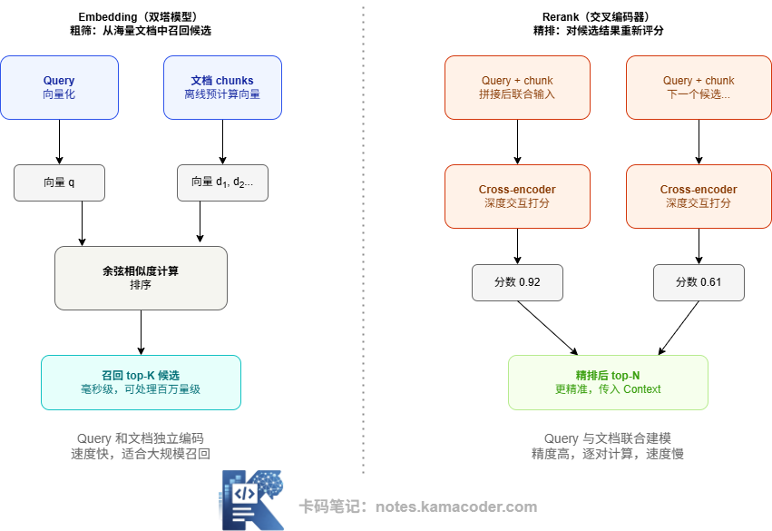

# Embedding 是什么：语义压缩、模型选型、和 Rerank 的区别

> 来源: https://notes.kamacoder.com/llm/app/embedding.html

# `# Embedding 是什么：语义压缩、模型选型、和 Rerank 的区别 
 

前段时间有个录友的分享，对话是这样的： 

面试官：用户问‘出差能不能报销坐飞机’，你的知识库明明有答案，为什么搜不出来？ 

他：可能是关键词没匹配上，我再多加几个同义词。 

面试官：文档里写的是‘民用航空器’，不是‘飞机’，再想想。 

他沉默了几秒：是不是搜索词库不够全？ 

面试官摇摇头：你加再多同义词也没用。你的检索到底在匹配什么？是文字，还是语义？ 

他：我就是按关键词搜索啊...... 

面试官：那用户说‘飞机’，你怎么匹配‘民用航空器’？ 

他：(́◉◞౪◟◉‵)...... 

传统搜索在拼文字，而 Embedding，就是让机器读懂人类的语言。 

今天我们把 Embedding 向量检索，从头到尾拆清楚。  

## `# 一、Embedding 到底是什么？ 

Embedding 是一种将文本（或图片、音频等）映射到高维向量空间的技术。一个句子经过 Embedding 模型处理后，会变成一个由几百到几千个浮点数组成的数组，比如 `[0.23, -0.87, 0.14, ..., 0.56]`（维度通常是 384、768 或 1536 维）。 

关键不在于这串数字本身，而在于它在空间里的**位置**：语义相似的文本，它们的向量在这个高维空间里彼此距离近；语义不相关的文本，距离远。 

这是 Embedding 的核心承诺：**用空间距离来表达语义相似度。** 

下面这张图用二维空间来直觉化这件事。真实的向量是几百到几千维，但投影到二维平面后，语义聚类的模式仍然清晰可见： 

 

图中的每个点都是一段文本经过 Embedding 后在向量空间中的位置。真实维度远不止两维（通常是几百到几千维），但语义聚类的规律是一致的：出行报销类的文档彼此靠近，动物类、编程类各自聚集。 

用户的 Query 向量化后，系统计算它与所有文档向量的距离，找到最近的几个，这就是向量检索的本质。  

## `# 二、Embedding 不是生成文本，是在压缩语义 

这里有一个经常被混淆的概念，值得单独说清楚。 

生成式大模型（如 GPT、Claude）的目标是**输出文字**，给你一段输入，生成下一段内容。 

Embedding 模型的目标完全不同——它的输出不是文字，而是一个**向量表示**，目的是把一段文字的"语义"压缩到一个固定维度的数字数组里，保留语义信息，丢掉格式和措辞细节。 

同一个语义，即使换各式各样的说法，经过一个好的 Embedding 模型，得到的向量应该非常接近。这就是语义搜索能跨越措辞差异找到相关内容的根本原因。  

## `# 三、Embedding 模型怎么选？ 

在实际工程中选 Embedding 模型，有几个维度需要考量： 

**向量维度** 

维度越高，理论上能表达的语义越细腻，但存储开销和检索速度也会相应增加。常见维度有 384 维（轻量）、768 维（均衡）、1536 维（高精度）。大多数中等规模业务选 768 维是合理起点。 

**最大 token 限制** 

每个 Embedding 模型都有输入长度上限，超过上限的内容会被截断。这个限制直接约束了 Chunk 的最大大小。比如 `bge-small-zh` 支持最多 512 token，那你的 chunk 就不能超过这个限制。选模型前一定要核对这个参数。 

**中文支持** 

这是中文 RAG 场景最关键的选型依据。通用的英文 Embedding 模型（如 OpenAI 的 `text-embedding-ada-002`）对中文的支持质量明显不如专门优化过中文的模型。目前中文场景下口碑较好的开源选项包括 BGE 系列和 M3E 系列，都在评测榜上有较好表现。 

**是否支持非对称检索** 

RAG 里有一个典型的非对称场景：Query 是一个简短的问题（"退款政策是什么"），而文档片段是一段较长的说明文字。有些模型为这类非对称的 Query-Document 对做了专门优化，检索效果明显更好，比如 BGE 系列支持为 Query 加特殊前缀 `"Represent this sentence for searching relevant passages:"` 来提升检索效果。  

## `# 四、Embedding 和 Rerank 有什么区别？ 

这是面试里非常高频的一个问题，也是很多初学者模糊的概念。 

二者在 RAG 链路中扮演不同的角色，简单说：Embedding 负责"粗筛"，Rerank 负责"精排"。 

下面这张图展示了两者在链路中的位置和工作机制对比：两者的核心差异在于建模方式： 

 

Embedding 使用**双塔模型（Bi-Encoder）**：Query 和每个文档片段各自独立经过模型编码成向量，然后通过向量距离（余弦相似度）来衡量相关性。这种方式的最大优势是文档向量可以**离线预计算**，存入向量库，检索时只需计算 Query 向量并做近似最近邻搜索，速度极快，可以在毫秒内从百万量级文档里完成召回。 

Rerank 使用**交叉编码器（Cross-Encoder）**：把 Query 和每个候选文档片段**拼接在一起**，作为一个整体输入模型，模型直接输出一个相关性分数。这种方式让模型能看到 Query 和文档之间的完整交互，语义理解更深，精准度更高——但代价是无法预计算，每次都需要逐对推理，只适合对少量候选（top-20 以内）做精排。 

实际 RAG 系统里，两者是流水线关系：Embedding 先从全量文档里快速召回 top-K（可能是 20-50 个），Rerank 再从这些候选里精选出最相关的 top-N（通常 3-5 个）传入 LLM 的 Context。  

## `# 五、中文场景和通用场景的区别 

中文 Embedding 不是把英文模型直接用就行的，主要有几个差异： 

**分词边界**：中文没有天然的空格分词，字符级别的语义表达和英文差异显著，通用模型对中文的语义捕捉能力明显弱于专门训练的中文模型。 

**专业术语**：中文业务场景里大量出现行业专业词（法律条款、医疗术语、金融名词），通用模型往往无法精准表达这些词的语义关系。 

**评估基准**：选中文 Embedding 模型，MTEB（Massive Text Embedding Benchmark）的中文 Retrieval 子任务榜单是重要参考。目前（2025 年）在开源中文模型里，BGE 系列（`BAAI/bge-large-zh-v1.5`、`bge-m3` 等）和 E5 系列表现较为出色。 

选型建议： 

如果是中文业务为主，优先考虑 BGE 系列或 M3E，而不是 OpenAI 的 `text-embedding-ada-002`（后者对中文的支持相对偏弱）。如果需要同时处理中英文双语文档，`bge-m3` 是较好的选择，它专门针对多语言检索做了优化。  

## `# 六、常见误区 

**误区 1："Embedding 模型越大越好"** 

不一定。更大的模型通常精度更高，但推理速度更慢、内存占用更大。对于实时检索场景，一个轻量但针对检索任务专门优化的模型（如 `bge-small-zh`），可能比通用大模型效果更好、成本更低。 

**误区 2："用 OpenAI 的 Embedding 就够了"** 

OpenAI 的 `text-embedding-3-small/large` 在英文场景表现极好，但中文场景建议做评测对比。很多中文业务用专门的中文模型效果更好，同时还能减少对第三方 API 的依赖、降低成本。 

**误区 3："Embedding 和 Rerank 用不同模型没关系"** 

Embedding 模型的选择没有强制约束，但 Rerank 模型最好和 Embedding 模型在训练数据分布上相近，否则两者的评分可能口径不一致，精排效果反而不稳定。 

**误区 4："换了 Embedding 模型不需要重建索引"** 

完全错误。不同 Embedding 模型生成的向量处于不同的语义空间，旧索引里的向量和新模型生成的 Query 向量根本不可比。换了模型，必须重新对所有文档做 Embedding，重建整个向量索引。  

## `# 七、面试可能怎么问 

**Q：Embedding 模型怎么选？** 

参考思路：从四个维度回答。第一，语言场景——中文业务优先选中文优化模型（BGE、M3E），不要直接用英文通用模型；第二，输入长度——模型的最大 token 限制直接决定 chunk 大小的上限；第三，向量维度——根据存储资源和精度要求权衡，768 维通常是合理起点；第四，任务类型——非对称检索（短 Query 找长文档）和对称检索（相似问题匹配）的最优模型不同，要看具体业务场景。 

**Q：Embedding 和 Rerank 有什么区别？** 

参考思路：Embedding（双塔/Bi-Encoder）对 Query 和文档**分别独立**编码成向量，通过向量相似度召回，优点是文档向量可离线预计算、检索极快，可处理百万量级，适合粗筛；Rerank（Cross-Encoder）把 Query 和每个候选文档**拼接后联合**输入，直接输出相关性分数，模型能看到两者的深度交互，精准度更高，但无法预计算、需逐对推理，只适合对少量候选做精排。两者是流水线关系：Embedding 粗筛召回候选池，Rerank 精排过滤出最终传给 LLM 的上下文。  

## `# 八、结语 

Embedding 是 RAG 系统里"让机器理解语义"的核心基础设施。它不是把文字变成数字的简单编码，而是把语义压缩进一个可计算的空间，让相似的意思在空间里相互靠近。理解了 Embedding 的工作原理、选型逻辑以及它和 Rerank 的关系，你就掌握了 RAG 语义层最重要的工程认知。
