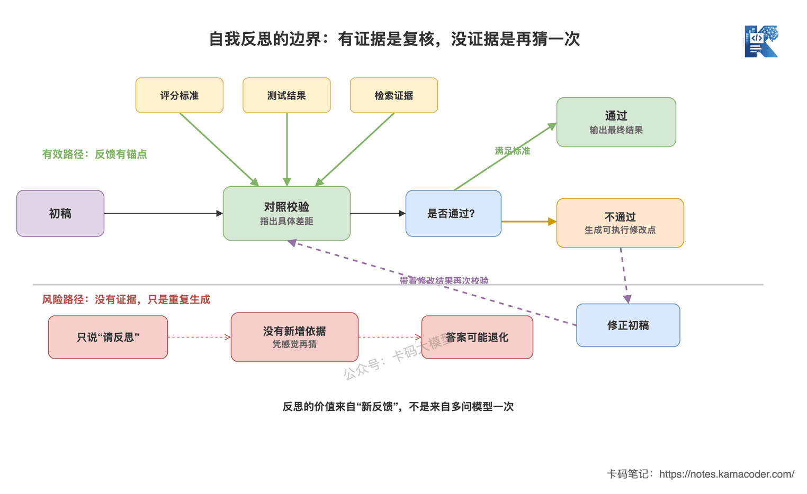

# Few-shot、CoT与自我反思有什么区别？

> 来源: https://notes.kamacoder.com/llm/app/prompt_fewshot_cot_reflection.html

# `# Few-shot、CoT与自我反思有什么区别？ 
 

上一篇《Prompt Engineering不是“写提示词”》讲了结构化Prompt：System放规则，User放请求，动态数据用变量注入，输出格式提前约束。 

但结构写对了，不代表模型就一定能按你的方式完成任务。 

面试官继续问：“Few-shot、CoT和自我反思分别解决什么问题？生产环境怎么选？” 

很多录友上来就是三句：Few-shot是给例子，CoT是一步步思考，自我反思是检查答案。 

没错，但**太浅了**。 

面试官真正想听的是：三种方法分别改了生成链路的哪一段，为什么有效，什么时候用了反而更差。 

## `# 简要回答 
  - **Few-shot**：在上下文里放少量“输入→输出”示例，让模型模仿任务边界、标签、格式和语气，解决“规则写了，但模型不知道你要的成品长什么样”。   - **CoT（Chain-of-Thought）**：让复杂任务先拆步骤、再得结论，解决多跳推理、计算和约束组合时直接猜答案的问题。   - **自我反思**：先生成初稿，再依据评分标准、测试结果或检索证据找错并修改，解决“一次生成没有复核”的问题。 

一句话：**Few-shot负责示范，CoT负责拆解，自我反思负责复核。** 

## `# 详细回答 

### `# 三种方法不是同义词，它们卡在不同位置 


 

这张图回答的是：Few-shot、CoT和自我反思分别在一次生成的哪个位置发力。Few-shot在模型作答前提供参照，CoT改变模型处理问题的过程，自我反思则发生在初稿之后。**作用位置都不一样，不能把它们当成三个可以随便互换的“提示词技巧”。** 

### `# Few-shot：不是让模型学新知识，是给它看“标准件” 

Few-shot Prompting就是在Prompt里放几个示例。 

比如让模型做工单分类，只写规则： 

```
请把用户问题分类为：物流、退款、商品咨询。

```

 

模型知道这三个标签，却不一定知道“快递显示签收但我没收到”到底算物流还是退款。 

加两个示例后就清楚多了： 

```
输入：快递三天没更新了
输出：物流

输入：衣服不合适，钱怎么退回来
输出：退款

输入：快递显示签收但我没收到
输出：

```

 

模型没有因为这两个例子重新训练，也没有更新参数。它只是根据当前上下文里的映射关系，继续生成最符合模式的答案。这通常叫**上下文学习（In-context Learning）**。 


 

这张图回答的是：Few-shot为什么比继续堆抽象规则更容易对齐。示例直接把“什么输入对应什么标签”展示出来，模型归纳的是当前上下文里的映射模式；新请求沿着同一映射得到结果，模型权重没有变化。 

**Few-shot最适合三类任务：** 
  - 标签边界不好用一句规则说清，比如意图分类、内容审核；   - 输出格式特殊，比如固定JSON、SQL风格、简历点评结构；   - 风格要求抽象，比如“像Carl一样直接、口语化”，给成品比堆十条形容词更有效。 

但例子不是越多越好。 

例子选错了，模型会稳定地模仿错误；例子全是同一类，模型可能产生标签偏置；例子和当前问题差太远，占了Token却没有帮助。真实项目里要优先选**正确、边界清楚、和当前请求相似，同时能覆盖不同情况**的示例。 

### `# CoT：让复杂问题先拆，再算，再回答 

CoT是Chain-of-Thought，中文一般叫思维链。 

它适合的不是所有任务，而是**答案依赖多个中间步骤**的任务。 

比如面试官给你一个售后规则：7天内、未拆封、非定制商品才能无理由退款。现在用户的商品买了5天，已经拆封，也不是定制商品。 

如果让模型直接回答“能不能退”，它容易抓住“5天内”就给出错误结论。 

更稳的Prompt不是只加一句“请认真思考”，而是把判断路径写清楚： 

```
请依次检查时间、拆封状态、商品类型三个条件。
先列出每个条件是否满足，再给出最终结论和依据。

```

 

这里真正有价值的不是模型写了一大段“内心戏”，而是**任务被拆成了可检查的中间状态**。 

CoT常见两种方式： 
  - **Zero-shot CoT**：不给推理示例，只要求分步骤分析，成本低，适合先快速验证；   - **Few-shot CoT**：示例里不仅给最终答案，还给正确的拆解路径，适合推理步骤固定、业务规则复杂的场景。 

**简单任务不要硬上CoT。** 情感分类、关键词抽取、固定字段提取，本来一步就能做完。强行让模型长篇推理，只会增加Token、延迟和跑偏机会。 

还有一个常见误区：模型写出的推理过程看起来很顺，不等于答案一定对，也不等于这段文字完整还原了模型内部如何得到答案。生产环境更应该要求它输出**可验证的依据、计算结果、规则命中项或执行计划**，而不是迷信一段漂亮的“思考过程”。 

### `# 自我反思：不是说“再检查一下”就完了 

自我反思的基本链路是： 

**生成初稿→按标准找问题→修改→再次验证。** 

比如模型生成SQL后，不要只让它说“请检查是否正确”，而是给清楚检查项： 

```
请检查这段SQL：
1. 字段是否都来自给定表结构；
2. JOIN条件是否会产生重复数据；
3. WHERE条件是否符合时间范围；
4. 修改后只输出最终SQL和修改点。

```

 

如果还能接入SQL解析器、只读数据库或测试用例，就更靠谱。因为模型不再凭感觉评价自己，而是拿结果去碰真实约束。 


 

这张图回答的是：为什么自我反思必须有证据锚点。有评分标准、测试或检索结果时，反馈能指出具体错误并进入下一轮；如果只有一句“请反思”，模型很可能只是换一种说法，甚至把原本正确的答案改错。 

所以工程里的Reflection至少要有三样东西： 
  - **明确标准**：正确答案要满足什么，不要让模型自由发挥；   - **外部信号**：测试、编译器、数据库约束、检索证据、人工反馈，能接就接；   - **停止条件**：通过校验就停，或者最多修改1到2轮，防止死循环和Token失控。 

这和Agent里的Reflection思路是相通的，但范围不同。这里讲的是一次Prompt调用或短链路里的“生成—批评—修改”；Agent还要处理工具执行、任务状态和多轮记忆，完整模式可以看《ReAct、Reflection、规划执行》。 

### `# 生产环境怎么组合？ 

三种方法可以组合，但不要无脑全开。 

一个比较稳的顺序是： 
  - 先用结构化Prompt把任务、数据、约束和输出格式说清楚；   - 模型仍不理解边界或格式，再加少量高质量Few-shot；   - 任务确实需要多步判断，再要求输出可验证的中间结果；   - 错误代价高，再增加基于规则、测试或证据的反思环节；   - 用固定评测集比较准确率、格式通过率、Token和延迟，不靠“感觉变聪明了”。 

**Prompt技巧不是叠得越多越高级。** 每加一层，都要说明它解决了哪类错误，也要付出上下文、延迟和维护成本。 

## `# 知识拓展 

**Q1：Few-shot和微调有什么区别？** 

Few-shot把示例放在本次请求的上下文里，不改模型参数，改例子就能立刻切任务，但每次调用都要重复消耗Token。微调会用训练数据更新模型参数，前期成本和维护成本更高，适合大量、稳定、重复的行为模式。**能用少量示例解决的，先别急着微调。** 

**Q2：Few-shot的示例是不是越多越好？** 

不是。数量增加会占上下文、拉高成本，还可能把冲突规则和低质量答案一起塞进去。先用2到5个高质量示例做基线，再根据失败案例补边界，不要一上来灌几十个。 

**Q3：CoT必须把完整思维过程展示给用户吗？** 

不需要。业务真正需要的是可复核的结论，不是越长越好的推理文本。可以让模型输出简短的判断依据、命中的规则、计算式或执行计划，再把最终答案单独放进结构化字段。这样更容易校验，也更省Token。 

**Q4：为什么自我反思有时会越改越错？** 

因为同一个模型第一次不知道哪里错，第二次如果没有新增信息，未必突然就知道了。它可能只是因为被要求“找问题”，硬编一个问题再修改。给它测试结果、评分标准或检索证据，反思才有可靠抓手。 

**Q5：面试中怎么回答你做过Prompt优化？** 

不要说“我调了很多版Prompt，效果不错”。要说清楚：原始错误是什么，为什么选择Few-shot、CoT或Reflection，评测集怎么构造，优化前后准确率、格式通过率、平均Token和P95延迟怎么变化。**没有对比数据的Prompt优化，只是手感。** 

Few-shot、CoT、自我反思都不神秘。 

真正拉开差距的，是你知道模型错在了哪一环，只加那一层控制。
