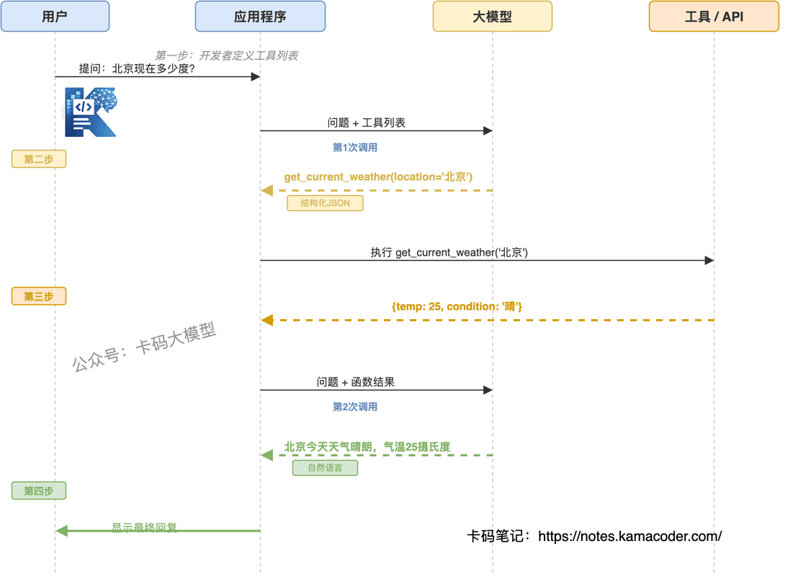

# Function Calling详解：大模型怎么调用工具，为什么是Agent的基础

> 来源: https://notes.kamacoder.com/llm/app/function_calling.html

# `# Function Calling详解：大模型怎么调用工具，为什么是Agent的基础 
 

如果你也打算面试Agent开发岗，那么你至少要知道：Function Calling 是什么？它为什么是 Agent 的前置能力？ 

## `# 一、什么是 Tool / Function？ 

在大模型应用的语境下，**Tool（工具）** 或 **Function（函数）**，本质上是**一段预先定义好的代码逻辑**，大模型本身并不执行它，而是**告诉应用程序该执行哪段代码**。 

Function Calling即调用外部函数。 

我们知道大模型是在一个巨大的静态数据集上训练的。知识、能力、精确性都有局限性。如deepseekR1在2025年发布时，其训练数据截止于2023年12月，单从数据来看，再聪明的模型肯定不知道未来发生了什么。 

Function Calling就是给这个聪明的“大脑”配备了“手”和“脚”，让它能够与外部世界互动，从而克服上述局限性。 

## `# 二、和普通问答有什么区别？ 

普通问答与 Function Calling 有本质区别。简单来讲，普通问答是“说”，Function Calling是“做”。 

| 维度  普通问答 (Chat Completion)  Function Calling (Tool Use) 
| **输出内容**  纯自然语言文本  **结构化数据** (JSON/Object)，明确指定函数名和参数 
| **知识来源**  仅依赖训练数据 (截止训练日)  **实时外部数据** (通过工具获取) 
| **准确性**  容易幻觉 (瞎编数据)  **高可信度** (基于真实 API 返回) 
| **执行动作**  无法执行动作，只能“说”  可以**触发行动** (下单、发邮件、查库) 
| **可控性**  输出格式难以严格约束  输出格式**严格遵循JSON**，便于程序解析 
| **典型场景**  闲聊、写作、翻译、总结  查询实时信息、操作业务系统、多步任务规划 

## `# 三、模型“调用工具”本质上发生了什么？ 

Function Calling的工作流程可以大概分为4步骤： 

 

**第一步：开发者定义和提供工具（Functions）** 

在最开始，你需要告诉大模型它有哪些“工具”可用。这就像你给一个助手一个工具箱，并告诉他每个工具的作用。 

**第二步：大模型响应，返回函数调用指令** 

当用户提出一个请求（例如：“北京现在多少度？”），你的应用程序将用户的问题和上述工具列表一起发送给大模型。大模型在处理请求后，会识别出它需要调用一个外部工具来获取信息。它的响应不会是常规的文本回复，而是一个结构化的函数调用参数。 

**第三步：应用程序执行函数并再次调用大模型** 

这是整个流程中最关键的步骤。你的应用程序代码接收到大模型的响应后，需要完成检查响应、解析指令、执行函数、再次调用大模型等工作。 

**最后一步**，大模型接收到所有这些信息后，会利用函数执行的结果，生成一个自然流畅的最终回复给用户：“北京今天天气晴朗，气温25摄氏度。” 

### `# 上例流程解析 
  - **意图识别与参数提取**：模型在第一轮交互中并没有回答天气，而是输出了一段**结构化数据（通常是 JSON）**，告诉你：“我需要调用 `get_current_weather` 函数，参数 `location` 是 `北京`”。   - **控制权交接**：此时，生成的主动权交还给了你的代码。你的程序解析这段 JSON，发现要调用`get_current_weather`函数，于是在你的服务器环境里执行它。   - **结果回填**：你把函数执行的真实结果（`{"temp": 25, "condition":"晴"}`）以JSON格式再次发给模型。   - **最终合成**：模型看到结果后，结合上下文，用自然语言总结出最终答案。 

## `# 四、为什么 Function Calling 是 Agent 的基础？ 

如果说大模型是“大脑”，那么 Function Calling 就是“神经系统”，连接着大脑和手脚（工具）。没有它，Agent 就只是一个“只会动嘴不会动手”的小笨蛋。 

### `# 1. “被动回答”->“主动行动” 

没有 Function Calling：你问它“怎么订会议室？”，它会给你写一篇《订会议室指南》。有了 Function Calling后：你问它“帮我订明天下午 3 点的 A 会议室”，它会调用开发者设定好的函数`book_room(time="15:00", room="A")`，真正完成预订，并返回订单号。 

这就是Agent（智能体）产生的质变——能够感知环境并采取行动以实现目标的实体。 

### `# 2. 复杂任务规划的前提 (ReAct 模式) 

高级Agent往往需要多步推理（Plan & Solve）。例如：“分析上个月销售数据，如果低于目标，就给销售经理发邮件。”这需要模型具备链式调用能力，连续准确地**选择工具**并**提取参数**： 
  - 

先调用 `query_sales_data(month="last")`。   - 

**根据返回结果进行逻辑判断**（模型内部推理）。   - 

如果条件满足，再调用 `send_email(to="manager", content=...)`。 

如果Function Calling不准，整个链条就会断裂。 

### `# 3. 解决“幻觉”与“时效性”的有效方案 

Agent 的核心价值是解决实际问题，而实际问题往往涉及私有数据或实时状态。 

靠微调（Fine-tuning）让模型记住所有库存信息？不可能，数据天天变。靠 Prompt 把几百万行数据塞进去？nonono，上下文有限且昂贵。通过 Function Calling，让模型在需要时按需定向查询。这让 Agent 拥有了“无限的知识库”和“实时的感知力”。 

## `# 五、面试官可能怎么问？ 

准备面试时，这几个问题是高频考点： 
  - 

**“请简述 Function Calling 的工作流程。”** 

不要只说“模型调函数”。要强调“模型结构化输出（JSON） -> 程序拦截并执行 -> 结果回传 -> 模型生成最终回复”的流程。   - 

**“如果模型调用了错误的工具，或者参数提取错了，怎么办？”** 

提到**重试机制**（让模型根据错误信息重新思考）、**Few-Shot Prompting**（在提示词中给出正确调用的示例）、以及**工具描述的优化**（更清晰的参数定义）等。   - 

**“Function Calling和普通的Prompt指示（如‘请调用 API’）有什么区别？”** 

强调**结构化输出**和**可靠性**。普通指示模型可能会编造 API 调用过程，而 Function Calling 强制模型输出符合 Schema 的 JSON，程序可精准解析执行。  

## `# 六、总结 

Function Calling是一套**严谨的工程协议**。它让应用开发从**“生成文本”**变成了**“执行业务”**，是构建Agent的绝对基石。
