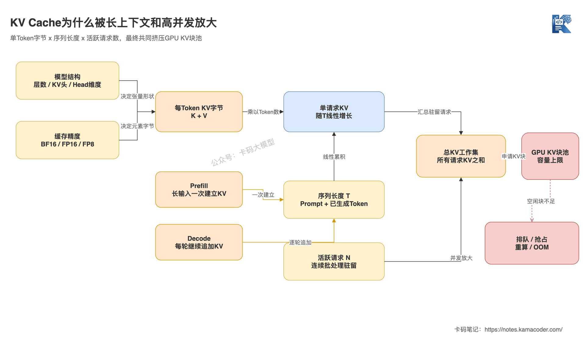
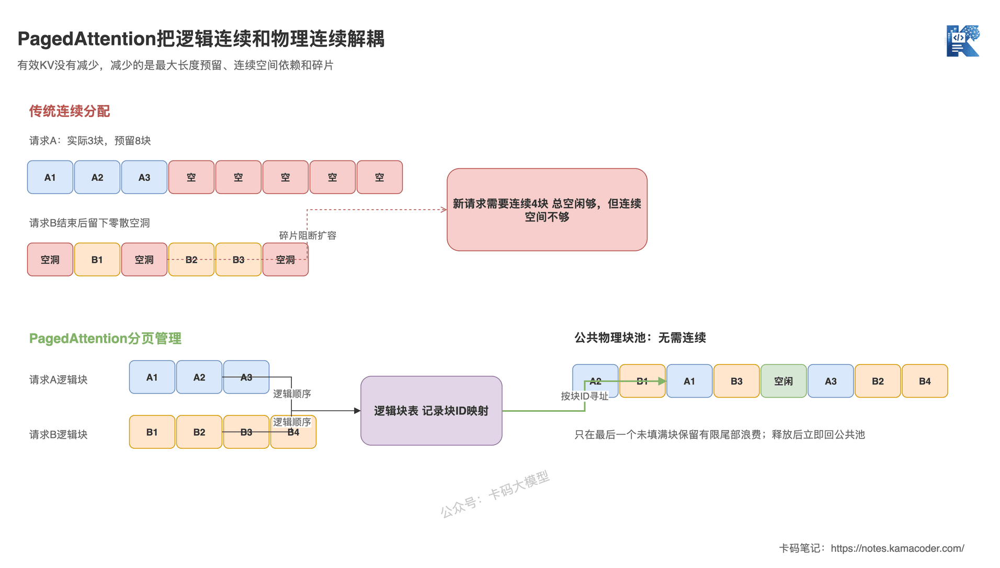
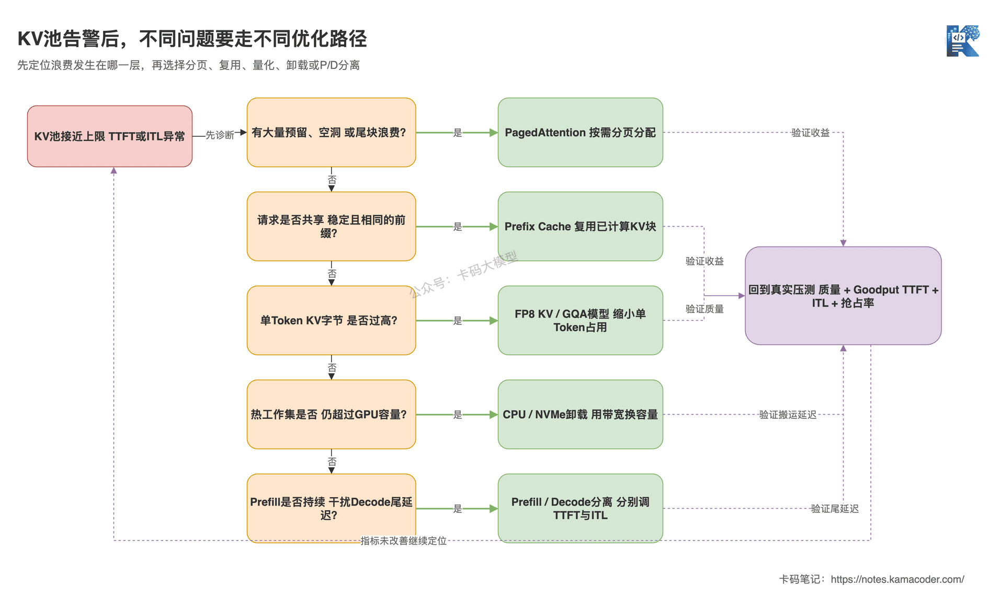

# KV Cache为什么会吃光显存？从PagedAttention到Prefix Cache

> 来源: https://notes.kamacoder.com/llm/app/kv_cache_paged_attention.html

# `# KV Cache为什么会吃光显存？从PagedAttention到Prefix Cache 
 

上一篇《云API、托管推理还是自部署？大模型部署方案怎么选》讲了部署模式和责任边界。 

但很多团队真正开始自部署后，会马上撞上第二个问题：**模型权重明明已经放进GPU，为什么并发几个长请求，显存还是被迅速吃光？** 

面试官问：“KV Cache为什么占显存？PagedAttention和Prefix Cache分别解决什么问题？” 

很多录友会回答：“KV Cache保存历史Token，PagedAttention负责省显存，Prefix Cache负责加速。” 

方向没错，但还缺最关键的工程边界： 
  - KV Cache到底按什么公式增长；   - 长上下文和高并发为什么会互相放大；   - PagedAttention省掉的是碎片和预留，不是有效KV数据；   - Prefix Cache减少的是重复Prefill，不能加速所有Decode；   - 显存真的不够时，量化、卸载和分离式推理又分别在换什么。 

## `# 简要回答 
  - **KV Cache**保存每一层注意力中历史Token的Key和Value。Prefill一次性为输入建立缓存，Decode每生成一个Token继续追加缓存，避免每一步都重算全部历史。   - 标准注意力下，KV Cache大致与层数、KV头数、Head维度、序列长度、并发请求数和数据精度成正比。上下文翻倍，单请求缓存接近翻倍；并发翻倍，总缓存也接近翻倍。   - **连续批处理**让请求按生成迭代动态进入和退出批次，提高GPU利用率，但同时驻留的请求越多，KV Cache工作集越大，最终并发上限经常由KV块数量决定。   - **PagedAttention**把KV Cache切成固定大小的块，按需分配并通过块表寻址，主要减少连续预留、外部碎片和尾部浪费；它不会压缩每个有效Token的KV数据。   - **Prefix Cache**复用完全相同前缀对应的KV块，跳过重复前缀的Prefill计算；它对公共System Prompt、Few-shot和共享文档有效，对不同前缀和后续Decode帮助有限。 

一句话：**PagedAttention解决“怎么装得更紧”，Prefix Cache解决“哪些前缀不用重复算”，量化和卸载才是在改变每份KV的大小或存放位置。** 

## `# 详细回答 

### `# 为什么生成下一个Token还要保存前面的K和V？ 

自回归模型一次只生成一个新Token。 

生成第`t`个Token时，新Token的Query需要和前面所有Token的Key做注意力计算，再用注意力权重汇总对应的Value。如果不缓存，模型每生成一步，都要重新计算历史Token在每一层的Key和Value。 

序列越长，重复计算越夸张。 

KV Cache做的事情很直接： 
  - Prefill阶段处理完整输入，并保存每一层的K和V；   - Decode阶段只计算新Token的Q、K、V；   - 新Query直接读取历史KV，再把新Token的K和V追加进去。 

所以KV Cache是典型的**用显存换计算**。没有它，显存压力小一些，但Decode会不断重算历史，生成速度根本扛不住。 

### `# 一条请求的KV Cache到底有多大？ 

对常见的标准注意力、MHA或GQA模型，可以先用下面的近似公式建立直觉： 

```
单请求KV Cache字节数
≈ 2 × 层数 × Token数 × KV头数 × Head维度 × 每元素字节数

```

 

前面的`2`代表Key和Value两份张量。 

假设一个模型有32层、8个KV头、Head维度128，KV使用BF16，每个元素2字节： 

```
每Token KV Cache
= 2 × 32 × 8 × 128 × 2 Byte
= 131072 Byte
≈ 128 KiB

```

 

那么： 
  - 8K Token约占1 GiB；   - 32K Token约占4 GiB；   - 128K Token约占16 GiB。 

这还只是一条请求。8条32K请求同时驻留，理论KV数据就接近32 GiB。 

真实部署还要给模型权重、CUDA Graph、激活、中间工作区、通信缓冲和运行时预留显存。Tensor Parallel如何切分KV头、模型是否采用MQA、GQA、MLA或滑动窗口，也会改变每张卡的实际占用，所以公式用于容量初算，最终仍要以引擎指标和压测为准。 

**真正容易忽略的是：模型权重是相对静态的，KV Cache却是随请求实时增长的动态工作集。** 

### `# Prefill、Decode和连续批处理怎么把压力放大？ 

Prefill和Decode消耗显存的方式不一样。 

前文《Token、成本与延迟：大模型应用的三个硬约束》已经拆过TTFT和TPOT，这里把它们继续落到GPU显存上。 

长Prompt进入Prefill后，会快速建立一大段KV Cache，所以长上下文请求可能在刚入场时就申请大量KV块。Decode每轮只追加少量Token，但请求迟迟不结束，缓存会一轮一轮继续增长。 

现代推理引擎通常还会做连续批处理，也叫Iteration-level或In-flight Batching：每轮Decode后，完成的请求退出，新请求立即加入，不必等整个固定Batch全部结束。Orca论文把这种思想称为迭代级调度。 

它提高了GPU利用率，却也让KV池成为调度中心： 

```
总KV Cache
≈ 所有活跃请求已处理Token数对应的KV之和

```

 

当空闲KV块不足时，新请求只能排队；部分引擎会抢占已有请求并在之后重算或恢复；管理不当时就直接OOM。于是你会看到一个很典型的现象：GPU计算单元还没有持续跑满，服务却已经因为KV容量不足接不进更多请求。 


 

这张图回答的是：KV Cache压力如何从单Token经过序列长度和活跃请求数逐层放大。Prefill让长输入一次占入大量缓存，Decode持续追加，连续批处理又让更多请求同时驻留，最终把有限的GPU KV池推到排队、抢占或OOM。 

### `# 为什么传统连续分配会浪费大量显存？ 

请求的最终长度在开始时并不知道。 

如果每条请求都按最大长度预留一块连续显存，短请求会留下大量未使用空间；如果只按当前长度分配，序列增长时又需要寻找更大的连续区域。请求不断进入和退出后，空闲显存可能散落在多个小洞里，总量看着够，却找不到合适的连续空间。 

这里有三类浪费： 
  - **过度预留**：按最大长度申请，实际只用了很短一段；   - **内部碎片**：分配单元内部没有填满；   - **外部碎片**：空闲空间被切散，无法满足连续申请。 

PagedAttention论文  (opens new window)借鉴操作系统分页：把一条序列的KV Cache切成固定Token数的逻辑块，再通过块表映射到不连续的物理显存块。 

这样做之后： 
  - 序列增长时按需增加块，不用一开始按最大长度预留；   - 不同请求释放的物理块可以立刻回到公共池；   - 一条逻辑连续的序列，可以落在不连续的物理块上；   - 多个序列的公共KV块还可以通过引用计数共享。 


 

这张图回答的是：PagedAttention为什么能缓解显存碎片。上方的连续分配路径被最大长度预留和零散空洞卡住；下方通过逻辑块表把序列映射到公共物理块池，只在最后一个未填满的块留下有限尾部浪费。 

但别把它说成“PagedAttention把KV Cache压缩了”。 

**对同一个模型、同一批有效Token和同一精度，K和V本身没有少。** PagedAttention优化的是分配、回收、共享和寻址，让更多有效KV能装进同一块GPU，而不是让每个Token凭空变小。 

它也不是完全没有代价。分页需要块表和专门的注意力访问路径，块大小还会影响尾部浪费、调度粒度和内核效率。现代引擎会把这些细节封装掉，但做性能对比时仍要看具体版本、Attention Backend和工作负载。 

### `# Prefix Cache为什么不是另一个PagedAttention？ 

PagedAttention关心的是“KV块放在哪里”。Prefix Cache关心的是“这个KV块以前是不是已经算过”。 

假设大量请求都包含同一个长System Prompt、相同Few-shot示例或同一份文档： 

```
公共前缀 + 用户问题A
公共前缀 + 用户问题B
公共前缀 + 用户问题C

```

 

如果每条请求都从头Prefill，公共前缀会被重复计算多次。Prefix Cache把已经计算完成的前缀KV块保留下来，新请求命中相同前缀后，直接复用这些块，只计算后面不同的部分。 

vLLM的Automatic Prefix Caching设计  (opens new window)会结合父块哈希、当前块Token和LoRA、多模态输入等额外信息标识缓存块，并且只缓存完整块。多租户环境还要用Cache Salt隔离复用范围，避免不同信任域通过延迟差异推测缓存内容。 

Prefix Cache主要带来两个收益： 
  - 减少重复Prefill计算，降低命中请求的TTFT；   - 相同前缀可以共享物理KV块，避免每条请求都复制一份。 

它的边界同样明确： 
  - Token序列必须一致，语义相近但Token不同不能命中；   - 动态时间戳、随机ID放在Prompt前面，会让后面的大段内容一起失去命中；   - 它不能减少用户问题和输出部分的Decode计算；   - 热前缀需要占用缓存容量，低价值缓存最终仍会被淘汰；   - 命中率高不等于吞吐一定高，Decode或显存带宽可能已经成为新瓶颈。 

所以工程上常把稳定内容放在Prompt前部，把每次变化的字段尽量后移。但不能为了命中率打乱指令优先级、权限边界和业务语义。 

### `# 显存还是不够，量化、卸载和分离式推理怎么选？ 

这些方案解决的不是同一个问题。 

| 方案  主要解决什么  典型收益  主要代价 
| PagedAttention  预留和碎片浪费  提高KV池有效利用率和可服务并发  块管理与内核路径更复杂 
| Prefix Cache  公共前缀重复计算和复制  降低命中请求TTFT，复用KV块  依赖重复前缀，占用缓存容量 
| FP8 KV Cache  每个Token的KV字节数过高  相比BF16/FP16原始数据通常接近减半  需要硬件和内核支持，必须做质量校准 
| CPU、NVMe或远端卸载  GPU工作集装不下  用更大、更便宜的存储扩展容量  数据传输增加延迟，受PCIe或网络带宽约束 
| Prefill/Decode分离  两阶段资源特征和延迟目标互相干扰  分别调优TTFT与ITL，控制尾部ITL  需要传输KV，架构和调度更复杂 

vLLM的量化KV文档  (opens new window)支持FP8 KV Cache，并建议通过校准获得更可靠的缩放因子。精度从16位降到8位，KV主体数据的理论占用接近减半，但真实节省还要考虑Scale、对齐、临时缓冲和具体内核。 

TensorRT-LLM的KV Cache Connector  (opens new window)把CPU内存、NVMe和网络存储作为更低层级的缓存空间，也支持在不同实例间传输KV。容量变大了，但一次Cache Miss可能触发昂贵的数据搬运，所以卸载更适合有明显冷热分层、复用价值高或GPU容量特别紧张的负载。 

Prefill通常更偏计算密集，Decode更受显存带宽和逐Token调度影响。将两者拆到不同实例，可以分别扩容和调优。不过vLLM的分离式Prefill文档  (opens new window)明确提醒：它的主要目标是分别调优TTFT和ITL、控制尾部ITL，并不直接保证吞吐提升。 


 

这张图回答的是：看到KV池告警后应该先判断哪种浪费。碎片走分页，重复前缀走Prefix Cache，单Token太大再看量化，冷热工作集超过GPU才考虑卸载；只有Prefill和Decode互相干扰时，才进入分离式推理。 

### `# 项目里应该按什么顺序优化？ 

第一步不是立刻打开所有开关，而是把容量账算清楚。 

至少记录： 
  - 模型权重和非KV显存占用；   - KV Cache总块数、使用率和可用块数；   - 活跃请求数、排队请求数和每条序列长度；   - Prefix Cache命中Token数和命中率；   - 抢占、重算、Swap或Cache Miss次数；   - TTFT、TPOT或ITL、P95/P99和SLO内Goodput。 

这些指标怎么设计压测负载，可以继续对照《部署、推理、压测核心指标》。 

然后按下面的顺序处理： 
  - **先限制失控输入**：校验最大上下文、最大输出和单租户并发，避免一个请求把整池KV吃掉；   - **先减少管理浪费**：启用成熟的分页KV管理和连续批处理，用真实长度分布压测调度参数；   - **再提高复用**：整理稳定前缀，观察命中Token而不是只看请求命中数，同时做好租户隔离；   - **再缩小每Token占用**：评估FP8 KV Cache或选择采用GQA、MQA的模型，必须回归长上下文质量；   - **最后扩大存储层级或拆服务**：只有GPU容量、TTFT和ITL的瓶颈证据足够明确，才引入卸载或Prefill/Decode分离。 

优化成功不能只看“没有OOM”。 

如果Prefix Cache让TTFT下降，却把大量低复用块留在池里，导致高峰期抢占增加；或者FP8让并发上去了，却让长文档问答准确率下降，这都不算成功。最终要比较的是：**质量门槛内，SLO达标请求的Goodput和每个成功任务成本有没有改善。** 

## `# 知识拓展 

**Q1：KV Cache、Prefix Cache和Prompt Cache是一回事吗？** 

KV Cache是模型推理过程中的K/V张量。Prefix Cache是一种跨请求复用KV Cache的机制。云API里的Prompt Cache是产品层能力，底层可能复用类似结果，也可能有不同的持久化、计费和淘汰实现，不能直接等同于某个引擎的Prefix Cache。 

**Q2：开启PagedAttention后，显存占用为什么看起来还是很高？** 

很多引擎会预先建立较大的KV块池，把空闲显存尽量留给后续请求。监控里的“已保留显存”不等于“都被有效Token占用”，要同时看KV块使用率、可用块数和活跃Token数。 

**Q3：Prefix Cache命中后，为什么TPOT没有明显下降？** 

Prefix Cache跳过的是共享前缀的Prefill，所以最直接改善的是TTFT。TPOT主要取决于后续Decode、Batch大小、显存带宽和调度干扰，不能期待前缀命中把每个输出Token都加速。 

**Q4：KV Cache量化一定不会影响效果吗？** 

不能这样承诺。不同模型、层类型和任务对K/V误差的敏感度不同。要用真实长上下文集比较准确率、召回、困惑度或业务指标，还要观察量化与反量化是否让TPOT变差。 

**Q5：模型支持128K上下文，就能同时跑很多条128K请求吗？** 

上下文窗口说明单条请求在模型和服务配置上允许多长，不代表GPU能高并发承载这个长度。容量规划要把单请求KV大小乘上活跃请求数，再扣除权重和运行时显存。 

**Q6：面试里怎么回答“KV Cache怎么优化”？** 

先用公式说明容量由层数、KV头、维度、长度、并发和精度决定；再区分分页、复用、量化、卸载和分离式推理各自解决的瓶颈；最后落到监控指标和压测证据。不要只报一串框架参数。 

本文涉及的实现现状核验于2026年8月，参考文献： 

PagedAttention论文：https://arxiv.org/abs/2309.06180 

Orca论文：https://www.usenix.org/conference/osdi22/presentation/yu 

vLLM Prefix Cache设计：https://docs.vllm.ai/en/latest/design/prefix_caching/ 

vLLM量化KV文档：https://docs.vllm.ai/en/latest/features/quantization/quantized_kvcache/ 

vLLM分离式Prefill文档：https://docs.vllm.ai/en/latest/features/disagg_prefill/ 

TensorRT-LLM KV Cache Connector：https://nvidia.github.io/TensorRT-LLM/features/kv-cache-connector.html 

别再把“打开PagedAttention”当成KV Cache优化的完整答案。 

能判断显存浪费发生在分配、复用、精度、存储层级还是调度阶段，才算真正懂大模型推理。
