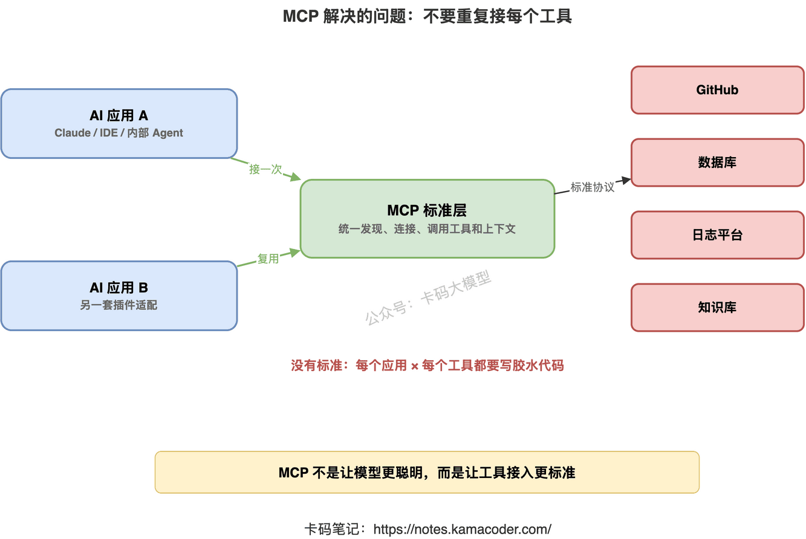
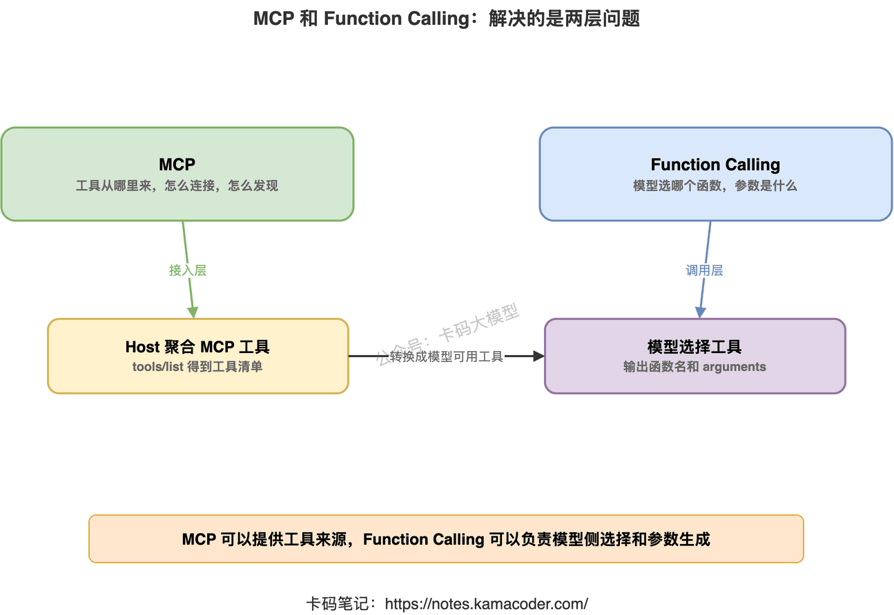
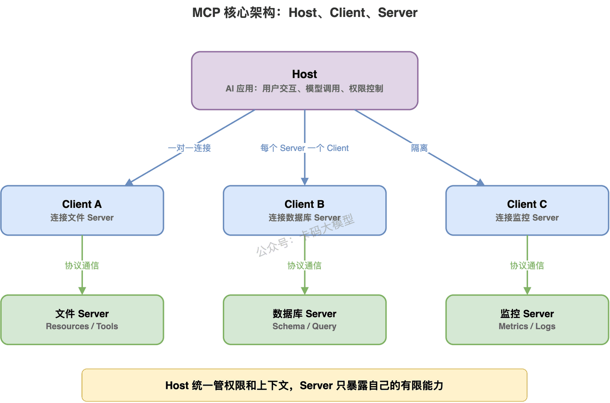
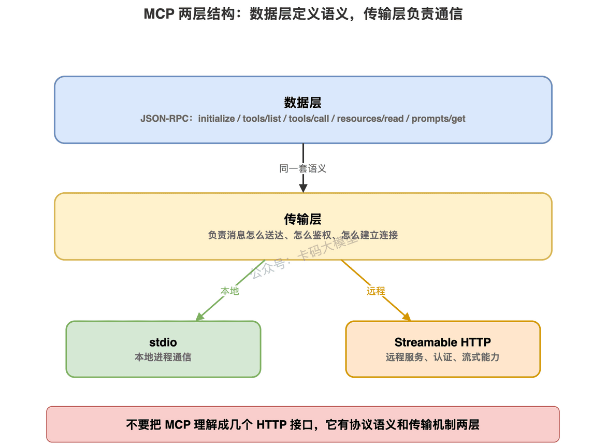
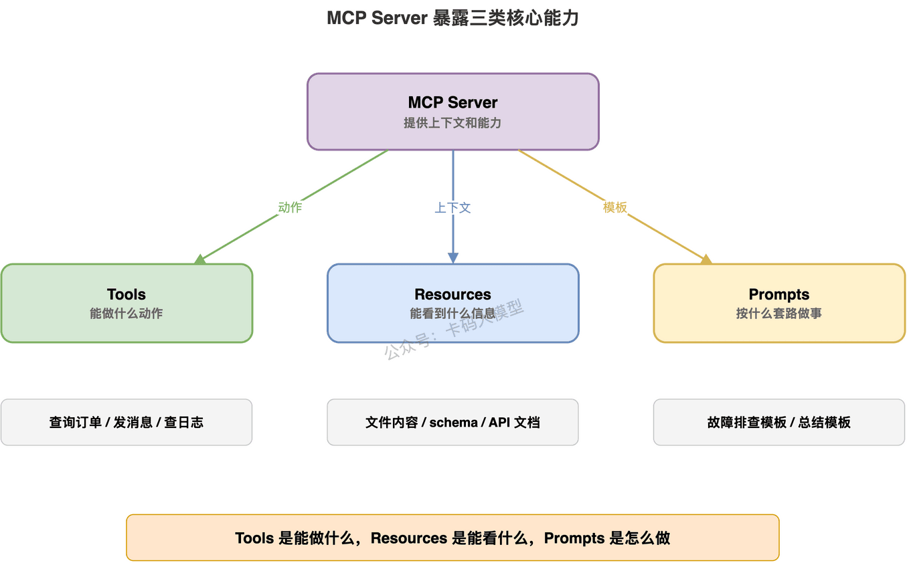
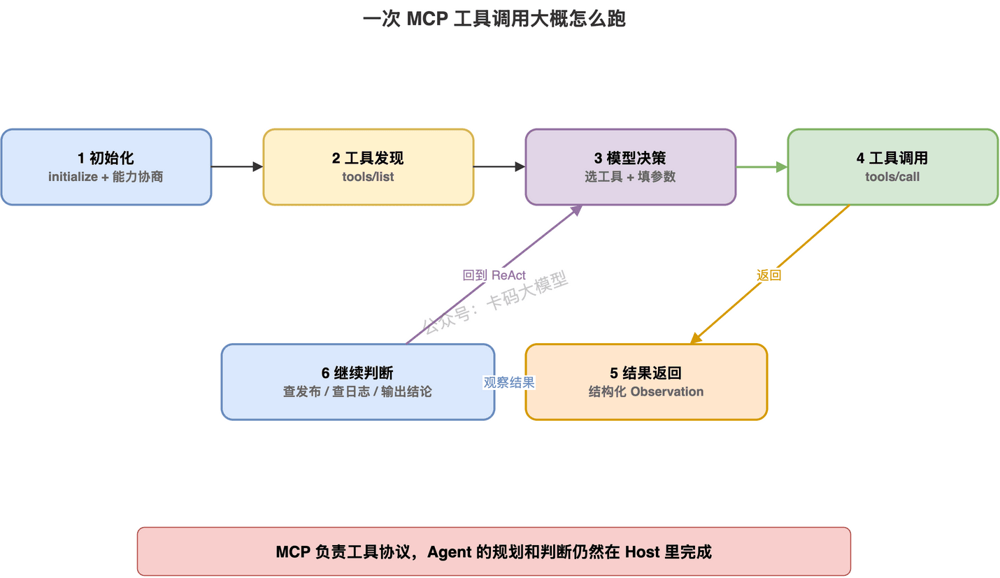
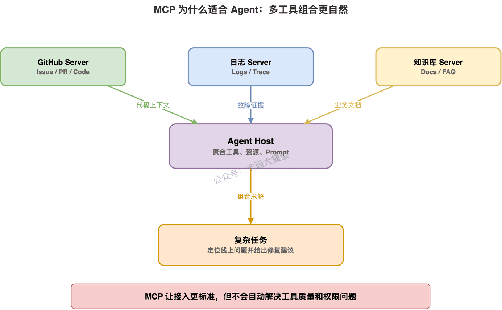
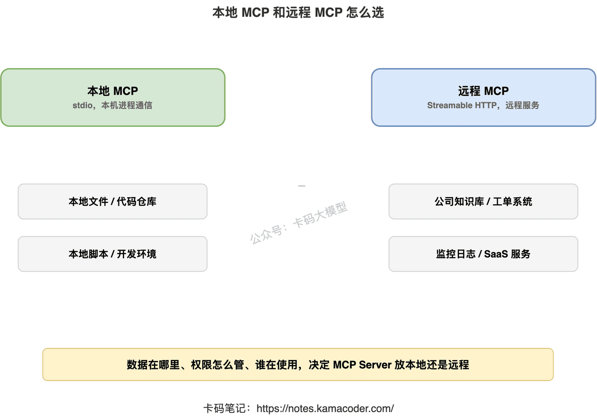
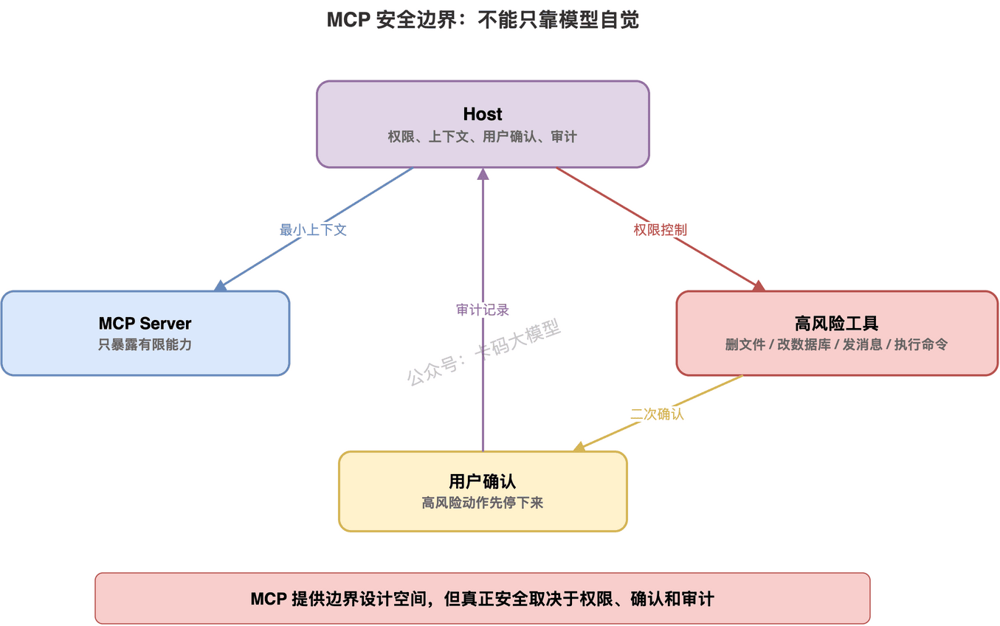

# MCP协议：Agent工具调用的新标准

> 来源: https://notes.kamacoder.com/llm/app/mcp_protocol.html

# `# MCP协议：Agent工具调用的新标准 
 

上一篇我们讲了 工具设计决定 Agent 上限。 

核心就一句话：**工具不是 API 列表，而是 Agent 的行动边界。** 

工具描述、参数 Schema、返回值、权限边界、错误恢复，这些东西设计不好，Agent 一定会乱。 

但讲到这里，录友很容易继续问： 

“如果每个工具都要自己接，那不同工具、不同产品、不同模型之间，岂不是又要重复造轮子？” 

没错。 

这就是 MCP 要解决的问题。 

现在很多 Agent 项目最大的问题，不是模型不会调用工具，而是工具接入太碎。 

接 GitHub 要写一套。 

接数据库要写一套。 

接本地文件要写一套。 

接 Slack、飞书、Notion、Jira、Sentry，又各写一套。 

今天给 Claude 接一遍，明天给 Cursor 接一遍，后天给自己公司内部 Agent 再接一遍。 

越做越像胶水工程。 

所以这篇我们来讲一个现在 Agent 面试越来越容易被问到的东西： 

**MCP，Model Context Protocol。** 

你可以先把它理解成一句话： 

**MCP 是一套标准协议，用来让 AI 应用以统一方式连接外部工具、数据和提示模板。** 

注意，它不是模型。 

也不是 Agent 框架。 

它更像是 Agent 时代的“工具接入协议”。 


 

## `# 一、为什么会有 MCP 

先别急着背架构。 

我们先看没有 MCP 的世界是什么样。 

假设你要做一个代码助手，让它能完成这些事： 
  - 读本地文件   - 搜 GitHub Issue   - 查数据库   - 看 Sentry 报错   - 发 Slack 消息   - 读公司知识库 

如果没有统一协议，每接一个系统，都要自己定义一套工具格式： 
  - 工具怎么发现？   - 参数 Schema 怎么描述？   - 工具怎么调用？   - 工具结果怎么返回？   - 工具权限怎么控制？   - 本地工具和远程工具怎么通信？   - 工具变了，客户端怎么知道？ 

这些问题如果每个产品都自己解决，就会非常乱。 

对工具提供方也很痛苦。 

比如你做了一个数据库查询工具。 

你想让 Claude Desktop 能用。 

想让 Cursor 能用。 

想让 VS Code 里的 AI 插件能用。 

想让公司内部 Agent 也能用。 

难道每个宿主都写一套插件？ 

这就太浪费了。 

MCP 的思路是： 

**工具提供方按 MCP 标准暴露能力，AI 应用按 MCP 标准连接这些能力。** 

这样工具和 AI 应用之间就有了一层统一协议。 

就像前后端之间用 HTTP API 通信。 

就像数据库客户端通过统一协议连接数据库。 

MCP 解决的不是“模型怎么推理”。 

它解决的是：**AI 应用怎么标准化地拿到上下文、调用工具、使用提示模板。** 

## `# 二、MCP 不是 Function Calling 的替代品 

很多录友第一次听 MCP，会把它和 Function Calling 混在一起。 

这俩有关系，但不是一回事。 

Function Calling 解决的是： 

**模型这一次响应里，要不要调用某个函数，以及参数是什么。** 

它更贴近模型调用层。 

比如你把工具定义发给模型，模型返回： 

```
{
  "name": "get_order_detail",
  "arguments": {
    "order_id": "202605200001"
  }
}

```

 

然后你的程序执行这个函数，把结果再发回模型。 

这是 Function Calling。 

MCP 解决的是另一个层面： 

**这些工具从哪里来？怎么发现？怎么连接？怎么通信？怎么暴露给不同 AI 应用？** 

也就是说，Function Calling 更像“模型和工具之间的一次调用格式”。 

MCP 更像“AI 应用和工具服务器之间的一套连接协议”。 

可以这么理解： 

**Function Calling 关注模型怎么调用工具。** 

**MCP 关注工具怎么标准化接入 AI 应用。** 

它们不是互斥关系。 

很多 AI 应用会先通过 MCP 发现工具，再把这些工具转换成模型可用的 Function Calling / Tool Use 格式，让模型决定调用哪一个。 


 

这也是面试里最容易问的点。 

如果面试官问： 

“MCP 和 Function Calling 有什么区别？” 

你不要回答： 

“MCP 更高级。” 

这很虚。 

你应该说： 

“Function Calling 是模型侧的工具调用机制，重点是模型输出哪个函数和参数；MCP 是应用侧的工具接入协议，重点是 AI 应用如何发现、连接和调用外部工具、资源和提示模板。实际系统里，MCP 可以作为工具来源，Function Calling 可以作为模型选择和调用工具的方式。” 

这个回答就稳。 

## `# 三、MCP 的核心架构：Host、Client、Server 

MCP 官方架构里有三个角色： 

**Host、Client、Server。** 

这三个词一定要分清。 

否则一讲 MCP 就容易乱。 

### `# 1. Host：AI 应用本体 

Host 就是用户真正使用的 AI 应用。 

比如： 
  - Claude Desktop   - Claude Code   - VS Code 里的 AI 插件   - Cursor 这类代码助手   - 公司自己做的 Agent 平台 

Host 负责用户交互、模型调用、权限决策、上下文聚合。 

简单说，Host 是“大脑所在的应用壳”。 

用户不是直接跟 MCP Server 聊。 

用户是在 Host 里提问。 

### `# 2. Client：Host 里负责连接某个 Server 的组件 

MCP Client 不是一个独立产品。 

它通常是 Host 里面的一段连接组件。 

一个 Host 可以连接多个 MCP Server。 

每连接一个 Server，Host 里通常就会创建一个对应的 Client。 

所以 Client 的职责是： 
  - 和某个 MCP Server 建立连接   - 做协议版本和能力协商   - 发送工具列表请求   - 发送工具调用请求   - 接收结果和通知   - 维护这条连接的安全边界 

你可以把它理解成： 

**一个 MCP Client 对应一个 MCP Server 的连接通道。** 

### `# 3. Server：提供工具、资源和提示模板 

MCP Server 是真正提供能力的一方。 

比如： 
  - 文件系统 Server：暴露读文件、列目录等能力   - GitHub Server：暴露 issue、PR、代码仓库能力   - 数据库 Server：暴露 schema、查询工具   - Sentry Server：暴露错误事件和监控能力   - 公司内部 Server：暴露订单、工单、知识库、日志平台 

Server 不负责和用户聊天。 

Server 只负责按 MCP 协议提供能力。 

这些能力主要有三类： 

**Tools、Resources、Prompts。** 

后面我们单独讲。 


 

这套架构最大的好处是隔离。 

一个 Host 可以连接多个 Server。 

但每个 Server 不应该直接看到全部对话，也不应该随便访问其他 Server 的数据。 

Host 负责统一管理权限和上下文。 

Server 只暴露自己该暴露的能力。 

这点很关键。 

MCP 不是让所有工具互相打通。 

**MCP 是让 Host 在可控边界内组合多个工具服务器。** 

## `# 四、MCP 有两层：数据层和传输层 

很多人讲 MCP，只讲“它能接工具”。 

这太浅了。 

MCP 至少要理解两层： 

**数据层**和**传输层**。 

### `# 1. 数据层：定义消息和语义 

数据层负责定义： 
  - 初始化怎么做   - 能力怎么协商   - 工具怎么列出   - 工具怎么调用   - 资源怎么读取   - Prompt 怎么获取   - 通知怎么发送   - 错误怎么返回 

MCP 的数据层基于 JSON-RPC。 

比如工具发现可以是 `tools/list`。 

工具调用可以是 `tools/call`。 

资源读取可以是 `resources/read`。 

Prompt 获取可以是 `prompts/get`。 

注意，MCP 不是随便用 HTTP 路径写几个接口。 

它有自己的协议方法、请求结构和响应结构。 

### `# 2. 传输层：定义消息怎么传 

传输层负责把这些 JSON-RPC 消息送过去。 

常见有两种： 

**stdio。** 

本地进程之间通过标准输入输出通信。 

比如 Claude Desktop 启动一个本地文件系统 MCP Server，然后通过 stdio 和它通信。 

这种方式适合本地工具，性能好，不需要网络。 

**Streamable HTTP。** 

通过 HTTP 和远程 Server 通信，也可以支持流式能力和标准鉴权。 

比如连接远程的 Sentry MCP Server、公司内部 MCP 网关。 

这种方式适合远程服务、多用户场景、需要认证授权的场景。 


 

所以你面试时不要只说： 

“MCP 是一个工具协议。” 

你可以说： 

“MCP 的数据层基于 JSON-RPC，定义工具、资源、Prompt、生命周期和通知等语义；传输层负责消息通信，常见是本地 stdio 和远程 Streamable HTTP。” 

这就明显专业很多。 

## `# 五、MCP Server 暴露三类能力：Tools、Resources、Prompts 

这是 MCP 最重要的一块。 

MCP Server 不是只能暴露工具。 

它主要暴露三类能力： 

**Tools、Resources、Prompts。** 

这三个一定要分清。 

### `# 1. Tools：模型可以主动调用的动作 

Tools 是最像 Function Calling 的部分。 

它表示模型可以主动调用的函数。 

比如： 
  - 查询订单   - 搜索日志   - 创建工单   - 发送消息   - 查询数据库   - 修改文件 

Tool 通常有名称、描述、参数 Schema。 

模型根据用户问题和上下文决定要不要调用它。 

一句话： 

**Tools 解决“Agent 能做什么动作”。** 

### `# 2. Resources：提供上下文的数据源 

Resources 是给 AI 应用读取的上下文数据。 

它更偏“被动提供信息”。 

比如： 
  - 文件内容   - 数据库 schema   - API 文档   - 用户偏好   - 日历信息   - 项目 README 

Resources 不一定是模型主动调用的动作。 

很多时候是 Host 或应用根据需要读取，然后放进上下文。 

一句话： 

**Resources 解决“Agent 能看到什么信息”。** 

### `# 3. Prompts：可复用的提示模板 

Prompts 是预先定义好的交互模板。 

比如： 
  - “帮我规划一次旅行”   - “帮我总结会议”   - “帮我根据错误日志生成排查步骤”   - “帮我按公司规范写 PR 描述” 

Prompt 可以告诉模型应该怎么使用某些工具和资源。 

一句话： 

**Prompts 解决“Agent 应该按什么套路做事”。** 


 

这里有一个很好的记法： 

**Tools 是能做什么。** 

**Resources 是能看什么。** 

**Prompts 是怎么做更稳。** 

很多人只把 MCP 理解成“工具调用协议”，其实有点窄。 

MCP 真正想标准化的是： 

**AI 应用和外部上下文之间的连接方式。** 

工具只是其中最显眼的一部分。 

## `# 六、MCP 一次工具调用大概怎么跑 

我们用一个简单例子串起来。 

用户在 AI 应用里问： 

“帮我查一下支付服务昨天晚上为什么变慢。” 

假设 Host 已经连接了一个监控 MCP Server 和一个日志 MCP Server。 

大概流程是这样的。 

**第一步：初始化连接。** 

Host 为每个 MCP Server 创建 Client。 

Client 和 Server 做协议初始化，协商版本和能力。 

比如 Server 声明自己支持 tools、resources。 

**第二步：发现工具。** 

Client 向 Server 发 `tools/list`。 

Server 返回自己有哪些工具，比如： 
  - `query_api_latency`   - `search_service_logs`   - `get_deploy_records` 

Host 把这些工具整理成模型可用的工具列表。 

**第三步：模型决定调用工具。** 

模型看到用户问题后，决定先调用 `query_api_latency`。 

它生成工具名和参数。 

**第四步：Client 调用 MCP Server。** 

Host 通过对应 Client 发出 `tools/call`。 

MCP Server 执行真实查询，返回结构化结果。 

**第五步：模型根据结果继续判断。** 

如果延迟从 22:10 开始升高，模型可能继续调用发布记录工具。 

如果发现 22:05 有发布，再调用日志工具。 

这就回到了我们前面讲的 ReAct 循环。 

MCP 在这里负责的是工具接入和调用协议。 

Agent 的规划、判断、反思，仍然由 Host 里的模型和应用逻辑负责。 


 

注意一个细节： 

MCP Server 通常不会自己决定“用户最终该怎么回答”。 

它只是提供能力。 

真正把工具结果组织成回答的，还是 Host 里的 AI 应用。 

所以不要把 MCP Server 理解成一个完整 Agent。 

它更像一个标准化能力提供者。 

## `# 七、MCP 为什么适合 Agent 

Agent 最怕什么？ 

不是没工具。 

是工具太多、太散、太不统一。 

MCP 对 Agent 的价值主要有四个。 

### `# 1. 工具接入标准化 

没有 MCP，每个 AI 应用都要自己写工具适配层。 

有了 MCP，工具提供方可以按标准暴露能力。 

Host 只要支持 MCP，就能连接不同 Server。 

这会明显降低接入成本。 

### `# 2. 工具发现动态化 

传统 Function Calling 往往是开发者在代码里写死工具列表。 

MCP 里，Client 可以向 Server 发 `tools/list`，动态发现当前 Server 提供什么工具。 

如果工具变化，Server 还可以通过通知让 Client 知道。 

这对大型 Agent 平台很重要。 

因为工具不是一成不变的。 

### `# 3. 上下文和动作分开 

Tools 是动作。 

Resources 是上下文。 

Prompts 是模板。 

这比“所有东西都包装成函数”更清楚。 

比如数据库 schema 更适合作为 Resource。 

查询 SQL 才适合作为 Tool。 

面试时能讲清这点，很加分。 

### `# 4. 多工具组合更自然 

一个 Host 可以连接多个 MCP Server。 

比如： 
  - 文件系统 Server   - GitHub Server   - 数据库 Server   - Sentry Server   - 公司知识库 Server 

Host 把这些能力聚合后，模型可以围绕一个任务组合使用。 

这就是 Agent 需要的能力。 


 

但这里也要注意。 

**MCP 让工具接入更标准，不代表 Agent 自动变可靠。** 

工具描述烂，参数设计烂，权限边界烂，MCP 也救不了。 

上一篇讲的工具设计原则，仍然成立。 

MCP 只是把“怎么接入”标准化。 

不是把“怎么设计好工具”自动解决掉。 

## `# 八、本地 MCP 和远程 MCP 怎么选 

MCP Server 可以跑在本地，也可以跑在远程。 

这两种场景差别很大。 

### `# 1. 本地 MCP：适合文件、命令行、开发环境 

本地 MCP Server 常用 stdio。 

Host 启动一个本地进程，通过标准输入输出通信。 

适合： 
  - 读本地文件   - 搜索代码   - 操作本地 Git 仓库   - 运行本地脚本   - 访问开发者机器上的临时环境 

优点是快、简单、没有网络开销。 

缺点是更依赖本机环境，也更需要注意本地权限。 

比如文件系统 Server 绝对不能默认开放整个磁盘。 

应该限制可访问目录。 

### `# 2. 远程 MCP：适合企业服务和平台能力 

远程 MCP Server 常用 Streamable HTTP。 

适合： 
  - 公司知识库   - 监控平台   - 日志平台   - 工单系统   - CRM   - 内部数据库网关   - SaaS 服务 

优点是集中部署、统一鉴权、方便多人使用。 

缺点是要处理认证、授权、网络延迟、审计和多租户隔离。 


 

所以选型可以这么讲： 

**本地文件、代码和开发工具，适合本地 MCP。** 

**企业系统、多人共享和需要统一鉴权的能力，适合远程 MCP。** 

不要把所有东西都做成本地。 

也不要把所有东西都做成远程。 

看数据在哪里、权限怎么管、谁在使用。 

## `# 九、MCP 的安全边界，不能只靠模型自觉 

MCP 让 AI 应用更容易连接工具。 

但连接越容易，安全问题也越明显。 

这点一定要讲。 

否则你面试时只说 MCP 好，面试官很容易追问： 

“那工具权限怎么控制？MCP Server 会不会拿到不该拿的数据？恶意工具怎么办？” 

你就卡了。 

MCP 的安全边界，核心在 Host。 

Host 要负责： 
  - 连接哪些 Server   - 给每个 Server 什么权限   - 工具调用前是否需要用户确认   - 传给 Server 哪些上下文   - 是否允许执行高风险动作   - 调用记录是否可审计 

Server 也要克制。 

Server 不应该默认读取所有上下文。 

不应该默认访问所有文件。 

不应该把工具描述写得误导模型。 

不应该偷偷扩大权限。 

尤其是高风险动作： 
  - 删除文件   - 修改代码   - 发消息   - 改数据库   - 提交订单   - 执行命令   - 调用生产接口 

这些都不能让模型“想调就调”。 

应该有权限限制、用户确认和审计记录。 


 

所以你要记住： 

**MCP 不是安全魔法。** 

它提供了标准协议和边界设计空间。 

但最终安不安全，取决于 Host 怎么管权限、Server 怎么暴露能力、工具怎么做确认和审计。 

这和上一篇工具设计是连着的。 

只要涉及外部动作，就必须按工程安全来做。 

## `# 十、MCP 项目在简历里怎么写 

如果你做过 MCP 相关项目，简历不要只写： 

“接入 MCP Server，实现 Agent 工具调用。” 

这句话太浅。 

你要写出你解决了什么工程问题。 

比如： 

“基于 MCP 接入内部知识库、工单系统和日志平台，将原本硬编码在 Agent 中的工具适配逻辑抽象为独立 MCP Server，实现工具发现、参数 Schema 校验、调用审计和权限控制，支持 Agent 在故障排查场景下动态调用监控、日志和发布记录工具。” 

这就明显更像项目。 

它体现了几个点： 
  - 你知道 MCP 是工具接入协议   - 你知道 Server 应该独立封装能力   - 你做了工具发现和参数校验   - 你考虑了审计和权限   - 你能把 MCP 放进具体业务场景 

再比如： 

“设计订单客服 MCP Server，暴露订单查询、物流查询、退款规则检查、退款草稿创建等工具，并将订单状态、退款规则文档作为 Resources 提供给 Agent，避免把所有业务数据塞进 Prompt，提升工具调用稳定性和可维护性。” 

这就比“做了智能客服 Agent”强很多。 

## `# 十一、面试官怎么问 MCP 

最后给录友整理几个高频问法。 

**面试官问：MCP 是什么？** 

可以这样答： 

“MCP，全称 Model Context Protocol，是一套让 AI 应用标准化连接外部工具、数据源和提示模板的协议。它采用 Host-Client-Server 架构，Server 暴露 Tools、Resources、Prompts，Host 通过 Client 连接多个 Server，并把这些能力提供给模型使用。” 

**面试官问：MCP 和 Function Calling 有什么区别？** 

可以这样答： 

“Function Calling 更偏模型侧，解决模型如何选择函数和生成参数；MCP 更偏应用接入层，解决工具、资源和 Prompt 如何被 AI 应用发现、连接和调用。实际系统里，Host 可以通过 MCP 获取工具列表，再转成模型支持的 Function Calling 格式让模型调用。” 

**面试官问：MCP 的核心角色有哪些？** 

可以这样答： 

“核心是 Host、Client、Server。Host 是 AI 应用，负责用户交互、模型调用、权限和上下文聚合；Client 是 Host 内部连接某个 Server 的组件；Server 负责暴露工具、资源和提示模板。一个 Host 可以有多个 Client，每个 Client 通常对应一个 Server。” 

**面试官问：Tools、Resources、Prompts 怎么区分？** 

可以这样答： 

“Tools 是模型可以主动调用的动作，比如查数据库、发消息；Resources 是只读上下文，比如文件内容、数据库 schema、API 文档；Prompts 是可复用的提示模板，用来指导模型按某种流程使用工具和资源。简单说，Tools 是能做什么，Resources 是能看什么，Prompts 是怎么做。” 

**面试官问：MCP 有什么安全风险？** 

可以这样答： 

“MCP 让工具接入更标准，但不等于天然安全。Host 必须控制 Server 连接权限、上下文传递范围和高风险工具确认；Server 要暴露最小能力，不能默认访问所有数据。有副作用的工具，比如删文件、发消息、改数据库，需要用户确认、权限校验和审计记录。” 

这套回答基本够用了。 

## `# 十二、别把 MCP 神化 

MCP 很重要。 

但不要把它神化。 

它不是万能 Agent 框架。 

不是用了 MCP，Agent 就会自动规划、自动反思、自动变可靠。 

MCP 解决的是连接问题。 

它让工具、资源、提示模板能以标准方式接入 AI 应用。 

但 Agent 能不能稳定完成任务，还要看： 
  - 工具描述清不清楚   - 参数 Schema 严不严   - 返回值能不能驱动下一步   - 权限边界有没有做   - 错误能不能恢复   - Host 有没有做工具选择和上下文管理   - 高风险动作有没有确认和审计 

所以你可以这样理解： 

**Function Calling 是模型调用工具的一种方式。** 

**MCP 是工具接入 AI 应用的一套标准协议。** 

**Agent 是围绕目标持续行动的系统。** 

这三者不是互相替代。 

它们在不同层面解决不同问题。 

把这层关系讲清楚，面试官就知道你不是在追热词。 

你是真知道 MCP 放在 Agent 工程里的哪个位置。
