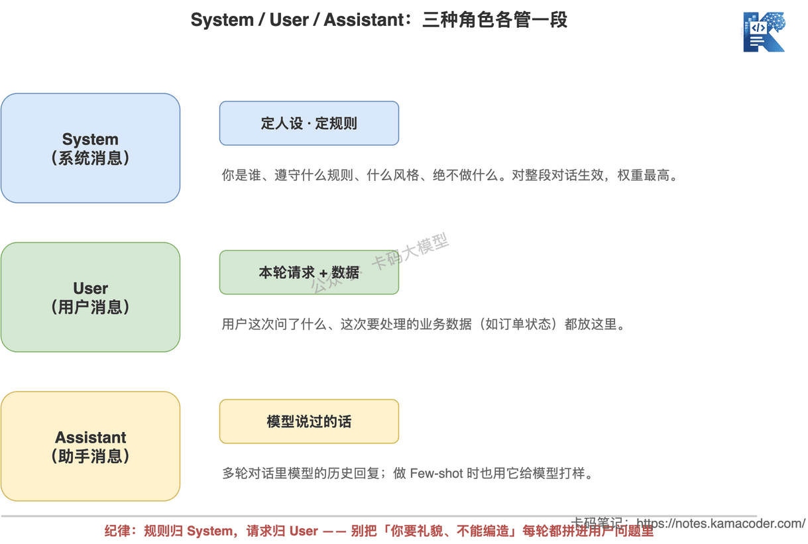
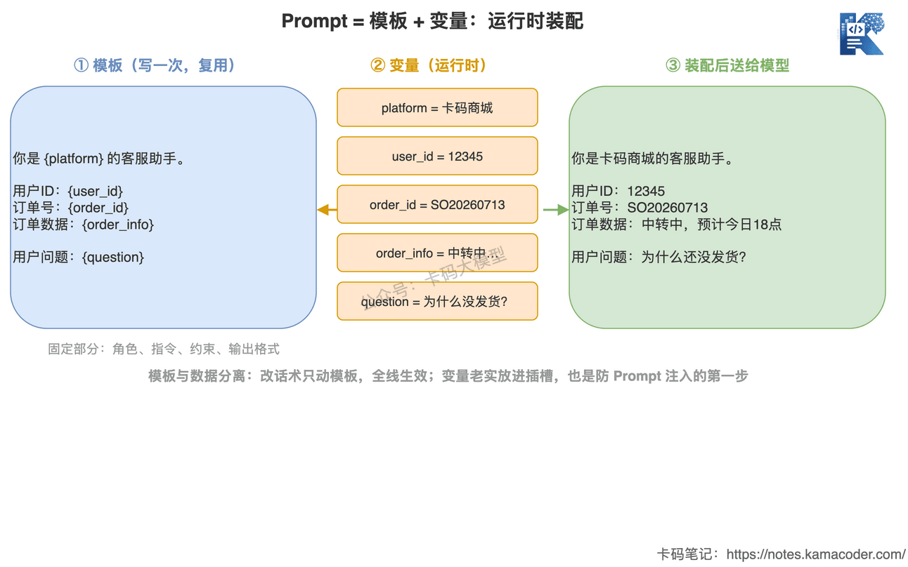

# Prompt Engineering不是"写提示词"：结构化Prompt设计、System/User/Assistant角色与模板变量

> 来源: https://notes.kamacoder.com/llm/app/prompt_engineering.html

# `# Prompt Engineering不是"写提示词"：结构化Prompt设计、System/User/Assistant角色与模板变量 
 

上一篇《大模型怎么接入真实应用》里，我们把一个AI请求的完整链路拆成了四步：用户请求→Prompt构造→模型调用→输出处理。当时我说"Prompt构造是最关键的一步"，但只用了一小段带过。 

这一篇，我们就把这一步单独拎出来，放大了讲。 

先说个现象。很多录友学Prompt，就是去收藏各种"Prompt大全""万能提示词模板"，存了几百条，真到自己业务里用，发现不好使——同样一句"你是一个专业的XX助手"，别人贴出来效果惊艳，自己一跑就翻车。 

问题不在于你没背够模板，而在于你把Prompt当成了**一段要靠灵感憋出来的文案**。 

而在真实的应用系统里，Prompt根本不是"写"出来的，是**"设计"出来的**。它有固定的结构、有角色分工、有变量插槽、有输出约束——它是个工程产物，跟你写一个函数、定一个接口没什么本质区别。 

这就是"写提示词"和"Prompt Engineering"的差距。 

## `# 一、聊天框里的Prompt，和系统里的Prompt不是一回事 

你在豆包、ChatGPT的对话框里随手打一句话，那叫提示词。它的特点是：一次性、给人看、错了你自己再补一句就行。 

但业务系统里的Prompt完全是另一种东西。它要满足几个硬性条件： 

**它要被复用成千上万次。** 客服系统一天处理十万条咨询，每一条都走同一个Prompt。这个Prompt不能是某次灵感，得是一个稳定的模板。 

**它要动态填入数据。** 每个用户的订单号、问题、历史记录都不一样，Prompt里必须有"插槽"，运行时把真实数据塞进去。 

**它的输出要被代码接住。** 模型返回的不是给人读的一段话，而是要写进数据库、传给下游系统的结构化数据。 

**它要能被版本管理。** 改了一版Prompt效果变差了，你得能回滚，能对比，能知道到底改了哪。 

你看，这些要求，跟你随手在对话框里写一句话，完全是两个世界。 


 

想清楚这一点，你就明白为什么"Prompt大全"不好使了：那些模板是别人在他的业务、他的数据、他的输出要求下调出来的，脱离了那套上下文，模板本身没有意义。 

**Prompt工程的核心，不是记模板，是理解Prompt的结构，然后针对你自己的业务把这个结构填满。** 

下面我们就拆这个结构。 

## `# 二、先搞懂三种角色：System、User、Assistant 

很多人写Prompt，就是把所有话一股脑塞进一个输入框。但你去看任何一个主流大模型的API，它接收的从来不是"一段文本"，而是**一个消息数组**，每条消息都带一个`role`： 

```
messages = [
    {"role": "system",    "content": "你是一个电商平台的客服助手..."},
    {"role": "user",      "content": "我的订单XXXX为什么还没发货？"},
    {"role": "assistant", "content": "您好，正在为您查询..."},
    {"role": "user",      "content": "那大概什么时候能到？"},
]

```

 

这三个角色分工很明确，搞混了Prompt效果就打折扣。 

**System（系统消息）：定人设、定规则。** 这里放的是全局设定——模型是谁、遵守什么规则、说话什么风格、绝对不能做什么。它对整段对话生效，权重最高。比如"你是客服助手，只回答订单相关问题，不编造物流信息，回复控制在两句话以内"。这些是贯穿始终的约束，放System里最合适。 

**User（用户消息）：放本轮的具体请求和数据。** 用户这次问了什么、这次要处理的业务数据是什么，都放这里。注意，注入的业务数据（比如从数据库查到的订单状态）通常也拼在User消息里，作为这次请求的上下文。 

**Assistant（助手消息）：模型自己说过的话。** 多轮对话时，模型历史的回复会以assistant角色回填，让模型"记得"之前聊了什么。另外，做Few-shot示例时，我们也会手动构造assistant消息，给模型打样"该这么回答"（这块下一篇专门讲）。 


 

**一个常见的错误，是把该放System的规则塞进User。** 比如每次用户提问，都在问题前面拼一大段"你是客服，你要礼貌，你不能……"。这样做，一是浪费token，二是规则和用户问题混在一起，模型容易分不清哪些是指令、哪些是要回答的内容。**规则归System，请求归User，这是结构化Prompt的第一条纪律。** 

## `# 三、Prompt是"带插槽的模板"，不是一次性文案 

搞清角色分工，下一个关键认知是：生产环境的Prompt，是**模板 + 变量**，不是一段写死的文字。 

回到客服的例子。你不可能给每个用户手写一个Prompt，你写的是一个带占位符的模板： 

```
SYSTEM_TEMPLATE = """你是{platform}的客服助手。
规则：
1. 只回答订单、物流、售后相关问题；
2. 必须基于提供的订单数据回答，不得编造；
3. 回复控制在两句话以内，语气礼貌。"""

USER_TEMPLATE = """用户ID：{user_id}
订单号：{order_id}
订单数据：{order_info}

用户问题：{question}"""

```

 

运行时，再把真实数据填进去： 

```
system = SYSTEM_TEMPLATE.format(platform="卡码商城")
user = USER_TEMPLATE.format(
    user_id="12345",
    order_id="SO20260713",
    order_info="物流状态：中转中，预计送达：今日18点",
    question="我的订单为什么还没发货？"
)

```

 

这一步就叫**变量替换**，是Prompt工程里最基础也最重要的动作。它把两件事彻底分开了： 
  - **不变的部分**（人设、规则、任务指令、输出格式）→ 沉淀成模板，写一次，复用无数次；   - **变化的部分**（用户数据、本轮问题）→ 运行时动态注入。 


 

为什么这件事这么重要？因为它把Prompt从"文案"变成了"工程资产"： 

模板可以统一管理、统一优化。你想调整客服的话术风格，改一处模板，全线生效，不用去动业务代码。 

变量注入的边界也清晰了。哪些是系统控制的固定指令、哪些是外部灌进来的动态数据，一目了然——**这其实还是一道安全线**：如果你把用户输入直接拼进指令部分而不做隔离，用户就可能用一句"忽略以上所有指令"来劫持你的Prompt，这就是所谓的Prompt注入。把变量老老实实放进它该在的插槽，是防注入的第一步。 

实际项目里，很少有人自己用`str.format`裸拼，通常会用LangChain的`PromptTemplate`、或者Jinja2这类模板引擎来管理。但工具是次要的，**"模板与数据分离"这个思路才是本质**。 

## `# 四、输出格式约束：让模型的话能被代码接住 

Prompt设计的最后一块，是约束输出。 

链路的下一步是"输出处理"，代码要拿模型的返回值去干活——写数据库、调接口、做判断。可模型默认是"自由发挥"的，你不约束，它今天回你一段话，明天回你一个markdown列表，代码根本没法稳定解析。 

所以在Prompt里，你得明确告诉模型：**输出长什么样。** 

最简单的做法，就是在Prompt里把格式写死： 

```
请只输出JSON，不要有任何多余文字，格式如下：
{"order_id": "订单号", "reason": "延迟原因", "eta": "预计送达时间"}

```

 

这是结构化输出的入门写法。但你可能已经想到了：光靠在Prompt里"请求"模型守规矩，它并不是每次都听话——它本质是概率生成，格式随时可能漂移。 

所以在Prompt层约束之外，工程上还有更硬的手段：JSON Schema校验、模型原生的结构化输出接口（`response_format`）、Pydantic做反序列化验证……这些属于"怎么保证输出一定合法"的范畴，我在《大模型结构化输出》那一篇里专门讲了，这里不展开。 

这一篇你只要记住一点：**在设计Prompt时，就要把"输出格式"当成Prompt的一个固定组成部分写进去，而不是等模型输出乱了再回头补救。** 

## `# 五、拼起来：一个结构化Prompt的骨架 

前面拆了角色、模板、约束，现在把它们组装成一个可以直接套用的骨架。一个工程化的Prompt，通常包含这五段： 

**1. 角色设定（Role）**：你是谁。"你是电商平台的客服助手。" 

**2. 任务指令（Instruction）**：你要干什么。"根据订单数据，回答用户关于物流的问题。" 

**3. 上下文与数据（Context）**：干活要用的料，带变量插槽。"订单数据：{order_info}；用户问题：{question}" 

**4. 约束条件（Constraints）**：不能越的线。"只依据订单数据回答，不得编造；回复不超过两句话。" 

**5. 输出格式（Output Format）**：结果长什么样。"以JSON输出：{order_id, reason, eta}。" 

这五段不是死规矩，简单场景可以合并，复杂场景还能再加（比如Few-shot示例段）。但它给了你一个检查清单：**你写完一个Prompt，回头对一遍这五项，哪项缺了、哪项含糊，一眼就能看出来。** 

这就是"设计"和"随手写"的区别——随手写靠的是手感，设计靠的是结构。 

## `# 六、面试可能怎么问 

**Q：System Prompt和User Prompt有什么区别？** 

参考思路：System放全局设定——人设、规则、风格、约束，对整段对话生效，权重最高；User放本轮的具体请求和动态注入的业务数据。区别的本质是"贯穿全局的指令"和"单次的请求数据"要分开，混在一起会浪费token，也会让模型分不清指令和内容。 

**Q：生产环境的Prompt是怎么管理的？** 

参考思路：不会把Prompt写死在代码里，而是做成"模板+变量"。固定部分（角色、指令、约束、输出格式）沉淀为模板，统一管理和优化；变化部分（用户数据、本轮问题）运行时通过变量替换注入。这样能复用、能统一调优、能版本管理，也能把动态用户输入和固定指令隔离开，降低Prompt注入风险。 

**Q：怎么保证模型按你要的格式输出？** 

参考思路：分层。Prompt层明确写出目标格式；API层用`response_format`等原生结构化输出做强约束；业务层拿到结果用JSON Schema或Pydantic校验，不通过就重试。单靠在Prompt里"请求"格式并不可靠，因为模型是概率生成的。 

## `# 七、结语 

回到开头那个问题：为什么你收藏了几百条Prompt模板还是用不好？ 

因为Prompt的能力不在模板本身，而在你理不理解它的结构——角色怎么分、数据怎么注入、输出怎么约束。理解了这套结构，你自己就能针对任何业务写出好Prompt，不用再到处找模板。 

这，才是Prompt Engineering这个"Engineering"的分量所在。
