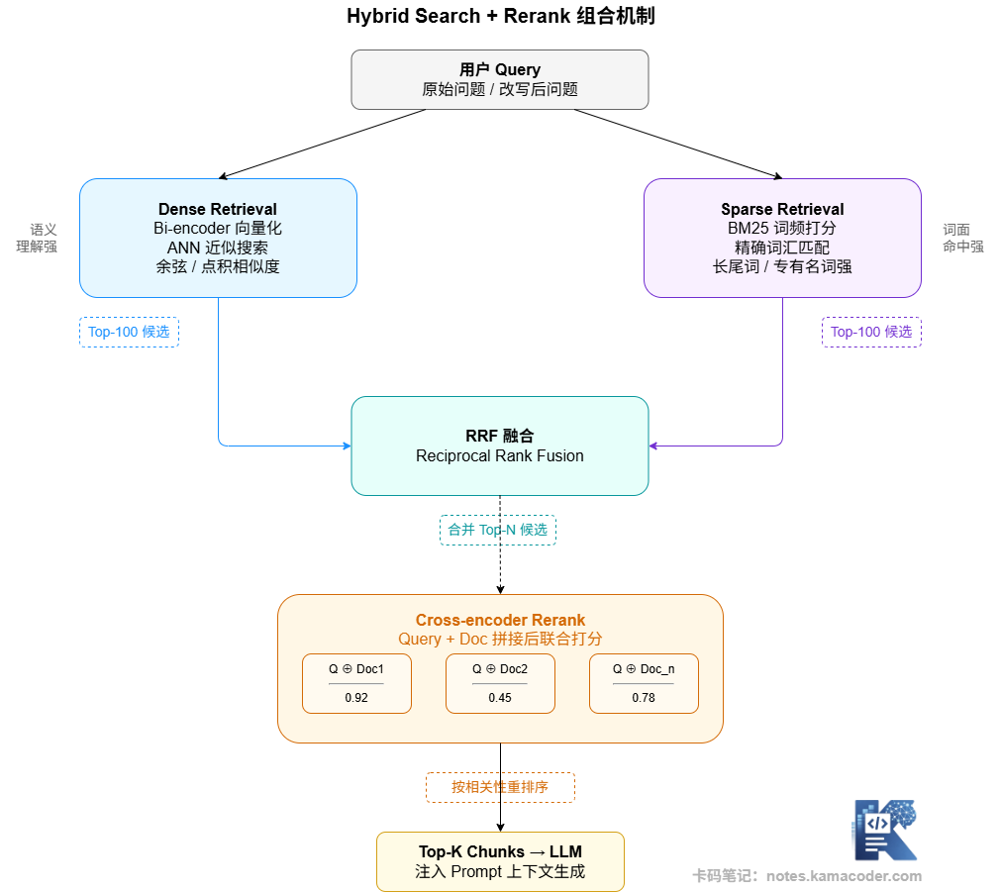

# RAG 优化思路：Query 改写、混合检索、Rerank、父子块检索、Context 压缩

> 来源: https://notes.kamacoder.com/llm/app/rag_optimization.html

# `# RAG 优化思路：Query 改写、混合检索、Rerank、父子块检索、Context 压缩 
 

## `# 一、优化要对症下药 

先建立一个重要的认知：RAG 优化没有万能药。"加个 Rerank 就搞定了"、"换个更好的模型就行了"——这类说法听起来合理，但很多时候只是在用锤子找钉子。 

正确的姿势是：先诊断问题出在哪个环节（上一篇的方法），再选择对应的优化手段。 

优化手段大致可以分为三类： 

**Query 侧优化**：在用户问题进入检索之前，对 Query 进行处理，让它更适合被检索到正确答案。 

**检索侧优化**：改善召回质量，让相关内容更准确地被找到。 

**Context/生成侧优化**：改善最终喂给 LLM 的上下文质量，让模型能更好地利用检索结果。 

 

看了全景图之后，我们接下来逐个讲清楚每种优化手段的机制。  

## `# 二、Query 侧优化 

### `# Query 改写（Query Rewrite） 

用户的原始问题往往措辞口语化、表达方式多样、语义模糊，不一定适合直接做向量检索。Query 改写的思路是：在检索之前，先用 LLM 对用户问题做一轮处理——扩展同义词、修正表述、补全隐含条件，让改写后的查询更贴近知识库里文档的用词习惯。 

举个例子：用户问"这个合同能退吗"，改写后可以变成"合同解除条款、退款政策、合同撤销条件"——在这多个角度下做检索，覆盖率明显更好。 

### `# Multi-Query（多角度查询） 

当一个问题可以从多个角度来理解时，生成多个不同版本的 Query，分别做检索，然后把多路结果合并去重。 

比如用户问"我们产品的 SLA(服务水平协议) 是多少"，可以展开为： 
  - "服务等级协议内容"   - "故障响应时间"   - "可用性承诺"   - "赔偿条款" 

每路独立检索，再把结果合并，召回率会显著提升。  

## `# 三、检索侧优化 

### `# 混合检索（Hybrid Search） 

纯向量检索擅长语义理解，但对专有名词、精确匹配（如人名、产品型号、法规编号）不如关键词搜索准确。混合检索把两者结合起来：同时跑向量检索和 BM25 关键词检索，然后用融合算法（最常见的是 RRF，Reciprocal Rank Fusion）把两路结果合并排序。 

RRF 的思路很直觉：一个文档在两路结果里排名都靠前，它的融合分数就高；只在一路排名靠前的，分数打折。 

### `# 元数据过滤（Metadata Filtering） 

在向量相似度检索的同时，叠加结构化的元数据条件。比如"只搜索 2024 年之后的文档"、"只在合同类文档里搜索"、"只搜索研发部门的内部规范"。 

元数据过滤不会改变检索算法，但可以大幅缩小搜索范围，既提高精准度，又降低计算开销。  

## `# 四、精排优化：Rerank 

这是 RAG 优化里最常被提及的手段，但它的位置很具体：在向量检索召回了 top-K 候选之后，用一个 Cross-Encoder 模型对每个 (Query, Chunk) 对精细打分，重新排序，只保留真正高相关度的 top-N 传给 LLM。 

Rerank 的核心价值在于：向量检索的相似度是独立编码的，不能完整捕捉 Query 和文档之间的深度语义关联；Cross-Encoder 可以看到两者的完整交互，打分更精准。 

下面这张图展示了混合检索和 Rerank 组合使用时，整条优化链路的工作方式： 

 

混合检索 + Rerank 是目前工程上最成熟的检索优化组合。两路各召回一定量候选，经 RRF 融合后形成候选池，再由 Cross-Encoder 精排，最终只有 3-5 条高质量 chunk 进入 Context。 
> 

Rerank 什么时候该加：如果 Recall@K 已经足够好（相关内容确实被召回了），但答案精准度仍然不高，通常是 Rerank 缺失导致的——召回了相关内容，但没有精确筛出最核心的部分。 

Rerank 什么时候不急着加：Recall@K 本身很低，相关内容根本没被召回，这时加 Rerank 没有意义，应该先解决召回问题。
  

## `# 五、Context 侧优化 

### `# 父子块检索（Parent-Child Retrieval） 

这个方案解决的是 Chunking 里的一个经典矛盾：小 chunk 利于精准匹配（向量更聚焦），但传给模型时上下文不够完整；大 chunk 上下文完整，但检索精准度差。 

父子块的思路是：建立两级索引。用**小 chunk（子块）** 做检索，找到相关内容；但实际传给 LLM 的时候，使用包含这个子块的**大 chunk（父块）**。这样兼顾了检索精准度和上下文完整性。 

比如：一篇 2000 字的文章按段落切成 5 个 400 字的子块做索引，但匹配到某个子块后，传给模型的是整篇文章（或者其中一个更完整的部分）。 

### `# Context 压缩（Context Compression） 

当召回的 chunk 里包含了大量和当前问题无关的内容时，可以用一个 LLM 先做压缩提取——让模型阅读 chunk，把和 Query 高度相关的句子提取出来，丢弃无关内容，再把压缩后的片段拼成最终 Context。 

这个方案能显著减少上下文里的噪声，但会额外增加一次 LLM 调用的延迟和成本，适合对准确性要求极高、对延迟容忍度较高的场景。  

## `# 六、初学者应该如何选择优化方向？ 

面对这么多优化手段，初学者最容易犯的错是"什么都想加"——加了 Query 改写、加了混合检索、加了 Rerank、加了父子块，结果系统延迟飙升，性能变差，还搞不清楚到底是哪个环节帮了忙。 

一个更理性的顺序是： 
  - 

先建立baseline，做好评估。在任何优化之前，先用 Recall@K 和答案质量指标（可以用 LLM 打分或人工评估）建立可量化的基线。没有基线，就无法判断优化是否有效。   - 

优先解决"能不能找到"，再解决"找到了对不对"。如果 Recall@5 很低，先优化召回（换 Embedding 模型、调整 Chunk 策略、加混合检索），而不是先加 Rerank。   - 

每次只改一个变量。控制变量是评估优化效果的基本要求。同时改 Chunk 大小、Embedding 模型和是否加 Rerank，你永远不知道是哪个起了作用。   - 

按成本/收益决定优先级。混合检索（增加 BM25 索引）成本低、覆盖面广，通常是性价比最高的第一步优化；Query 改写、Rerank 会增加延迟和成本，要根据业务 SLA 决定是否值得。  

## `# 七、面试可能怎么问 

**Q：你们 RAG 系统做了哪些优化？** 

参考思路： 

按优化框架（Query 侧 / 检索侧 / 精排侧 / Context 侧）分类回答，说清楚每个优化针对的具体问题、实施前后的效果变化，以及取舍（为什么做这个而不是那个）。比如"我们发现 Recall@5 在 60% 左右，先引入了混合检索，Recall@5 提升到 78%；再加了 Rerank，答案精准率提升了约 15%"——有数据有逻辑才是好回答。 

**Q：混合检索怎么实现？两路结果怎么融合？** 

参考思路： 

向量检索用 Embedding 模型和向量数据库；关键词检索用 BM25 算法（Elasticsearch 或向量数据库的关键词搜索功能）。融合用 RRF（Reciprocal Rank Fusion）：对每个文档，把它在两路排名中的名次取倒数相加，得到融合分数，重新排序。RRF 对超参数不敏感，实现简单，效果稳定，是工程首选。  

## `# 八、结语 

RAG 优化是一个按需组合、逐步迭代的过程，而不是一次性把所有手段全部加上。理解每种手段解决的是哪个具体问题，建立可量化的评估体系，优先解决最影响效果的瓶颈——这才是 RAG 优化的正确姿势。
