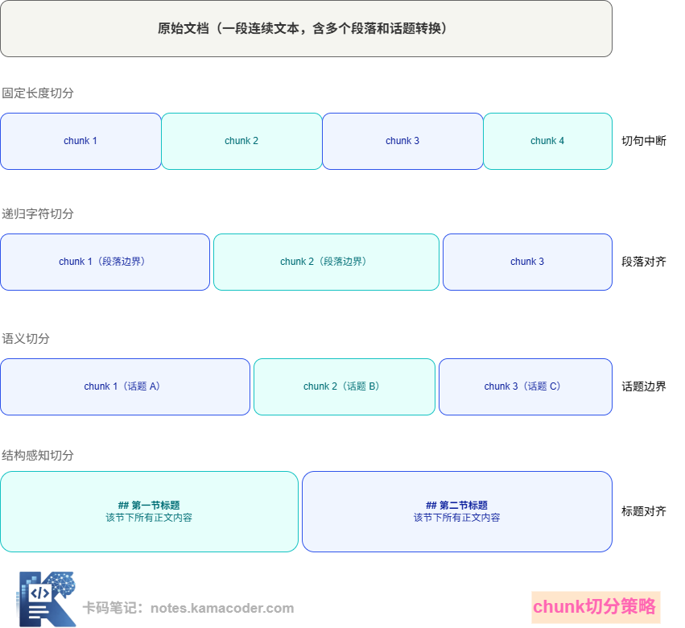
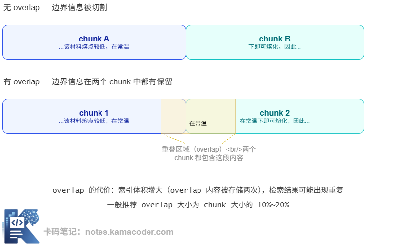

# RAG 切片策略：固定长度、递归字符、语义切分、结构感知四种方式对比

> 来源: https://notes.kamacoder.com/llm/app/how_to_chunking.html

# `# RAG 切片策略：固定长度、递归字符、语义切分、结构感知四种方式对比 
 

## `# 一、为什么 Chunking 这么重要？ 

先用一个比喻建立直觉。 

假设你在准备一场考试，有一本 500 页的教材。你的复习策略是：把书撕成很多小卡片，每张卡片写一个知识点，考试前根据题目去抽卡片。 

如果你的卡片切得太细——每张只写一句话——那每张卡片的上下文不完整。 

如果你的卡片切得太粗——每张抄一整章——那虽然信息完整，但你要看的内容太多，真正需要的那句话藏在一大堆无关文字里。 

RAG 里的 Chunking，面对的就是这个核心矛盾：**chunk 太小，单个片段语义不完整；chunk 太大，检索出来的内容里信噪比太低。**  

## `# 二、四种主流切分策略 

### `# 策略一：固定长度切分（Fixed-size Chunking） 

最简单粗暴的方式：按字符数或 token 数固定切，每个 chunk 固定 512 个 token，切完拉倒。 

优点是实现极简，不需要理解文档结构。缺点同样明显：它完全不管语义边界，可能把一句话从中间切断，把一个完整的论述拆成两半。 

实际工程中，这种方式通常只用于原型阶段的快速验证，不适合生产环境。 

### `# 策略二：递归字符切分（Recursive Character Splitting） 

这是目前工程实践中最常用的基础策略，LangChain 的 `RecursiveCharacterTextSplitter` 就是这个思路。 

核心思路是：按优先级尝试不同的分隔符切分。先尝试用段落分隔符（`\n\n`）切，如果切出来的 chunk 还是太大，再用换行符（`\n`）切，还是太大就用句号切，以此递归，直到每个 chunk 都在目标大小以内。 

相比固定长度切分，这种方式更倾向于在自然的语义边界处断开，同时还能控制 chunk 的上限大小。在大多数普通文本场景下，这是一个不错的默认选择。 

### `# 策略三：语义切分（Semantic Chunking） 

更进一步的方式：不依赖固定分隔符，而是真正理解文本语义，在"话题转变"的地方切分。 

具体做法是：把文档按句子分割，然后计算相邻句子之间的语义相似度（用 Embedding 模型），当相似度出现明显跌落时，就认为这里发生了话题转换，在此处切开。 

优点是切分结果的语义完整性最好，每个 chunk 内部讨论的主题相对聚焦。缺点是需要对全文做 Embedding 计算，处理速度慢，成本更高，而且切出来的 chunk 大小很不规则。 

### `# 策略四：结构感知切分（Structure-aware Chunking） 

当文档有明确的层级结构时（比如 Markdown 文档有标题层级、法律文件有条款编号、代码有函数边界），按结构切分往往是最优选择。 

比如一篇技术文档，按 、`##`、`###` 级别的标题切分，每个二级标题下的内容作为一个 chunk。这样每个 chunk 天然对应一个有意义的主题，检索精准度往往最高。 

对于代码文件，按函数或类的边界切分；对于 PDF 报告，识别出页码和章节标题再切分——这些都属于结构感知切分。 

下面这张图展示了同一段文本用不同策略切出来的结果差异： 

 

## `# 三、Overlap：被低估的关键参数 

讲 Chunking 绕不开一个关键参数：**overlap（重叠）**。 

设想一段文字，中间某句话恰好落在两个 chunk 的边界：前半句在 chunk 1，后半句在 chunk 2。当用户提问这句话相关的内容时，单独检索到 chunk 1 或 chunk 2，拿到的都是一半，信息不完整，生成的答案就会出错。 

Overlap 的解决思路是：相邻 chunk 之间保留一段重叠的内容。比如 chunk 大小设为 512 token，overlap 设为 64 token，那么 chunk 2 的前 64 个 token 和 chunk 1 的后 64 个 token 是完全相同的。 

这样，边界附近的信息在两个 chunk 里都有备份，不管检索命中哪个，都能拿到完整的上下文。 

  

## `# 四、Chunk 过大、过小各有什么问题？ 

**Chunk 过小：** 

单个 chunk 的语义不完整，孤立一句话往往没有足够的上下文让模型理解。比如检索结果里出现: 

"是的，这种做法符合规范。" 

符合什么规范？完全不知道。同时，chunk 太小意味着要切出大量 chunk，索引规模膨胀，检索速度也会变慢。 

**Chunk 过大：** 

每个 chunk 里包含的话题太多，和用户问题的相关度被稀释。假设 chunk 是 2000 token 的长段落，用户只关心其中 50 个 token 的内容，但这 2000 token 都会被塞进 Context，占用宝贵的上下文窗口，同时让模型的注意力难以聚焦。另外，chunk 越大，它的向量表示就越"平均化"，语义越模糊，检索精准度越低。 

**关于 chunk 大小的经验值：** 

没有通用的最优大小，但实践中一些常用的参考范围是：对话型问答场景通常在 256～512 token；知识库检索通常在 512～1024 token；长文档摘要场景可以到 1500～2000 token。这些都是估计，需要根据实际业务效果调整。  

## `# 五、实际项目里怎么选策略？ 

面试被问"你们项目里 chunk 是怎么切的"，不要只说"用了 LangChain 的 TextSplitter"，而应该能回答出选择这个策略的理由。 

以下是一个决策框架： 

**文档有清晰的结构（章节、标题、条款）？** 优先考虑结构感知切分，按自然的结构边界切，语义完整性最好。 

**文档是普通散文、没有明确结构？** 用递归字符切分，配合合适的 chunk size 和 overlap。 

**文档质量要求极高，话题切换频繁？** 考虑语义切分，代价是需要更多计算资源和时间。 

**快速验证原型？** 固定长度切分够用，记得上线前换掉。  

## `# 六、面试可能怎么问 

**Q：你们项目里 chunk 是怎么切的？** 

参考思路： 

先说选择了什么策略及原因，再说具体参数（chunk size、overlap），最后说是如何评估和调整的。 

例如："我们的文档是有章节结构的产品手册，所以用了结构感知切分，按二级标题划分。每个 chunk 控制在 600 token 以内，overlap 设了 80 token。后来发现部分技术规格内容跨段落，把 overlap 调大到 120 token 后，相关问题的召回率有明显提升。" 

**Q：chunk 过大过小分别有什么问题？** 

参考思路： 

过小会导致语义不完整，单个 chunk 缺乏上下文，向量表示语义模糊，检索精准度低。 

过大会导致 Context 里的噪声增多，模型注意力被分散，同时每个 chunk 的向量是多话题混合的平均，语义匹配变差。两个方向的问题都直接影响最终的生成质量。 

**Q：为什么要设置 overlap？** 

参考思路： 

overlap 是为了防止重要信息落在 chunk 边界被割裂，通过让相邻 chunk 共享一段内容来保证边界附近的信息在两侧都能被完整检索到。  

## `# 七、结语 

Chunking 是 RAG 系统里最"不起眼"却影响深远的设计决策。它不那样有明显的技术感，但糟糕的 Chunking 会让后面所有的优化努力都打折扣，检索到的片段不合适，再好的模型也生成不出好答案。
