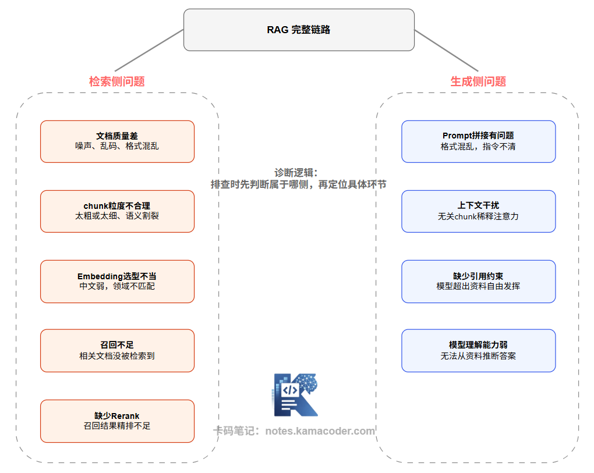

# RAG 系统答不准的常见问题：检索侧五类、生成侧四类问题逐一排查

> 来源: https://notes.kamacoder.com/llm/app/rag_problems.html

# `# RAG 系统答不准的常见问题：检索侧五类、生成侧四类问题逐一排查 
 

前段时间一个录友发帖求助，他的 RAG 系统效果一直很差，换模型、加 Rerank 都试遍了，还是没起色。 

有位民间大神一句话点醒他：“你连问题出在哪都没定位，优化全靠瞎试。” 

很多人一碰到 RAG 答不准，第一反应就是换模型、上 Rerank，却从来不去拆解根源。 

事实上，RAG 就两段关键链路：离线构建索引、在线检索生成。答案不好，要么是检索崩了（没找到、找错了），要么是生成崩了（找到了但没用好）。 

不先定位是检索还是生成的问题，所有优化都是治标不治本。 

## `# 一、所有常见问题一览 

下面这张图把 RAG 常见问题按所属环节归类。 

 

下面把每个问题拆开来讲，以及如何判断和初步应对。  

## `# 二、检索侧：五类常见问题 

### `# 1. 文档质量差 

这是最根本的问题，却也是最容易被忽略的。 

如果输入文档本身是扫描件 OCR 后的乱码、格式混乱的 PDF 解析结果、或者充满模板噪声的 HTML，那么再好的 Embedding 模型也无法从噪声中提取有效语义。向量化的质量决定了检索出来的质量。 

典型症状：检索结果里出现大量无意义的片段，比如"第 3 页"、"版权所有"、"……………………"这类内容。 

应对思路：在 Chunking 之前加强文档预处理，譬如清除页眉页脚、过滤模板噪声、对低质量文档做专项清洗甚至人工校对。 

### `# 2. Chunk 粒度不合理 

这在之前的文章已详细介绍过，有兴趣的同学可以去复习一下。今天就简单概括一下： 

Chunk 太小会导致每个片段只有一两句话，语义不完整，Embedding 向量无法准确表达这段内容的主题，导致召回时命中了相关话题但内容不够完整。 

Chunk 太大会导致每个片段包含多个话题，向量表示变成多主题的混合，和 Query 的语义匹配变得模糊，召回精准度下降。 

### `# 3. Embedding 选型不当 

这也在之前的文章详细介绍过，指路： 

Embedding 模型的语义理解能力决定了"相似度计算的语义准确性"。如果用了一个对中文支持弱、或者对某个专业领域覆盖不足的模型，那么语义相似的内容可能在向量空间里距离很远，导致检索根本找不到。 

典型症状：用相同的中文提问，换了说法之后检索结果差异巨大；同义句子得分很低。 

应对思路：评估几个候选模型（可以用 MTEB 中文榜排名作参考），在业务数据上跑召回率对比实验，选最适合当前领域的模型。 

### `# 4. 召回不足 

即便 Embedding 模型本身没问题，也可能因为索引数据问题导致相关文档根本没被检索到。常见原因包括：文档更新了但索引没有及时重建、部分文档在入库时被错误过滤掉、top-K 设置太小以至于相关内容排在 K 之外。 

典型症状：明明知识库里有答案，但 RAG 系统给不出；手动搜索能找到，自动检索找不到。 

应对思路：检查索引覆盖是否完整；适当增大 top-K（如从 5 增到 10-20）再配合 Rerank 过滤；引入混合检索（向量+关键词）作为补充。 

### `# 5. 缺少 Rerank 

初步召回的 top-K 片段未必按真实相关性排序——向量相似度和"内容与问题的真实相关性"是两个不同的维度。有些片段向量很近（讨论了相关话题），但未必精准回答了用户的具体问题。 

典型症状：最终答案看起来"相关但不精准"，答案方向对但细节错；Context 里明明有答案，但模型拼接出来的回答不够准确。 

应对思路：在召回后加入 Cross-Encoder Rerank，让模型对 (Query, Chunk) 对进行精细评分，只保留真正高相关度的结果传入 LLM。  

## `# 三、生成侧：四类常见问题 

### `# 1. Prompt 拼接有问题 

这是工程上很容易被忽视的问题。RAG 系统把检索到的 chunk 拼进 Prompt 里，但拼接方式不当——比如多个 chunk 之间没有分隔符、来源信息缺失、指令和内容混在一起、或者指令表述模糊，这些都会让模型难以正确理解输入。 

典型症状：模型回答时把多个文档的内容混淆了；或者对"如果资料中没有答案请说不知道"这类指令的遵从率很低。 

应对思路：明确区分"系统指令"和"参考资料"，为不同来源的内容加分隔符，并在指令里明确告诉模型如何处理资料不足的情况。 

### `# 2. 上下文干扰（Context Noise） 

召回的 chunk 里，不是每一条都和用户问题高度相关。低相关度的 chunk 混入 Context，会稀释模型的注意力，让模型在大量无关信息中"迷失"，最终给出的答案受到这些干扰项的影响。这个问题在没有 Rerank 的系统里尤为突出，也和 top-K 设置过大有关。 

典型症状：答案里混入了一些奇怪的、不相关的细节；或者模型给出了一个综合了多个不相关来源的"平均答案"。 

应对思路：用 Rerank 过滤低相关 chunk；减少传入 Context 的 chunk 数量（宁少勿滥）；在 Prompt 里明确要求模型只根据提供的资料作答。 

### `# 3. 缺少引用约束（模型自由发挥） 

如果 Prompt 没有明确限制模型"只基于提供的资料作答"，模型会自然地把自身参数里的知识和检索到的内容混合起来回答——这会引入幻觉，让答案看起来比实际上更完整，但准确性存疑。 

应对思路：在系统 Prompt 里加入明确的引用约束，比如"请严格根据以下资料回答，资料中没有的内容请明确说明无法回答"，并要求模型在答案里标注来源。 

### `# 4. 模型理解能力不足 

即便检索结果质量很高，模型自身的推理能力也会成为瓶颈——尤其是当答案需要跨多个 chunk 进行综合推断、或者问题本身需要复杂的逻辑推理时。这类问题在使用小模型时尤为明显。 

应对思路：对于推理密集型问题，升级到推理能力更强的模型；优化 Prompt，明确要求逐步推导；或者通过 Query 拆解把复杂问题分解成多个简单检索任务。  

## `# 四、如何系统地诊断 RAG 问题？ 

知道了有哪些问题，更重要的是建立一套**诊断方法**，而不是靠感觉猜。 

**第一步：判断是检索问题还是生成问题。** 

最简单的方法：手动查看检索结果。把用户的问题直接查向量库，看看返回的 top-K chunk 里有没有包含正确答案。 
  - 如果 top-K chunk 里有正确答案，但最终生成的回答是错的 → 生成侧问题   - 如果 top-K chunk 里根本没有正确答案 → 检索侧问题 

**第二步：在检索侧，进一步定位。** 

召回率评估：对一批"已知有答案"的问题，统计正确 chunk 是否出现在 top-K 结果里（Recall@K）。如果 Recall@K 低，进一步分析是 Embedding 问题（语义匹配差）还是文档覆盖问题（相关内容根本没有入库）。 

检索结果质量评估：查看 top-K 结果的相似度分数分布——如果分数普遍很低，说明 Embedding 语义空间不匹配；如果分数高但内容无关，说明 Embedding 模型在当前领域理解有偏差。 

**第三步：在生成侧，进一步定位。** 

把正确的 chunk 手动构造 Prompt 喂给模型，看模型能否正确回答。如果可以，说明是检索问题（找对了内容模型能用好）；如果不行，说明是 Prompt 设计或模型能力问题。 

  

## `# 五、面试可能怎么问 

**Q：你们 RAG 系统答不准，你会怎么排查？** 

参考思路： 

先从检索侧、生成侧做分析。手动查看 top-K 检索结果——如果答案在里面，说明是生成侧问题（Prompt、上下文噪声、引用约束、模型能力）；如果答案不在里面，说明是检索侧问题（召回率低、Embedding 选型、Chunk 质量、文档覆盖）。然后用 召回率Recall@K （在 top-K 个检索结果中，正确 chunk 出现的比例）等指标量化，再针对性地调整。 

**Q：如何评估 RAG 系统的召回效果？** 

参考思路： 

构造评估集——选取一批"已知有答案的问题"及其对应的正确 chunk，然后计算 Recall@K。K 通常取 5 或 10。一般而言，如果 Recall@5 低于 70%，说明检索侧有明显问题，需要优先优化。  

## `# 六、结语 

RAG 答不准是一个背后可能有很多不同病因的症状。我们要有一个清晰的分类框架（检索侧 vs 生成侧）和诊断路径（从 top-K 结果的人工检查切入）。理解了这个框架，后面我们就可以更有针对性地讲优化，不至于没有落脚点。
