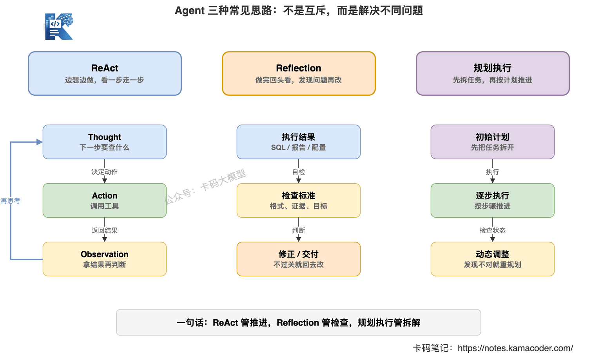
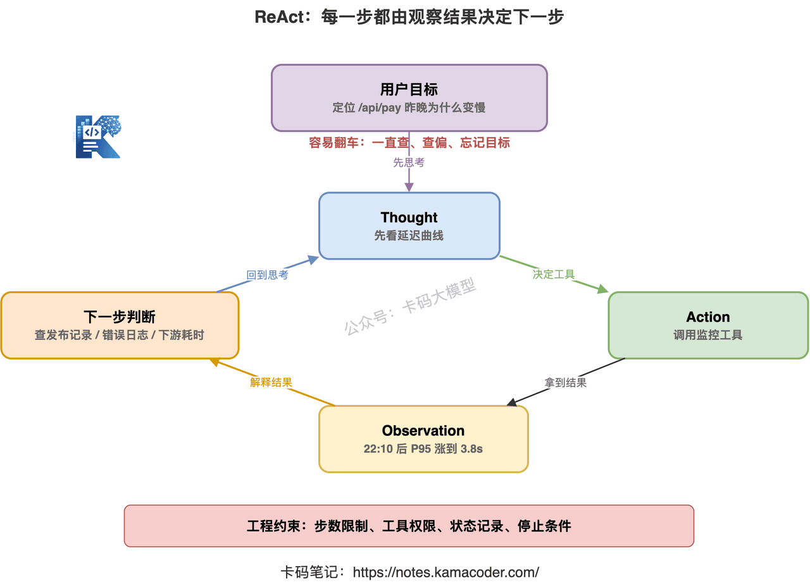
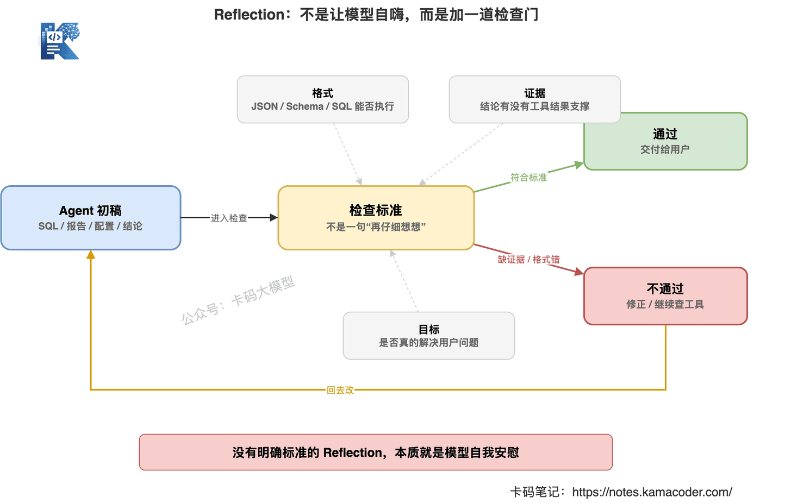
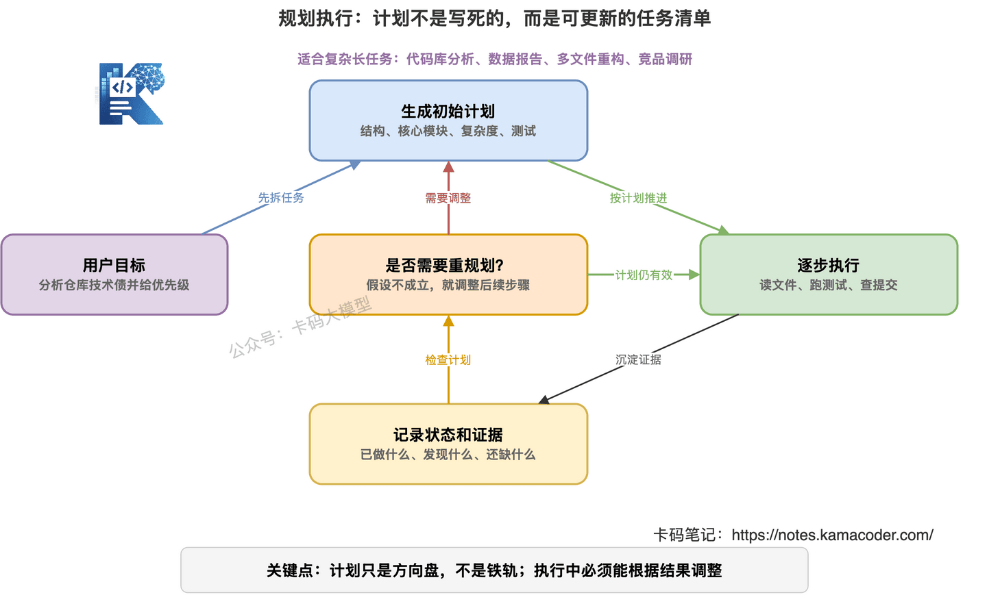
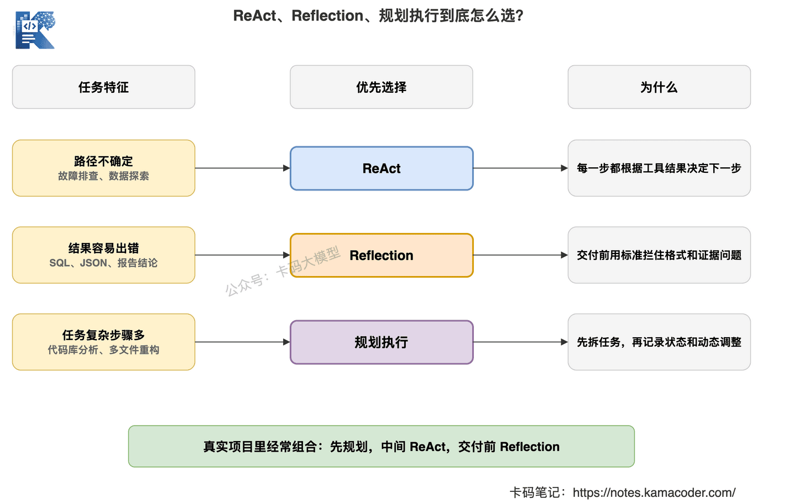

# ReAct、Reflection、规划执行：Agent三种常见思路怎么选？

> 来源: https://notes.kamacoder.com/llm/app/react_reflection_planning.html

# `# ReAct、Reflection、规划执行：Agent三种常见思路怎么选？ 
 

上一篇我们讲了 Agent 到底是什么。 

核心就一句话：**Agent 不是更会聊天的大模型，而是能围绕目标持续行动的系统。** 

但面试官不会只停在这里。 

他大概率会继续问： 

“那你们这个 Agent 是怎么设计的？是 ReAct 结构，还是先规划再执行？如果中间做错了，怎么自我检查和修正？” 

很多录友一听 ReAct、Reflection、Plan-and-Execute 就开始慌。 

其实不用慌。 

这三个词不是三套神秘框架，而是三种很朴素的 Agent 做事方式： 
  - ReAct：边想边做，看一步走一步   - Reflection：做完回头看，发现问题再改   - 规划执行：先拆任务，再按计划推进 

这篇就把它们讲清楚。 

重点不是背概念，而是知道：**什么场景用哪种，为什么面试官喜欢追问 ReAct。** 

 

## `# 一、先别背名词，Agent 本质是一个循环 

很多人一上来就背： 

“ReAct = Reasoning + Acting。” 

这句话没错，但太浅了。 

面试官真正想听的不是英文展开，而是你有没有理解 Agent 的运行方式。 

一个 Agent 最基本的循环是： 

**看到目标 -> 想下一步 -> 调工具 -> 看结果 -> 再想下一步。** 

比如用户说： 

“帮我查一下最近 7 天订单失败率升高的原因。” 

Agent 不能直接瞎猜。 

它应该先想： 

“我要先看失败率趋势。” 

然后调用数据工具。 

拿到结果后发现失败率是从周三开始涨的。 

它再想： 

“那我要查周三有没有发布、支付接口有没有异常、库存服务有没有超时。” 

然后继续调用工具。 

这就是 Agent 的味道。 

不是一次性给答案，而是**每一步都根据上一步结果继续判断。** 

所以 ReAct、Reflection、规划执行，本质上都是在回答同一个问题： 

**Agent 到底应该怎么推进任务？** 

只是推进方式不同。 

## `# 二、ReAct：边思考，边行动，边观察 

ReAct 是 Agent 里最经典的一种思路。 

它的名字来自两个词： 
  - Reasoning：推理，先想清楚下一步为什么这么做   - Acting：行动，调用工具或执行动作 

但只记这两个还不够。 

ReAct 真正关键的是中间还有一个 Observation。 

也就是工具执行后的观察结果。 

一个典型 ReAct 循环长这样： 
  - Thought：我现在需要知道什么   - Action：我要调用哪个工具   - Observation：工具返回了什么   - Thought：根据结果，我下一步该做什么 

举个例子。 

用户问： 

“帮我定位接口 `/api/pay` 昨天晚上为什么变慢。” 

ReAct Agent 可能这样跑： 
  - Thought：先看接口延迟曲线，确认变慢时间段。   - Action：调用监控查询工具，查询 `/api/pay` 昨晚 P95 延迟。   - Observation：22:10 后 P95 从 300ms 涨到 3.8s。   - Thought：需要看这个时间点有没有发布。   - Action：调用发布记录工具。   - Observation：22:05 发布了支付服务 v2.3.1。   - Thought：继续查错误日志和下游接口耗时。   - Action：调用日志工具。   - Observation：第三方支付回调超时明显增加。 

你看，ReAct 的特点很明显： 

**它不要求一开始就把完整计划想完，而是每拿到一个结果，再决定下一步。** 

这就是为什么 ReAct 特别适合工具调用场景。 

因为真实环境里，你一开始根本不知道问题在哪。 

你只能查一步，看一步，再决定下一步。 

 

## `# 三、为什么面试官最爱问 ReAct 

因为 ReAct 能看出你是不是真懂 Agent。 

很多人说自己做了 Agent，但其实流程是写死的： 
  - 先查知识库   - 再查数据库   - 再让模型总结   - 最后返回答案 

这更像 Workflow。 

不是不能用，而是它没有体现 Agent 的动态决策。 

面试官问 ReAct，往往是在确认三件事： 

**第一，你是否理解工具调用不是一次性的。** 

真正的 Agent 可能要调用多次工具，而且每次调用什么工具，要看上一步结果。 

**第二，你是否理解 Observation 的重要性。** 

没有 Observation，模型就是在脑补。 

工具返回什么、返回是否为空、返回是否异常，都会影响下一步。 

**第三，你是否知道 ReAct 也会翻车。** 

ReAct 不是万能的。 

它最大的问题是容易跑散。 

因为每一步都动态决策，如果没有约束，Agent 很容易： 
  - 查着查着忘了原始目标   - 一直调用无关工具   - 在失败结果里反复重试   - 明明信息够了，还继续查 

所以你面试时不能只说 ReAct 好。 

你还要补一句： 

**ReAct 适合路径不确定的任务，但必须配合步数限制、工具权限、状态记录和停止条件。** 

这句话很加分。 

因为它说明你不是只会背论文名，而是知道工程上怎么落地。 

## `# 四、Reflection：不是让模型自嗨，而是让它检查结果 

Reflection 翻译过来叫反思。 

很多人一听反思，就以为是让模型输出一句： 

“我再仔细检查一下。” 

这没用。 

模型说自己检查了，不代表真的检查了。 

Reflection 的核心不是一句提示词，而是**给 Agent 一个明确的检查环节。** 

比如 Agent 写完一段 SQL，不要直接交付。 

让它回头检查： 
  - 字段有没有写错   - WHERE 条件有没有漏   - 是否会全表扫描   - 返回结果是否符合用户目标 

再比如 Agent 生成一份问题分析报告，也不要直接交付。 

让它检查： 
  - 结论有没有证据支撑   - 是否遗漏关键时间点   - 是否把相关性当成因果   - 建议是否能落地 

这才是 Reflection。 

它不是让模型“感觉自己更认真”，而是让模型按照标准检查输出。 

## `# 五、Reflection 适合解决什么问题 

Reflection 最适合三类场景。 

### `# 1. 结果容易有格式错误 

比如结构化输出、SQL、配置文件、接口参数。 

模型第一次生成很可能看起来对，但细节错。 

这时候加一个检查环节，能拦住很多低级问题。 

### `# 2. 任务有明确验收标准 

比如： 
  - 单测是否通过   - JSON 是否符合 Schema   - SQL 是否能执行   - 报告是否包含指定字段   - 简历项目是否包含四要素 

有标准，Reflection 才有抓手。 

没有标准，只让模型“反思一下”，它很容易给你一段漂亮废话。 

### `# 3. Agent 容易过早交付 

很多 Agent 的问题不是不会做，而是做了一半就开始总结。 

Reflection 可以在交付前加一道门： 

当前结果是否已经满足用户目标？如果不满足，还缺什么证据？是否需要继续调用工具？ 

这个检查能把“半成品交付”挡住一部分。 

但 Reflection 也有边界。 

**如果模型本身不知道正确答案长什么样，它反思十遍也没用。** 

比如让模型判断一个线上故障根因，它没有日志、没有监控、没有发布记录，只靠自我反思，最后还是猜。 

所以 Reflection 最好和工具、规则、测试、评估一起用。 

不要把它当玄学许愿。 

 

## `# 六、规划执行：先拆任务，再推进 

第三种思路叫规划执行。 

也经常写成 Plan-and-Execute。 

它的逻辑很简单： 

先让模型根据用户目标生成一个计划。 

然后再按计划一步一步执行。 

比如用户说： 

“帮我分析这个仓库的技术债，并给出优先级。” 

如果用规划执行，Agent 不能一上来就随便翻几个文件。 

它应该先生成计划： 
  - 了解项目结构和技术栈。   - 找核心模块和高频变更文件。   - 检查复杂函数、重复代码、缺测试模块。   - 结合影响范围评估优先级。   - 输出技术债清单和修复建议。 

然后再执行每一步。 

规划执行的优点是：**任务更有方向，不容易一开始就跑偏。** 

尤其适合复杂任务。 

比如： 
  - 代码库分析   - 竞品调研   - 数据分析报告   - 多文件重构   - 长文档整理   - 面试题系统总结 

这些任务如果完全靠 ReAct，一步一步临时想，容易走散。 

先规划，再执行，会稳很多。 

## `# 七、规划执行最大的问题：计划经常跟不上变化 

但规划执行也不是万能的。 

它最大的问题是：**一开始的计划不一定对。** 

真实任务经常是这样的： 

一开始你以为问题在数据库。 

查完发现数据库没问题。 

再查才发现是缓存击穿。 

如果 Agent 死守最开始的计划，就会越做越偏。 

所以好的规划执行不是“一次性写死计划”。 

而是： 

**先有大方向，执行中根据结果调整计划。** 

这点非常重要。 

面试时你可以这么讲： 

“我们不会让 Agent 生成一个计划后机械执行到底，而是把计划当作可更新的任务清单。每完成一步，都记录状态和证据，如果发现假设不成立，就重新规划后续步骤。” 

这个回答比“我们用了 Plan-and-Execute”强太多。 

因为它讲到了工程落地。 

 

## `# 八、三种思路到底怎么选 

不要把 ReAct、Reflection、规划执行看成互斥方案。 

真实项目里，它们经常组合使用。 

但为了面试好讲，可以先按场景区分。 

| 场景  更适合的思路  原因 
| 路径不确定，需要边查边判断  ReAct  每一步根据工具结果决定下一步 
| 结果容易出错，需要交付前检查  Reflection  用标准拦截格式、逻辑和证据问题 
| 任务复杂，步骤多，容易跑偏  规划执行  先拆任务，避免一开始就乱跑 
| 代码修改、数据分析、故障排查  组合使用  先规划，中间 ReAct，交付前 Reflection 

 

举个真实一点的例子。 

用户说： 

“帮我定位线上支付接口变慢，并给出修复建议。” 

比较稳的 Agent 设计应该是： 
  - 先规划：确认要查监控、日志、发布记录、下游依赖。   - 中间 ReAct：根据每次查询结果，决定下一步查哪里。   - 最后 Reflection：检查结论是否有证据，建议是否对应根因。 

这就比单独讲某一种模式更成熟。 

因为真实任务不是教科书。 

它不会乖乖按照某个模式走完。 

## `# 九、面试时怎么回答这类问题 

**面试官问：你怎么理解 ReAct？** 

不要只说： 

“ReAct 是 Reasoning and Acting。” 

可以这样答： 

“ReAct 是一种让 Agent 在推理和行动之间循环的设计方式。模型先判断当前需要什么信息，再选择工具执行，拿到 Observation 后再决定下一步。它适合故障排查、数据查询这类路径不确定的任务。工程上要注意限制步数、记录状态、设置停止条件，否则容易跑偏或陷入无效工具调用。” 

**面试官问：Reflection 有什么用？** 

可以这样答： 

“Reflection 不是简单让模型‘再想想’，而是在交付前增加一个检查环节。它要基于明确标准检查结果，比如格式是否符合 Schema、结论是否有证据、任务目标是否完成。如果没有外部标准或工具结果，Reflection 容易变成模型自我安慰，所以最好结合测试、规则和评估机制使用。” 

**面试官问：规划执行和 ReAct 有什么区别？** 

可以这样答： 

“规划执行更强调任务开始前先拆解步骤，适合复杂长任务；ReAct 更强调执行过程中根据观察结果动态决策，适合路径不确定的任务。实际项目里一般会组合使用：先做粗粒度规划，中间用 ReAct 调工具推进，最后用 Reflection 做交付前检查。” 

这套回答，基本够用了。 

## `# 十、别把 Agent 模式讲成玄学 

ReAct、Reflection、规划执行，听起来像三个高级概念。 

但落到工程上，其实就是三件事： 

**ReAct 解决的是：下一步怎么根据结果继续走。** 

**Reflection 解决的是：交付前怎么发现自己做错了。** 

**规划执行解决的是：复杂任务怎么先拆开再推进。** 

真正的 Agent 不是堆模式名。 

而是知道任务需要什么能力，然后把这些思路组合起来。 

如果你面试时能讲清楚： 
  - 为什么要用 ReAct   - 什么时候加 Reflection   - 规划怎么更新   - 如何防止跑偏 

那面试官基本就知道，你不是在背概念。 

你是真的理解 Agent 怎么落地。
