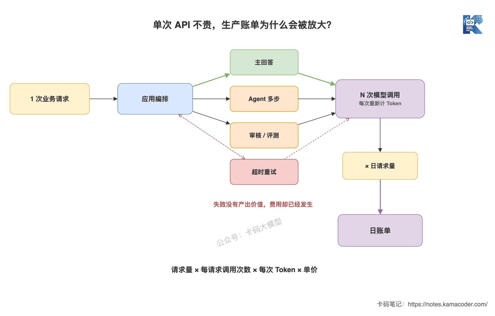

# Token、成本与延迟：大模型应用的三个硬约束

> 来源: https://notes.kamacoder.com/llm/app/token_cost_latency.html

# `# Token、成本与延迟：大模型应用的三个硬约束 
 

上一篇《大模型同步、异步、流式输出怎么选》讲了结果怎么交付。流式输出能让用户更早看到内容，但它没有让模型少算一个Token，也没有让总生成时间凭空消失。 

面试官继续问：“你们的大模型应用，怎么控制Token、成本和延迟？” 

很多录友会回答：“Prompt写短一点，用便宜模型，再加个流式输出。” 

方向不算错，但这还是三个零散技巧。面试官真正想听的是：**Token在哪里产生，成本怎么被业务量放大，延迟又卡在哪个阶段。** 

这三个问题其实是一条链。 

## `# 简要回答 
  - **Token**是模型处理文本的基本单位。输入Token包括System Prompt、历史消息、RAG文档、工具定义和用户问题；输出Token是模型生成的内容。Token数必须用对应模型的Tokenizer计算，不能拿字数硬换算。   - **成本**通常按输入、输出分别计费，输出Token单价往往不同。缓存Token、推理Token、Embedding和工具调用是否另计，要看具体厂商规则。   - **延迟**要拆开看：排队和网络耗时、Prefill处理输入的耗时、Decode逐Token生成的耗时。TTFT看多久出第一个Token，TPOT看后续Token生成得多快。   - **优化顺序**不是一味追求便宜和快，而是先守住质量底线，再减少低价值Token，用模型路由、缓存、并发控制和输出上限控制单位请求成本与P95/P99延迟。 

一句话：**Token是资源计量单位，成本是它乘上价格和调用量，延迟是它在推理链路里消耗的时间。** 

## `# 详细回答 

### `# Token不是字数，要以Tokenizer为准 

模型看到的不是“多少个汉字”，而是一串Token ID。 

同一句话换成中文、英文、代码或JSON，切分结果都可能不同；同一段文本换一个模型家族，Tokenizer也可能不同。长URL、UUID、转义后的JSON和生僻字符，经常比肉眼看上去更耗Token。 

所以“一个Token约等于几个汉字”只能做早期粗估，不能拿来做线上预算。生产代码至少要记录四类量： 
  - 输入Token：System Prompt、Few-shot、历史消息、RAG片段、工具Schema、工具结果和本轮问题；   - 输出Token：最终回答或结构化结果；   - 缓存Token：重复前缀命中Prompt Cache后的输入，是否折价由接口决定；   - 推理Token：部分推理模型内部使用，是否可见、是否计费、是否占窗口，要看接口说明。 

上一篇《上下文窗口有多大？Context Engineering入门》讲过，输入和输出还要共享上下文窗口。这里再补一层：**这些Token不只占窗口，还会进入账单和延迟。** 


 

这张图回答的是：一个请求里的Token，怎么同时影响成本和延迟。输入越长，Prefill通常越重，TTFT越高；输出越长，Decode步数越多，费用和总耗时一起增加。流式输出只是提前交付已生成的Token，不会抹掉后面的Decode过程。 

### `# 一次请求到底花多少钱？ 

最基本的估算公式是： 

```
单请求成本
= 输入Token / 计价单位 × 输入单价
+ 输出Token / 计价单位 × 输出单价
+ 其他费用

```

 

计价单位常见是百万Token，但不要写死在业务逻辑里。价格、缓存折扣和计费项都会变化，应该放在配置中心或成本平台里维护。 

如果想看一份带具体模型价格的完整账单计算，可以对照前文《大模型API到底怎么计费》。本篇不重复比价，重点看这些费用到了真实业务里怎么被调用量、重试和多步链路放大。 

举个不绑定具体厂商单价的例子。一次问答用了3000输入Token、800输出Token，每天10万次请求，那么每日基础用量就是： 

```
输入：3000 × 100000 = 3亿Token/天
输出： 800 × 100000 = 0.8亿Token/天

```

 

真正上线后，还要把这些放大项算进去： 
  - 失败重试：超时重试一次，可能把同一份长Prompt再付一遍；   - 多步Agent：一次用户请求，背后可能触发多次模型调用；   - RAG与Embedding：检索前的向量化、Rerank也可能有独立成本；   - 审核与评测：主模型回答后，再调一个模型做校验，同样要计费；   - 无效输出：用户看到一半就取消，已经生成的Token通常仍然消耗资源。 

所以成本不能只看“模型每百万Token多少钱”，而要看： 

```
日成本 = 日请求量 × 单请求平均调用次数 × 单次平均成本

```

  


 

这张图回答的是：为什么一个看起来不贵的API，到了生产环境账单会突然放大。业务请求量会放大总调用量；重试、Agent多步调用和低命中请求，则会把一次业务请求扩成多次付费模型调用。 

### `# 延迟不能只看一个“总耗时” 

大模型请求的端到端延迟，可以先拆成四段： 

```
端到端耗时 = 网络与应用处理 + 排队 + Prefill + Decode

```

 

**Prefill**负责处理全部输入Token并建立KV Cache。输入越长，计算量通常越大，它主要影响TTFT，也就是从发出请求到收到第一个Token的时间。 

**Decode**负责一个接一个生成输出Token。每生成一步，都要基于之前的结果继续推理。它主要受输出长度和每Token生成速度影响。 

可以用一个简化公式建立直觉： 

```
生成阶段耗时 ≈ 输出Token数 × TPOT
端到端耗时 ≈ TTFT + 生成阶段耗时

```

 

这不是精确压测公式，但足够解释两个常见现象： 
  - Prompt很长、回答很短：用户会在第一个字出来前等很久，TTFT高；   - Prompt不长、回答很长：第一个字很快，但后面一直生成，总耗时高。 

因此，流式输出主要优化的是**等待感知**。如果TTFT本身就很高，开启Streaming也救不了首字前的空白；如果TPOT很慢，用户看到的会是卡顿的“挤牙膏”。 

### `# Token、成本、延迟为什么是三个硬约束？ 

因为它们不能单独优化。 

把RAG文档从5段砍到1段，输入Token、费用和TTFT都可能下降，但关键证据也可能被删掉，回答准确率跟着掉。 

换成更小更便宜的模型，单价和延迟可能下降，但复杂任务的失败率上升。失败后触发重试或人工兜底，最终成本反而更高。 

为了提高吞吐做更激进的批处理，GPU利用率可能更高，但单个请求在队列里等得更久，P99延迟变差。 

给模型更大的`max_tokens`，不代表每次都一定生成那么多，但会放宽输出边界；没有停止条件时，模型更容易输出冗长内容，Decode时间和费用一起涨。 

**真正的优化目标，是在质量达标的前提下，降低每个成功任务的成本和延迟。** 注意是“成功任务”，不是“单次调用”。 


 

这张图回答的是：优化动作应该怎么选。先用质量门槛拦住“便宜但答错”的方案，再分别检查输入、输出、模型和并发；优化后回到线上指标验证，避免把成本问题转成质量问题，或者把吞吐问题转成P99延迟问题。 

### `# 生产环境怎么优化？ 

先从Token下手，但不要直接暴力截断。 
  - **裁掉低价值输入**：清理重复历史、无关RAG片段、过期工具结果和当前任务用不到的工具Schema；   - **控制输出边界**：明确回答格式和长度，设置合理的最大输出Token与停止条件；   - **复用稳定前缀**：System Prompt、公共知识和工具定义稳定时，评估Prompt Cache；   - **按任务路由模型**：分类、抽取走小模型，复杂推理再升级到强模型；   - **减少无效调用**：能由代码完成的校验、计算和规则判断，不要再调一次模型；   - **治理重试**：只对可恢复错误重试，使用指数退避和幂等设计，避免超时风暴；   - **控制并发与队列**：设置超时、限流、熔断和降级，关注P95/P99而不是只看平均值。 

Prompt Cache要特别注意边界：它通常能减少重复输入的计算或费用，但缓存Token往往仍占上下文窗口，而且只有稳定前缀才能获得高命中。缓存的详细机制可以看《Claude Code为什么快？Prompt Cache一篇讲明白》。 

### `# 监控哪些指标，才能发现问题？ 

至少按“质量、用量、成本、延迟”四组记录，而且要能按模型、业务、租户和请求类型拆分： 
  - 质量：任务成功率、结构校验通过率、重试后成功率、人工兜底率；   - 用量：输入Token、输出Token、缓存Token、每个业务请求的模型调用次数；   - 成本：单请求成本、每个成功任务成本、日成本、异常增长率；   - 延迟：TTFT、TPOT、端到端P50/P95/P99、队列等待时间、超时率。 

只看平均Token和平均耗时很危险。大部分请求可能很短，但少量超长Prompt已经吃掉一半预算；平均延迟看着正常，P99用户可能已经等到超时。 

## `# 知识拓展 

**Q1：面试中怎么回答“你们如何控制大模型成本”？** 

先讲口径：按输入、输出、缓存和多步调用统计，核心指标是“每个成功任务成本”。再讲手段：上下文裁剪、输出上限、模型路由、Prompt Cache、减少无效调用和重试治理。最后讲验证：同时观察任务成功率、Token分布、日成本与P95/P99延迟，不能只报一句“换了便宜模型”。 

**Q2：为什么输出Token经常比输入Token更值得控制？** 

输出Token不仅可能有不同单价，还要逐Token Decode，直接拉长总耗时。很多业务只需要一个分类、JSON字段或简短结论，却让模型自由发挥几百字，这是最直接的浪费。 

**Q3：流式输出能降低延迟吗？** 

它主要降低用户感知到的等待时间，让结果边生成边交付；通常不会减少模型的总计算量。要降低真实TTFT，需要减少排队和Prefill压力；要降低总耗时，还要控制输出长度并提高Decode速度。 

**Q4：上下文越短越好吗？** 

不是。删除噪声是优化，删除证据是降质。应该比较删减前后的任务成功率、引用正确率、成本和延迟，寻找满足质量门槛的最小有效上下文。 

**Q5：为什么模型单价降了，月账单反而涨了？** 

可能是请求量、平均上下文、多步调用或重试率上涨，也可能是便宜模型失败率更高。把总账单拆成“请求量 × 每请求调用次数 × 每次Token × 单价”，才能找到真正的放大项。 

别再只说“Prompt写短一点”。 

能把每一笔Token为什么花、每一秒延迟卡在哪里讲清楚，才算真正做过大模型应用。
