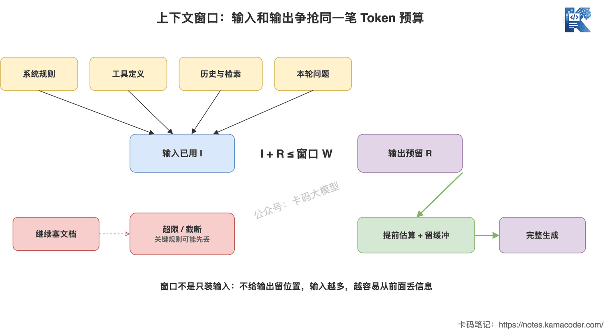
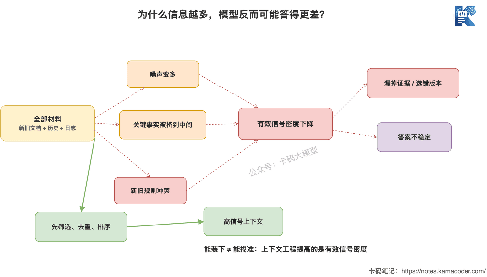
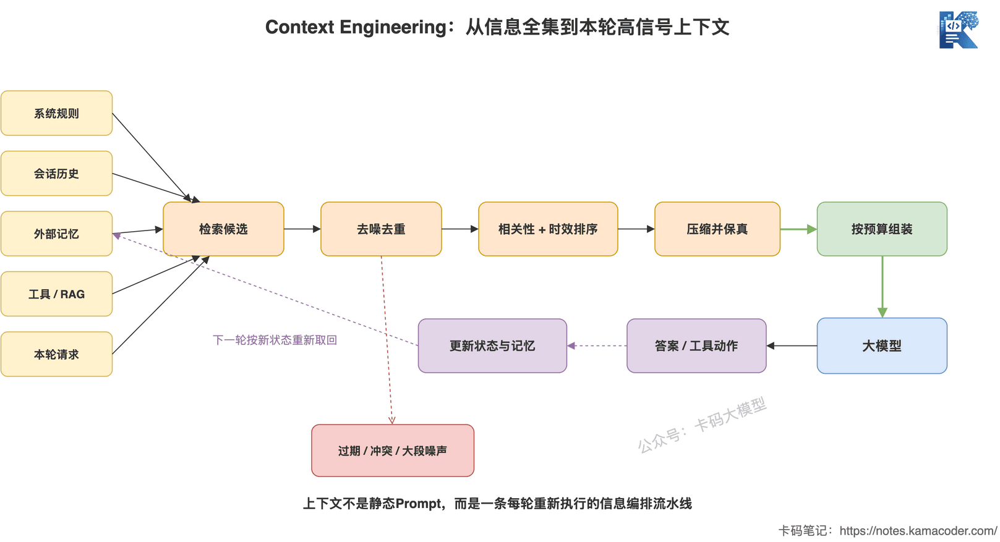
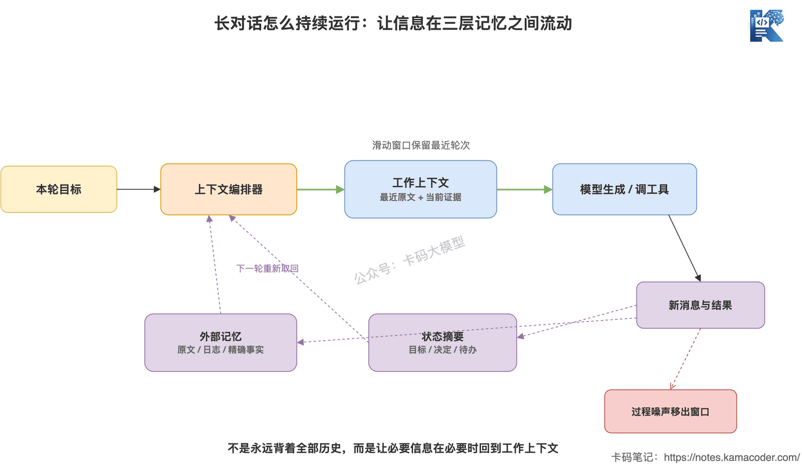

# 上下文窗口有多大？Context Engineering入门

> 来源: https://notes.kamacoder.com/llm/app/context_engineering.html

# `# 上下文窗口有多大？Context Engineering入门 
 

上一篇《大模型结构化输出》讲的是怎么管住模型的输出：用JSON Schema定义结构，用校验和重试接住异常。 

但模型输出之前，还有一个更容易被忽略的问题：**这次到底给模型看什么？** 

面试官继续问：“模型支持200K、1M上下文，是不是把历史对话、知识库文档、工具结果全塞进去就行？” 

很多录友会回答：“窗口够大就能记得更多，满了再做摘要。” 

这句话不能说完全错，但没有回答面试官真正关心的工程问题。 

上下文窗口只是容量上限。真正决定效果的，是有限的Token里放了什么、删了什么、按什么顺序放，以及每一轮怎么更新。 

这就是Context Engineering，上下文工程。 

## `# 简要回答 
  - **上下文窗口**：模型生成本轮答案时能够参考的Token总预算，通常由系统指令、工具定义、Few-shot示例、历史消息、检索数据、本轮问题和输出共同占用。   - **窗口大小**：由具体模型和接口决定。当前主流模型从数十万到约100万Token都有，但“标称能装下”不等于“每个位置的信息都能稳定用好”。   - **Context Engineering**：不是继续雕一句Prompt，而是持续选择、组织、压缩和更新模型本轮真正需要的信息。   - **常见手段**：相关信息检索、去噪与排序、滑动窗口、关键信息摘要、外部记忆、旧工具结果清理、任务隔离。 

一句话：**Prompt Engineering关心“指令怎么写”，Context Engineering关心“模型此刻看见什么”。** 

## `# 详细回答 

### `# 上下文窗口不是输入框大小，是一整笔Token预算 

先把最容易混淆的概念说清楚。 

上下文窗口不是只计算用户这次输入了多少字。模型调用时进入上下文的内容，都可能占位置： 
  - System Prompt和业务规则；   - 工具名称、参数Schema和说明；   - Few-shot示例；   - 多轮对话历史；   - RAG召回的文档；   - 工具执行结果；   - 用户本轮问题；   - 模型为本轮生成的输出。 

可以先记住一个简化公式： 

```
输入Token + 本轮输出Token ≤ 上下文窗口

```

 

部分推理模型还会消耗推理Token，具体是否计入窗口、怎么计费，要看厂商接口定义，不能自己猜。 


 

这条预算关系最容易踩的坑，是把窗口全部留给输入。 

假设一个模型窗口是200K，你已经塞了198K输入，又要求它最多输出8K，当然可能超限。即使接口没有直接报错，框架也可能从前面截断历史消息。被截掉的如果正好是关键规则，模型接下来就会像“突然失忆”一样。 

所以生产环境不会把窗口吃到100%。通常要提前给输出、工具返回和后续轮次留缓冲区，在调用前做Token估算，而不是等API报错。 

**窗口上限是硬边界，预留空间是工程纪律。** 

### `# 200K、1M到底有多大？ 

Token不是汉字数，也不是字符数。 

同一句话换一种语言、换一个分词器，Token数量都可能变化。代码、JSON、长URL、表格和自然语言的切分方式也不一样。所以“1个Token固定等于几个汉字”只能拿来粗估，不能拿来做线上限流。 

截至2026年7月，一些主流API已经提供约100万Token的上下文窗口，也仍有模型是200K。比如OpenAI当前模型页列出了约1.05M窗口，Anthropic文档同时列出了1M和200K模型，Gemini官方文档也说明多款模型支持1M或更大的长上下文。具体选型时必须查当前模型文档： 
  - OpenAI模型列表  (opens new window)   - Claude上下文窗口说明  (opens new window)   - Gemini长上下文说明  (opens new window) 

但录友别只盯着数字。 

**标称上下文回答的是“最多能送进去多少”，不是“送进去以后能不能找准、用好、还付得起”。** 

一个100万Token的窗口，不等于100万Token的完美记忆。它更像一张非常大的工作台：材料确实都摆得下，但无关文件、过期结论和几百页日志混在一起，真正要用的那张纸反而更难找。 

### `# 为什么信息越多，模型反而可能答得更差？ 

很多人默认：相关信息不确定，那就多塞一点，总不会有坏处。 

坏处很直接。 

第一，**信号被噪声稀释**。十段材料里只有一段能回答问题，模型要先从九段干扰里找到它。 

第二，**信息会冲突**。旧规则说退款期限是7天，新规则改成15天，两版同时放进去，模型可能选错。 

第三，**关键内容的位置会变化**。对话越长，最早的约束会被挤到长上下文中间。 

研究里有一个很典型的现象叫Lost in the Middle  (opens new window)：同样的关键信息，只改变它在长上下文中的位置，模型表现就可能明显变化；信息放在开头或结尾时往往更容易被利用，埋在中间时更容易丢失。 


 

这不是说中间的信息一定读不到，也不是所有模型退化程度都一样。真正应该得到的工程结论是：**不要把“窗口装得下”当成“模型一定用得到”。** 

Anthropic把随着上下文增长而出现的召回、聚焦能力下降称为context rot。无论叫上下文腐化、注意力稀释还是上下文污染，落到系统里都是同一件事：你给的Token越来越多，但每个Token带来的边际价值越来越低。 

### `# Context Engineering和Prompt Engineering有什么区别？ 

《Prompt Engineering不是“写提示词”》里，我们强调了角色、任务、约束和输出格式；《Few-shot、CoT与自我反思》又讲了怎么用示例、推理步骤和复核机制改变生成过程。它们都属于Prompt Engineering，重点是**怎么表达指令、怎么引导生成**。 

Context Engineering的范围更大，它要管整次推理能看到的所有状态： 

```
System规则 + 用户请求 + Few-shot示例 + 对话历史
+ RAG文档 + 工具定义 + 工具结果 + 任务状态 + 外部记忆

```

 

比如一个客服系统，Prompt写得很清楚：“必须根据最新订单状态回答，不得编造。” 

可你拼进上下文的是昨天的物流记录，那Prompt再漂亮也没用。又或者你把最近50轮闲聊、30条召回文档和完整数据库结果全塞进去，模型可能连“最新订单状态”在哪都找不准。 

所以Context Engineering不是“高级Prompt技巧”，而是围绕上下文做一条动态数据链路。 

Anthropic关于Context Engineering的文章  (opens new window)给了一个很实用的定义：在模型推理时，持续策划和维护一组最优Token。换成大白话就是：**用尽可能少的高信号信息，让模型更可能做对当前任务。** 

### `# 一次上下文编排，到底做了什么？ 

一套基本的上下文编排链路可以拆成五步： 
  - **检索**：从历史消息、知识库、业务数据库和工具中找到候选信息；   - **筛选**：去掉和当前任务无关、重复、过期或不可信的内容；   - **排序**：按相关性、时效性、指令优先级重新组织；   - **压缩**：长内容保留结论、证据、精确ID和未完成事项，删掉过程噪声；   - **组装**：给输出留出预算，再按稳定结构送给模型。 


 

注意，这五步不是只在会话开始时做一次。用户每追问一轮、Agent每调用一次工具，候选信息都变了，上下文也应该重新编排。 

一个极简的伪代码可以这样写： 

```
def build_context(request, session):
    candidates = retrieve(
        query=request.question,
        sources=[session.memory, session.history, business_db]
    )

    selected = filter_stale_and_duplicate(candidates)
    ranked = rank_by_relevance_and_recency(selected, request.question)
    evidence = fit_token_budget(ranked, budget=60_000)

    return [
        system_rules,
        session.state_summary,
        *evidence,
        request.question,
    ]

```

 

这里最重要的不是函数名，而是顺序：**先从信息全集里找候选，再做取舍，最后按预算组装。** 不是先把所有东西塞进去，超了再从头随便砍。 

### `# 滑动窗口：只保留最近几轮，够不够？ 

滑动窗口是最简单的上下文管理办法：只保留最近N轮消息，旧消息自动移出。 

它适合短期依赖强的场景。比如普通客服闲聊，用户当前一句“那什么时候到”主要依赖前两轮的订单话题，不需要把半年前的聊天全带上。 

但滑动窗口也很粗暴。 

关键约束不一定出现在最近几轮。用户第一轮说“我对花生过敏”，聊了20轮后才问“这个套餐能不能吃”。如果只截最后5轮，这条信息就丢了。 

所以成熟一点的做法不是单独使用滑动窗口，而是分层： 
  - 最近几轮保留原文，保证局部对话自然；   - 早期历史压成状态摘要，保留目标、约束、决定和未完成事项；   - 精确事实放进外部存储，需要时再检索；   - 大段原始日志和旧工具结果移出工作上下文，但保留可追溯地址。 

**最近对话解决连贯性，摘要解决持续状态，外部记忆解决长期事实。** 

### `# 摘要压缩不是“把前文缩短一点” 

上下文快满时，把早期对话总结后开启一个更干净的窗口，这叫Compaction，上下文压缩。 

听起来很简单，真正难的是：摘要是有损的。 

一段排错记录压缩后，“我们试过A方案但因为连接池泄漏失败”可能只剩“尝试过A方案”。下一轮模型没看到失败原因，又把A方案重做一遍。 

所以面向长任务的摘要，至少要保住这些信息： 
  - 当前目标和验收条件；   - 已确认的事实与证据来源；   - 已做决定，以及为什么这么决定；   - 失败尝试和失败原因；   - 精确的文件名、订单号、错误码、参数值；   - 仍未解决的问题和下一步动作。 

摘要适合保留“状态”，不适合替代所有“原始证据”。合同原文、代码文件、数据库记录仍应放在外部可检索存储里，需要时重新取回。 

### `# 长对话怎么跑下去？靠的是分层记忆 

一个能持续运行的会话，通常不会只维护一份不断增长的messages数组。 

它会把信息分成三层： 
  - **工作上下文**：当前任务马上要用，直接送给模型；   - **状态摘要**：跨轮次必须保持的目标、约束、进度和决定；   - **外部记忆**：完整历史、文档、日志和结构化事实，需要时检索。 


 

每一轮结束后，系统要判断新信息去哪：当前就要用的留在窗口，长期有效的写入状态或记忆，纯过程噪声只保留日志地址。下一轮再围绕新问题取回必要部分。 

这才是“记忆管理”。**不是让模型永远背着全部历史，而是让信息在合适的时候重新进入工作上下文。** 关于短期记忆、长期记忆和RAG的边界，可以接着看《Agent的记忆》。 

### `# 工具调用为什么特别容易污染上下文？ 

Agent一旦开始调用工具，上下文膨胀会非常快。 

查一次数据库可能返回几千行，跑一次测试可能打印几万字日志，打开网页还会带回导航、脚注和无关区域。工具每调用一次，结果继续追加；下一轮模型又要重新读。 

工程上要控制三件事： 
  - **工具定义按需加载**：当前任务用不到的工具，不要把完整Schema全塞进去；   - **工具输出先加工**：分页、过滤、只返回必要字段，错误日志保留关键堆栈和定位信息；   - **旧结果及时清理**：结论已经写入状态后，原始大结果移出工作窗口，通过ID或文件路径保留追溯能力。 

缓存也救不了这个问题。Prompt Cache可以降低重复输入的计算或费用，但缓存里的Token通常仍占上下文窗口。**便宜地塞满，还是塞满。** 这部分的计算和缓存复用过程，可以看《Claude Code为什么快？Prompt Cache一篇讲明白》。 

### `# 怎么判断上下文工程做得好不好？ 

不要只看“有没有超窗口”。至少同时看四组指标： 
  - **效果**：回答准确率、引用命中率、任务完成率、约束遵守率；   - **上下文质量**：召回信息是否相关，关键事实是否被保留，过期信息是否混入；   - **资源**：每轮输入Token、输出Token、缓存命中、调用成本；   - **体验**：首字延迟、总耗时、长会话后性能是否退化。 

最有价值的测试不是用一个短问题跑一次，而是专门构造长会话：把关键规则放在开头、中间和结尾，加入相似但错误的旧数据，再看模型是否仍能找到正确证据。 

如果你的“优化”只是把输入从20K缩到10K，但准确率也掉了，那不叫优化，只叫删内容。 

**上下文工程优化的是单位Token的信息价值，不是单纯追求Token越少越好。** 

## `# 知识拓展 

**Q1：上下文窗口越大，模型能力就越强吗？** 

不一定。窗口大小只说明容量，还要看模型能否在不同位置稳定召回信息、长输入的延迟与成本，以及冲突信息下的判断能力。选模型要用自己的长上下文数据测，不要只比较参数表。 

**Q2：RAG和Context Engineering是什么关系？** 

RAG是上下文工程的一种重要手段，负责从外部知识库找相关材料。但Context Engineering还要管理系统规则、消息历史、工具定义、工具结果、任务状态、排序、压缩和预算。**RAG解决“找什么”，上下文工程还要解决“怎么放、放多少、什么时候更新”。** 

**Q3：滑动窗口和摘要压缩怎么选？** 

最近几轮足以回答当前问题，用滑动窗口最简单；任务跨很多轮，早期决定以后还会用，就要加结构化摘要；精确原文以后可能复查，再配外部存储。真实系统通常是三者组合，不是三选一。 

**Q4：为什么换一个更大窗口的模型，问题还在？** 

因为原问题可能不是容量不足，而是上下文里有噪声、冲突、过期数据或关键证据排序太靠后。换大窗口只是把垃圾桶换大了，没有提高信息密度。 

**Q5：面试中怎么回答“你们怎么做上下文管理”？** 

不要只说“超过长度就截断”。要说清楚上下文由哪些部分组成，怎么预留输出预算，历史消息怎么滑动和摘要，RAG结果怎么筛选排序，工具大结果怎么清理，长期事实存在哪里，以及你用什么长会话评测验证没有丢关键约束。 

上下文窗口再大，也是有限的工作台。 

真正的工程能力，不是把它堆满，而是让模型每一轮都只看到最该看的东西。
