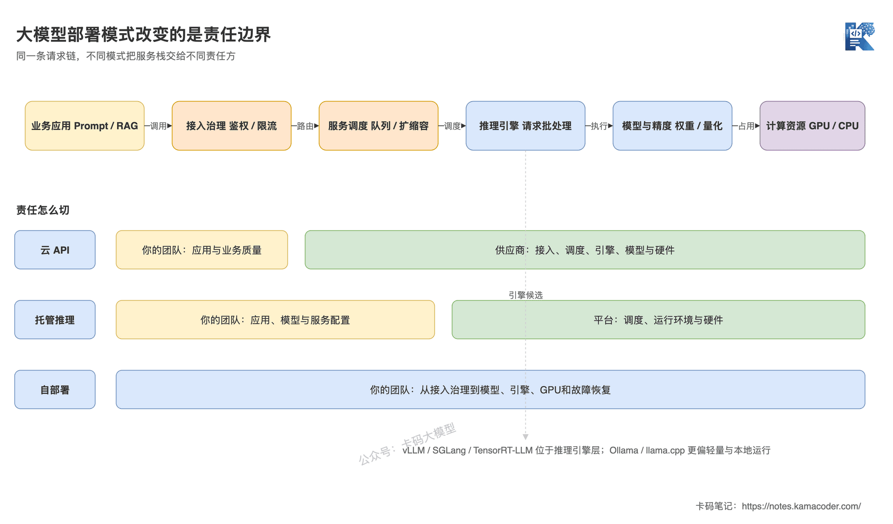
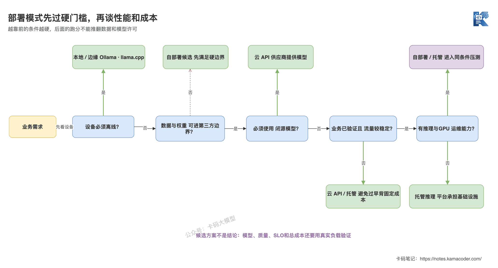

# 云API、托管推理还是自部署？大模型部署方案怎么选

> 来源: https://notes.kamacoder.com/llm/app/deployment_options.html

# `# 云API、托管推理还是自部署？大模型部署方案怎么选 
 

上一篇《面试官怎么问微调？应用开发者该怎么答》讲清了一个边界：应用开发者不一定亲手训练模型，但必须能判断什么时候值得微调。 

模型选完、Prompt和RAG也调通后，下一道边界题来了： 

**这个模型到底放在哪儿跑？** 

面试官问：“你们为什么选择自部署，而不是直接调用云API？” 

很多录友会回答：“自部署数据安全，而且vLLM性能高，长期肯定更便宜。” 

这个回答的问题很具体： 
  - 数据是否安全，取决于数据边界、合同、网络和日志策略，不由“自部署”三个字自动保证；   - vLLM只是推理引擎候选之一，不能替你决定部署模式；   - 自部署省下了Token账单，却增加了GPU闲置、扩缩容、升级、监控和故障恢复成本；   - 没有相同模型、相同负载下的质量和压测数据，“更便宜”只是猜测。 

真正要回答的不是“哪个工具最强”，而是：**哪些约束决定部署模式，谁负责每一层，最后用什么证据证明选择成立。** 

## `# 简要回答 
  - **云API**适合先验证业务、流量波动大、团队不想维护GPU的场景，代价是模型和底层优化控制较少；   - **托管推理**允许部署指定模型或权重，但把GPU调度、服务扩缩容等工作交给平台，控制力和运维成本居中；   - **自部署**适合模型权重必须可控、数据边界严格、流量足够稳定，且团队有推理与GPU运维能力的场景；   - vLLM、SGLang、TensorRT-LLM属于自部署或托管服务里的推理引擎选择，Ollama和llama.cpp更偏本地、边缘和轻量运行，不能把它们和部署模式混成一题；   - 最终选型要用同一模型、同一硬件和真实流量压测，比较质量、SLO内Goodput与每个成功任务的总成本。 

一句话：**先按业务约束选“谁来负责部署”，再按模型、硬件和负载选推理引擎。** 

## `# 详细回答 

### `# 部署方案本质上在决定什么？ 

部署方案决定的不是“从哪个URL请求模型”，而是**模型服务栈里的责任由谁承担**。 

一次线上请求至少要经过接入鉴权、限流路由、请求排队、推理引擎、模型权重和计算硬件。再往外还有监控、升级、扩缩容和故障恢复。 

选择云API，供应商替你承担大部分模型服务和硬件责任；选择托管推理，平台管基础设施，你开始负责模型及部分服务配置；选择自部署，整条链路基本都落到自己团队。 


 

这张图回答的是：云API、托管推理和自部署真正改变了什么。三种模式处理的是同一条请求链，差别不是有没有API，而是责任边界从哪一层切开；vLLM、SGLang等推理引擎只位于服务栈内部。 

这也解释了一个常见误区：**“OpenAI兼容接口”不等于“这是云API模式”。** 

自部署的vLLM、SGLang和llama.cpp同样可以暴露OpenAI兼容接口。接口长得像，只说明应用层迁移更方便，不代表模型行为、工具调用、结构化输出和运维责任完全一致。 

### `# 云API、托管推理、自部署分别适合谁？ 

三种模式不是从低级到高级，而是三种责任分配。 

| 部署模式  更适合的场景  主要代价 
| 云API  业务还在验证、流量波动大、需要快速使用前沿闭源模型、团队不维护GPU  模型和版本控制有限，受供应商配额、价格、地域与合规条件约束 
| 托管推理  要运行指定开源模型或私有权重，但不想自己维护完整GPU集群  仍受平台支持矩阵和资源供给约束，单位成本通常包含托管溢价 
| 自部署  权重和数据必须进入自有边界、需要深度推理优化、流量稳定且规模足够  要承担容量规划、GPU利用率、升级兼容、监控告警与故障恢复 

还有一类容易混进来的场景：**本地或边缘部署**。 

例如开发机离线调试、门店设备、个人电脑和端侧应用，核心约束往往是安装简单、硬件兼容、内存占用和离线可用。这时Ollama、llama.cpp这类工具很合适，但它解决的不是大型GPU集群的吞吐调度问题。 

判断规则很简单： 

**没有硬约束时，先选能最快验证业务的模式；只有当数据、模型控制、性能或规模真的形成约束，再承担更重的部署责任。** 

### `# “数据不能出域”就一定要自部署吗？ 

不一定，先把“出域”说清楚。 

有些业务要求数据不能进入公共互联网，但允许进入指定云VPC或专属实例；有些要求模型权重、请求数据和日志全部留在自有机房；还有些只要求敏感字段脱敏后才能外发。 

这三种要求对应的方案完全不同。 

项目里要先确认： 
  - 原始Prompt、RAG文档、模型输出和日志分别能到哪里；   - 供应商是否保存数据、用于训练或跨地域处理；   - 网络隔离、密钥、审计和删除策略由谁负责；   - 使用的模型权重和量化版本是否允许目标部署方式。 

**合规是架构输入，不是部署方案自动附赠的属性。** 

### `# vLLM、SGLang、TensorRT-LLM、Ollama到底怎么选？ 

先纠正层级：它们都能“把模型跑起来”，但目标用户、硬件范围和优化重点并不完全相同。 

截至2026年7月，可以先用下面这张定位表建立初始候选集： 

| 工具  更适合先进入候选集的情况  选型时重点核验 
| vLLM  通用GPU服务、OpenAI兼容接口、模型生态和部署集成优先  目标模型和量化格式支持、硬件后端、并行与高级特性兼容性 
| SGLang  低延迟高吞吐、长前缀复用、推理与RL链路、特定新模型优化  目标模型的优化成熟度、硬件平台、集群部署复杂度 
| TensorRT-LLM  NVIDIA硬件、需要深入利用低精度和多GPU优化  GPU代际、模型支持矩阵、特性组合和版本迁移成本 
| Ollama  本地开发、演示、单机私有运行、追求安装和模型管理简单  并发上限、队列、显存、模型格式与生产治理能力 
| llama.cpp  CPU、Apple Silicon、CPU+GPU混合、边缘设备和GGUF生态  目标硬件实测速度、量化质量、上下文和并发需求 

这里故意没有写“谁性能第一”。 

推理性能不是工具的固定属性，而是下面这些变量共同作用的结果： 

```
结果 = 模型结构 × 精度/量化 × 硬件 × 并行方式 × 输入输出长度 × 并发与SLO

```

 

换一个模型、GPU或Prompt长度分布，排名都可能变化。 

还有两个当前状态需要特别注意： 
  - Hugging Face已经把TGI标记为维护模式，并建议后续优先评估vLLM、SGLang、llama.cpp或MLX；   - TensorRT-LLM在2026年移除了旧TensorRT执行后端，当前官方文档以PyTorch为唯一执行后端，旧教程里的构建和转换流程不能直接照搬。 

所以工具清单只能作为带日期的快照。真正稳定的是：**先查目标模型和硬件的官方支持矩阵，再做自己的基准测试。** 

### `# 项目里怎么一步步选部署模式？ 

不要一上来就问“vLLM还是SGLang”，先过硬门槛。 

第一关看数据、模型许可和权重控制。如果指定数据或权重不能进入第三方边界，云API直接出局；如果必须使用闭源前沿模型，自部署同样可能直接出局。 

第二关看业务是否已经验证。需求、质量标准和调用量都没稳定时，先买API通常比先买GPU更合理。否则很容易用一个月搭好集群，才发现模型根本解决不了业务问题。 

第三关看流量与SLO。持续、可预测的高负载更容易摊薄固定GPU成本；低频和突发流量则可能让GPU长期闲置。实时对话、离线批处理和Agent长任务，对TTFT、TPOT和总完成时间的权重也不同。 

第四关看团队能力。自部署不是把Docker跑起来就结束，还要有人处理驱动、显存不足、模型升级、扩缩容、监控和夜间故障。 


 

这张图回答的是：部署选型应该按什么顺序做。数据和模型许可先做硬门槛，业务验证与流量再决定是否值得承担固定资源，最后才进入托管或自部署的工程选择；本地离线是另一条由设备边界触发的分支。 

这个顺序很重要。越靠前的条件越硬，后面的性能优化不能推翻前面的合规和模型可用性。 

### `# 自部署长期一定更便宜吗？ 

不一定，要比较总拥有成本，也就是TCO。 

云API成本比较显眼，通常能直接看到输入、输出和其他计费项。自部署的成本更分散： 

```
自部署TCO
= GPU与网络资源
+ 闲置和冗余容量
+ 存储与模型分发
+ 平台开发和运维人力
+ 升级、故障与停机成本

```

 

同样不能只比较“单Token成本”。更合理的业务口径是： 

```
每个成功任务成本 = 周期总成本 / 满足质量与SLO的成功任务数

```

 

这和前文《Token、成本与延迟：大模型应用的三个硬约束》是同一套逻辑：便宜但失败率高、超时多的方案，最终不一定便宜。 

### `# 最终选型为什么必须经过压测闭环？ 

因为文档和公开跑分只能帮你缩小候选集，不能替你签上线结论。 

至少固定下面这些条件： 
  - 同一个模型版本、Tokenizer和聊天模板；   - 同一种精度或量化方案；   - 同级硬件、GPU数量和并行方式；   - 接近线上的输入长度、输出长度、并发和突发流量；   - 相同的质量测试集、超时和SLO。 

然后同时比较三类证据： 
  - **质量**：任务成功率、结构化输出通过率、工具调用正确率和回归集；   - **性能**：TTFT、TPOT/ITL、端到端P95/P99、错误率和SLO内Goodput；   - **成本**：GPU利用率、周期总成本和每个成功任务成本。 


 

这张图回答的是：为什么选型不是一次拍板。业务约束先产生候选方案，统一压测生成质量、性能和成本证据；不满足门槛就调整部署模式、引擎或配置，只有三类指标同时过线才进入上线方案。 

现有《部署、推理、压测核心指标》可以先帮你建立TTFT、TPOT和吞吐直觉。但项目落地时不要照抄固定阈值，必须按业务体验设置P95/P99 SLO，并把队列时间、错误率和Goodput一起纳入。 

## `# 知识拓展 

**Q1：调用云API，是不是就完全不用懂部署？** 

不用管理GPU，不等于不用做工程。应用层仍然要处理配额、限流、超时、取消、重试、供应商故障、模型版本变化和成本监控。你只是把推理基础设施责任交给了供应商。 

**Q2：托管推理和云API最大的区别是什么？** 

云API通常调用供应商提供的模型服务；托管推理通常允许你指定开源模型或私有权重，由平台替你管理一部分计算与服务基础设施。前者交付“模型能力”，后者更接近交付“托管运行环境”。 

**Q3：vLLM和SGLang到底选谁？** 

先看目标模型、量化格式、硬件和必需功能是否受支持，再在真实负载下比较。模型刚发布时，某个引擎可能先做了专门优化；过几个版本后差距又会变化。没有脱离版本和负载的永久答案。 

**Q4：接口都兼容OpenAI，切换引擎是不是只改Base URL？** 

只能说接入成本可能更低。聊天模板、Tokenizer、工具调用、结构化输出、采样参数、错误码和并发语义仍可能不同。切换后必须跑功能回归和质量评估。 

**Q5：应用开发者需要学到多深？** 

不要求每个人都写CUDA内核，但要能讲清责任边界、容量和SLO，知道模型为什么放不下、并发为什么上不去、故障时该看哪一层。否则你只能把所有问题都归因成“模型太慢”。 

**Q6：面试里怎么回答“为什么自部署”？** 

先说硬约束，例如数据、权重或模型控制；再说流量与SLO是否足以支撑固定资源；然后说团队承担了哪些运维责任；最后给出同条件压测和TCO结果。不要只回答“安全、便宜、性能高”。 

本文涉及的工具现状核验于2026年7月，参考vLLM官方文档  (opens new window)、SGLang官方文档  (opens new window)、TensorRT-LLM迁移说明  (opens new window)、Ollama FAQ  (opens new window)、llama.cpp官方仓库  (opens new window)和TGI官方仓库  (opens new window)。 

别再先问“生产环境都用哪个框架”。 

能把责任、边界、SLO和总成本算清楚，才是真正会做部署选型。
