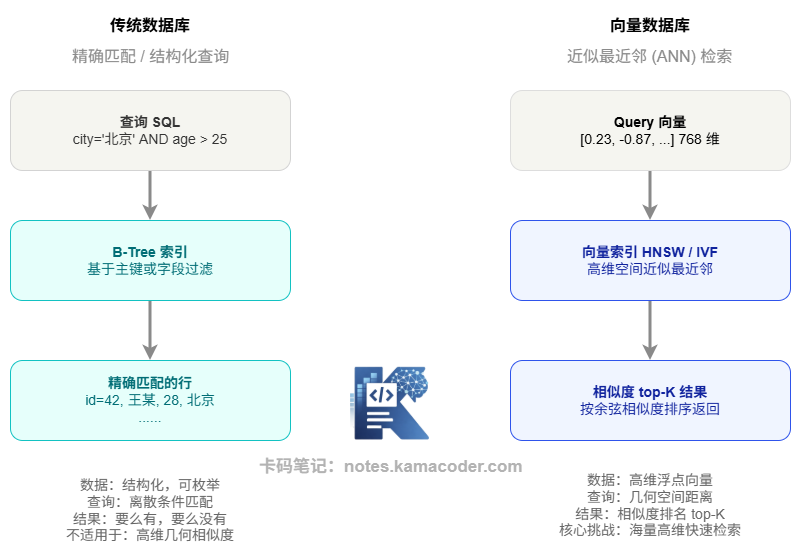
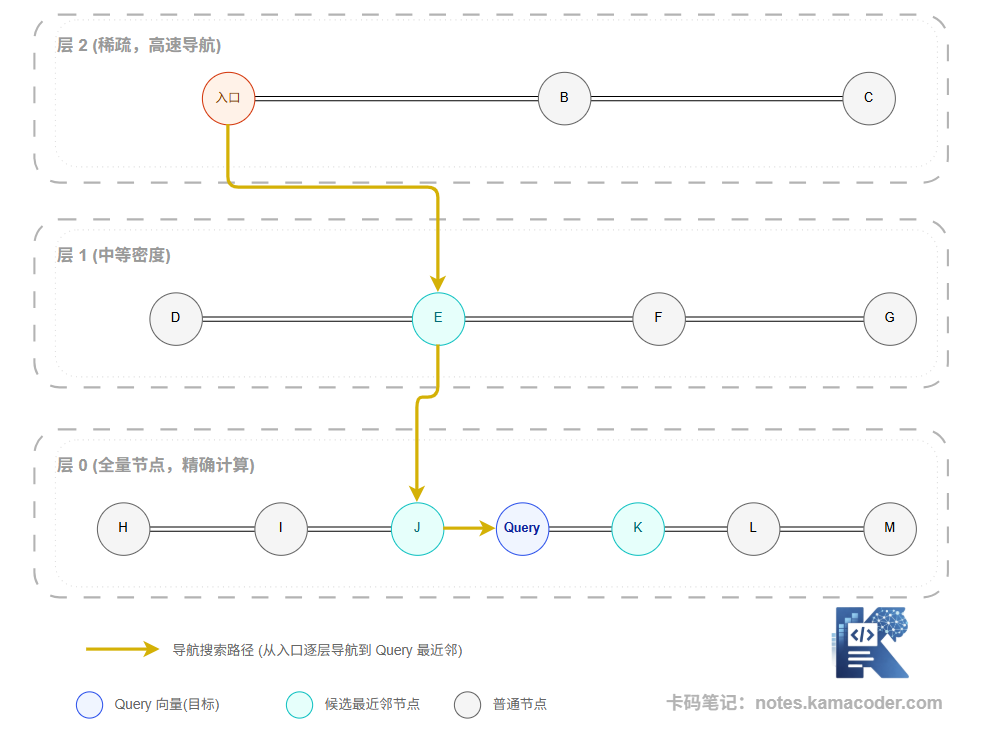

# 向量数据库解决了什么问题：为什么不能用 MySQL 做向量检索、ANN 索引原理

> 来源: https://notes.kamacoder.com/llm/app/vector_database.html

# `# 向量数据库解决了什么问题：为什么不能用 MySQL 做向量检索、ANN 索引原理 
 

## `# 一、从一个问题出发 

你做了一个 RAG 系统，有 100 万个文档 chunk，每个 chunk 都经过 Embedding 变成了一个 768 维的向量。 

现在用户提了一个问题，你把这个问题也向量化了。接下来你要做的事情是：找到 100 万个向量里，和这个 Query 向量**最相似**的 top-5 个。 

听起来不难，实际做起来很麻烦。 

最直接的方法是"暴力搜索"：把 Query 向量和全部 100 万个向量逐一计算余弦相似度，排序，取 top-5。在一台普通服务器上，这个操作大概需要几百毫秒到几秒——对于实时对话场景来说完全不可接受。 

而且，当向量数量增长到 1000 万、1 亿时，暴力搜索的耗时线性增长，根本无法用于生产。 

这就是**向量数据库要解决的核心问题**：在海量高维向量中，如何在毫秒级内找到最相似的结果？  

## `# 二、为什么不能用 MySQL 做向量检索？ 

这是面试里最常问的问题之一。答案不只是"MySQL 不支持"，而是有本质的技术原因。 

传统关系型数据库的查询本质上是**精确匹配**或**范围扫描**——比如 `WHERE age > 25 AND city = '北京'`，通过 B-Tree 索引可以快速定位到符合条件的行。 

向量相似度搜索完全不同。你不是在问"哪些向量等于某个值"，而是在问"哪些向量和我的查询向量**最接近**"——这是一个在高维连续空间里的几何问题。 

传统数据库的索引结构（B-Tree、Hash Index）对这类问题完全无效，因为它们设计之初没有考虑"高维几何相似度"这个维度。即便 PostgreSQL 的 pgvector 扩展支持向量存储，在大规模场景下的性能仍然远不如专门的向量数据库。 

 

## `# 三、向量索引：ANN 如何在速度和精度之间取得平衡 

要在百万量级向量中做毫秒级检索，关键是**向量索引**。向量数据库不做暴力全量计算，而是预先构建一个特殊的索引结构，让检索时只需访问一小部分向量就能找到近似的最近邻——这就是 ANN（Approximate Nearest Neighbor，近似最近邻搜索）。 

"近似"两字需要注意。ANN 不保证找到绝对最近邻，但在实践中找到的结果精准度足够高（通常 95%+），而速度提升是数量级的。 

目前最主流的两类向量索引算法是： 

**HNSW（Hierarchical Navigable Small World）** 

HNSW 构建了一个层级结构的图：最顶层是少量节点，形成"高速公路"；底层是所有节点，形成"街道网络"。检索时从顶层入口进入，沿图中的邻居边快速导航，逐层下降，像 GPS 导航一样越来越精细，最终定位到目标附近的最近邻。 

 

HNSW 的优势是查询速度极快、精度高，是 Milvus、Qdrant、Weaviate 等主流向量数据库的默认索引。代价是构建索引时内存占用较大。 

**IVF（Inverted File Index）** 

IVF 先对所有向量做 K-Means 聚类，把相似的向量分组到同一个"货架"里。检索时先找到 Query 向量最近的几个货架，只在这些货架内做精细查找，而不是全量扫描。 

IVF 的优势是内存占用较低，适合超大规模数据集。缺点是如果 Query 向量恰好落在两个货架的边界，可能会漏掉一些相关结果（边界效应）。  

## `# 四、向量数据库还能做什么？ 

向量数据库不只是"存向量、搜向量"这么简单，它还有几个在 RAG 工程里非常重要的能力： 

**元数据过滤（Metadata Filtering）** 

每个向量可以附带结构化的元数据，比如文档来源、创建时间、部门归属、文档类型等。检索时可以在向量相似度搜索的同时附加元数据条件——比如"只在最近三个月的文档里搜索"、"只搜索产品部门的文档"。这让 RAG 系统可以做到语义相关 + 业务过滤的组合查询。 

**混合检索（Hybrid Search）** 

主流向量数据库（如 Weaviate、Elasticsearch with dense vectors）支持同时运行向量搜索和关键词搜索，然后用融合算法（如 RRF，Reciprocal Rank Fusion）合并两路结果。这对中文专业术语场景尤其有用，因为有些专有名词的语义表示很弱，必须依赖关键词精确匹配。 

**向量更新和删除** 

知识库需要持续更新——文档修改了、删除了，向量索引也需要对应更新。不同向量数据库对这个操作的支持成本差异很大，选型时需要考虑业务的更新频率。  

## `# 五、主流向量数据库简介 

目前常见的向量数据库选项可以分几类： 

专用向量数据库，比如 Milvus、Qdrant、Weaviate、Pinecone——这类系统从设计之初就以向量检索为核心，功能最完善，性能最优，适合大规模生产场景。 

传统数据库的向量扩展，比如 PostgreSQL + pgvector、Elasticsearch + dense vectors——如果已有这些基础设施，小规模场景下也可以用，但在百万量级向量时性能明显不如专用方案。 

轻量级本地库，比如 FAISS（Facebook AI Similarity Search）、Chroma——FAISS 是纯向量索引库（不是完整的数据库），适合嵌入到应用内做原型或小规模部署；Chroma 则是轻量级向量数据库，适合开发调试阶段。 

选型的核心考量是规模和功能需求：如果是几十万向量以内的场景，Chroma 或 pgvector 足够；规模到百万以上、需要元数据过滤和混合检索，Milvus 或 Qdrant 是更好的选择；如果要云端托管、免运维，Pinecone 值得考虑。  

## `# 六、常见误区 

**误区 1："向量数据库的结果不精确，所以不可靠"** 

ANN 的"近似"指的是找到的不一定是数学意义上的绝对最近邻，但实践中召回精度通常在 95%-99%（通过 recall@K 指标衡量）。对于 RAG 应用来说，这个精度完全够用，而速度收益是数量级的。 

**误区 2："向量数据库越大越好，建索引时参数越高越好"** 

HNSW 等索引有超参数（如 M——每个节点的最大连接数，efConstruction——建图时的搜索深度），这些参数越大精度越高，但内存占用和构建时间也成比例增加。需要根据实际场景找到精度/速度/内存的平衡点，不是越大越好。 

**误区 3："向量相似度高就代表语义相关"** 

向量相似度是 Embedding 模型学出来的相似度，取决于模型的训练质量和领域覆盖。如果 Embedding 模型对某个专业领域支持不足，即便向量相似度高，语义也可能并不相关。向量数据库只是工具，底层模型的质量仍然是决定因素。 

**误区 4："用 FAISS 就是用了向量数据库"** 

FAISS 是一个向量索引库，不是完整的数据库系统。它没有持久化、没有元数据管理、没有 CRUD 接口，只负责索引构建和搜索计算。在生产环境里，通常需要在 FAISS 基础上自己封装持久化和业务逻辑，或者直接用封装好这些能力的向量数据库。  

## `# 七、面试可能怎么问 

**Q：为什么不用 MySQL 做相似检索？** 

参考思路：分两个层面回答。第一，功能层面：传统关系型数据库的查询模型是精确匹配和范围扫描，基于 B-Tree 等索引结构，这类结构无法支持"找高维空间中的近似最近邻"这种几何问题；第二，性能层面：即便通过扩展支持向量存储和计算（如 pgvector），在百万级向量时全量计算余弦相似度的复杂度是 O(N)，远远无法满足毫秒级检索需求。向量数据库通过 HNSW、IVF 等专门的近似索引结构，把检索复杂度降低到近似 O(log N)。 

**Q：向量数据库为什么能加速召回？** 

参考思路：向量数据库的核心是 ANN（近似最近邻搜索），通过预先构建向量索引来避免全量计算。以 HNSW 为例，它构建了分层的可导航小世界图，检索时从顶层稀疏图的入口快速导航，逐层定位到目标区域，只访问极少数节点就能找到近似最近邻，速度比暴力搜索快几个数量级。代价是"近似"——不保证绝对最近邻，但实践中 recall 精度 95%+ 足以满足 RAG 场景需求。  

## `# 八、结语 

向量数据库解决的是一个传统数据库根本没有设计来解决的问题：在海量高维向量中快速找到相似的那些。理解了它和传统数据库的本质区别，以及向量索引（HNSW/IVF）的工作原理，你就能在 RAG 系统的选型和优化中做出更有依据的决策。
