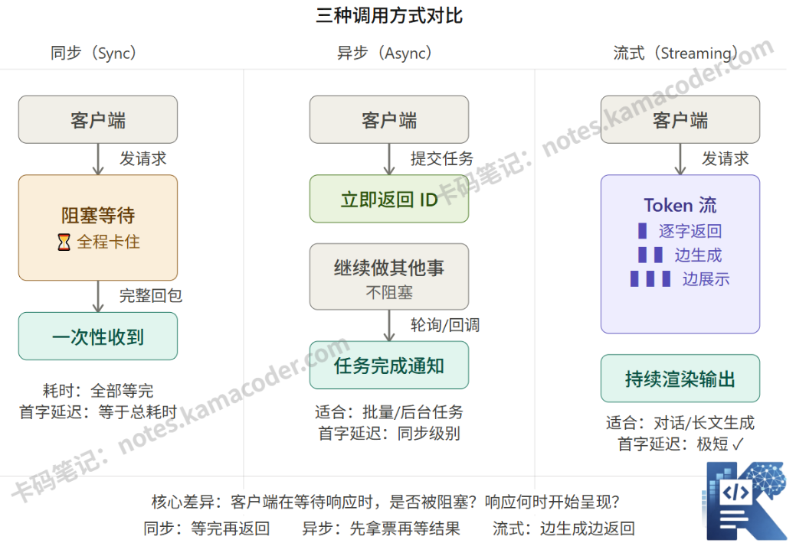
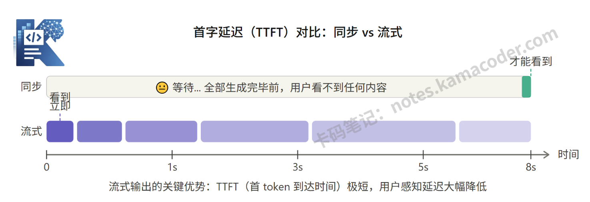

# 大模型同步、异步、流式输出怎么选？三种调用方式详解

> 来源: https://notes.kamacoder.com/llm/app/streaming_output.html

# `# 大模型同步、异步、流式输出怎么选？三种调用方式详解 
 

## `# 一、为什么调用方式很重要 

之前提到过，初学者第一次接触大模型API，都是用最简单的方式：发个请求，等着拿结果，打印出来。这是OK的。 

但当你把这个逻辑放进真实产品的时候，问题就来了： 
> 

用户发了一个问题，页面白屏转圈 10 秒，然后蹦的一下子出来一大段文字——**体验很差** 

你想批量处理 1000 条文档，用同步的方式一条等完再发下一条——**效率极低** 

你做了一个对话产品，用户希望看到逐字打出来的效果——**同步根本做不到**
 

这就是同步、异步、流式输出这三种调用方式存在的原因。它们不是高级特性，而是应对不同业务场景的基本工程选择。  

## `# 二、同步、异步、流式 

### `# 1. 同步调用（Synchronous） 

最直观的方式。你发出请求，然后程序挂起等待，直到模型把完整内容全部生成完毕，才把结果一次性返回给你。 

（你去奶茶店点了一杯奶茶，点单后没有离开，而是站在柜台前一直等待，直到店员做好奶茶、递给你，你才转身离开。这个过程中，你（客户端）的所有动作都被“等待奶茶”阻塞了——不能去做其他事，只能等。） 

它的优点在于逻辑简单，代码好写，调试方便。但在模型生成期间，调用方什么都做不了。如果模型需要10秒才能生成完一篇文章，调用方就得等10秒。适合内部脚本、批处理任务、测试和原型阶段、对实时性没有要求的后台任务。  

### `# 2. 异步调用（Asynchronous） 

异步的核心思路是：把**提交任务**和**拿结果**分开来做。 

譬如你提交了一个生成任务，系统立刻返回一个任务ID（"你的单号是 XX，已受理"），接下来你的程序不用等着，可以继续做别的事。过一段时间，你再去查询这个ID对应的任务有没有完成，或者系统主动回调通知你。 

（你去奶茶店点单后，店员给你一个取号器，告诉你“做好了会叫号”，你可以拿着取号器去旁边坐着刷手机、做其他事，不用一直站在柜台前等；等取号器响了，你再去柜台拿奶茶。） 

适用任务耗时长，不希望占用请求线程，可以接受延迟交付结果的场景。 
> 

⚠️ **常见误区：** 很多人以为"异步"就等于"更快"。并不是。异步解决的是**资源利用率**的问题（让程序不用傻等），而不是让模型生成更快。首字延迟和总耗时，异步并不比同步短。
 

Anthropic 官方API提供了Batch API，就是为了解决这类大批量异步处理的需求，成本更低，延迟宽松。  

### `# 3. 流式输出（Streaming） 

流式才是今天大部分对话类 AI 产品背后真正在用的方式。 

它的原理是：模型**生成一个 token，就立刻发送一个 token**，不等全部生成完才返回。客户端收到第一个 token 后，就可以开始渲染展示，用户会看到文字一个字一个字地"打印"出来。 

（你去奶茶店点了一杯奶茶，店员没有等完全做好再递给你，而是边做边给你：先把空杯子递给你，再倒入茶汤，最后加入珍珠、奶盖，每一步都实时反馈给你，你能全程看到奶茶的制作过程，不用等到最后才拿到完整的奶茶。） 

这不是前端的"打字机动画特效"，而是真实的数据流。后端在持续往前端推数据，前端在持续渲染。 

技术上，流式输出依赖的是**SSE（Server-Sent Events）**。不需要深入了解，但知道这个有助于你理解为什么网络层面需要特殊处理。 

  

## `# 三、为什么流式输出这么常见？ 

这里引入一个关键概念：**TTFT（Time to First Token，首 token 到达时间）**。 

在用户体验研究里有一个经典结论：用户能接受"慢"，但很难接受"卡"。也就是说，页面白屏等 10 秒，远比看着文字一个字一个字打出来 10 秒的心理负担更重。 

流式输出的核心价值，不是让总生成时间变短，而是**让用户感受到系统在工作**，让首字延迟降到极低（通常 200ms 以内），从而大幅提升主观体验。另一个实际价值是：如果用户发现生成方向不对，他可以提前打断，不必等到全部输出完再重试。 

  

## `# 四、面试可能怎么问？ 

*Q：你们的产品为什么要用流式输出，而不是等生成完再返回？* 

参考思路：从用户体验角度切入——流式可以大幅降低 TTFT（首 token 延迟），用户不需要等待完整内容就能开始阅读，主观上感受到系统响应很快。同时流式允许用户提前打断不合适的输出，提升交互效率。 

*Q：流式输出的技术原理是什么？* 

参考思路：大模型是自回归生成的，每次生成一个token，流式就是利用HTTP的分块传输（chunked transfer）或SSE（Server-Sent Events）机制，将每个token生成后立刻推送给客户端，而不是缓冲全部结果再一次性发送。 

*Q：什么场景下不该用流式？* 

参考思路：当下游逻辑依赖完整输出时，比如需要做JSON解析、结构化提取、或者把完整文本存入数据库，流式反而引入额外复杂度，这时同步调用更合适。  

## `# 五、结语 

同步、异步、流式，本质上是三种任务与结果的交付模式，对应不同的业务需求和工程约束。在做技术选型时，能清楚地说出"为什么这里用流式，那里用异步"，这是应用开发者需要具备的工程判断力。
