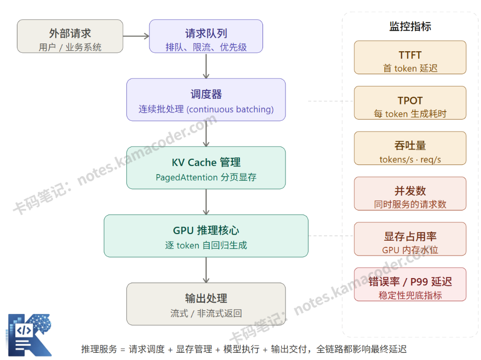
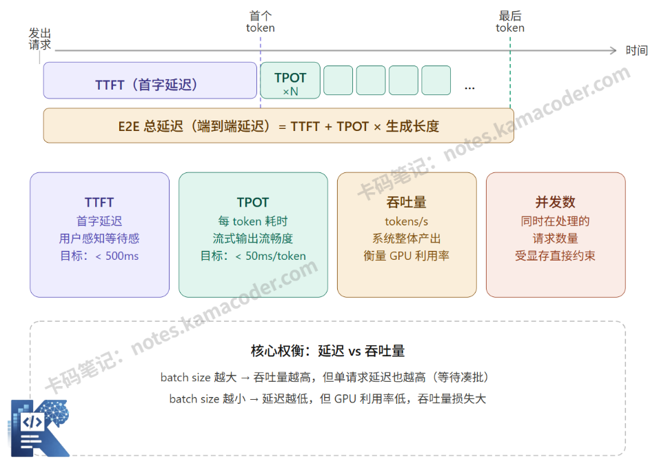

# 大模型部署、推理、压测核心指标：TPS、首字延迟、吞吐、并发

> 来源: https://notes.kamacoder.com/llm/app/stress_testing.html

# `# 大模型部署、推理、压测核心指标：TPS、首字延迟、吞吐、并发 
 

前段时间有个录友来找我复盘，他面了阿里的Agent开发岗，项目里做了一套企业级 AI 对话服务。 

他的系统在业务层做得相当不错 —— 交互流畅、功能完整、Prompt 清晰、结构化输出也稳得很。但面试官问了几句业务逻辑后，直接杀向部署、推理、压测方向去了： 

面试官：“你的功能没问题，那一到高峰期就卡顿、响应忽快忽慢，问题出在哪？” 

他：“可能是网络波动…… 或者服务器配置太低？” 

面试官：“硬件资源是充足的，再想想。” 

他沉默了几秒：“是不是模型太大了，跑得慢？” 

面试官摇摇头：“我给你换最强的GPU，延迟照样不稳定。你的推理服务怎么做的？压测指标关注哪些？” 

他：“我就直接调用模型 API，压测看了下平均耗时……” 

面试官：“那你知道 TTFT、TPOT、P99 延迟代表什么吗？KV Cache、vLLM、PagedAttention 你在项目里怎么用的？” 

他：“阿巴阿巴阿巴。。。” 

部署、推理、压测才是大模型应用能不能稳定上线的底气，今天我们把从头到尾拆清楚。 

## `# 一、为什么应用开发者也需要懂部署？ 

初级应用开发者在做demo时往往得心应手，可一旦业务量上来，你会发现自己根本绕不开部署层的问题： 
> 

为什么高峰期响应特别慢，用户反馈体验差？ 

为什么同样的请求，有时候 2 秒返回，有时候要 20 秒？ 

老板问"这个系统能支撑多少并发用户"，你说不出来 

压测报告上一堆指标，不知道该看哪个、该优化什么
 

是不是挺真实？这些问题的答案，都藏在部署和推理服务这一层。你可能不需要自己去写框架，但你需要读得懂这一层在说什么，才能和基础设施团队对话，才能在面试里说清楚你的系统设计。  

## `# 二、模型部署，在关注什么？ 

"部署"这个词在不同场景下含义不同。在大模型场景里，模型部署主要解决的是：**如何让一个训练好的模型，变成可以被稳定调用的服务？** 

有几个核心问题我们至少要在概念上有所了解： 

1、用什么框架跑？ 

模型不能直接用 PyTorch 训练代码上线，需要专门的推理框架。常见的有 vLLM、TGI（Text Generation Inference）、TensorRT-LLM 等。这些框架会针对推理场景做大量优化，比如批处理请求、显存管理、KV Cache 复用等。 

2、模型放在哪？ 

大模型的权重动辄几十 GB 甚至几百 GB，放在单卡上跑不下的时候需要多卡并行（张量并行、流水线并行）。 

3、如何管理显存？ 

推理时的显存消耗有两部分：一是模型权重本身（静态，加载一次），二是 KV Cache（动态，每个请求都会产生，随序列长度增长）。推理的优化就是要在有限显存里，服务尽可能多的并发请求。 

4、模型量化与格式转换 

如果原始模型用 FP32 存储，量化成 INT8 之后，模型体积能缩小几倍，推理速度也会提升，但可能带来轻微的精度损失。选择合适的量化策略，是部署阶段的常见决策点。 
> 

PS： 

量化：将大型语言模型中的高精度参数转换为低精度格式，从而降低内存占用、加快推理速度并提升部署效率的技术
  

## `# 三、推理服务，在关注什么？ 

模型部署好了，推理服务层才真正开始工作。推理服务是一个围绕模型的服务化封装，它负责： 

接收外部请求，管理请求队列，调度 GPU 资源，把请求送进模型，收集输出，再返回给调用方。 

 

## `# 四、vLLM 是为了解决什么问题？ 

这是面试里最高频的一个问题，值得单独说清楚。 

大模型推理时，有一个叫做 KV Cache 的机制：模型在处理每个 token 时，会计算出 Key 和 Value 矩阵，这些中间结果可以被后续 token 复用，从而避免重复计算。KV Cache 会占用显存，而且随着序列长度增长，占用量线性增加。 

传统推理框架管理 KV Cache 的方式很粗暴：为每个请求预先分配一块连续的显存，按最大序列长度分配。这带来了两个严重问题： 

第一，内存碎片化。不同请求的实际生成长度差异很大，预分配的显存大量浪费，导致明明还有显存，却因为找不到连续空闲块而无法服务新请求。 

第二，并发上限低。显存利用率只有 20%~40%，GPU 资源严重浪费，能同时服务的请求数很少。 

vLLM 提出了 PagedAttention 技术，借鉴操作系统虚拟内存的分页思想（梦回考研408）：把 KV Cache 切分成固定大小的"页"（block），不需要预分配连续空间，按需动态分配和回收，像管理内存页表一样管理 KV Cache。 

效果是：显存利用率显著提升，相同显存下吞吐量大幅提升。 

简单说，vLLM 解决的核心问题是：**让 GPU 显存不再因为碎片化而被大量浪费，从而用同等硬件服务更多请求。**  

## `# 五、压测需要关注的指标 

上线前必须做压测，压测报告里会出现一堆指标。下面这张图把最核心的几个指标放在一起，帮你建立直觉： 

 

上图里的几个指标，在实际压测中各有侧重： 
> 

**TTFT（Time to First Token，首 token 延迟）** 

从请求发出到第一个 token 返回的时间。这是用户主观感受最强烈的指标——超过 1 秒，用户会开始觉得"系统在卡"。对话类产品对 TTFT 极度敏感，目标通常控制在 200-500ms 以内。 

TTFT 主要受 Prefill 阶段影响：模型要先把整个输入 Prompt 的所有 token 都处理完（计算 KV Cache），才能开始生成第一个输出 token。Prompt 越长，TTFT 越高。 

**TPOT（Time Per Output Token，每 token 生成耗时）** 

生成阶段每个 token 的平均耗时。它决定了流式输出的"打字速度"，太慢会让用户感觉文字一顿一顿的。一般目标是 30-80ms/token，对应人眼感知流畅的输出速度。 

**吞吐量（Throughput）** 

单位时间内系统能处理的 token 数量或请求数量，通常用 tokens/s 或 req/s 表示。这是衡量系统效率和 GPU 利用率的核心指标，直接影响单位算力的服务成本。 

**并发数（Concurrency）** 

系统同时在处理的请求数量。并发数受显存约束——每个请求都需要分配 KV Cache，显存满了就没法接受新请求。压测时需要找到系统在不降低 SLA（服务等级协议）前提下能支撑的最大并发数。
  

## `# 六、为什么大模型系统要特别关注首字延迟？ 

这是面试里另一个高频问题，值得展开说。 

普通 Web 服务的延迟通常是端到端的，用户等的是"整个结果"。大模型的情况不同：它是自回归生成的，输出内容本来就是逐步产生的。 

这意味着大模型系统有一个独特的机会：**即使整体生成需要 10 秒，只要前几百毫秒就能输出第一个 token，用户就不会感觉到等待**——他们会看到内容在逐渐出现。 

这就是为什么在大模型产品里，TTFT 的优先级往往高于 E2E 总延迟。优化 TTFT，等于在用户等待感知上做了最大收益的投入。 

从工程角度，降低 TTFT 的常见手段有：减少 Prompt 长度、使用推测解码（speculative decoding）、做 Prompt caching（对常见前缀的 KV Cache 做复用）等。  

## `# 七、常见的一些问题 

**误区 1："用云 API 就不用管部署了"** 

调用 OpenAI、Claude 等第三方 API，确实可以不管部署，但你仍然需要理解推理层的指标——限流策略、并发控制、超时处理，这些都是应用层必须面对的工程问题，而理解这些需要知道背后的推理逻辑。 

**误区 2："吞吐量越高越好"** 

不一定。吞吐量和延迟通常是此消彼长的关系。如果你的产品是实时对话，牺牲延迟来换吞吐量是错误取舍，需要根据实际业务来决定优化方向。 

**误区 3："压测结果等于线上表现"** 

压测通常用均匀分布的请求，而线上流量有峰谷差异、长短 Prompt 混合、突发脉冲等。压测数据是参考基线，真正的生产稳定性需要配合限流、降级策略一起保障。  

## `# 八、结语 

部署和推理是大模型应用"能不能上线"和"上线后好不好用"的底层基础。作为应用开发者我们应该能读懂推理层的指标，能和基础设施团队对话，能在系统设计里做出合理的选型决策。
