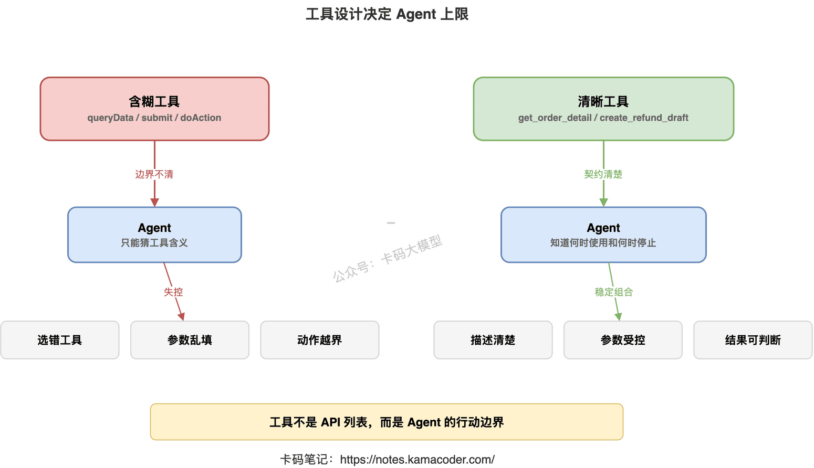
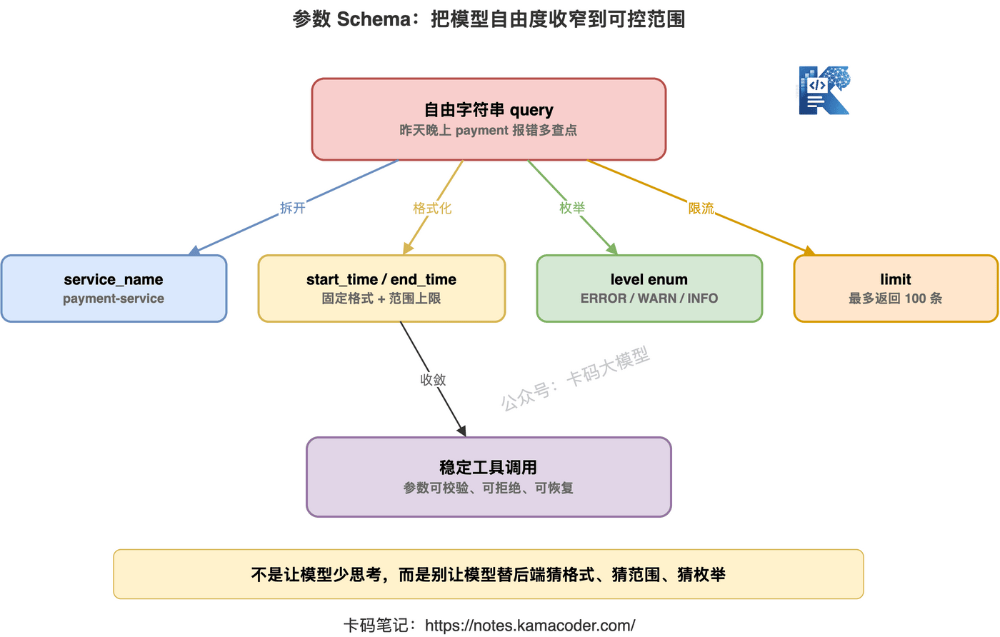
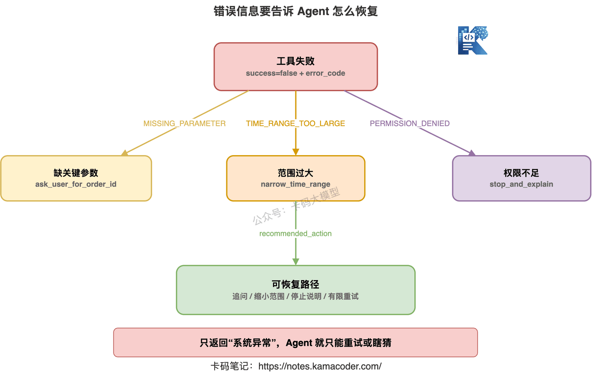
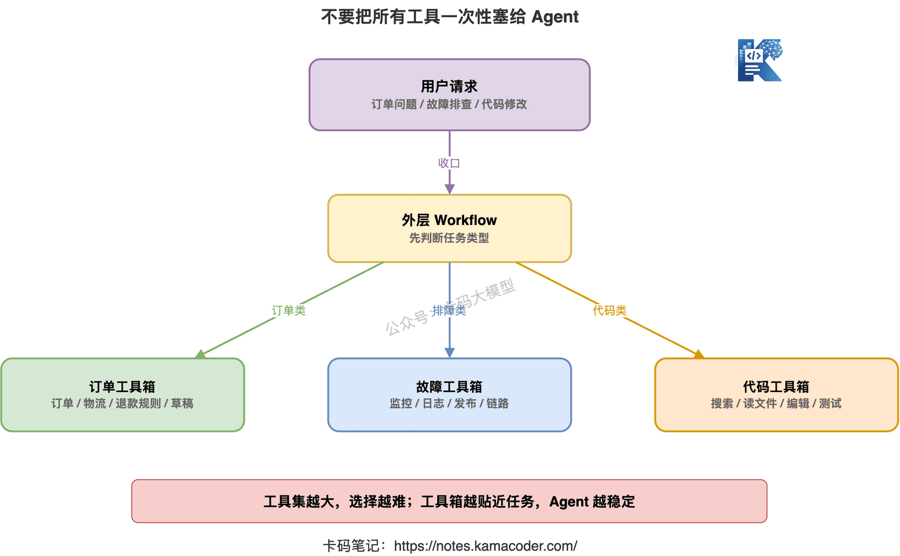

# 工具设计决定 Agent 上限

> 来源: https://notes.kamacoder.com/llm/app/agent_tool_design.html

# `# 工具设计决定 Agent 上限 
 

前几篇我们把 Agent 的基础逻辑讲清楚了。 

Agent 到底是什么，核心是：**Agent 不是更会聊天，而是能围绕目标持续行动。** 

ReAct、Reflection、规划执行，核心是：**Agent 要能边做边判断，做完还要检查。** 

Agent vs Workflow，核心是：**流程能写死，就别硬上 Agent；路径不确定，才让 Agent 动态决策。** 

但真正开始做 Agent，很多录友会马上踩下一个坑： 

“我已经给 Agent 接了工具，为什么它还是经常选错、参数乱填、结果看不懂，甚至越跑越偏？” 

这时候别急着怪模型。 

很多 Agent 不是模型不行，而是工具设计太差。 

**工具设计，直接决定 Agent 的能力上限。** 

你给它一个含糊的工具，它就只能猜。 

你给它一堆粒度混乱的工具，它就会乱选。 

你给它一个返回值全是自然语言的工具，它下一步就没法稳定判断。 

你给它一个没有权限边界的写操作工具，它迟早会把生产系统干出事故。 

这篇就专门讲：**Agent 的工具到底应该怎么设计。** 


 

## `# 一、工具不是 API 列表，而是 Agent 的行动边界 

很多人一开始做工具调用，思路是这样的： 

“后端已经有一堆接口了，我把这些接口都注册给大模型，不就完事了吗？” 

不完事。 

这也是很多 Agent 项目失控的开始。 

后端 API 是给程序员用的。 

Agent 工具是给模型决策用的。 

这两个东西不是一回事。 

程序员调用 API 时，脑子里知道业务含义、调用时机、参数来源、异常处理。 

模型不知道。 

模型看到的只是工具名、工具描述、参数 Schema 和历史上下文。 

如果你把一堆内部接口原样丢给模型，比如： 
  - `queryData`   - `getInfo`   - `submit`   - `updateStatus`   - `doAction` 

那它只能猜。 

它不知道 `queryData` 查的是订单、用户、日志，还是财务数据。 

它不知道 `submit` 是提交草稿，还是直接提交审批。 

它不知道 `updateStatus` 会不会产生真实业务影响。 

所以工具设计的第一条原则是： 

**工具不是把 API 暴露给模型，而是把可控动作封装成模型能理解、能选择、能恢复的能力。** 

这句话有点长，但很关键。 

一个好工具，至少要回答四个问题： 
  - 这个工具能做什么？   - 什么时候应该用它？   - 什么时候不应该用它？   - 调用完之后，Agent 能不能根据结果继续判断？ 

如果这四个问题没回答清楚，Agent 就会开始自由发挥。 

自由发挥听起来很智能。 

放到生产里，就是不稳定。 

## `# 二、工具描述：不要只写“查询订单信息” 

先讲最容易被忽略的地方：工具描述。 

很多工具描述写得特别随意。 

比如： 

```
{
  "name": "get_order",
  "description": "查询订单信息"
}

```

 

这描述太浅了。 

模型看完只能知道这个工具能查订单。 

但它不知道： 
  - 查的是订单基础信息，还是支付、物流、退款状态？   - 用户只提供手机号时能不能用？   - 订单不存在时会返回什么？   - 这个工具适合排查什么问题？   - 它能不能替代退款工具？ 

对人来说，“查询订单信息”也许够了。 

对 Agent 来说，不够。 

因为 Agent 要靠描述判断“下一步该不该用它”。 

更好的描述应该这样写： 

```
{
  "name": "get_order_detail",
  "description": "根据订单ID查询订单的基础状态、支付状态、发货状态和退款状态。适用于用户询问订单进度、支付是否成功、是否已发货、是否已退款等问题。不用于创建订单、修改订单或发起退款。"
}

```

 

你看，差别很明显。 

好的工具描述不只是说“能做什么”，还要说清楚“适用边界”。 

尤其要写清楚三类信息： 

**第一，工具能解决什么问题。** 

比如“查询订单状态”“查询接口延迟”“检索知识库文档”“创建工单草稿”。 

不要写“处理用户请求”这种空话。 

**第二，工具不能做什么。** 

比如查询工具不能修改数据。 

草稿工具不能直接发送消息。 

库存查询工具不能代表最终可购买数量。 

这个“不做什么”很重要。 

因为 Agent 最怕把相似工具混在一起。 

**第三，什么时候优先使用它。** 

比如： 

“当用户提供订单ID时优先使用。” 

“当需要定位接口性能问题时，先用该工具确认异常时间段。” 

“当知识库检索无结果时，不要反复调用，应改为询问用户补充信息。” 

这些描述会直接影响模型的工具选择。 

工具描述不是注释。 

**工具描述就是 Agent 的使用说明书。** 


 

## `# 三、参数设计：别把脏活都丢给模型 

工具描述决定模型会不会选对工具。 

参数设计决定模型能不能把工具用对。 

很多 Agent 工具的参数设计很粗暴： 

```
{
  "name": "search_logs",
  "parameters": {
    "query": "string"
  }
}

```

 

看起来很灵活。 

实际上很危险。 

因为你把所有脏活都丢给模型了。 

模型要自己决定： 
  - 查哪个服务   - 查哪个时间段   - 查什么日志级别   - 查哪些关键词   - 返回多少条   - 要不要按 traceId 过滤 

这就很容易出问题。 

它可能把时间写成“昨天晚上”。 

可能把服务名写错。 

可能查了太宽的范围，导致工具超时。 

可能查了太窄的范围，什么都查不到。 

更好的方式，是把参数拆清楚： 

```
{
  "name": "search_service_logs",
  "description": "查询指定服务在固定时间范围内的日志，用于排查接口错误、超时和异常调用链。",
  "parameters": {
    "type": "object",
    "properties": {
      "service_name": {
        "type": "string",
        "description": "服务名称，例如 payment-service"
      },
      "start_time": {
        "type": "string",
        "description": "查询开始时间，格式为 YYYY-MM-DD HH:mm:ss"
      },
      "end_time": {
        "type": "string",
        "description": "查询结束时间，格式为 YYYY-MM-DD HH:mm:ss"
      },
      "level": {
        "type": "string",
        "enum": ["ERROR", "WARN", "INFO"],
        "description": "日志级别，排查故障时优先使用 ERROR 或 WARN"
      },
      "keyword": {
        "type": "string",
        "description": "可选关键词，例如接口路径、错误码或 traceId"
      }
    },
    "required": ["service_name", "start_time", "end_time", "level"]
  }
}

```

 

这样 Agent 就不会随便编一个大字符串。 

它必须按结构填参数。 

这就是参数 Schema 的价值。 

它不是为了让接口看起来高级。 

**它是为了把模型的自由度约束在合理范围内。** 


 

参数设计有几个很实用的原则。 

### `# 1. 能枚举就枚举 

比如日志级别、订单状态、排序方式、操作类型。 

能用 enum，就不要让模型自由填字符串。 

自由字符串看似灵活，但很容易出现： 
  - `err`   - `error`   - `ERROR_LOG`   - `fatal`   - `错误` 

后端还要做一堆兼容。 

枚举能减少很多不必要的不稳定。 

### `# 2. 时间、数量、范围要明确 

Agent 很喜欢写模糊表达： 
  - 最近   - 昨晚   - 前几天   - 多查一点 

这些对人能理解，对工具不稳定。 

工具参数里最好要求明确格式： 
  - `start_time`   - `end_time`   - `limit`   - `page_size`   - `sort_by` 

同时加上默认上限。 

比如日志查询最多返回 100 条。 

检索工具最多返回 5 个文档块。 

监控查询时间范围不能超过 7 天。 

这些限制不是小题大做。 

它们是在防止 Agent 一次调用把系统拖垮。 

### `# 3. 不要让一个参数承担多个含义 

比如： 

```
{
  "user_input": "帮我查一下张三昨天的订单"
}

```

 

这个参数就太混乱。 

它里面混了用户、时间、对象和意图。 

工具端还要再做一次理解。 

如果工具本身还要靠大模型再解析，那你就把不确定性叠了两层。 

更好的方式是拆开： 
  - `user_name`   - `date`   - `query_type` 

参数越清楚，Agent 越稳定。 

### `# 4. 缺关键参数时，不要让模型硬编 

这个特别重要。 

用户问： 

“帮我查一下订单怎么还没发货？” 

但他没给订单号。 

这时候 Agent 不应该编一个订单号，也不应该直接调用工具。 

更好的工具描述和系统约束应该告诉它： 

**缺少必填参数时，先向用户追问。** 

比如： 

“需要订单ID才能查询发货状态，请你提供一下订单号。” 

很多 Agent 翻车，就是在关键信息缺失时硬调用。 

它不是在解决问题。 

它是在制造幻觉。 

## `# 四、返回值设计：别只返回一段自然语言 

很多人只重视工具入参，不重视工具返回值。 

这也很容易出问题。 

比如一个订单查询工具返回： 

```
{
  "result": "订单已经支付成功，目前正在仓库处理中，预计明天发货。"
}

```

 

人看当然没问题。 

但 Agent 下一步要怎么判断？ 

它要不要继续查物流？ 

它要不要告诉用户退款入口？ 

它怎么知道这是支付成功，还是发货中？ 

如果返回值只有一段自然语言，模型又要重新理解一遍。 

这会带来新的不稳定。 

更好的返回值应该结构化： 

```
{
  "success": true,
  "order_id": "202605190001",
  "order_status": "PROCESSING",
  "payment_status": "PAID",
  "shipping_status": "NOT_SHIPPED",
  "refund_status": "NONE",
  "estimated_shipping_time": "2026-05-20",
  "evidence": [
    "支付流水号 PAY_8891 已确认",
    "仓库系统状态为待出库"
  ]
}

```

 

这样 Agent 就能稳定判断： 
  - 支付成功了   - 还没发货   - 没有退款   - 可以告诉用户预计发货时间   - 如果用户继续问退款，再调用退款规则工具 

这才是能被 Agent 消费的返回值。 

工具返回值设计，至少要包含三类信息。 


 

**第一，状态字段。** 

比如： 
  - `success`   - `status`   - `error_code`   - `order_status`   - `risk_level` 

状态字段让 Agent 能做分支判断。 

**第二，证据字段。** 

比如： 
  - 数据来源   - 命中文档   - 查询时间范围   - 监控指标   - 日志片段 ID 

证据字段让 Agent 的最终回答不只是猜。 

它能说“我根据什么得出这个结论”。 

**第三，下一步提示。** 

比如： 

```
{
  "suggested_next_actions": [
    "如果用户询问物流单号，可以调用 get_shipping_detail",
    "如果用户要求取消订单，可以先调用 check_cancel_policy"
  ]
}

```

 

这个字段不是必须，但在复杂 Agent 里很有用。 

它不是替 Agent 做决定，而是给 Agent 一个可靠的行动提示。 

尤其是业务系统里，不同状态对应不同后续动作。 

把这些动作提示写在工具返回里，比让模型凭空猜稳定得多。 


 

## `# 五、工具粒度：太细会跑断，太粗会失控 

工具粒度，是 Agent 设计里最容易纠结的问题。 

工具应该设计得细一点，还是粗一点？ 

答案是：都不能极端。 

### `# 1. 工具太细，Agent 会被迫做大量低级决策 

比如你给 Agent 这些工具： 
  - `get_user_id_by_phone`   - `get_order_ids_by_user_id`   - `get_order_base_info`   - `get_payment_info`   - `get_shipping_info`   - `get_refund_info` 

这些工具单看都没问题。 

但如果用户只是问： 

“我买的东西怎么还没发货？” 

Agent 可能要连续调用五六次。 

中间任何一步参数错了、结果空了、状态没记录好，后面就断了。 

工具太细，会让 Agent 变成一个脆弱的流程编排器。 

模型要做太多机械步骤。 

这不是它擅长的。 

### `# 2. 工具太粗，Agent 又看不见过程 

另一种极端是： 
  - `handle_order_problem`   - `solve_user_issue`   - `process_after_sales` 

这种工具太粗。 

Agent 调用之后，里面到底做了什么，它不知道。 

返回一个“处理成功”，它也不知道成功在哪里。 

出错了，也不知道是订单不存在、支付失败、库存不足，还是物流异常。 

工具太粗，Agent 表面上很省事。 

但系统会变成黑盒。 

不可解释，也不好调试。 

### `# 3. 合理粒度：围绕一个业务动作封装 

比较合理的粒度是： 

**一个工具完成一个清晰的业务动作，并返回可判断的结构化结果。** 

比如： 
  - `get_order_detail`：查询订单完整状态   - `check_refund_policy`：判断当前订单是否满足退款规则   - `create_refund_draft`：创建退款申请草稿   - `confirm_refund_submit`：用户确认后提交退款   - `search_service_logs`：查询指定服务日志   - `query_api_latency`：查询接口延迟指标   - `get_deploy_records`：查询发布时间段内的发布记录 

这些工具既不是底层数据库接口，也不是“解决一切”的超级工具。 

它们都是围绕一个明确业务动作设计的。 

这样 Agent 才能稳定组合。 

面试时你可以这么说： 

**工具粒度要介于底层 API 和完整业务流程之间。太细会增加多步调用失败率，太粗会降低可控性和可解释性。** 

这句话很好用。 


 

## `# 六、有副作用的工具，必须单独设计边界 

Agent 工具大致可以分两类： 

**查询类工具**和**动作类工具**。 

查询类工具只读数据。 

比如查订单、查日志、查监控、查知识库。 

动作类工具会改变外部世界。 

比如发邮件、提交退款、修改配置、重启服务、删除文件、创建工单。 

这两类工具绝对不能混在一起设计。 

因为风险完全不一样。 

查询错了，最多答案不准。 

动作错了，可能直接造成业务事故。 

所以有副作用的工具，至少要加三层保护。 

### `# 1. 读写工具分开 

不要设计这种工具： 

```
{
  "name": "handle_refund",
  "description": "处理退款问题"
}

```

 

它太模糊了。 

处理退款到底是查规则，还是直接提交退款？ 

更好的设计是拆开： 
  - `get_order_detail`   - `check_refund_policy`   - `create_refund_draft`   - `submit_refund_after_user_confirm` 

读是读。 

写是写。 

草稿是草稿。 

正式提交是正式提交。 

边界越清楚，越不容易出事故。 

### `# 2. 高风险动作必须二次确认 

凡是会影响钱、权限、数据、通知、生产环境的操作，都不要让 Agent 单独决定。 

比如： 
  - 退款   - 扣费   - 删除数据   - 修改权限   - 发送正式邮件   - 重启线上服务   - 改生产配置 

这些操作前，应该让 Agent 先生成草稿或执行计划。 

然后让用户确认。 

确认后再调用真正的执行工具。 

这不是不智能。 

这是工程安全。 

一个成熟的 Agent 系统，必须知道什么时候停下来让人确认。 

### `# 3. 工具返回要记录审计信息 

动作类工具返回值里，最好包含： 
  - 操作人   - 操作对象   - 操作时间   - 操作前状态   - 操作后状态   - 审计 ID   - 是否需要人工复核 

比如： 

```
{
  "success": true,
  "action": "CREATE_REFUND_DRAFT",
  "draft_id": "RF_DRAFT_10086",
  "order_id": "202605190001",
  "amount": 199.00,
  "requires_user_confirm": true,
  "audit_id": "AUDIT_7788"
}

```

 

这样 Agent 后续回答就不会说： 

“我已经退款了。” 

而应该说： 

“我已经创建退款申请草稿，需要你确认后才会正式提交。” 

这就是工具边界带来的稳定性。 


 

## `# 七、错误信息要能让 Agent 恢复 

很多工具失败时，返回值只有一句： 

```
{
  "success": false,
  "message": "系统异常"
}

```

 

这对 Agent 没什么帮助。 

它不知道接下来该重试、换参数、换工具，还是告诉用户稍后再试。 

好的错误返回，应该能帮助 Agent 恢复。 

比如： 

```
{
  "success": false,
  "error_code": "MISSING_REQUIRED_PARAMETER",
  "message": "缺少订单ID",
  "recoverable": true,
  "recommended_action": "ask_user_for_order_id"
}

```

 

再比如： 

```
{
  "success": false,
  "error_code": "TIME_RANGE_TOO_LARGE",
  "message": "日志查询时间范围不能超过24小时",
  "recoverable": true,
  "recommended_action": "narrow_time_range"
}

```

 

这就清楚多了。 

Agent 可以根据错误类型决定下一步： 
  - 缺参数，就追问用户   - 时间范围太大，就缩小范围   - 权限不足，就说明无法执行   - 工具超时，可以有限重试   - 业务规则不允许，就不要再试 

错误信息不要只给人看。 

**错误信息也要给 Agent 看。** 

如果工具失败后，Agent 无法恢复，它就很容易乱编一个答案。 

很多幻觉不是从模型生成开始的。 

而是从工具返回值太差开始的。 


 

## `# 八、不要一次性把所有工具都塞给 Agent 

还有一个常见误区： 

“工具越多，Agent 越强。” 

不一定。 

工具越多，选择空间越大。 

选择空间越大，选错概率也越高。 

如果你把订单、物流、退款、财务、日志、监控、代码、邮件、工单、数据库工具全塞给 Agent，它每一步都要在几十个工具里选。 

这对模型不是增强。 

这是干扰。 

更好的方式是按任务动态收敛工具集。 

比如客服 Agent 处理订单问题时，只给它： 
  - 订单查询   - 物流查询   - 退款规则查询   - 退款草稿创建   - 用户追问工具 

排查故障时，只给它： 
  - 监控查询   - 日志查询   - 发布记录查询   - 链路追踪查询   - 报告生成工具 

写代码时，只给它： 
  - 文件读取   - 代码搜索   - 测试执行   - 补丁编辑   - 结果汇总 

工具集不是越大越好。 

**工具集要和当前任务相关。** 

这点和上一章的 Agent vs Workflow 是连着的。 

Workflow 可以先判断任务类型，再给 Agent 分配对应工具箱。 

外层流程负责收口，内部 Agent 负责开放探索。 

这样会稳很多。 


 

## `# 九、工具设计不好，Agent 会出现哪些症状 

判断工具设计有没有问题，不用玄学。 

看 Agent 的行为就知道。 

如果经常出现下面这些情况，大概率是工具设计有问题。 

### `# 1. 经常选错工具 

比如用户问退款规则，Agent 却直接查物流。 

这通常是工具描述太像、边界不清。 

解决方式是把每个工具的适用场景和不适用场景写清楚。 

### `# 2. 参数经常填错 

比如时间格式错、枚举值错、ID 类型错。 

这通常是参数 Schema 太松。 

解决方式是收紧类型、枚举、必填项和格式说明。 

### `# 3. 调用后不知道下一步 

工具返回一大段自然语言，Agent 看完继续猜。 

这通常是返回值没有状态字段和证据字段。 

解决方式是返回结构化结果。 

### `# 4. 一直重复调用同一个工具 

比如知识库没搜到，还连续搜五次。 

这通常是缺少失败语义和停止条件。 

解决方式是在返回值里标记无结果原因，并提示下一步应该追问用户或换策略。 

### `# 5. 做了不该做的动作 

比如用户只是咨询退款，Agent 却直接提交退款。 

这通常是读写边界不清，没有二次确认。 

解决方式是拆分查询、草稿和正式执行工具。 

这些问题表面看是 Agent 不稳定。 

底层经常是工具契约没设计好。 

## `# 十、面试时怎么讲工具设计 

Agent 面试里，工具设计是很高频的问题。 

面试官可能会问： 

**“你们 Agent 的工具是怎么设计的？”** 

不要只回答： 

“我们用 Function Calling 接了几个业务 API。” 

太浅了。 

可以这样答： 

“我们没有直接把后端 API 暴露给模型，而是按业务动作封装成工具。每个工具会写清楚使用场景、不适用场景、参数 Schema、返回结构和错误码。查询类工具和有副作用的执行类工具分开，高风险操作只允许先生成草稿，用户确认后再提交。” 

这个回答就比“接了 API”强很多。 

面试官继续问： 

**“工具粒度怎么控制？”** 

可以这样答： 

“工具粒度一般介于底层 API 和完整业务流程之间。太细会导致 Agent 多步调用链过长，任何一步错了都会断；太粗会让工具内部变成黑盒，Agent 看不到状态和证据。我们通常围绕一个清晰业务动作封装工具，比如查询订单完整状态、检查退款规则、创建退款草稿，而不是暴露一堆数据库接口。” 

面试官再问： 

**“如果工具调用失败怎么办？”** 

可以这样答： 

“工具失败不能只返回系统异常，而要返回结构化错误码、是否可恢复、推荐下一步。比如缺参数就让 Agent 追问用户，时间范围过大就缩小范围，权限不足就停止并说明原因。这样 Agent 才能从错误里恢复，而不是继续瞎猜。” 

如果问到安全边界，可以这样答： 

“查询类工具和写操作工具必须分开。写操作尤其是退款、发邮件、改配置、删数据这类有副作用的动作，要先生成草稿或执行计划，再经过用户确认。工具返回里要带审计信息，方便追踪和回放。” 

这套回答，基本能说明你是真的做过 Agent 工程设计。 

不是只会说 ReAct 和 Function Calling。 

## `# 十一、工具设计 Checklist 

最后给录友一个检查清单。 

做 Agent 工具时，可以逐项问自己： 
  - 工具名能不能一眼看出业务动作？   - 工具描述有没有写清楚适用场景？   - 工具描述有没有写清楚不适用场景？   - 必填参数是否足够明确？   - 能枚举的参数有没有用 enum？   - 时间、数量、范围有没有格式和上限？   - 缺少关键参数时，Agent 是追问，还是硬编？   - 返回值有没有结构化状态字段？   - 返回值有没有证据字段？   - 错误信息能不能指导 Agent 恢复？   - 查询工具和写操作工具有没有分开？   - 高风险动作有没有二次确认？   - 工具调用有没有审计 ID？   - 当前任务是否真的需要暴露这么多工具？ 

这套清单不复杂。 

但能挡住很多 Agent 翻车。 

## `# 十二、Agent 的上限，藏在工具细节里 

很多人做 Agent，喜欢先聊模型、框架、推理模式。 

这些当然重要。 

但落到工程里，Agent 能不能稳定完成任务，很大程度取决于工具设计。 

工具描述不清，Agent 会选错。 

参数设计太松，Agent 会填错。 

返回值太自然语言，Agent 下一步会猜。 

工具粒度太乱，Agent 要么跑断，要么变黑盒。 

权限边界不清，Agent 迟早做出危险动作。 

所以别把工具调用理解成“给模型接几个 API”。 

**工具是 Agent 连接外部世界的接口，也是约束 Agent 行为的边界。** 

真正靠谱的 Agent，不是让模型无限自由。 

而是把自由放在该自由的地方，把边界写在工具里。 

工具设计好了，Agent 才有上限。 

工具设计烂了，再好的模型也会被拖下水。
