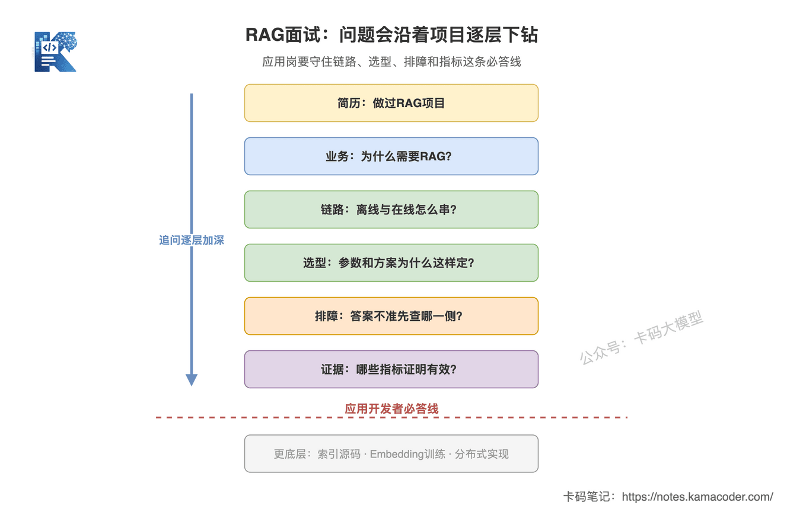
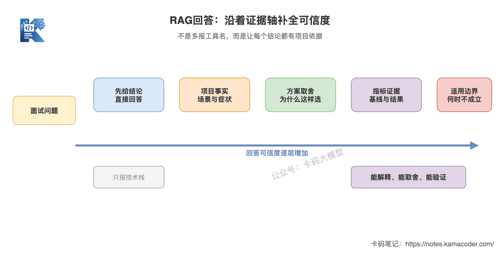
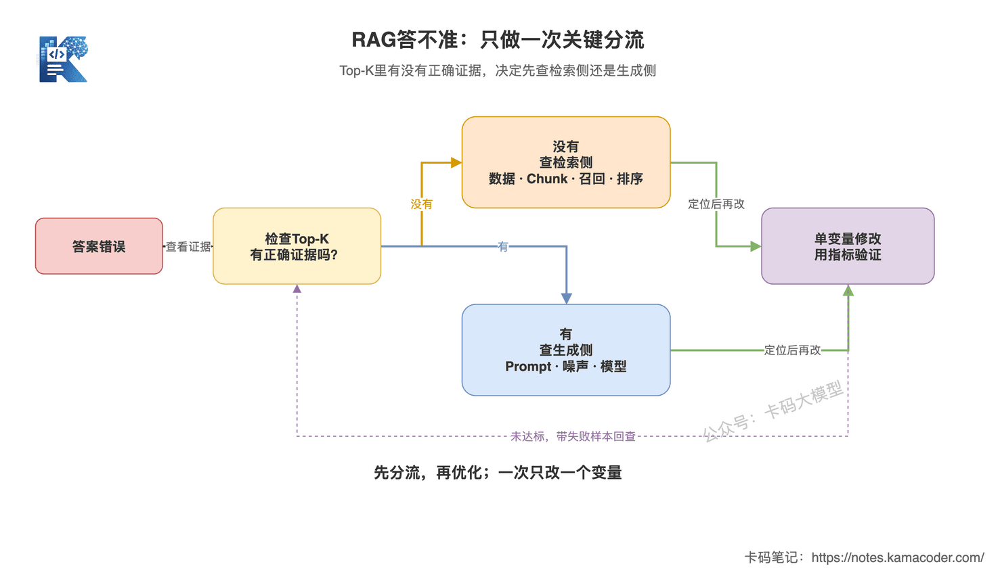

# 面试官怎么问RAG？高频问题与回答框架

> 来源: https://notes.kamacoder.com/llm/app/rag_interview_framework.html

# `# 面试官怎么问RAG？高频问题与回答框架 

上一篇《RAG怎么评估？检索质量和生成质量的度量》讲了怎么用检索指标和生成指标判断效果。 

到这里，RAG这一章从链路、切片、Embedding、向量数据库，一直讲到了排障、优化和评估。 

但很多录友知识点都看过，到了面试现场还是讲不清。 

面试官问：“你这个RAG项目做了哪些优化，效果怎么样？” 

常见回答是：“我们用了向量数据库，还加了混合检索和Rerank，效果提升挺明显。” 

方向不算错，但有三个硬伤： 
  - 没说原来出了什么问题，为什么要优化；   - 没说为什么选这些方案，付出了什么代价；   - 没有基线和指标，“明显”只是主观感觉。 

**面试官真正想听的不是技术名词，而是你有没有完整做过“发现问题、做出取舍、验证结果”这条工程链路。** 

## `# 简要回答 

RAG项目面试，可以抓住五个落点： 
  - **业务目标**：知识从哪来，为什么需要RAG，不用RAG会出什么问题；   - **完整链路**：离线怎么建库，在线怎么检索、重排、拼接和生成；   - **选型取舍**：Chunk、Embedding、向量库、Top-K、混合检索为什么这么选；   - **问题诊断**：答案不准时，先区分检索没找到，还是模型没用好；   - **指标证据**：用检索、生成、线上业务三层指标证明方案有效。 

回答单个问题时，按这个顺序组织：**先给结论，再讲项目事实，然后说明取舍，最后给指标和边界。** 

## `# 面试官会沿着项目一直往下挖 

面试官通常不会随机抽十个名词让你背。 

他会从简历上的一句“负责企业知识库RAG系统”开始，顺着同一条项目链不断追问：为什么做、链路是什么、参数怎么定、效果差怎么排、收益怎么证明。 

 

这张图回答的是：RAG面试的追问深度怎么递进，以及应用开发者必须守住哪条回答线。链路、选型、排障和指标都属于必答区；索引算法源码、Embedding训练目标等底层细节，知道原理和工程影响即可，不要硬装成算法专家。 

**真正拉开差距的不是背到多底层，而是必答区里的每一层都有项目证据。** 

## `# 一个通用回答框架 

同一道题，有人答得像背博客，有人答得像真做过项目，差别就在回答结构。 

很多录友上来先报技术栈：“LangChain、Milvus、BGE、Rerank全用了。” 

这相当于把工具箱倒在桌上，却没说你修的是什么问题。 

更稳的回答顺序是： 
  - **结论**：先直接回答面试官的问题；   - **项目事实**：说清数据、场景、症状或约束；   - **方案取舍**：为什么选A不选B，代价是什么；   - **指标证据**：基线和改后分别怎样；   - **适用边界**：什么情况下这套方案不成立。 

 

这张图回答的是：一句泛泛的技术结论，怎么逐步变成可信的项目回答。工具名只能说明“用过”，项目事实、取舍和指标才能证明“做过”。 

比如面试官问：“为什么加Rerank？” 

不要只说：“Rerank能提高准确率。” 

可以这样答： 

“我们先看评估集，发现相关Chunk多数已经进入Top-20，但真正能回答问题的片段经常排不到前5，所以问题不在召回覆盖，而在候选排序。我们保留前面的快速召回，再用Rerank做精排，只把Top-N交给模型。代价是多了一段推理延迟，所以候选数和Top-N是根据离线排序指标、端到端答案质量和P95延迟一起定的。” 

这段话里有症状、有判断、有方案，也有代价。即使暂时不报具体数字，也比“Rerank更准”有说服力。 

## `# 高频问题怎么答 

### `# Q1：为什么这个项目要用RAG？ 

**踩雷答法**：“因为大模型有幻觉，所以我们用了RAG。” 

这句话太泛。大模型有幻觉，不代表所有场景都要建知识库。 

**回答框架**：业务缺口 → RAG能力 → 不选其他方案的原因。 

可以这样答： 

“这个场景依赖企业内部文档，知识会更新，而且答案需要展示来源。基础模型既接触不到私有数据，也不能保证引用可追溯，所以我们用RAG在生成前动态检索证据。动态知识不适合直接训进参数；如果只是固定格式或语气问题，我会先用Prompt，必要时才考虑微调。” 

这里要说清楚：**RAG解决的是外部知识接入，不是给所有模型问题贴创可贴。** 

场景边界可以回看《为什么有了大模型还需要RAG》和《什么时候微调、什么时候RAG》。 

### `# Q2：从用户提问到最终回答，完整链路是什么？ 

**踩雷答法**：“文档向量化，用户提问后做相似度检索，再让大模型回答。” 

这只说出了三个大词，离真实链路还差一截。 

**回答框架**：离线建库 + 在线问答 + 质量控制。 

一段可直接复述的话术是： 

“离线侧先解析和清洗文档，按结构切成Chunk，补充来源、时间、权限等元数据，再用Embedding模型向量化并建立索引。在线侧先处理Query，经过向量检索或混合检索召回候选，再按需要做Rerank，筛出高质量上下文，带着来源信息拼进Prompt，最后由模型生成答案。生成后还要做引用、无答案拒答、权限和日志监控。” 

面试官继续追问时，再展开你项目里真正负责的环节。 

完整流程可以回看《RAG完整链路拆解》。不要在这里重新背一篇百科。 

### `# Q3：Chunk多大？Overlap多少？为什么？ 

**踩雷答法**：“Chunk设500，Overlap设100，这是比较常见的配置。” 

参数可能没错，但“常见”不是选型依据。面试官再问一句“为什么不是300”，回答就断了。 

**回答框架**：文档结构 → 用户问题粒度 → 参数候选 → 评估结果。 

可以这样答： 

“Chunk大小不是固定值。我们先看文档结构和问题粒度：FAQ按问答对切，Markdown优先保留标题层级，合同或制度文档尽量不拆散完整条款。Chunk过小会丢上下文，过大会混入多个主题。Overlap只用来保护边界信息，不是越大越好；过大会造成重复召回和上下文浪费。最终会在业务评估集上对比不同参数的Recall@K、排序质量和答案忠实度。” 

**好回答不是报出一个神奇数字，而是说清数字怎么来的。** 

具体切法可以回看《Chunk怎么切？切片策略直接决定检索效果》。 

### `# Q4：Embedding模型和向量数据库怎么选？ 

这道题最容易答成产品点名大会。 

**Embedding看的是检索效果和部署约束，向量数据库看的是数据规模与工程能力。两者不是一回事。** 

Embedding选型至少讲四个维度： 
  - 业务语言和垂直领域是否匹配；   - 在自有评估集上的Recall@K、MRR或NDCG；   - 向量维度带来的存储和检索成本；   - 本地部署、调用延迟、吞吐和数据合规。 

向量数据库选型至少讲五个维度： 
  - 数据量和并发量；   - 索引类型及查询延迟；   - 持久化、扩缩容和高可用；   - 元数据过滤、增量更新和多租户能力；   - 团队运维成本。 

可以这样收口： 

“我不会因为某个模型榜单高就直接选，也不会因为某个向量库流行就上。先用业务评估集验证召回效果，再结合延迟、成本、合规和运维约束做选择。” 

### `# Q5：为什么要混合检索？为什么还要Rerank？ 

先分清两者解决的问题。 

**混合检索补召回，Rerank提排序。** 

向量检索擅长语义相似，但产品型号、错误码、法规编号、人名等精确词可能漏掉；BM25擅长关键词命中，但不理解改写和近义表达。两路召回再融合，是为了让候选池覆盖更完整。 

Rerank发生在候选池之后。它用更精细的相关性模型重新排序，解决的是“找到了，但真正有用的Chunk排得不够靠前”。 

回答时还要主动说代价： 
  - 混合检索增加一套检索与融合链路；   - Rerank增加推理延迟和算力成本；   - Recall@K本来就低时，Rerank救不回根本没召回的内容；   - 简单、低风险场景不一定值得把整套链路都加上。 

这比“生产环境标配混合检索加Rerank”更靠谱。**工程里没有无条件的标配，只有指标和约束下的选择。** 

### `# Q6：RAG答不准，你怎么排查？ 

这是RAG面试里最能区分“跑过Demo”和“做过工程”的问题。 

第一步不要换模型，也不要立刻加Rerank。 

**先看Top-K候选里有没有支撑正确答案的Chunk。** 
  - 没有：优先查文档解析、索引覆盖、Chunk、Embedding、Query和召回策略；   - 有，但排序靠后：查融合、Rerank、Top-K和上下文噪声；   - 有且位置合理，答案仍然错：查Prompt拼接、引用约束、上下文冲突和模型能力；   - 知识库本来就没有：应该拒答或转人工，不能逼模型编一个答案。 

 

这张图回答的是：RAG答案错误时，怎么用Top-K证据把问题分流到检索侧或生成侧，再通过单变量实验和指标形成优化闭环。 

完整问题清单可以回看《RAG为什么总是答不准？常见问题排查》。 

### `# Q7：你们做了哪些优化？ 

**踩雷答法**：“做了Query改写、混合检索、Rerank、父子块和Context压缩。” 

全都做不代表做得好。一次改五个变量，最后甚至不知道是谁起了作用。 

更好的回答是： 

“我们先建立Baseline，把失败样本按检索侧和生成侧分类。评估发现主要问题是……，所以先改……。每次只调整一个变量，用同一评估集比较改前改后，再观察端到端质量、P95延迟和单次成本。达到收益门槛才保留，否则回滚。” 

回答里最好只选一两个你真正做过的优化，讲透下面四件事： 
  - 优化前的症状；   - 你如何定位根因；   - 为什么选择这个方案；   - 哪些指标发生了变化。 

优化手段本身可以回看《RAG优化不是“加个Rerank”就完了》。 

### `# Q8：怎么证明RAG真的有效？ 

指标要分三层讲。 

**检索侧**回答“有没有找到、排得好不好”： 
  - Recall@K看相关证据是否进入候选；   - Precision@K看候选里有多少是相关内容；   - MRR看第一个相关结果排得够不够靠前；   - NDCG看多级相关性下的整体排序质量。 

**生成侧**回答“模型有没有把证据用好”： 
  - 忠实度看答案是否被上下文支持；   - 答案相关性看有没有正面回答问题；   - 引用正确率看来源能否支撑对应结论；   - 无答案场景要看正确拒答率。 

**线上业务侧**回答“系统是否真的可用”： 
  - 任务成功率、用户反馈或转人工率；   - P95/P99延迟、超时率；   - 单次请求成本、每个成功任务成本；   - 越权检索、敏感信息泄露等风险指标。 

面试时可以用这个句式： 

“优化前，评估集上的`[指标]`是`[基线]`；定位到`[根因]`后，我们做了`[单一改动]`，该指标变成`[结果]`。同时`[延迟/成本/风险指标]`变化了`[真实数据]`，所以最终选择`[上线、灰度或放弃]`。” 

方括号必须换成你项目的真实数据。**忘了精确数值可以说明统计口径和大致区间，不能现场编一个漂亮结果。** 

## `# 面试里最容易暴露的四个问题 

### `# 只报技术栈，不讲问题 

“用了LangChain、某向量库、某Embedding模型”只能证明你知道工具名。 

改法：每个工具后面补一句“它解决了什么问题，为什么适合当前约束”。 

### `# 把参数说成行业标准 

Chunk大小、Overlap、Top-K和阈值都依赖数据与任务。 

改法：讲候选范围、对比实验和最终指标，不要把个人配置包装成通用答案。 

### `# 只讲准确率，不讲成本和延迟 

多一次Query改写、多一路召回、多一个Rerank，都可能让效果变好，也可能让P95延迟和成本失控。 

改法：质量达标后，再比较端到端延迟和每个成功任务成本。 

### `# 编指标 

编一个“准确率提升30%”很容易，面试官追问评估集规模、标注方式、统计口径时也很容易穿帮。 

改法：没有线上规模就如实说是离线评估；没有自动指标就说明人工抽检规则；没记住数值就讲方法和区间。 

## `# 如果只做过Demo，怎么答？ 

不要硬说自己做过生产级RAG。 

可以明确说明：“这个项目目前做到离线Demo，没有真实线上流量，所以我验证的是检索和生成质量，没有声称做过高并发生产验证。” 

然后继续讲： 
  - 你如何构造测试问题和标准证据；   - 你对比过哪些方案；   - 失败样本暴露了什么问题；   - 如果上线，还要补哪些监控、安全和容量工作。 

**诚实地讲清边界，比虚构一个生产项目更像工程师。** 

如果还想集中刷更细的原理题，可以继续看《RAG大厂面试题汇总》；如果面试官追问“RAG落地最难的地方”，可以看《RAG落地最难的地方在哪》。 

## `# 知识拓展 

**Q1：Top-K是不是越大越好？** 

不是。K增大通常能提高召回覆盖，但也会带来更多噪声、Token、延迟和生成干扰。先看Recall@K曲线，再结合Rerank后的上下文质量和端到端指标选，不要只追求召回。 

**Q2：有了Rerank，还需要优化Embedding吗？** 

需要。Rerank只能重排已经召回的候选。相关内容根本没进候选池，它就无能为力。先保证召回，再优化排序。 

**Q3：RAG能彻底消除幻觉吗？** 

不能。检索可能找错，文档本身可能过期，模型也可能忽略或曲解证据。RAG降低了无依据生成的概率，但仍要配合引用、拒答、权限、时效性和人工兜底。 

**Q4：向量数据库能不能直接用普通数据库代替？** 

要看规模和能力需求。数据量小、数据库本身支持向量类型和近似检索时，可以先用现有数据库降低复杂度；当向量规模、查询吞吐、索引能力、过滤和扩缩容要求上来后，再评估独立向量数据库。 

**Q5：面试官追问没负责的环节怎么办？** 

直接说明责任边界，再讲你理解的接口和影响。例如：“索引集群由基础设施同学维护，我负责检索策略和评估；我关注索引参数对召回、延迟和内存的影响，但没有改过底层实现。”这比把团队成果全揽到自己身上更可信。 

别再把RAG面试答成工具名接龙。 

**把问题怎么发现、方案为什么选、收益怎么验证讲清楚，面试官自然知道你是不是做过。**
