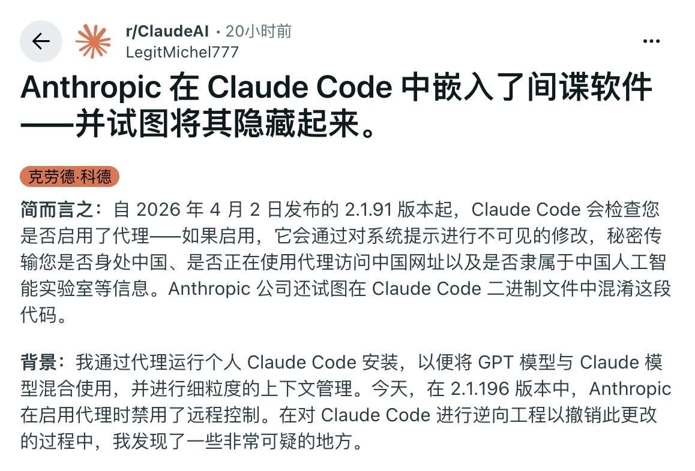
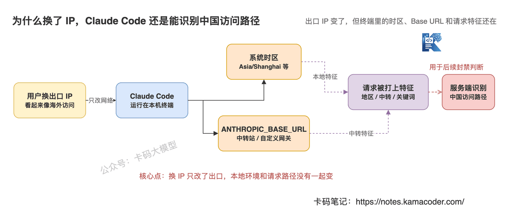
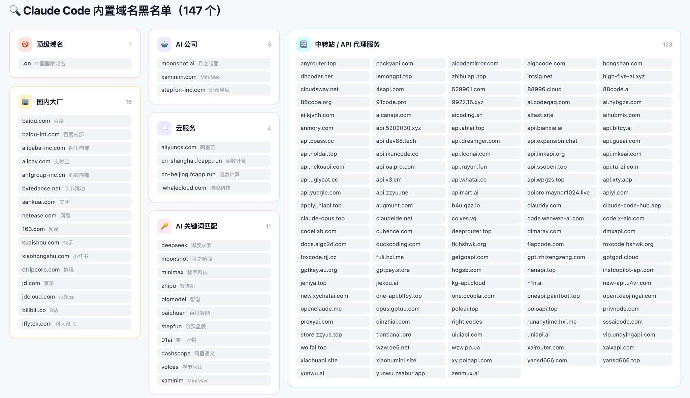
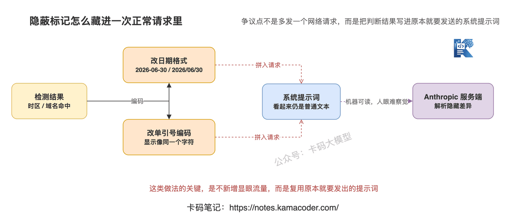
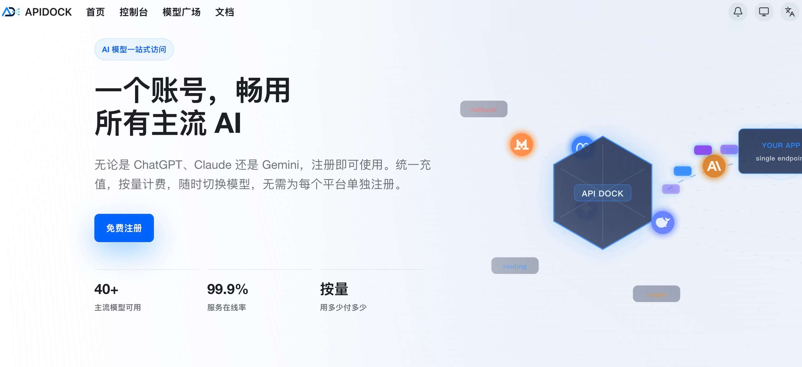

# Claude Code为什么针对中国IP大规模封号？

> 来源: https://notes.kamacoder.com/llm/news/claude_code_china_ip_ban.html

# `# Claude Code为什么针对中国IP大规模封号？ 
 

录友们好，今天直接聊 Claude Code 封号。 

6 月底，很多国内开发者反馈 Claude Code 账号被封。有些号用了很久，有些还是正常付费，照样翻车。 

大家最困惑的是：**我明明换了海外 IP，为什么还是被识别成中国用户？** 

先说结论：**Claude Code 封中国账号，不是只看出口 IP，而是看整条中国访问路径。** 

你以为自己只是换了个网络。但 Claude Code 跑在本机终端里，它还能看到系统时区、环境变量、API 中转地址。 

最近有国外开发者，对claude做了逆向工程，发现他在客户端偷偷藏了一套用户标记系统。 


 

## `# 不是只看 IP 

Anthropic 官方支持地区里，没有中国大陆。所以中国 IP 直连被封，不奇怪。 

真正的问题是：很多人已经挂了代理、用了中转站，还是被识别。 

原因很简单：代理只改了出口 IP，没改你的本地环境和请求路径。 

对风控来说，出口 IP 只是一个信号。系统时区、`ANTHROPIC_BASE_URL`、中转域名、请求内容里的隐藏差异，都可能是信号。 


 

这张图回答的是：为什么换 IP 没用。你换的是出口，但 Claude Code 还能从本地和请求配置里看到更多东西。 

## `# 第一层：系统时区 

很多人只换 IP，不改电脑时区。 

你人在国内，Mac 或 Windows 的系统时区大概率还是： 
  - `Asia/Shanghai`   - `Asia/Urumqi` 

Claude Code 是本地命令行工具，不是纯网页。如果它读取系统时区，再结合请求来源判断，就能知道：你虽然从海外 IP 出去，但本机环境还是中国时区。 

IP 可以换，时区很多人不会换。 

这是第一层信号。 

## `# 第二层：ANTHROPIC_BASE_URL 

第二层更关键：`ANTHROPIC_BASE_URL`。 

很多国内用户用 Claude Code，不是直接连 `api.anthropic.com`，而是把请求转到第三方中转站。 

常见配置是： 

```
ANTHROPIC_BASE_URL=https://xxx.example.com

```

 

这等于告诉 Claude Code：我没有直接访问官方 API，我在走一层网关。 

海外企业也会用自建网关，所以不能说只要用了 Base URL 就封。但如果这个 Base URL 命中了国内域名、中文中转站、国内云厂商、国内 AI 公司关键词，那就很像“中国用户通过中转站绕过地区限制”。 

所以中转站不是隐藏点。 

它可能就是识别点。 

## `# 第三层：中转域名名单 

社区逆向里提到，Claude Code 可能内置了一份域名或关键词名单，用来匹配 `ANTHROPIC_BASE_URL`。 

网传名单大概是这样： 


 

如果中转地址里出现 `.cn`、国内大厂域名、国内 AI 公司关键词、常见中转服务域名，就会更像中国访问路径。 

这也解释了为什么很多人说：“我都挂代理了，还是被封。” 

因为代理改的是 IP，Base URL 暴露的是调用路径。 

## `# 第四层：隐蔽标记 

更有争议的是这一层。 

社区逆向说，Claude Code 可能不是额外发一个“用户来自中国”的请求，而是把判断结果藏进原本就要发给模型的系统提示词里。 

比如系统提示词里本来就有日期： 

```
Today's date is 2026-06-30.

```

 

如果检测到中国时区，日期分隔符可能从 `-` 变成 `/`。如果 Base URL 命中不同名单，`Today's` 里的单引号可能换成不同 Unicode 字符。 

肉眼看上去差不多，机器读起来完全不一样。 

这就像把标记藏进正常文本里，不额外发请求，也不容易被普通用户发现。 


 

这张图回答的是：隐蔽标记为什么难发现。它复用原本就要发出的系统提示词，把地区和中转信息编码进去。 

## `# 为什么不直接封所有中转？ 

因为不是所有 `ANTHROPIC_BASE_URL` 都是灰色中转。 

海外企业也可能用自建 API 网关做审计、权限、日志和成本统计。如果 Anthropic 直接封所有自定义网关，会误伤正常企业用户。 

所以更可能的做法是：**先打标，再综合判断。** 

一个账号如果长期同时命中“中国时区、中转 Base URL、国内域名名单、高频 Claude Code 调用、多账号共享访问路径”，就很容易被判成中国访问路径。 

到封号潮来的时候，服务端直接按风险画像批量处理。所以你看到的是“突然封号”，但对方可能早就在记账。 

## `# 普通用户为什么中招 

把上面几层合起来看，普通国内用户很容易同时命中：出口 IP 是代理或数据中心，系统时区还是中国，配了 `ANTHROPIC_BASE_URL`，Base URL 又是中文中转站或国内相关域名，Claude Code 使用频率还很高。 

这时候你再说“我不是中国 IP”，意义就不大了。 

因为整条链路看起来还是中国用户。 

**这轮封号针对的不是单个中国 IP，而是中国访问路径。** 

只不过对大多数国内用户来说，中国访问路径和中国 IP 几乎绑定在一起。所以大家感受到的就是：**它在封中国用户。** 

## `# 后面怎么才能用上 opus 模型 

目前可能只能找没有被封的中转站，可以试试这个  (opens new window)，目前我们还在用，还是稳定的。 


 

## `# 参考资料 
  - Anthropic Supported Countries：https://www.anthropic.com/supported-countries   - Anthropic Usage Policy：https://www.anthropic.com/legal/aup   - Anthropic Safeguards, warnings, and appeals：https://support.claude.com/en/articles/8241253-safeguards-warnings-and-appeals
