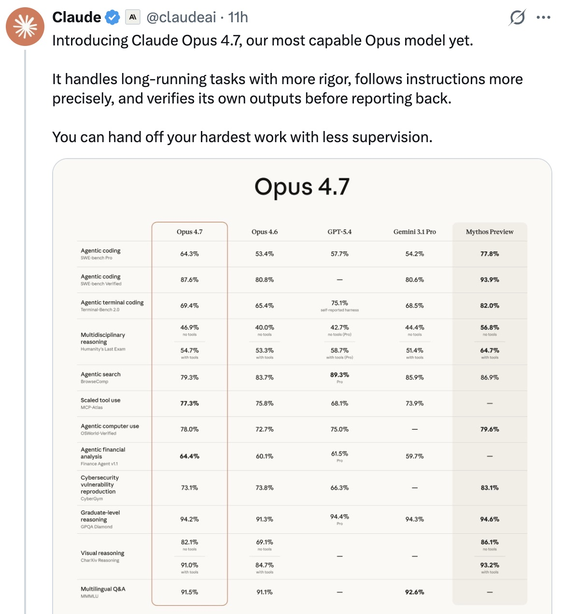
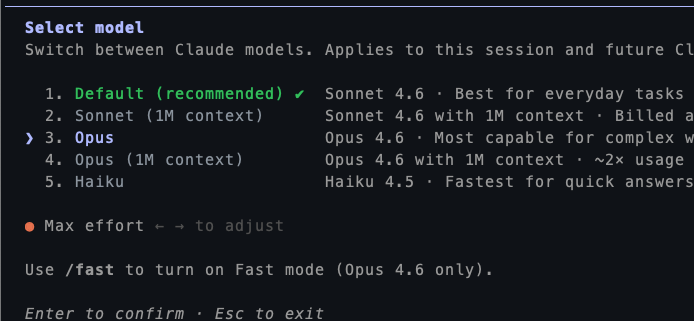
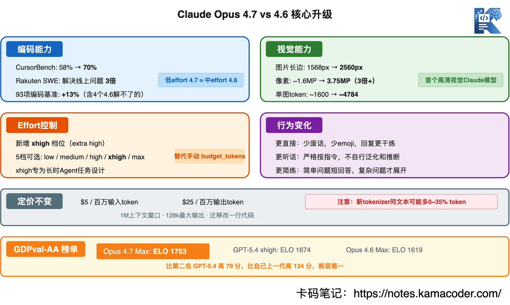
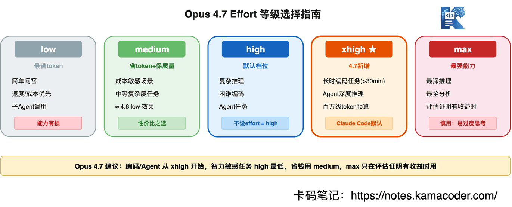

# Claude Opus 4.7 发布：编码能力暴涨、3倍高清视觉、新增xhigh档位，全面拆解

> 来源: https://notes.kamacoder.com/llm/news/claude-opus-4-7.html

# `# Claude Opus 4.7 发布：编码能力暴涨、3倍高清视觉、新增xhigh档位，全面拆解 
> 

不少读者问我，如何充值Claude会员，我在这里篇单独讲一下：国内Claude充值会员的方法
 

之前还在说，我用claude agent + cli + GLM-5.1，基本平替了 Opus4.6  (opens new window)。 

昨天（2026年4月16日）日常逛一下X，结果就被打脸了。 


 

Anthropic发布了Claude Opus 4.7！ 

现在CLI端，model里还不能选 4.7，还是只能用4.6，估计这两天就可以切了。 


 

网页版可以切 4.7了，不过还是只有agent才能发挥模型的实力。web端要差很多。 

着急体验的录友，直接用API吧，现在可以用。 

再来说说这次的更新，总体来说，这次不是小更新，算是大升级吧。 

主要能力提升是 编码能力暴涨、视觉分辨率提升3倍、新增effort xhigh档位、auto模式全面开放。（claude编码已经很强了，现在这是要遥遥领先的节奏） 

这里顺便在督促一下国内厂商吧，对齐 Opus 4.6，不够了。 

顺便点点deepseek，你该发布版本了，生产队的驴不能这么拖（**开玩笑的，我相信deepseek一定在憋大招**） 

接下来，逐个拆开看看Opus 4.7 更新了啥。 

## `# 一、编码能力：这是Opus 4.7最大的升级点 

先看数据： 


 

几个最硬的数字： 
  - **CursorBench**：Opus 4.7 70% vs Opus 4.6 58%，提升12个百分点。   - **Rakuten SWE-Bench**：解决的线上问题是Opus 4.6的**3倍**。   - **93项编码基准**：比Opus 4.6多解决13%的任务，其中有4个任务是Opus 4.6和Sonnet 4.6都搞不定的。   - **Notion内测**：比Opus 4.6提升14%，用的token更少，工具调用错误只有1/3。   - **OfficeQA Pro（Databricks）**：错误率比Opus 4.6低21%。 

估计不少录友，也不知道这些指标是什么概念，我在多说一下。 
  - CursorBench是AI编程编辑器Cursor搞的基准测试，测的是模型在真实开发场景中帮人写代码的能力，不是跑几道算法题，是直接在项目里改bug、加功能   - SWE-Bench是目前最权威的"AI修线上bug"基准——给模型一个真实的GitHub issue，看它能不能自己定位、改代码、跑测试。Rakuten版本更贴近生产环境，3倍是什么概念不用我多说了吧   - 93项编码基准这些是各家公司内部的真实编码任务，不是公开刷榜的数据，说服力更强   - Notion是做知识管理工具的，他们的场景是让AI帮用户写文档、整理笔记、生成页面，测的是真实产品里的效果   - OfficeQA Pro是Databricks做的办公场景问答评测，测的是AI回答专业问题的准确性。 

**还有一点要说一下：低effort的Opus 4.7 ≈ 中effort的Opus 4.6。** 也就是说，同样的事情，Opus 4.7用更少的token就能做到。
**对开发者意味着什么？** 

如果你在用Claude Code写代码，升级到Opus 4.7是最直接的提升。特别是长任务——Opus 4.7会自己验证输出再返回，多步推理更稳定，不容易跑飞。 

## `# 二、视觉能力：分辨率提升3倍，终于能看清图了 

之前的Claude模型，图片长边最多1568像素。Opus 4.7直接拉到**2560像素**，约3.75百万像素，是之前的**3倍多**。 

这不是"看得更清楚一点"的升级，是**从看不清到看得清**的质变： 
  - **计算机视觉Agent**：读密集截屏、UI布局，之前会漏细节，现在不会了   - **复杂图表数据提取**：之前模糊的地方现在能看清了   - **像素级参考工作**：设计稿对比、UI还原，需要看细节的场景 

**但要注意成本。** 高分辨率图片的token消耗也是之前的3倍——单张图最多4784 tokens（之前约1600）。一张1920×1080的截图，输入成本约$0.014。 

我平时在用claude的时候，如果看到一个任务导致token在飞速燃烧，我的第一反应就是我刚刚是不是和他布置任务方式不对，这个任务不应该这么费token。 

所以opus 4.7 这块虽然处理图片能力强了，但如果钱包有限，卡哥良心建议：**发送前缩小图片**就行，省钱！ 

## `# 三、Effort参数：新增xhigh档位，最重要的新功能之一 

Opus 4.7引入了一个新的effort等级：**xhigh**（extra high），插在high和max之间。 

先解释一下effort是什么——这是控制Claude"愿意花多少token思考"的参数。不是精确的token预算，是行为信号：effort越高，Claude越愿意多想、多调工具、多验证。 

5个等级，各自适合什么场景： 


 

**xhigh为什么重要？** 

因为Agentic场景（比如Claude Code跑一个30分钟以上的长任务），high不够用，max又太贵。xhigh就是为这种场景设计的——**长时间运行的编码/Agent任务，token预算在百万级别，需要深度推理但不能像max那样无限烧token。** 

这里我给**几个实用建议：** 
  - 编码和Agent任务，**从xhigh开始**   - 大多数需要智能的任务，**high是最低档**，别再往下调了   - 省钱场景用**medium**，比low靠谱得多   - **max慎用**——大多数任务在xhigh就已经到头了，max额外消耗的token远大于收益，容易过度思考   - 用xhigh时，**max_tokens至少设64k**，给模型留够思考和行动的空间 

这里还有**一个重要变化：Opus 4.7不再支持手动extended thinking（`budget_tokens`），必须用adaptive thinking + effort控制思考深度。** 如果你之前在Opus 4.6上用了`thinking: {type: "enabled", budget_tokens: N}`，迁移到Opus 4.7会报400错误，必须改成`thinking: {type: "adaptive"}`。 

## `# 四、行为变化：更直接、更听话、更简练 

Opus 4.7在"性格"上有三个明显变化： 

**1、更直接** 

少了Opus 4.6那种"我理解您的需求"式的开场白，少了emoji，回复更干练。如果你之前在prompt里加了"请简短回复"，现在可能不需要了。 

我现在就是看到全篇emoji的文章或者文档或者回答，我本能的感受到不适，就不想看了。。。 

其实我一直都觉得 ai 输出内容没必要加那么多 emoji，看着很鸡肋。。 

**2、更听话** 

更严格地按指令执行，不会自己泛化、不会自行推断你没说的需求。对API用户是好事——prompt更可控。但如果你之前依赖Claude的"自由发挥"，可能需要调整prompt。 

其实这个看使用技巧，我一般都是让claude先帮我写一个需求文档，我看文档没问题后，再让他针对需求文档，写设计文档。 

最后再让他按照设计文档开发，这样基本没问题，完全按照我的思路来的。 

**3、长度自适应** 

Opus 4.7会根据任务复杂度调整回复长度，简单问题简短回答，复杂问题才展开。Opus 4.6不管什么问题都喜欢写一大段。 

**如果你觉得Opus 4.7回复太简短**，可以在prompt里加："请提供详细、完整的回复，包含必要的背景和示例。" 比说"不要简短"更有效。 

其实这一点也看使用技巧，我在和他布置任务的时候，就会给出我对它输出的预期，基本回复都在我限定内的（**别问我为什么，我看到token在燃烧，我心里难受**。。） 

## `# 五、安全与Project Glasswing 

这次发布绕不开一个背景：**Project Glasswing**。 

Anthropic在Opus 4.7发布前一周，公布了一个名为Mythos Preview的前沿模型（不公开发布）。这个模型在CyberGym安全基准上拿了83.1%，Opus 4.6只有66.6%。 

**Mythos Preview发现了什么？** 
  - OpenBSD上一个存在27年的漏洞，远程就能让任何机器崩溃   - FFmpeg上一个16年的漏洞，那行代码被自动化测试跑过500万次都没发现   - Linux内核漏洞链，普通用户可以提权到完全控制机器 

AI的编码能力已经强到可以找到这些漏洞了。**这是好事也是坏事**——好事是能帮我们修bug，坏事是攻击者也能用。 

看到这些漏洞，说实话我后背发凉，一个27年的漏洞，500万次测试没发现，AI找到了。 

所以Anthropic做了两件事： 
  - 

**Opus 4.7专门降低了网络攻击能力。** 不是削弱编码能力，是有针对性地降低了安全漏洞利用方面的能力。CyberGym上Opus 4.7的分数低于Mythos Preview，这是故意的。   - 

**推出Cyber Verification Program。** 安全研究人员可以申请使用更强的安全能力，但需要经过审核。 

## `# 六、GDPval-AA榜单：Opus 4.7登顶 

GDPval-AA是OpenAI开发的一套评估框架，测试AI在44个职业、9个行业的真实工作任务上的表现，用ELO排名。 

ELO排名简单说就是棋类比赛用的积分系统——赢一盘加分，输一盘减分，赢强手加得多，赢弱手加得少。两个AI模型做同一个任务，评委盲评谁做得好，赢了就加分。所以ELO排名反映的是"模型之间谁更强"，不是绝对分数，是相对实力。 

| 排名  模型  ELO 
| 1  **Claude Opus 4.7 (Max Effort)**  **1753** 
| 2  GPT-5.4 (xhigh)  1674 
| 3  Claude Sonnet 4.6 (Max Effort)  1667 
| 4  Claude Opus 4.6 (Max Effort)  1619 

Opus 4.7以1753的ELO**断层第一**，比第二名GPT-5.4高了79分，比自己上一代Opus 4.6高了134分。 

79分的ELO差距是什么概念？大概就是英超曼城和第四名的区别，不是一个档位。 

## `# 七、定价和迁移 

**定价没变**：$5/百万输入token，$25/百万输出token，跟Opus 4.6一样。 

**但要注意token计算变了**：同样的文本，Opus 4.7的tokenizer可能多出0-35%的token。你的API账单可能会涨，不是价格变了，是token数变了。 

**API用户迁移只需改一行代码：** 

```
# 之前
model = "claude-opus-4-6"

# 之后
model = "claude-opus-4-7"

```

 

如果是Claude Code CLI用户，等官方支持后用 `/model claude-opus-4-7` 切换就行。网页版用户在模型下拉菜单里直接选。 

**但API用户有一个破坏性变更：** `thinking: {type: "enabled", budget_tokens: N}` 在Opus 4.7上会报400错误，必须改成： 

```
thinking = {"type": "adaptive"}

```

 

然后通过effort参数控制思考深度，不再手动设token预算。  

## `# 八、Claude Code用户的变化 

如果你用的是Claude Code而不是API，关注一下这几点： 
  - 

**默认effort升到xhigh了。** 所有Plan（Free/Pro/Max）默认都是xhigh，不用手动调。   - 

**auto模式开放给Max用户。** auto模式是介于"每个操作都确认"和"跳过所有确认"之间的方案——一个分类器会检查每次工具调用，安全的自动放行，危险的拦截。不是完全安全，但比`--dangerously-skip-permissions`靠谱得多。   - 

**新增 `/ultrareview` 命令。** Pro和Max用户免费3次，用于代码审查。具体效果还没大面积验证，但方向是对的——AI审代码是个高频需求。  

## `# 写在最后 

大家可以理解，Opus 4.7 主要就是升级三个维度： 
  - **编码**：从"好"到"遥遥领先"，CursorBench +12%，Rakuten 3倍，不过这些都是参数说明，后面还是用起来，看看有没有真的 “遥遥领先”，而且对于很多录友来说，因为很多任务都很简单，用不出来差别   - **视觉**：从"能用"到"看清"，分辨率3倍提升，这个就看个人需求了，钱包有限的话，还是建设缩略一下图，再发给claude。   - **控制**：从"粗粒度"到"精细调节"，effort xhigh给了开发者一个更合理的选择，max慎用，很容易过度思考，而且烧token。 

对大多数开发者来说，**直接升级就行**——价格没变，能力涨了，迁移改一行代码。 

唯一要注意的是token计算变了，做好账单可能涨5-35%的心理准备。 

**谁该升级？** 很简单：在用Claude Code写代码的，直接升；在用API跑生产服务的，灰度测试一下再切；在用Sonnet 4.6觉得够用的，不用急，Sonnet 4.6性价比还是更高的。  

## `# 参考资料 
  - Claude Opus 4.7 发布公告：https://www.anthropic.com/news/claude-opus-4-7   - Claude Opus 4.7 System Card：https://anthropic.com/claude-opus-4-7-system-card   - Claude API 模型总览：https://platform.claude.com/docs/en/about-claude/models/overview   - 从 Opus 4.6 迁移到 Opus 4.7 的官方指南：https://platform.claude.com/docs/en/about-claude/models/migration-guide#migrating-to-claude-opus-4-7   - Effort 参数文档：https://platform.claude.com/docs/en/build-with-claude/effort   - 高分辨率 Vision 能力文档：https://platform.claude.com/docs/en/build-with-claude/vision   - Claude Code slash 命令文档（含 /ultrareview）：https://code.claude.com/docs/en/commands   - Auto mode 发布说明：https://claude.com/blog/auto-mode   - Project Glasswing 发布公告：https://www.anthropic.com/glasswing   - Cyber Verification Program 申请入口：https://claude.com/form/cyber-use-case   - GDPval-AA 榜单：https://artificialanalysis.ai/evaluations/gdpval-aa
