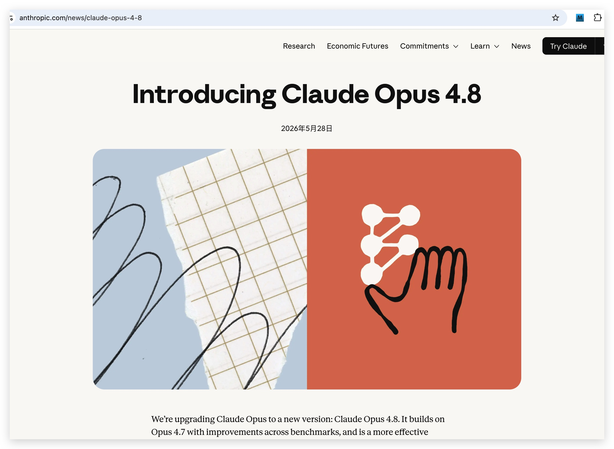
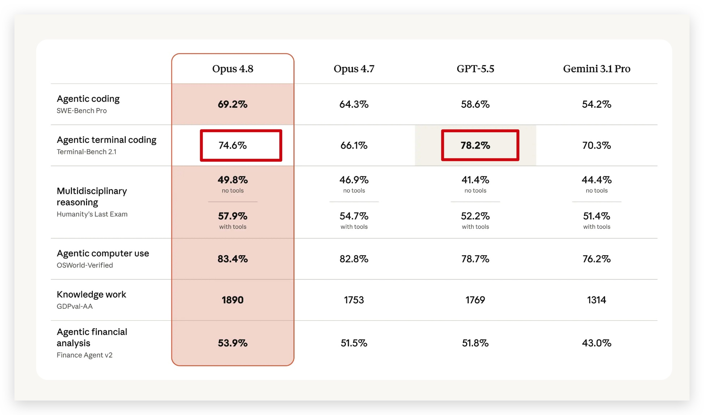
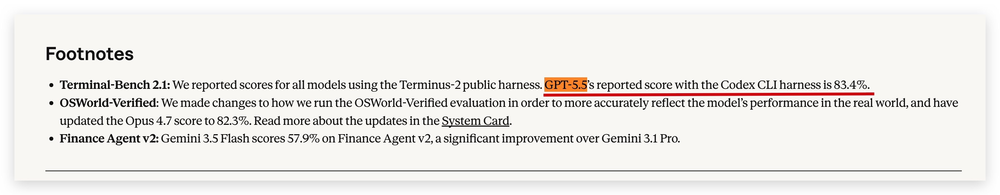
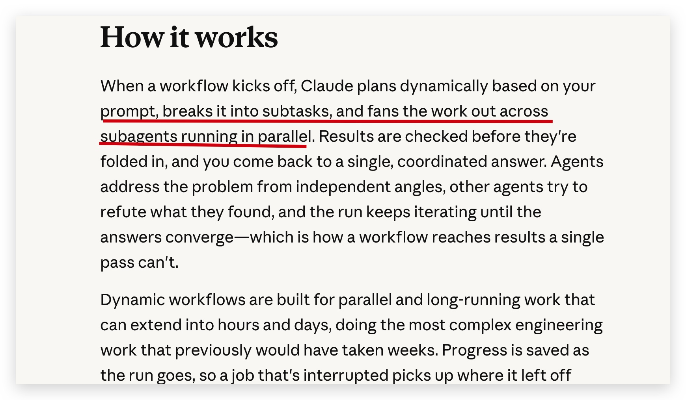
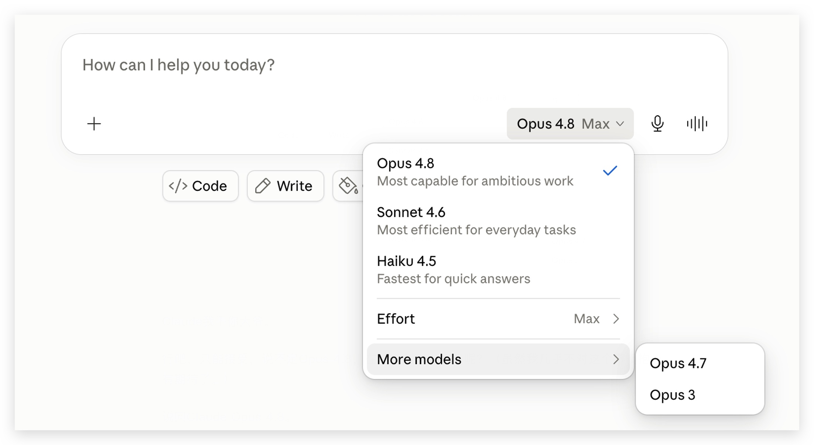

# Claude Opus 4.8发布：别被跑分带节奏，真正值得看的是Claude Code工作流

> 来源: https://notes.kamacoder.com/llm/news/claude-opus-4-8.html

# `# Claude Opus 4.8发布：别被跑分带节奏，真正值得看的是Claude Code工作流 
> 

不少读者问我，如何Claude账号被封，如果用上Claude opus4.8，或者Fable5，充值Claude会员，我在这里单独讲一下：没有Claude账号，怎么用上Opus模型
 

Anthropic 昨天发布了 Claude Opus 4.8。 

我心思这 4月16日刚发布 4.7  (opens new window)，这么快就 4.8了，迭代速度有点快啊！ 

官方链接在这里：https://www.anthropic.com/news/claude-opus-4-8 


 

这次发布很有意思。 

不是因为它强到离谱，而是因为官方和外界的语气反差很大。 

Anthropic 自己对 Opus 4.8 的描述很克制，用的是 **modest**。 

也就是：温和更新。 

但中文圈很多标题已经开始往“炸裂”“碾压”“最强”上靠了。 

卡哥觉得这事需要冷静一点。 

**Opus 4.8 是一次有价值的工程更新，但它不是一次颠覆式换代。** 

如果你只看发布页大表，很容易被带偏。 

如果你把脚注、Claude Code 的工作流更新、API 变化放在一起看，结论会更清楚： 

**Opus 4.8 的重点不是“跑分赢了谁”，而是更适合长时间帮开发者干活。** 

## `# 一、先别急着转那张跑分表 

这次最容易误读的地方，是 Terminal-Bench 2.1。 

Anthropic 发布页的大表里写的是： 

| 模型  Terminal-Bench 2.1 
| Claude Opus 4.8  74.6% 
| GPT-5.5  78.2% 


 

你没看错。 

就按这张表本身，GPT-5.5 也是高于 Opus 4.8 的。 

但更关键的是脚注。 

Anthropic 在脚注里补充：GPT-5.5 在 Codex CLI harness 下的公开成绩是 **83.4%**。 


 

这说明什么 

说明同一个模型，同一个 benchmark，只要执行框架、工具链、运行环境变了，结果就可能明显变化。 

78.2% 和 83.4%，差了 5.2 个百分点。 

这个差距已经足够影响传播口径了。 

**大表负责传播，脚注负责真相。** 

这才是这次 Opus 4.8 发布里最值得提醒的一点。 

## `# 二、那Opus 4.8到底有没有进步 

有。 

但不是那种“从 60 分跳到 90 分”的进步。 

它更像是把 Opus 4.7 上几个影响开发体验的问题往前推了一步。 

我把这次更新分成四类： 

**第一，控制权更清楚。** 

Opus 4.8 加强了 `effort` 思考强度控制。 

以前用 Opus 4.7，很多录友的感受是：模型有时候想太多，有时候又想得不够。你付了钱，但模型这次到底愿意花多少力气思考，体感上不够可控。 

现在可以通过 effort 明确告诉它：这次任务到底要浅一点，还是深一点。 

API 里大概是这样： 

```
thinking = {"type": "adaptive"}
output_config = {"effort": "high"}

```

 

我的建议： 
  - 简单解释、普通脚本：不用高 effort   - 改代码、排查问题：从 high 开始   - 大仓库任务、长链路 Agent：再考虑 xhigh / extra 

不要所有任务都开最高。 

模型不是越努力越好，钱包会先努力不动。 

**第二，工具调用更像工程流程。** 

Anthropic 在文档里提到，Opus 4.8 目标之一是减少“该调工具却跳过工具调用”的情况。 

这点比很多 benchmark 更重要。 

Agent 写代码最怕什么？ 

不是它不会写。 

而是它明明应该读文件，却直接猜。 

明明应该跑测试，却直接总结。 

明明应该查日志，却开始给你讲原理。 

这种模型再聪明，放到工程里也不稳定。 

Opus 4.8 如果能减少这类问题，价值很实在。 

**第三，长任务恢复更稳。** 

Claude Code 跑长任务时，经常会经历上下文压缩。 

老问题是：压缩前模型还知道自己在干什么，压缩后突然换了脑子。 

前面做过的判断忘了。 

已经排除的方向又重新查一遍。 

改着改着开始绕路。 

Opus 4.8 对 long agent trace 和 compaction 后的连续性做了优化。 

这对普通聊天没什么感觉，但对 Claude Code 用户非常关键。 

因为 Claude Code 的价值，本来就不只是“写一段代码”，而是能持续推进一个工程任务。 

**第四，更愿意承认代码里还有问题。** 

Anthropic 提到，Opus 4.8 比 Opus 4.7 更不容易把自己写出的代码缺陷放过去不说。 

这句话翻译成开发者语言就是： 

**它少了一点“自信地错”。** 

这很重要。 

Agent 任务里，模型报错不可怕。 

可怕的是它没修好，但告诉你已经修好了。 

前者你还能继续调。 

后者容易直接把坑带进代码库。 

## `# 三、Dynamic workflows才是Claude Code用户该看的 

这次发布里，我最关注的不是 Opus 4.8 本体，而是 Claude Code 的 dynamic workflows。 

官方介绍在这里：https://claude.com/blog/introducing-dynamic-workflows-in-claude-code 

它的思路很简单： 

**不要让一个 Agent 从头干到尾，而是让主 Agent 拆任务，再调度多个 subagents 并行处理，最后汇总和验证。** 


 

这其实更接近真实工程协作。 

一个复杂任务，不应该只有“一个模型一直读、一直改、一直测”。 

更合理的方式是： 
  - 一个子任务负责读模块   - 一个子任务负责找影响范围   - 一个子任务负责改代码   - 一个子任务负责跑测试   - 一个子任务负责挑错   - 主 Agent 最后合并判断 

这类能力适合什么场景？ 

**大仓库排查。** 

比如权限问题、性能问题、死代码、重复实现。 

顺序扫很慢，并行拆开更合理。 

**大规模迁移。** 

比如 API 替换、框架升级、语言迁移、模块重构。 

这类任务天然可以拆分，不适合让一个 Agent 慢慢翻。 

**高风险复核。** 

比如安全审计、合同检查、财务分析。 

一个 Agent 给结论，另一个 Agent 专门找反例，再由主 Agent 汇总，比单次回答更靠谱。 

不过录友别误会。 

Dynamic workflows 不是省钱功能。 

它更像是把“单人干活”升级成“小组协作”。 

小组协作效率高，但人也多，token 也多。 

第一次用，建议从小任务开始试，不要直接让它扫整个公司代码库。 

## `# 四、Fast mode终于有点意义了 

Opus 4.8 常规价格没变： 

| 模式  输入价格  输出价格 
| 常规模式  $5 / 百万 token  $25 / 百万 token 
| Fast mode  $10 / 百万 token  $50 / 百万 token 

Fast mode 的速度可以到 2.5 倍。 

这次价格降到上一代 fast 的三分之一。 

这不是便宜。 

但至少不再是“看起来有用、实际舍不得开”的功能。 

Claude Code 里，速度很影响体验。 

尤其是： 
  - 线上问题定位   - 演示前修 bug   - 大改动最后一轮验证   - 任务快结束但卡在测试失败 

这些场景下，fast mode 有价值。 

但日常写代码，我不建议默认开。 

**Fast mode 买的是时间，不是性价比。** 

## `# 五、代码能力：更强，但别写成碾压 

Opus 4.8 的代码能力确实比 Opus 4.7 好。 

我更愿意把它理解成“工程稳定性提升”，而不是“智商暴涨”。 

它在这些任务上更值得试： 
  - 多文件修改   - 长链路 bug 修复   - PR 审查   - 工具调用后继续验证   - 上下文压缩后继续执行 

但如果要和 GPT-5.5 比，不能只看一个表。 

Claude Code 是 Claude 的主场。 

Codex CLI 是 GPT-5.5 的主场。 

不同工具链下，模型表现会变。 

所以我的判断是： 

**Opus 4.8 和 GPT-5.5 在高端 AI 编程里都很强，具体谁好，要看任务和工具环境。** 

这也是为什么我不喜欢“碾压”这个词。 

它听起来很爽，但对开发者没帮助。 

开发者需要的是：这个任务用谁更稳、谁更便宜、谁更快、谁更容易校验。 

## `# 六、表达风格稍微舒服了一点 

Opus 4.7 有一个体感问题：有时不太像人在说话。 

它会给出很硬的判断，但中间缺少足够自然的解释。 

看起来像很强，读起来不一定舒服。 

Opus 4.8 稍微好了点。 

注意，是稍微。 

如果你让它做代码审查、架构点评、文案修改，它仍然可能输出那种“模型味很重”的句子。 

但整体上，比 Opus 4.7 更容易读。 

我个人还是觉得 Opus 4.6 的表达最自然。 


 

## `# 七、和DeepSeek V4怎么选 

这两天刚写完 DeepSeek V4-Pro永久降价75%  (opens new window)，现在 Opus 4.8 又来了。 

很多录友肯定会问：到底用哪个？ 

我的判断很简单： 

**便宜模型负责量，顶级模型负责难。** 

| 场景  推荐模型  原因 
| 简单问答、文章初稿、普通代码解释  DeepSeek V4-Flash  便宜，够用 
| 代码扫描、批量分析、日志总结  DeepSeek V4-Pro  价格低，适合大规模跑 
| 核心代码修改、复杂 bug、长链路 Agent  Claude Opus 4.8 / GPT-5.5  更稳，更会验证 
| 大仓库迁移、安全审计、跨模块重构  Claude Code + Opus 4.8 dynamic workflows  能拆任务、并行跑、再验证 

模型选型不是站队，是算账。 

一个任务如果结果能自动校验、失败成本低、token 量很大，那 DeepSeek V4-Pro 很香。 

一个任务如果失败成本高、上下文复杂、需要持续判断和工具调用，那 Opus 4.8 或 GPT-5.5 更值得。 

不要拿 Opus 4.8 批量生成低价值内容。 

也不要指望便宜模型稳定接手所有复杂 Agent 任务。 

## `# 写在最后 

Opus 4.8 是一次有用的更新。 

但不是一次值得神化的更新。 

它真正值得关注的是：effort 控制、dynamic workflows、fast mode 价格下降、长任务稳定性和工具调用习惯。 

这些东西不一定适合做夸张标题，但对开发者有用。 

至于跑分表，看看就行。 

别只看第一屏。 

脚注也要看。 

最后还是那句话： 

**便宜模型跑量，顶级模型攻坚。** 

自己测，按任务选。 

加油。
