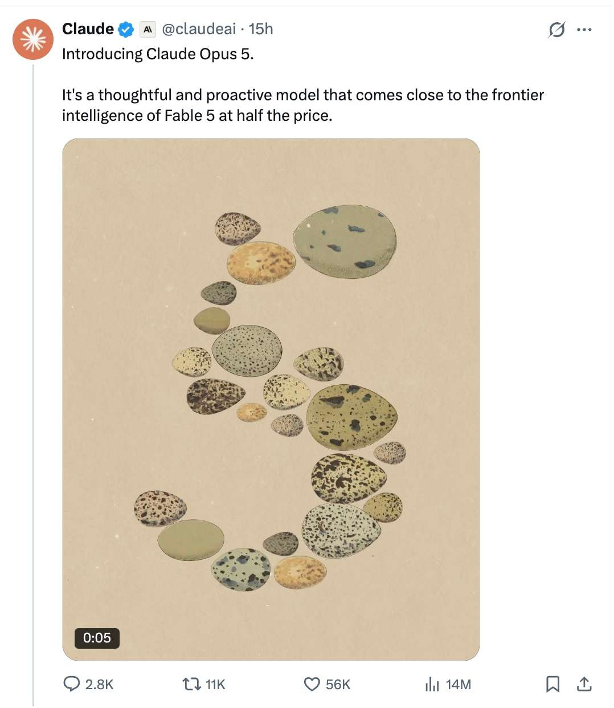
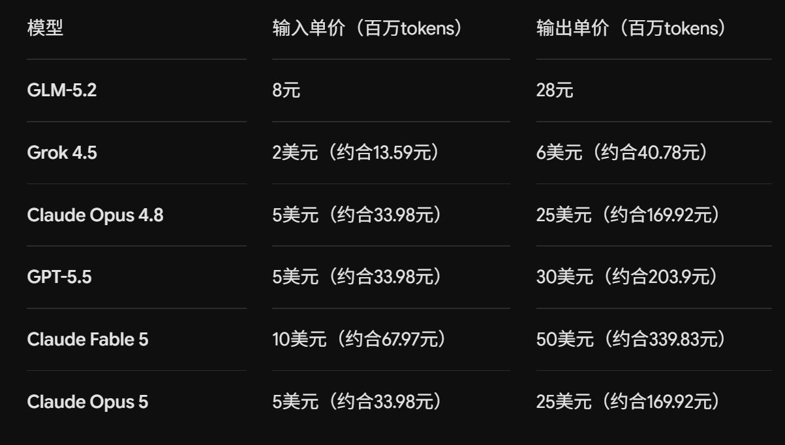
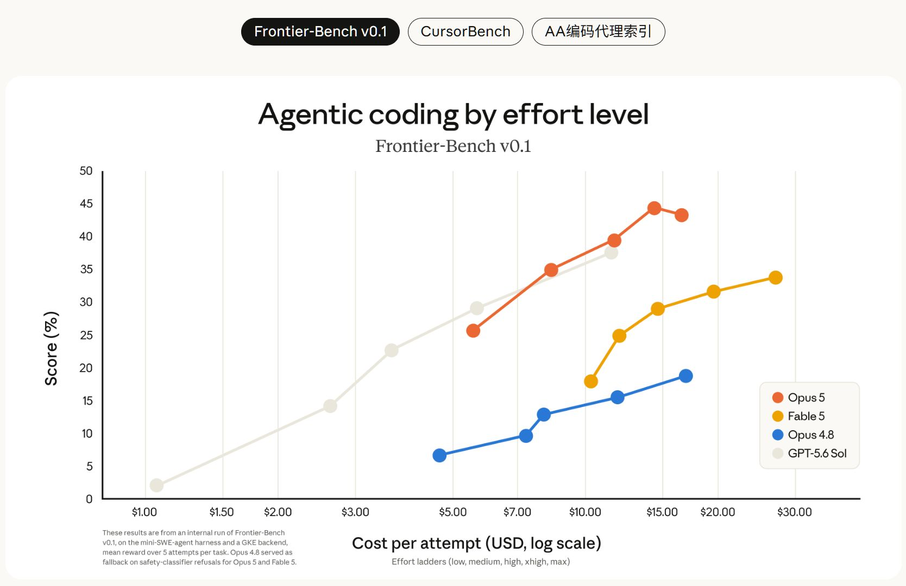
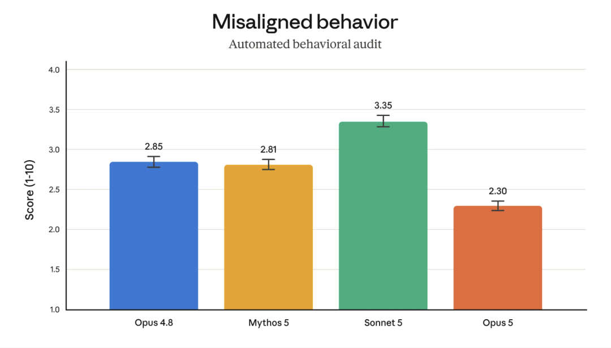

# Claude Opus 5发布：不是Fable 5平替，是Claude Code的日常主力

> 来源: https://notes.kamacoder.com/llm/news/claude-opus-5.html

# `# Claude Opus 5发布：不是Fable 5平替，是Claude Code的日常主力 
> 

**国内用户想用上 Opus 5，具体怎么接、模型名怎么填、封号后怎么办，我单独写了一篇：国内如何丝滑使用Claude Opus 5？Claude Code接入、API调用与封号后替代方案**
 

opus5 在7月25日凌晨正式发布： 

 

这次 Anthropic 发布 Claude Opus 5，重点更直接：**尽量接近 Fable 5 的能力，但把价格压回 Opus 4.8 的档位。** 

 

先说结论：**Opus 5 不等于 Fable 5 的完全替代，更像是把“高频干活”这一档模型做得更划算。** 日常写代码、排 Bug、跑 Agent、做知识工作，可以优先上它；真遇到失败代价极高、需要最强能力上限的任务，Fable 5 仍然有自己的位置。 

## `# 价格没涨，才是这次最值得看的地方 

Opus 5 的 API 模型名是 `claude-opus-5`，输入价格 $5 / 百万 Token，输出价格 $25 / 百万 Token，和 Opus 4.8 一样。它的上下文窗口是 **100 万 Token**，最大输出是 **128k Token**，思考默认开启。官方模型说明  (opens new window) 

| 模式  输入价格  输出价格  适合什么场景 
| 标准模式  $5 / 百万 Token  $25 / 百万 Token  日常 Claude Code、复杂开发、知识工作 
| Fast mode  $10 / 百万 Token  $50 / 百万 Token  线上故障、演示前修复、必须快速拿结果的任务 

Fast mode 约为默认速度的 2.5 倍，价格也翻倍。这个逻辑和 Opus 4.8 一样：**它卖的是等待时间，不是性价比。** 

这里补一个边界：Fast mode 目前是 Claude API 的研究预览，不能想当然地认为 Bedrock、Google Cloud、Microsoft Foundry 都能直接开。上线前先查你使用的平台能力，别把压测环境跑通了，生产环境才发现没有这个档位。 

 

不过这里也说明一下，图中 看上去 GLM5.2 便宜了不少，但真实使用体感来说，花钱速度没有比 opus4.8，gpt5.6 便宜很多。 

很多录友会问：既然 Opus 5 接近 Fable 5，那是不是以后只用 Opus 5？ 

别这么理解。Fable 5 仍然是更高一档的模型。Opus 5 的价值，是把“多数任务够强、成本更能接受”这件事做出来。你每天让 Claude Code 读仓库、改接口、补测试，用得多，单任务成本才是实打实的账。 

## `# Opus 5 强的不是写得快，是更会把任务做完 

Anthropic 的宣传里有很多评测图，录友看这种图要记住：厂商跑分能说明能力方向，**不能替代你的项目验收。** 

不过这次几个指标指向同一件事：Opus 5 在软件工程和端到端工作流里，更强调主动检查、反复验证和持续推进。 

 

这比“会不会生成一段代码”重要得多。 

真实项目里，最烦的不是模型报错，而是模型只修了表面症状，然后自信地告诉你已经好了。Opus 5 更值得期待的能力，是在写代码前多查链路，写完后自己补验证，发现假设不成立就继续迭代。 

比如一个包管理器的深层 Bug，修复报错那一行不难；难的是继续往下找，确认根因、边界条件和回归风险。**Agent 能不能做到这一步，决定了它是“代码补全”，还是能进工程流程的帮手。** 

## `# Effort别无脑拉满，按失败成本开 

Opus 5 继续提供 Effort 档位。简单说，就是让你决定这次任务值得模型花多少推理和工具调用成本。它默认开启思考；如果你一定要关闭思考，`effort` 最高只能设到 `high`。 

不要把它理解成“最高档一定最好”。最高 Effort 往往意味着更多 Token、更长等待和更多验证轮次。 

我的建议很简单： 
  - 改文案、解释代码、写小脚本：低档或默认即可。   - 修普通 Bug、实现独立功能：从 High 开始。   - 大仓库排障、跨模块迁移、关键代码审查：再上 Xhigh 或 Max。   - 涉及资金、安全、生产事故：除了提高 Effort，还要明确验收标准和人工复核。 

**Effort 解决的是“这次该花多少算力”，不是“我能不能不验收”。** 模型越强，越容易让人跳过最后一步，这反而是工程里最危险的地方。 

## `# 别把旧模型的“复核咒语”继续塞给 Opus 5 

 

Opus 5 的一个变化很反直觉：它本来就会主动验证和修正自己的工作。 

所以旧系统提示里那些“任何非简单任务都必须最终验证”“必须再检查一遍”“必须再派一个子 Agent 复核”的硬规则，别默认原样搬过来。 

规则叠在模型本来的自检上，结果很可能不是更可靠，而是多跑几轮工具、多花 Token、多等一会儿。官方的建议是：先删掉重复的复核脚手架，在自己的评测集上比较成功率、耗时和成本。 

这不等于不验收。关键路径、生产变更和安全相关任务，依然要有人类验收和自动化测试。 

但日常任务里，**优先把 Effort 降到 `low` 或 `medium` 测一遍，而不是粗暴关闭思考或无脑拉起一队子 Agent。** 小任务也委派，会把成本和时间一起放大。 

## `# 两个 API 更新，都是给 Agent 工作流准备的 

这次还有两个 beta 功能，看起来很小，但对做 Agent 的录友很实用。 

第一个是对话中动态修改可用工具，不会让 Prompt 缓存失效。以前工具列表一变，长上下文可能就得重新计费、重新灌进去；现在可以按任务阶段换工具，把不需要的能力收起来。API 侧需要使用 beta 请求头 `mid-conversation-tool-changes-2026-07-01`。 

第二个是自动回退。请求触发安全分类器时，开发者可以让它自动交给其他可用模型处理，而不是直接把整个工作流卡死。`fallbacks: "default"` 可以按拒绝类别使用 Anthropic 推荐的回退模型；该参数仍处于 beta，需要 `server-side-fallback-2026-07-01` 请求头。 

还有一个不起眼但很实在的成本变化：Opus 5 的 Prompt 缓存最小长度降到 **512 Token**，Opus 4.8 是 1024 Token。以前短到不够资格缓存的固定指令、工具说明，现在可能不用改代码就能命中缓存。 

 

这意味着你的 Agent 编排可以更清楚：低风险任务走 Opus 5，高风险请求触发限制时走回退分支，最终把失败状态、耗时和成本记录下来。 

不要把“自动回退”理解成万能兜底。模型换了，任务语义、安全边界和输出质量都可能变化。生产环境里仍然要把回退结果当成一条独立链路来测试。 

## `# 安全能力变强，但漏洞利用仍是边界 

官方和报道都提到，Opus 5 在行为审计中更不容易被诱导做危险操作，对不可逆动作也更谨慎。 

网络安全部分尤其要分开看：它可以更好地帮助开发者在源代码中发现风险，但对二进制漏洞扫描、渗透和利用代码生成等高风险请求会有更严格限制；触发限制时，系统可能回退到 Opus 4.8。 

所以别把“更会找漏洞”误读成“更能打”。能发现缺陷，和能把缺陷变成真实攻击，根本不是一回事。 

## `# Opus 5、Fable 5、Opus 4.8怎么选 

| 你的任务  更适合的模型  原因 
| 高频写代码、排查普通 Bug、日常 Agent  Opus 5  能力和单任务成本更平衡 
| 已跑稳的老工作流、需要验证迁移风险  Opus 4.8  行为更熟悉，先做 A/B 验收 
| 超长链路攻坚、复杂根因分析、失败代价极高  Fable 5  为能力上限付费 
| 高风险安全相关请求  按平台安全策略与回退链路处理  不要假定模型会稳定输出 

上一篇 Fable 5 我把它定义成“攻坚模型”。这个判断现在依然成立。 

Opus 5 则更像团队里的主力工程师：价格可控，覆盖面广，愿意多做几轮检查。只要你别把它当成免验收的自动驾驶，它很可能会成为 Claude Code 用户最常用的那个模型。 

别再只看“谁比谁高几分”。 

**能把成功率、Token、等待时间和人工复核一起算进去，才是会用模型。** 

国内录友想用上 Opus 5，具体怎么接、模型名怎么填、封号后怎么办，我单独写了一篇：国内如何丝滑使用Claude Opus 5？Claude Code接入、API调用与封号后替代方案。 

## `# 参考来源 
  - Anthropic 官方：Claude Opus 5 的新功能：https://platform.claude.com/docs/zh-CN/about-claude/models/whats-new-opus-5)   - Anthropic 官方：Claude Opus 5 提示指南：https://platform.claude.com/docs/zh-CN/build-with-claude/prompt-engineering/prompting-claude-opus-5
