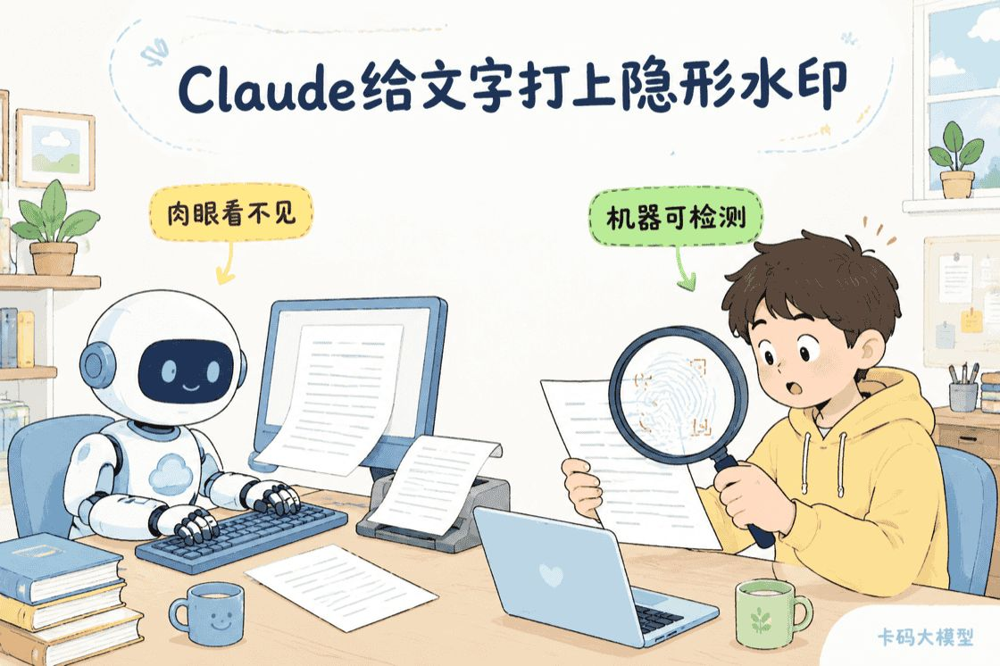
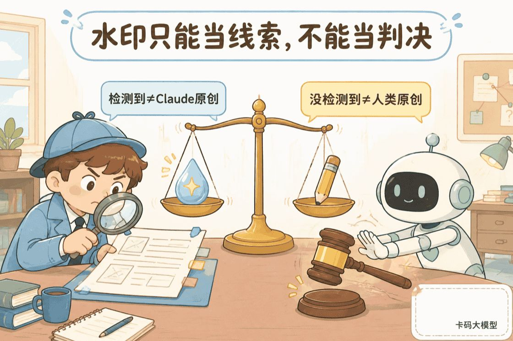

# Claude开始给文字打“暗号”：复制粘贴也会跟着走

> 来源: https://notes.kamacoder.com/llm/news/claude-invisible-text-watermark.html

# `# Claude开始给文字打“暗号”：复制粘贴也会跟着走 

你从 Claude 里复制一段文字，看起来和过去完全一样。 

没有角标，没有“AI生成”四个大字，也没有奇怪的乱码。 

但机器以后可能认得出来：**这段文字被 Claude 处理过。** 

Anthropic 近日公布了 AI 生成内容标记计划。为了落实欧盟《人工智能法案》Article 50(2) 生成内容透明度行为准则，Claude 会使用两套互补方案： 
  - 生成文字：嵌入肉眼不可见、机器可读的水印。   - 生成或处理文件：在支持的 SVG、PNG、JPG 等文件中附加数字签名的来源元数据。 

 

先说最容易被标题带偏的地方：**这不是所有 Claude 历史输出突然被统一盖章，也不是一个能直接判断“谁写了文章”的万能检测器。** 

它能提供来源线索，但不能替你下判决。 

## `# 不是页面功能，而是模型直接写进去 

按照 Claude Help Center 的官方说明(https://support.claude.com/en/articles/16266773-how-claude-marks-ai-generated-content)，支持该能力的 Claude 模型在生成文本时，会把不可感知的水印直接编织进文字。 

Anthropic 强调，这个标记不会改变回复的含义、质量和可读性。用户肉眼看不到它，但检测工具可以寻找对应信号。 

因为水印属于文本本身，所以它不是网页上临时加的一层标签。 

你把内容从 Claude 复制到 Word、邮件、博客或者代码仓库里，**水印也会跟着文本一起走，并且可能在部分编辑后继续存在。** 

这也解释了为什么覆盖范围这么大： 

| 使用入口  文字水印是否计划覆盖 
| Claude 网页与 App  支持模型的生成文字会标记 
| Claude Platform API  会标记，不是只有消费端产品才有 
| Claude Code  会标记 
| Claude Cowork、Claude Tag  会标记 
| AWS、Google Cloud、Microsoft Foundry  通过支持模型生成的文字会标记 

也就是说，换个客户端、套一层 API 或通过云厂商调用，并不会天然绕开文字水印。 

但“水印到底编码在什么统计特征里、检测阈值如何设定”，Anthropic 目前没有公开完整技术细节，只说后续会发布技术文档。 

因此现在把它直接解释成“藏了几个零宽字符”，或者断言“清理格式就能删除”，都说早了。 

## `# 图片和文件不是文字水印，而是C2PA签名 

Claude 对文件采用的是另一套方案。 

当 Claude 生成支持的 `.svg`、`.png` 或 `.jpg` 文件时，会附加经过数字签名的来源元数据。它遵循 C2PA 开放标准，也就是很多平台所说的 Content Credentials，中文通常叫“内容凭证”。 

它主要回答两个问题： 
  - 这个文件是否被 Claude 处理过？   - 文件附带凭证之后，内容是否又被篡改过？ 

文字水印和文件凭证不要混为一谈。 

| 标记方式  放在哪里  复制或转换后会怎样 
| 嵌入式文字水印  文字本身  普通复制粘贴会跟随，部分编辑后可能保留 
| C2PA签名来源元数据  文件元数据  重新保存、格式转换、截图等操作可能将其剥离 

文件有签名来源信息，不等于画面上会出现可见水印；反过来，右下角画了一个品牌名，也不等于文件带有可验证的 C2PA 凭证。 

## `# 检测工具还没公布，而且检测到也不能“定罪” 

Anthropic 表示，会帮助用户和第三方检测 Claude 的文字水印与来源元数据，但具体检测机制仍要等后续技术文档。 

未来如果检测到支持的 Claude 标记，准确说法应该是： 

**这份内容可能被 Claude 处理过。** 

不能直接说： 

**这份内容一定由 Claude 从头创作。** 

 

为什么？因为很多人会让 Claude 做校对、翻译、摘要或者文件转换。原始观点、数据甚至绝大多数文字可能来自人类，但只要内容经过支持的 Claude 模型重新输出，就可能带上标记。 

检测之后，内容也可能被截取、修改，或者和其他材料混在一起。 

另一边，没检测到水印，也不能证明内容是人类原创。官方列出的情况包括： 
  - 使用的是尚未支持标记的旧模型。   - 文字被大幅改写、转述、翻译或混入其他内容。   - 段落太短，信号不足以可靠检测。   - 文件经过格式转换、重新保存或截图，来源元数据被剥离。   - 使用的平台、功能或文件类型不支持对应标记。 

这条边界非常重要。 

学校查作业、公司查简历、平台审核投稿时，**检测结果可以触发进一步核实，但不能独立充当作弊或造假的证据。** 

否则新的水印技术没减少“AI猎巫”，反而只是给误判换了一个更像技术结论的包装。 

## `# 对普通用户和开发者，真正影响是什么 

对普通用户，最大的变化不是页面多了一个提示，而是“让 Claude 顺手润色一下”也可能留下 Claude 处理过的信号。 

如果你在意内容披露，最好区分三件事：原始观点是谁提出的、文字经过了哪些 AI 处理、最终由谁审核负责。一个水印解决不了这三道题。 

对使用 Claude API 的开发者，不能再把它当作 Claude 网页端的产品功能。 

只要底层是支持标记的 Claude 模型，你的写作工具、客服系统、Agent 工作流和内容平台生成的文字，都可能携带标记。Anthropic 也提醒开发者：如果把 Claude 部署进自己的产品，需要独立评估 Article 50 对产品和服务提出的透明度义务。 

对做图片和文档链路的团队，则要检查文件处理流程会不会把 C2PA 元数据弄丢。压缩、转码、截图、CDN 优化和二次导出，都可能改变最终结果。 

## `# 我更关心的，是它会不会影响文字质量 

Anthropic 的官方结论是：隐形水印不会改变文本含义、质量或可读性。 

但在技术细节、公开检测工具和独立评测出来之前，这个结论还很难被外部验证。 

文本水印天然要在“自由生成”和“留下可检测信号”之间做设计。它是否会影响特定语言、代码、超短文本和强格式输出，不能只用一句“肉眼看不见”回答。 

更靠谱的验证方式，是等支持模型和检测方法公布后，用同一批任务做 A/B 测试：看正确率、风格稳定性、代码可执行率和检测召回率，而不是凭几段聊天体感下结论。 

这项政策的方向很明确：AI 生成内容越来越多，平台想给来源增加一层可验证的信号。 

但一定要记住：**水印是来源线索，不是作者身份证；检测器是核实工具，不是判决书。** 

## `# 参考来源 

Anthropic：How Claude marks AI-generated content：https://support.claude.com/en/articles/16266773-how-claude-marks-ai-generated-content
