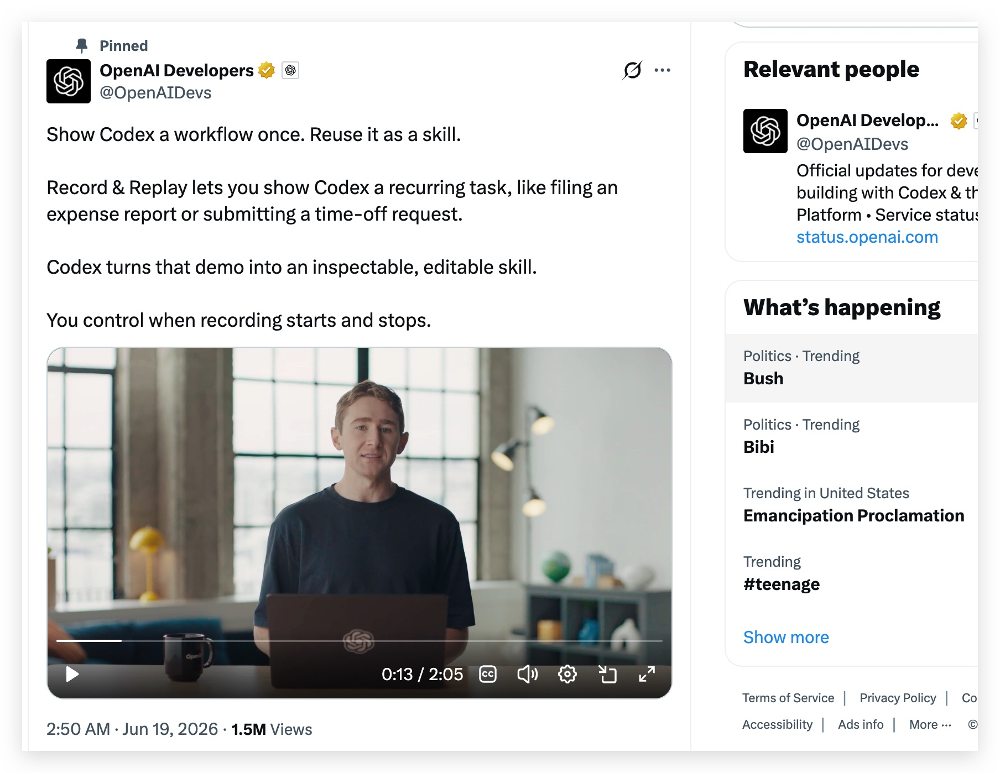
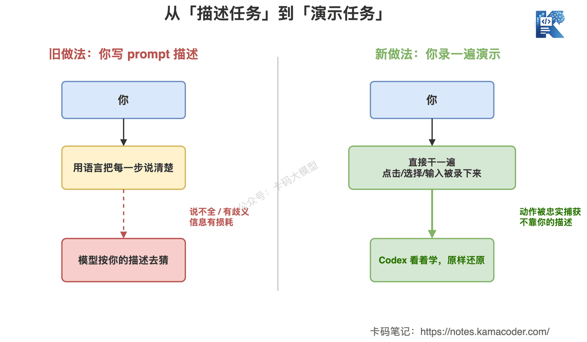
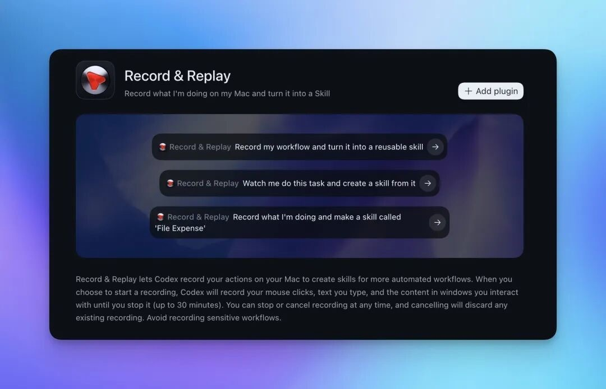
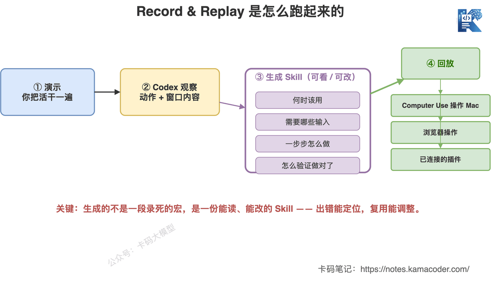
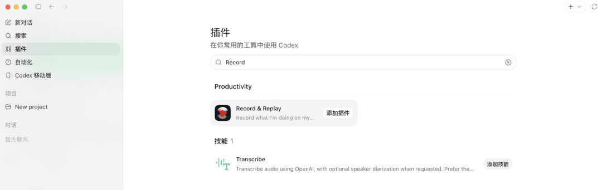
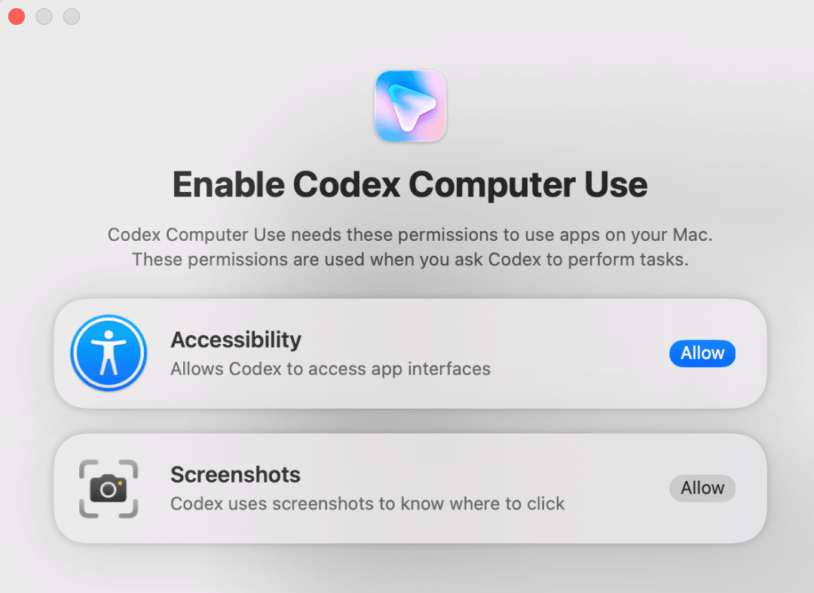
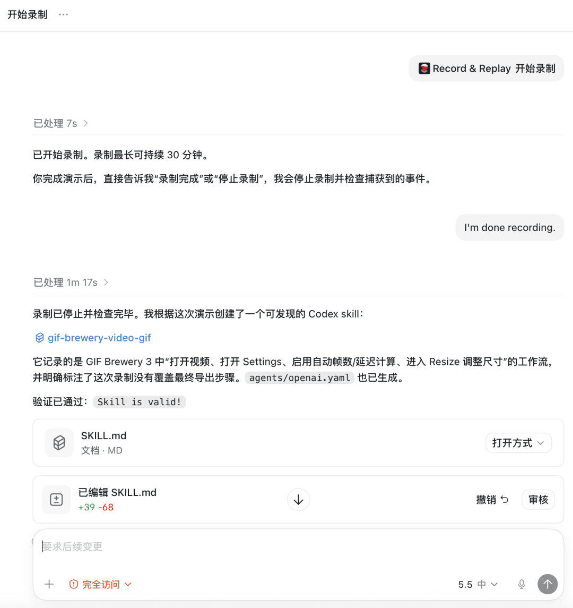
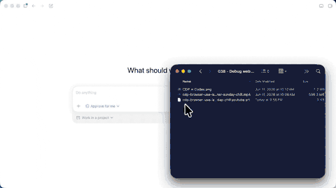
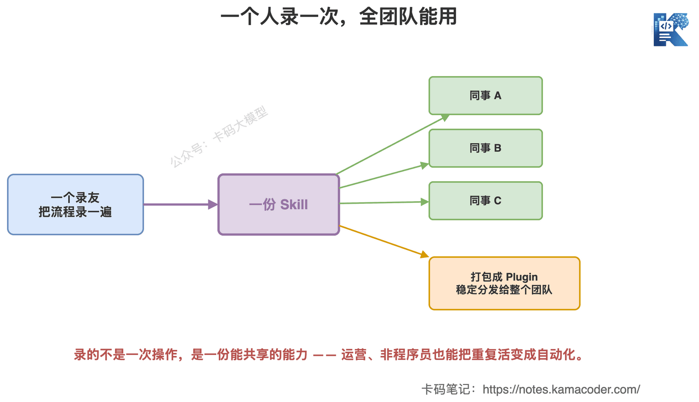

# Codex 这次发布的 Record & Replay，把“写 prompt”变成了“录一遍”

> 来源: https://notes.kamacoder.com/llm/news/codex-record-replay.html

# `# Codex 这次发布的 Record & Replay，把“写 prompt”变成了“录一遍” 
 

OpenAI在今天（6月19日） 又一个“Codex Thursday”，这次放出来的功能叫 **Record & Replay**。 

 

一句话先说清楚它干嘛： 

**你在 Mac 上把一件重复的活儿演示一遍，Codex 在旁边看着，把这次演示变成一份能查看、能编辑的 Skill，以后这活儿它自己干。** 

报销、订车位、建一个格式规范的 issue、发一条 YouTube 视频、每周拉一份报表——这类你天天手动点的流程，录一遍就行。 

卡哥看完第一反应是：**这个东西的方向，比又涨两个点跑分有意思多了。** 

为什么这么说，咱们一层层拆。 

## `# 一、最大的变化：从“你描述任务”到“你演示任务” 

这两年用大模型干活，主旋律一直是一个动作——**写 prompt**。 

你想让它干个啥，得把每一步、每个细节、每种情况都用语言说清楚。说不全、说得有歧义，它就跑偏。 

 

这张图说的就是这个转变。 

左边是旧做法：你把流程**翻译成语言**喂给模型，中间这一道翻译天然有损耗——你以为说清楚了，它未必这么理解。 

右边是 Record & Replay 的新做法：你**不用描述，直接干一遍**，点了哪个按钮、选了哪个文件、填了什么字，全被录下来。Codex 看的是你的真实操作，不是你对操作的转述。 

这个差别很关键。 

**会描述任务，是个门槛；会干一遍活，几乎没门槛。** 一个天天报销的运营，未必写得好 prompt，但他报销的流程闭着眼都能走一遍。 

Record & Replay 等于把自动化的入口，从“会写”挪到了“会做”。 

 

官方给的几个示例提示就很直白：“把我的工作流录下来，变成一个可复用技能”“看着我做这件事，据此生成一个技能”，甚至直接“录一个叫 File Expense 的报销技能”——你说一句、做一遍，剩下的交给它。 

## `# 二、它到底怎么跑起来的 

光说概念虚，咱们看它一整条链路是怎么走的。 

 

按官方文档，整个过程是这样： 
  - **开录**：在 Plugins 菜单里点 “Record a skill”，给点上下文或者直接用它建议的提示，授权之后开始。   - **演示**：你在 Mac 上把这件活正常干一遍。这期间 **Codex 观察你的操作和窗口里的内容**，学这个流程。   - **停录**：从菜单栏、悬浮条，或者直接说一句话停下来。官方提醒一句——**演示尽量短而完整**，别录一堆无关的来回。   - **生成 Skill**：Codex 把这次演示整理成一份 Skill，里面写清楚**何时该用、需要哪些输入、一步步怎么做、怎么验证做对了**。不满意还能让它改。   - **回放**：以后触发这个 Skill，它就用 **Computer Use（直接操作 Mac）、浏览器操作、已连接的插件**这几样能力，单独用或组合着用，把活干完。 

光看文字有点抽象，配几张实际操作的截图你就懂了。 

第一步，在 Codex 应用的插件页里把 Record & Replay 加进来： 

 

第二步，它会弹窗找你要权限——“辅助功能”用来读界面，“截屏”用来判断该点哪儿，这俩就是 Computer Use 干活的基础： 

 

第三步，你把活干完、说一句“录完了”，Codex 复盘一遍就吐出一份 `SKILL.md`，还会自检一句 “Skill is valid”： 

 

这里我要特别点一句，也是这张图中间画得最重的那块： 

**Codex 生成的不是一段“录死的宏”，而是一份能读、能改的 Skill。** 

老式的录宏你是知道的——录的是“在屏幕第 300 像素点一下”，UI 一变就废，而且它就是个黑盒，出错你都不知道错哪。 

Record & Replay 生成的 Skill 是结构化的、能看懂的：什么时候用、要什么输入、怎么验证。**出错能定位，场景变了能调整。** 这是它和传统 RPA 拉开差距的地方。 

OpenAI 自己演示的那个 YouTube 上传例子就挺能说明问题：它学会的不只是“点这点那”，而是整套逻辑——选视频文件、填标题描述、传缩略图、设隐私是 Private 还是 Unlisted、处理 .srt 字幕。它理解了“这一步是在干嘛”，不是机械复读坐标。 

 

就像这段演示里，它自己在文件夹里把视频和对应的字幕文件认成了一套——“哪两个文件是一对的”这种你平时懒得用文字写清楚的隐性规则，做一遍它反而能看明白。 

## `# 三、为什么说这事不小：一个人录，全团队能用 

如果只是“帮你自己省事”，那还只是个效率工具。 

Record & Replay 真正的想象空间在**复用和共享**。 

 

一个人录一遍，产出的是一份 Skill。这份 Skill 可以共享给团队里的其他人；要更稳定地分发，还能把它打包成一个 Plugin，发给整个部门。 

这意味着什么？ 

**一个老员工脑子里的“流程经验”，第一次可以被原样复制了。** 

以前“怎么提一个合规的报销”“怎么发一条符合规范的视频”，靠的是口口相传、靠新人自己摸。现在录一遍，变成一份能跑的 Skill，谁都能用,而且每次都一样。 

对天天被重复流程拖住的运营、行政、甚至非程序员录友来说，**这是第一次能把自己手里的重复活儿,直接变成自动化,而不用学写代码。** 

## `# 四、先泼盆冷水：别把它当万能 

方向好归方向好，卡哥还是得按老规矩泼盆冷水——**现在就指望它接管你所有重复工作，太早了。** 

几个现实的坎： 

**第一，一次演示抓不住所有分支。** 你录的是“顺利的那一遍”。可真实流程里全是岔路：这个字段空着怎么办、弹了个验证码怎么办、网络超时怎么办。你演示时没遇到的情况，Skill 大概率也不知道怎么处理。 

**第二，Computer Use 点 UI 这事本身就脆。** 靠识别屏幕去点按钮，页面改个版、弹个窗、加载慢一拍，就可能点错位置。这是所有“操作界面”类 Agent 的通病,不是 Codex 独有,但它确实还在。 

**第三，门槛限制实打实。** 目前**只支持 macOS**；首发**不含欧洲经济区、英国和瑞士**；而且要先开启 Computer Use（配置里 `computer_use = false` 就把它关了）。 

**第四，权限和隐私得想清楚。** 它录的是你的**操作 + 窗口内容**——也就是说,你屏幕上当时显示的东西它都看得到。涉及客户数据、内部系统的流程，录之前先掂量掂量哪些能给它看。 

所以卡哥的态度跟看每个新功能一样：**方向对、值得试，但别上来就把关键流程托付给它。** 

## `# 五、和 Claude 那条线怎么看，谁该现在试 

熟悉的录友应该看出来了——**“Skill”和“Computer Use”这两个词，不是 OpenAI 先喊的。** 

Anthropic 那边 Claude Skills 早就有 Skill 的概念，Computer Use 也做了挺久。两家其实在同一个方向上较劲：**让 Agent 不只是聊天和写代码，而是能真的去操作软件、把活干完。** 

Record & Replay 的差异化，在于它把“**怎么教 Agent 一个新技能**”这件事，从“写 Skill 文档 / 配工具”简化成了“**录一遍**”。这一步降门槛降得挺狠。 

那到底谁该现在上手？卡哥的判断： 

| 你的情况  建议 
| 用 Mac、有大量固定重复的桌面/网页流程（报销、填表、拉报表）  值得现在就录一个试试，正好是它的主场 
| 流程分支多、异常多、出错代价高（碰钱、碰生产数据）  先用低风险的活儿试水，别一上来就让它跑关键流程 
| 在欧洲/英国/瑞士，或者主力是 Windows/Linux  暂时还轮不到你，等后续放开 
| 本来就在用 Claude 的 Skills / Computer Use  拿同一个流程两边各跑一遍，看谁在你的活上更稳 

跟选模型一个道理，Claude Opus 4.8 那篇我们聊过：**别追新，看哪个在你手头的活上真能干成。** 

## `# 写在最后 

Record & Replay 这次，最值得记住的不是某个功能点。 

是它换了个思路：**你不用再绞尽脑汁把活儿描述给 AI，你干一遍给它看就行。** 

这条路要是走通了，自动化的门槛会被拉低一大截——不会写代码、不会写 prompt 的人，也能把自己天天重复的活儿变成一份能跑、能传的 Skill。 

但也别上头。一次演示≠搞定所有情况,点 UI 这事本身就脆，再加上 mac only、排除欧洲、要交屏幕内容这几道坎,它现在更像一个“值得认真试”的开始，而不是“可以闭眼托付”的成品。 

我的建议很简单： 
  - 用 Mac、手头有现成重复流程的，挑个低风险的活儿，今天就录一个,亲手感受下“录一遍”到底好不好使   - 流程涉及钱和数据的，先小范围试，验证稳了再扩   - 在用 Claude 那套的，拿同一个流程两边对一对 

自己录，按活儿选。 

加油。
