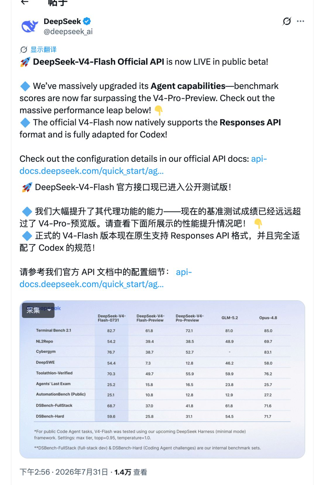
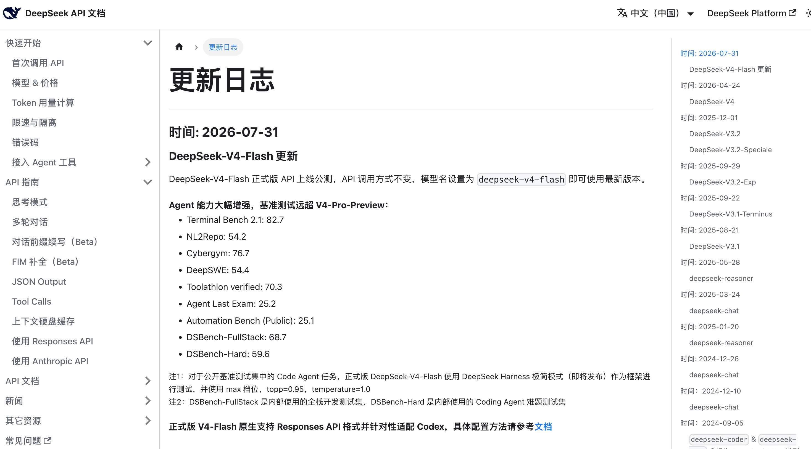
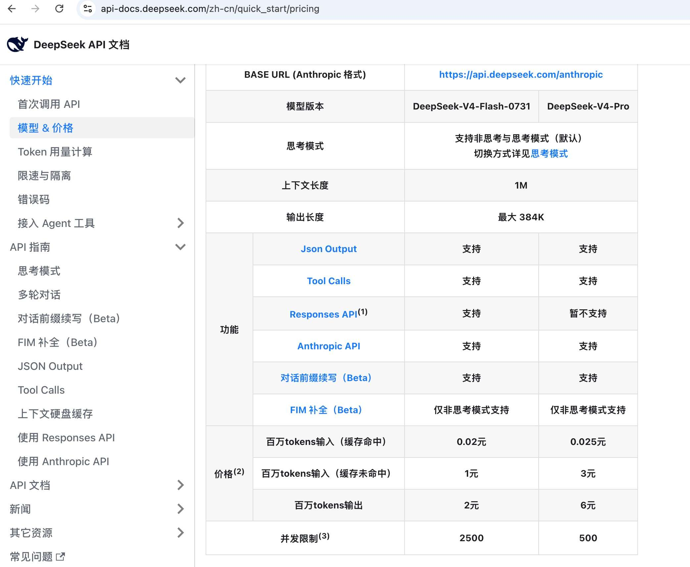

# DeepSeek V4-Flash正式版上线：Agent跑分82.7，能替代Codex主力模型吗？

> 来源: https://notes.kamacoder.com/llm/news/deepseek-v4-flash-official.html

# `# DeepSeek V4-Flash正式版上线：Agent跑分82.7，能替代Codex主力模型吗？ 

前面写 DeepSeek V4发布、V4 降价实测 时，卡哥的判断一直没变：V4-Flash 便宜，日常任务很香；但碰到长程 Agent 任务，不能只看参数和单次回答。 

现在这件事有了新变量。 

7 月 31 日，DeepSeek 把 V4-Flash 的官方 API 放进公测。模型名还是 `deepseek-v4-flash`，但实际版本已经更新为 **DeepSeek-V4-Flash-0731**。 

 

这次不是 App 或网页端换模型。官方明确说了：**升级的只有 API；V4-Pro API、DeepSeek App 和网页端模型都没变。** 所以你在网页里试几句，不能据此判断这次更新有没有生效。 

## `# 跑分很猛，但先看清它测的是什么 

这次最炸眼的是 Agent 基准。 

| 基准  V4-Flash-0731  V4-Flash-Preview  V4-Pro-Preview 
| Terminal Bench 2.1  82.7  61.8  72.1 
| NL2Repo  54.2  39.4  38.5 
| Cybergym  76.7  38.7  52.7 
| DeepSWE  54.4  7.3  12.8 
| Toolathlon-Verified  70.3  49.7  55.9 
| DSBench-FullStack  68.7  37.0  41.8 

官方原话是，新版在 Agent 能力上显著增强，跑分大幅超过 V4-Pro-Preview。更新日志  (opens new window) 也给出了完整数字。 

 

**这个提升值得重视，但别把它翻译成“Flash 已经全面超过 Pro，更超过所有顶级模型”。** 

原因很简单：这些是官方评测，公开 Code Agent 基准使用的是即将发布的 DeepSeek Harness minimal mode，并且开到 `max` effort、`top_p=0.95`、`temperature=1.0`。它能说明模型在这套 Agent 设定下变强了，不能替代你的仓库、工具链、测试和验收。 

另外，DSBench-FullStack 和 DSBench-Hard 是 DeepSeek 的内部测试集。拿来观察方向可以，不能和公开基准混在一起当成一个绝对排名。 

真正该验证的是：它会不会读错你的代码、工具调用是否稳定、改完能否自己跑测试、失败后会不会带着证据继续找，而不是只看它能不能一次写出一段漂亮代码。 

## `# 这次真正值得开发者注意的，是 Responses API 

V4-Flash-0731 原生支持 **Responses API**。这是 Codex 客户端与模型交互使用的接口格式。 

DeepSeek 已经把 Codex 接入文档放出来了：目前只有 `deepseek-v4-flash` 支持接入 Codex，`deepseek-v4-pro` 预计 8 月初再支持。你可以按官方 Codex 接入文档  (opens new window)一键配置，也可以手动配置模型目录和 provider。 

这意味着它不再只是“兼容 OpenAI Chat Completions 的便宜 API”。 

对于已经在 Codex 里跑多轮读代码、改文件、执行命令、验证结果的录友，Flash 现在有了更直接的接入方式。 

不过先别把生产主力一把切掉。 

建议这样试： 
  - 先挑可自动验收的任务：补单测、批量代码扫描、重复性重构、日志归因。   - 一次只换一个变量：同一个仓库、同一份任务说明、同一套测试，比较完成率、耗时和 Token 消耗。   - 涉及生产、权限、资金、安全的改动，仍然保留人工 review 和 CI；**模型跑分再高，也不是发布审批。** 

如果你刚开始做这类工作流，可以先看 Agent 到底是什么 和 Agent 为什么容易翻车。模型能力只是其中一环，工具边界、上下文和验证闭环更决定结果。 

## `# 价格没变，峰谷定价要盯住 

模型名不变，调用方式也不变：继续填 `deepseek-v4-flash`，就是最新的 0731 版本。 

 

当前常规价按百万 Token 计算： 

| 项目  V4-Flash  V4-Pro 
| 缓存命中输入  0.02 元  0.025 元 
| 缓存未命中输入  1 元  3 元 
| 输出  2 元  6 元 
| 并发限制  2500  500 

V4-Flash 仍然是这套产品里最适合铺量的一档：输入、输出都低，并发还高。 

但要注意价格页新增了一条规则：DeepSeek **将采用**峰谷定价，高峰时段的所有计费项按常规价两倍收取；目前生效时间仍以官方公告为准。拟定的高峰是北京时间每天 9:00–12:00、14:00–18:00。 

所以别只按“1 元输入、2 元输出”做月度预算。你要是把批处理和子 Agent 都集中在白天跑，价格规则生效后，账单会直接翻倍。能异步的低优先级任务，排到夜间更合理。 

## `# Flash 能不能当主力？答案是：先让它干能验收的活 

这次 V4-Flash 的位置更清楚了：不是单纯拿来问答、总结、补全的小模型，而是可以进入 Agent 第一轮选型的低成本候选。 

但“能进第一轮测试”和“直接替换最强模型”是两回事。 

低风险、任务量大、结果能跑测试验证的活，优先给 Flash；跨模块排障、架构判断、失败代价高的任务，仍然要给更强模型和人留位置。**把省下来的预算，用在真正需要深度推理和复核的地方。** 

这才是这次升级最实在的用法。 

加油
