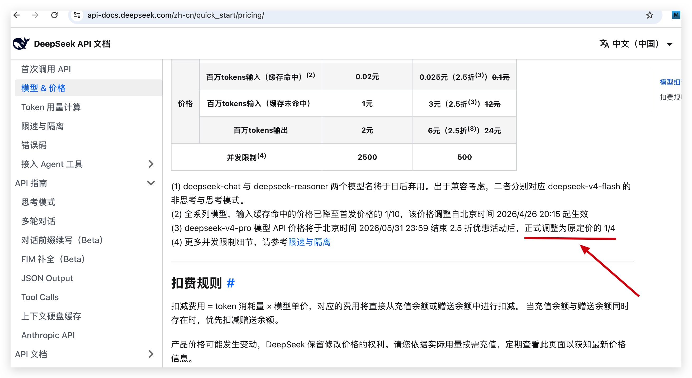
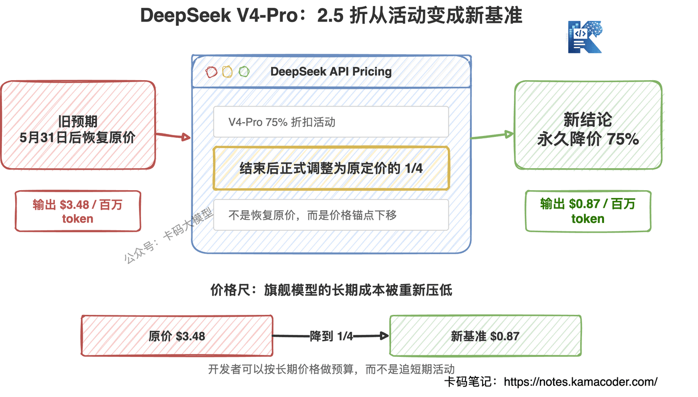
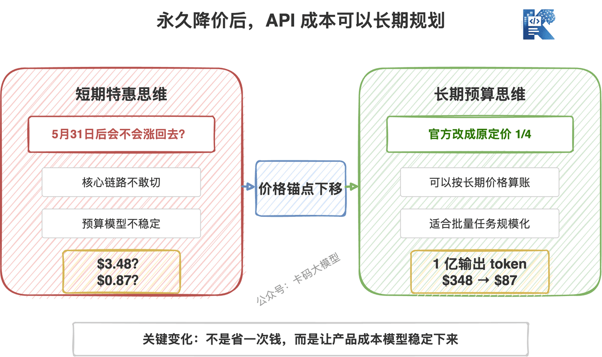
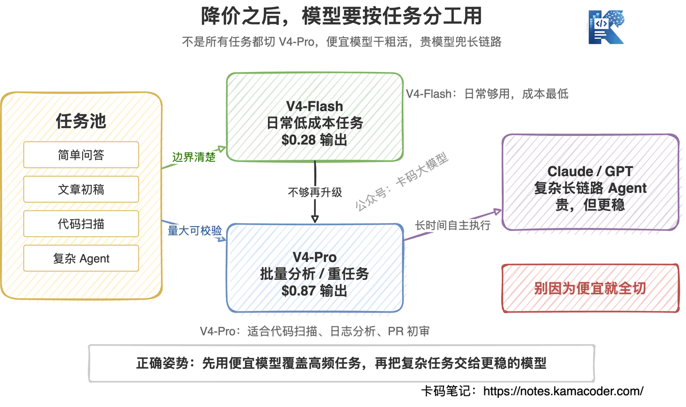

# DeepSeek V4-Pro永久降价75%：5月22日悄悄改了API定价页，这不是特惠了

> 来源: https://notes.kamacoder.com/llm/news/deepseek-v4-pro-permanent-price-cut.html

# `# DeepSeek V4-Pro永久降价75%：5月22日悄悄改了API定价页，这不是特惠了 
 

前面写DeepSeek V4降价75%实测的时候，卡哥还提醒录友：V4-Pro 的 2.5 折是特惠价，优惠结束后可能会恢复原价。 

结果 5 月 22 号，有录友发现 DeepSeek 官方定价页悄悄改了一行字。 

DeepSeek API 定价页  (opens new window)现在写的是：V4-Pro 在 75% 折扣活动结束后，API 价格会正式调整为原定价的 1/4。 

 

**这次不是短期促销了，是永久降价 75%。** 

这操作有点狠。 

 

## `# 价格到底变成多少 

先把账算清楚。 

DeepSeek V4-Pro 原价是： 

| 项目  原价  现在 2.5 折价  5月31日活动结束后 
| 缓存命中输入  $0.0145 / 百万 token  $0.003625 / 百万 token  $0.003625 / 百万 token 
| 缓存未命中输入  $1.74 / 百万 token  $0.435 / 百万 token  $0.435 / 百万 token 
| 输出  $3.48 / 百万 token  $0.87 / 百万 token  $0.87 / 百万 token 

注意最后一列。 

以前大家以为 5 月 31 日 15:59 UTC 之后，V4-Pro 会从 2.5 折恢复原价。现在官方的意思变了：**活动结束后，2.5 折价格直接转正。** 

北京时间就是 5 月 31 日 23:59。过了这个点，价格不是涨回去，而是继续保持 1/4 原价。 

这也是为什么我说这次不是促销，是 DeepSeek 把价格锚点重新打下来了。 

具体价格，大家可以直接去看deepseek官网：https://api-docs.deepseek.com/zh-cn/quick_start/pricing/ 

## `# 这对开发者意味着什么 

一句话：**V4-Pro 从“趁便宜用用”，变成了“可以按长期成本设计系统”。** 

这两个心态完全不一样。 

如果只是短期特惠，企业不会轻易把核心链路切过去。因为你今天按 $0.87 / 百万输出 token 算账，6 月份涨回 $3.48，成本模型直接崩。 

但如果这个价格长期存在，很多场景就可以重新算了。 

比如你有一个代码扫描平台，每个月消耗 1 亿输出 token。 

原价下，输出成本是 348 美元。 

现在是 87 美元。 

不是省几十块钱的问题，而是成本直接变成四分之一。更重要的是，**你可以拿这个价格去做长期预算**。 

对做 AI 编程、代码审计、文档分析、批量总结的录友来说，这个变化很大。 

以前很多任务不是模型做不了，是太贵。 

现在价格一降，很多“能不能做”的问题，变成了“值不值得做”。 

 

## `# 但别把 V4-Pro 神化 

便宜归便宜，还是要说清楚：**V4-Pro 不等于 Claude Opus，也不等于 GPT-5.5。** 

在DeepSeek V4发布那篇里，我们已经拆过它的能力边界。 

V4-Pro 的强项很明确： 
  - 代码理解   - 批量分析   - 长上下文输入   - 数学和结构化推理   - 成本敏感的大规模任务 

但它的短板也很明确： 
  - Agent 长链路稳定性不如闭源前沿模型   - 复杂任务跑久了，容易出现上下文漂移   - 通用知识和最前沿闭源模型还有差距   - 第三方平台价格未必同步官方 

所以不要看到降价 75%，就直接把所有任务都切到 V4-Pro。 

**便宜模型最适合干“量大、边界清楚、能校验”的活。** 

比如代码扫描、安全检查、日志分析、PR 初审、批量文档处理，这些任务很适合 V4-Pro。任务边界明确，结果也容易二次校验。 

但如果你要让模型自己跑 30 分钟，读项目、改代码、跑测试、修 bug、再继续迭代，那还是 Claude Opus、GPT-5.5 更稳。 

不是 V4-Pro 不能做，是翻车成本不一样。 

 

## `# V4-Flash 反而更值得普通录友关注 

这次大家都盯着 V4-Pro 永久降价，但普通录友日常更该关注的，可能还是 V4-Flash。 

V4-Flash 的价格本来就很离谱： 

| 模型  缓存未命中输入  输出 
| V4-Flash  $0.14 / 百万 token  $0.28 / 百万 token 
| V4-Pro  $0.435 / 百万 token  $0.87 / 百万 token 

V4-Pro 降完之后，依然是 V4-Flash 的 3 倍左右。 

所以我的建议还是不变： 

**日常任务用 V4-Flash，重任务再上 V4-Pro。** 

简单问答、文章初稿、代码解释、文件总结、普通脚本生成，用 V4-Flash 就够了。 

需要更强推理、更长上下文、更复杂代码理解，再切 V4-Pro。 

这才是最划算的用法。 

## `# 这次降价真正打到谁 

表面看，DeepSeek 是把自家 V4-Pro 打骨折。 

但实际打到的是整个 API 市场的价格预期。 

之前大家对旗舰模型的心理价位，大概是输出每百万 token 几美元到几十美元。Claude、GPT 这些闭源模型更贵，大家也认，因为确实强。 

现在 DeepSeek 把一个 1.6T MoE、百万上下文、代码能力很强的模型，长期压到 $0.87 / 百万输出 token。 

这会带来一个很现实的问题： 

**以后一个模型如果卖得贵，就必须证明它真的贵得有道理。** 

贵可以。 

但你要么 Agent 能力明显更稳，要么工具调用更强，要么多模态更好，要么企业服务更完整。 

只是“我是旗舰模型，所以我贵”，这套说法越来越站不住了。 

对开发者是好事。 

价格战打起来，真正受益的是大量做应用的人。 

## `# 几个坑别踩 

**第一，官方价不等于第三方平台价。** 

如果你通过 OpenRouter、聚合 API 或者其他平台调用 DeepSeek，价格可能不会第一时间同步。一定要看你实际使用平台的账单，不要只看 DeepSeek 官方页。 

**第二，缓存命中不是白送的。** 

缓存命中价非常低，但前提是你的请求有可复用的前缀。比如固定 system prompt、固定长文档前缀、相似的批量任务。每次请求都完全不同，就别指望全吃缓存价。 

**第三，模型名别写错。** 

官方模型名是 `deepseek-v4-pro` 和 `deepseek-v4-flash`。老的 `deepseek-chat`、`deepseek-reasoner` 后面会逐步废弃，官方现在把它们兼容到 V4-Flash 的不同模式上。 

**第四，别因为便宜就疯狂堆 token。** 

便宜不代表没有成本。尤其是 Agent 场景，一旦模型开始循环、重复读文件、反复输出废话，token 消耗照样会爆。 

便宜模型也要做预算、限额和日志。 

## `# 写在最后 

DeepSeek 这次最狠的地方，不是降价 75%。 

而是把 75% 降价从“活动”变成了“新基准”。 

这会让很多开发者重新评估大模型应用的成本，也会逼其他模型厂商解释自己的价格。 

但卡哥还是那句话：**别只看价格，要看任务。** 

V4-Flash 负责日常低成本任务，V4-Pro 负责批量分析和重任务，Claude、GPT 负责复杂 Agent 长链路。 

把模型当工具箱，而不是当信仰。 

这才是开发者该有的姿势。 

加油。
